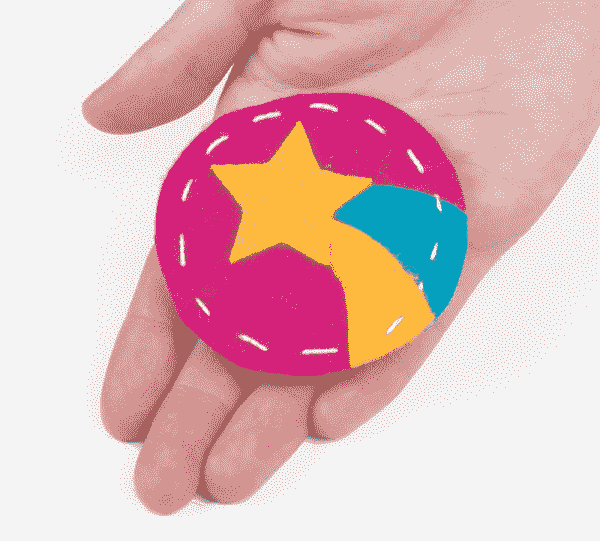
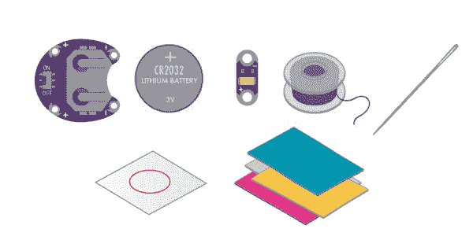

# 发光针

> 原文：<https://learn.sparkfun.com/tutorials/glowing-pin>

## 介绍

在这个项目中，我们将使用导电线创建一个可佩戴的引脚，将 LilyPad LED 连接到电池座。跟着在一块布料上画出你自己的设计，或者下载并打印一张 SparkFun 的设计。

设计和建造时间:30 分钟— 1 小时

这是来自 [LilyPad 可缝合电子套件](https://www.sparkfun.com/products/13927)的项目 1，看看套件中的其他项目:

*   项目 2: [发光面罩](https://learn.sparkfun.com/tutorials/illuminated-mask)
*   项目三:[点亮毛绒](https://learn.sparkfun.com/tutorials/light-up-plush)
*   项目四:[夜光锦旗](https://learn.sparkfun.com/tutorials/night-light-pennant-with-lilymini-protosnap)

### 推荐阅读

如果这是你的第一个可缝合电子项目，我们建议你阅读我们的 LilyPad 基础教程。

 [### LilyPad 基础:电子缝纫

#### 2016 . 12 . 17](https://learn.sparkfun.com/tutorials/lilypad-basics-e-sewing) Learn how to use conductive thread with LilyPad components.[Favorited Favorite](# "Add to favorites") 16

## 材料和工具

让我们来看一下将你的项目组合在一起所需要的所有东西。

 

将**添加到您的[购物车](https://www.sparkfun.com/cart)中！**

### [LilyPad 可缝电子套装](https://www.sparkfun.com/products/13927)

[In stock](https://learn.sparkfun.com/static/bubbles/ "in stock") KIT-13927

LilyPad 可缝制电子套件让您通过以下方式探索电子缝纫和电子纺织品的奇妙世界

$106.959[Favorited Favorite](# "Add to favorites") 39[Wish List](# "Add to wish list")** **### [LilyPad 可缝合电子套件](https://www.sparkfun.com/products/13927)中包含的项目:

*   [LilyPad 硬币电池座](https://www.sparkfun.com/products/13883)
*   [3V 纽扣电池](https://www.sparkfun.com/products/338)
*   [1 个 LilyPad LED](https://www.sparkfun.com/products/13903) (小心地从五个面板中取出)
*   [导电线](https://www.sparkfun.com/products/10867)
*   [针](https://www.sparkfun.com/products/10405)
*   Pin 模板(1 件)-请参见[规划您的项目](https://learn.sparkfun.com/tutorials/glowing-pin#planning-your-project)获取可打印的下载
*   白色毛毡(至少需要 3 平方英寸)
*   销回

Don't have a LilyPad Sewable Electronics Kit? You can follow along with this project using this [wish list](https://www.sparkfun.com/wish_lists/83222) of individual LilyPad pieces. You will need to source your own felt and pin back (available at local craft stores) to complete the project.**