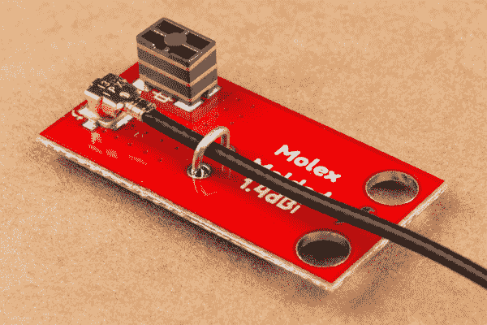

# GNSS 芯片天线连接指南

> 原文：<https://learn.sparkfun.com/tutorials/gnss-chip-antenna-hookup-guide>

## 介绍

GPS 很常见，但如果您需要将 GPS 接收器放入一个小空间(如可穿戴设备)中，该怎么办？标准的 [GPS 天线](https://www.sparkfun.com/products/14986)太大了，无法绑在手腕上，你该怎么办？你使用一个 [SparkFun GNSS 芯片天线](https://www.sparkfun.com/products/15247)！

 

将**添加到您的[购物车](https://www.sparkfun.com/cart)中！**

### [SparkFun GNSS 芯片天线评估板](https://www.sparkfun.com/products/15247)

[In stock](https://learn.sparkfun.com/static/bubbles/ "in stock") GPS-15247

SparkFun GNSS 芯片天线评估板可以轻松测试各种尺寸的 GPS 天线和几何形状。

$28.50 $14.251[Favorited Favorite](# "Add to favorites") 9[Wish List](# "Add to wish list")** **[https://www.youtube.com/embed/80zvUz1v8uI/?autohide=1&border=0&wmode=opaque&enablejsapi=1](https://www.youtube.com/embed/80zvUz1v8uI/?autohide=1&border=0&wmode=opaque&enablejsapi=1)

SparkFun GNSS 芯片天线评估板可以轻松测试各种尺寸的 GPS 天线和几何形状。一旦您选择了最适合您应用的天线，这些单独的天线甚至可以分离出来并永久安装到一个项目中。

### 所需材料

GNSS 芯片天线评估板(出于方便起见，从现在开始我们称之为评估板)之所以可行，是因为我们将每根天线都设计成具有 50 欧姆微带。要进行连接，您需要一根 [U.FL 电缆](https://www.sparkfun.com/products/15114)和一个能够连接到 U.FL 电缆的 GPS 接收器。你可能不需要所有的东西，这取决于你拥有什么。将它添加到您的购物车，通读指南，并根据需要调整购物车。

 

将**添加到您的[购物车](https://www.sparkfun.com/cart)中！**

### [U.FL 到 U.FL 迷你同轴电缆- 200mm](https://www.sparkfun.com/products/15114)

[Only 9 left!](https://learn.sparkfun.com/static/bubbles/ "only 9 left!") WRL-15114

这个可爱的小同轴电缆是我们的射频套件冠军！它两端都有一个直角母 U.FL(又名 I-PEX)连接器。现在本…

$1.95[Favorited Favorite](# "Add to favorites") 2[Wish List](# "Add to wish list")** **下面是 SparkFun GPS 接收器的列表，它的天线有一个 U.FL 连接器。这些产品最容易与评估板配合使用。

 

将**添加到您的[购物车](https://www.sparkfun.com/cart)中！**

### [【spark fun GPS Breakout-ZOE-M8Q(Qwiic)](https://www.sparkfun.com/products/15193)

[In stock](https://learn.sparkfun.com/static/bubbles/ "in stock") GPS-15193

SparkFun ZOE-M8Q GPS Breakout 是一款高精度、小型化的 GPS 板，非常适合不支持

$49.957[Favorited Favorite](# "Add to favorites") 8[Wish List](# "Add to wish list")**** 

将**添加到您的[购物车](https://www.sparkfun.com/cart)中！**

### [【spark fun GPS Breakout-xa 1110(Qwiic)](https://www.sparkfun.com/products/14414)

[In stock](https://learn.sparkfun.com/static/bubbles/ "in stock") GPS-14414

SparkFun XA1110 GPS Breakout 是一款 I2C 支持的小型模块，由于采用了 Qwiic Connect 系统，因此易于连接。电子邮件…

$34.955[Favorited Favorite](# "Add to favorites") 25[Wish List](# "Add to wish list")**** ****最常见的设置之一如下所示。ZOE-M8Q 有一个 U.FL 连接器，可以连接到六个芯片级 GPS 天线中的任何一个。

### 推荐阅读

如果你不熟悉使用 GPS 接收器或 U.FL 连接器，请务必查阅一些基础教程。你还需要查看你的 GPS 接收机的相关教程。

 [### GPS 基础知识](https://learn.sparkfun.com/tutorials/gps-basics) The Global Positioning System (GPS) is an engineering marvel that we all have access to for a relatively low cost and no subscription fee. With the correct hardware and minimal effort, you can determine your position and time almost anywhere on the globe.[Favorited Favorite](# "Add to favorites") 31 [### 关于使用 U.FL 的三个快速提示](https://learn.sparkfun.com/tutorials/three-quick-tips-about-using-ufl) Quick tips regarding how to connect, protect, and disconnect U.FL connectors.[Favorited Favorite](# "Add to favorites") 14

## 硬件概述

SparkFun GNSS 芯片天线评估板由六个“模块”组成。每个天线都能获得 GPS 锁定，但接收质量取决于天线的大小和形状。

### 天线技术

GNSS 芯片天线评估板上有六种不同的天线。

您可以按从左上到右下的顺序找到每款产品的数据手册和技术信息:

*   [Molex 模塑- 1.4dBi](https://cdn.sparkfun.com/assets/learn_tutorials/8/8/1/Molex_GNSS_Molded_1462350001_sd.pdf)
*   [脉冲 W3011 - 3.4dBi](https://cdn.sparkfun.com/assets/learn_tutorials/8/8/1/W3011_W3011A.pdf)
*   [脉冲 W3062A - 2.5dBi](https://cdn.sparkfun.com/assets/learn_tutorials/8/8/1/W3062A.pdf)
*   [TE Puck - 0dBi](https://cdn.sparkfun.com/assets/learn_tutorials/8/8/1/TE_GPS_Puck_Antenna_ENG_DS_1513634_A.pdf)
*   Molex Cube - 1dBi
*   [Molex 芯片- 2dBi](https://cdn.sparkfun.com/assets/learn_tutorials/8/8/1/Molex_GPS_Chip_Antenna_2042830001_sd.pdf)

增益印在每个天线模块上，但对这个增益要有所保留。天线制造商倾向于报告天线的理论增益，或从超过理想的设置(即，使用头部大小的接地层)获得的增益。

### 单个天线模块

六个天线中的每一个都有自己的 U.FL 连接器、安装孔、U.FL 应力释放孔和隔离接地层。

该板作为一个单一的单位，但可以迅速分开，以便任何一个天线块可以安装到一个项目。从理论上讲，天线分开时性能会更好，但我们发现天线整体或分开时没有可测量的性能差异。

### 单位 FL 连接器和应力消除

单位 FL 连接器通常很有弹性，但如果你有一个特别耐磨的项目或恶劣的天线环境，你可以通过在电缆上焊接一根电线来加强 U.FL 连接。我们建议您在选择了最适合您项目的天线后*再这样做。*

## 天线的表现如何？

这是我们的初步发现:

| 天线名称 | SIV^([1](#note1)) | PDOP^([2](#note2)) | HDOP^([3](#note3)) |
| Molex 模塑 | five | Two point two | one |
| W3011 | nine | One point four seven | Zero point six nine |
| W3062A | six | Two point four eight | One point one six |
| Molex 芯片 | five | Two point two seven | One point one eight |
| Molex 立方体 | Ten | One point one six | Zero point six three |
| 你这个混蛋 | nine | One point two seven | Zero point six eight |
| 莫仕柔性^([4](#note4)) | Ten | One point one four | Zero point six two |

¹ -可见卫星:天线搜索 60 秒后能够探测到的卫星数量。一般越高越好。

² -位置精度因子:接收器输出的 3D 解的精度。数字越小越好。数字的含义可以在[维基百科](https://en.wikipedia.org/wiki/Dilution_of_precision_(navigation)#Meaning_of_DOP_Values)上找到。

³——水平精度稀释:接收机输出的水平定位解的精度。数字越小越好。数字的含义可以在[维基百科](https://en.wikipedia.org/wiki/Dilution_of_precision_(navigation)#Meaning_of_DOP_Values)上找到。

⁴—[柔性粘贴 GPS 天线](https://www.sparkfun.com/products/15246)不在 GNSS 芯片天线评估板上，但表现令人印象深刻。

这些结果仅用于说明。使用 Ublox ZED-F9P 在 [RTK2](https://www.sparkfun.com/products/15136) 上进行测试，用 60 秒从冷启动中获得卫星。你的结果会有很大的不同，取决于你对天空的看法有多清晰，你所在的位置，以及所使用的 GPS 接收器的类型。

如你所见，天线越大，接收的卫星越多。有趣的异常值是[柔性天线](https://www.sparkfun.com/products/15246)(可以说是所有天线中最大的)和 Pulse W3011(可以说是最小、性能最好的天线之一)。

## 常见问题和故障排除

### GPS 和 GNSS 有什么区别？

*GPS* 指美国发射到太空的卫星集合。其他国家也有自己的导航卫星，包括俄国(他们的星座叫做 GLONASS)、欧盟(伽利略)和中国(北斗)。 *GNSS* 是指所有导航星座的整体。GNSS 芯片天线评估板能够接收任何 GPS/GLONASS/北斗/伽利略卫星在频段 1(最常见的民用频率)上发射的信号。如果你的 GPS 接收器是在 2015 年之后购买的，它可能能够接收大多数 GNSS 卫星。

### 我没有锁吗？！

你在外面吗？你能清楚、无障碍地看到天空吗？这些天线很小，需要非常清晰的天空视野。他们**不能**在室内得到[锁。](https://learn.sparkfun.com/tutorials/alphanumeric-gps-wall-clock#lock-problems)

你搬到外面了，还是有问题吗？仔细检查你的 U.FL 连接是否正确和正交。当连接器正确就位时，您应该会感觉到很好的咔嗒声。请务必查看我们关于使用 U.FL 连接器的教程。

 [### 关于使用 U.FL 的三个快速提示

#### 2018 年 12 月 28 日](https://learn.sparkfun.com/tutorials/three-quick-tips-about-using-ufl) Quick tips regarding how to connect, protect, and disconnect U.FL connectors.[Favorited Favorite](# "Add to favorites") 14

## 资源和更进一步

我们希望你在试验你的芯片天线时玩得开心。我们发现设计和几何形状的变化很吸引人，就像天线设计的艺术一样。请记住，我们所有的设计都是开源的，因此欢迎您在自己的设计中使用我们的电路板上的[尺寸和布局。这就是这款评估板的真正强大之处——尝试各种天线，如果您喜欢，可以在自己的微型 GPS 接收机设计中实现！](https://github.com/sparkfun/GNSS_Chip_Antenna_Evaluation_Board)

有关更多信息，请查看以下资源:

*   [示意图(PDF)](https://cdn.sparkfun.com/assets/learn_tutorials/8/8/1/GNSS_Chip_Antenna_Evaluation_Board.pdf)
*   [老鹰文件(ZIP)](https://cdn.sparkfun.com/assets/learn_tutorials/8/8/1/GNSS_Chip_Antenna_Evaluation_Board.zip)
*   数据表(PDF)
    *   [TE Puck 的尺寸图](https://cdn.sparkfun.com/assets/2/4/d/d/7/ENG_CD_1513634_E.pdf)
    *   [TE Puck - 0dBi](https://cdn.sparkfun.com/assets/learn_tutorials/8/8/1/TE_GPS_Puck_Antenna_ENG_DS_1513634_A.pdf)
    *   [PulseLarsen 天线指南](https://cdn.sparkfun.com/assets/d/5/2/b/c/Antennas_Catalog_Ver13.pdf)
        *   [脉冲 W3011 - 3.4dBi](https://cdn.sparkfun.com/assets/learn_tutorials/8/8/1/W3011_W3011A.pdf)
        *   [脉冲 W3062A - 2.5dBi](https://cdn.sparkfun.com/assets/learn_tutorials/8/8/1/W3062A.pdf)
    *   [Molex 天线导轨](https://cdn.sparkfun.com/assets/4/f/6/2/5/987651-5071.pdf)
        *   [Molex 模塑- 1.4dBi](https://cdn.sparkfun.com/assets/learn_tutorials/8/8/1/Molex_GNSS_Molded_1462350001_sd.pdf)
        *   Molex Cube - 1dBi
        *   [Molex 芯片- 2dBi](https://cdn.sparkfun.com/assets/learn_tutorials/8/8/1/Molex_GPS_Chip_Antenna_2042830001_sd.pdf)
*   [GitHub 产品报告](https://github.com/sparkfun/GNSS_Chip_Antenna_Evaluation_Board) -查看最新硬件文件的报告。
*   [SFE 产品展示区](https://youtu.be/80zvUz1v8uI)

请务必查看我们关于 GPS 的其他教程:

 [### GPS 屏蔽连接指南](https://learn.sparkfun.com/tutorials/gps-shield-hookup-guide) This tutorial shows how to get started with the SparkFun GPS Shield and read and parse NMEA data with a common GPS receiver.[Favorited Favorite](# "Add to favorites") 6 [### Sphero RVR 装配指南的基本自主套件](https://learn.sparkfun.com/tutorials/basic-autonomous-kit-for-sphero-rvr-assembly-guide) Get your Basic Autonomous Kit for Sphero RVR all hooked up with this guide 1 [### SparkFun RTK 快速连接指南](https://learn.sparkfun.com/tutorials/sparkfun-rtk-express-hookup-guide) Learn how to use the enclosed RTK Express product to achieve millimeter level geospatial coordinates.[Favorited Favorite](# "Add to favorites") 2 [### SparkFun GPS-RTK 航位推算 ZED-F9K 连接指南](https://learn.sparkfun.com/tutorials/sparkfun-gps-rtk-dead-reckoning-zed-f9k-hookup-guide) The u-blox ZED-F9K is a powerful GPS-RTK unit that uses a fusion of IMU, wheel ticks, a vehicle dynamics model, correction data, and GNSS measurements to provide highly accurate and continuous position for navigation in the difficult conditions. We will quickly get you set up using the Qwiic ecosystem through Arduino so that you can start reading the output 1********