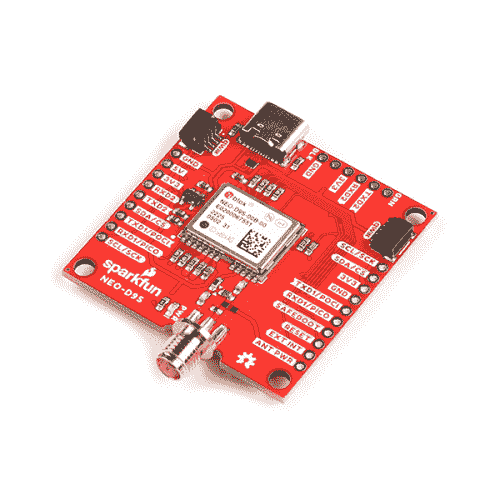

# GNSS 校正数据接收器(NEO-D9S)连接指南

> 原文：<https://learn.sparkfun.com/tutorials/gnss-correction-data-receiver-neo-d9s-hookup-guide>

## 介绍

[SparkFun GNSS 校正数据接收器- NEO-D9S](https://www.sparkfun.com/products/19390) 是用于 L 波段校正广播的卫星数据接收器。它可以配置为与各种校正服务一起使用，包括 u-blox 的 PointPerfect 卫星 GNSS 增强服务，该服务在邻近的美国和欧洲提供同质覆盖。天空清晰，尤其是南方清晰，它解码卫星传输并输出校正流，使多波段高精度 GNSS 接收器(如 u-blox ZED-F9P)能够达到厘米级定位精度，而无需单独的 RTK 或 NTRIP 校正！

 

将**添加到您的[购物车](https://www.sparkfun.com/cart)中！**

### [【spark fun GNSS 校正数据接收器- NEO-D9S (Qwiic)](https://www.sparkfun.com/products/19390)

[In stock](https://learn.sparkfun.com/static/bubbles/ "in stock") GPS-19390

SparkFun NEO-D9S GNSS 校正数据接收器是一种用于 L 波段校正广播的卫星数据接收器。

$124.95[Favorited Favorite](# "Add to favorites") 5[Wish List](# "Add to wish list")** **[https://www.youtube.com/embed/fGj44UBrErY/?autohide=1&border=0&wmode=opaque&enablejsapi=1](https://www.youtube.com/embed/fGj44UBrErY/?autohide=1&border=0&wmode=opaque&enablejsapi=1)

### 所需材料

要跟随本教程，您将需要以下材料。你可能不需要所有的东西，这取决于你拥有什么。将它添加到您的购物车，通读指南，并根据需要调整购物车。**