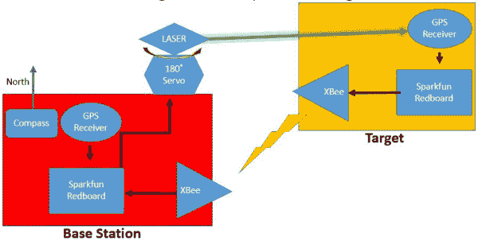
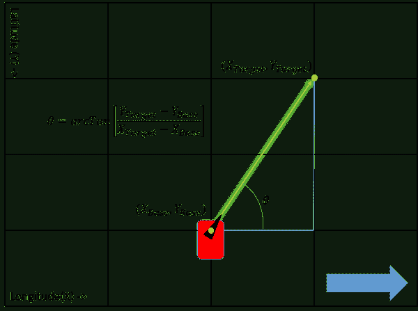
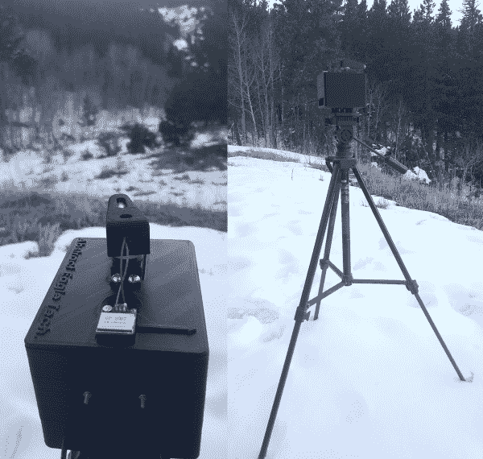

# GPS 差分矢量指针

> 原文：<https://learn.sparkfun.com/tutorials/gps-differential-vector-pointer>

## 介绍

**Heads up!** Originally, this tutorial was written to configure an XBee Series 1 to communicate in transparency mode. However, this can apply to the XBee Series 3 module as long as you configure the firmware to the legacy 802.15.4 protocol. For more information, check out the [Exploring XBees and XCTU](https://learn.sparkfun.com/tutorials/exploring-xbees-and-xctu) tutorial.

#### 在本教程中，你将学习如何使用 GPS 接收器让两个物体，一个基地和一个目标，指向彼此。这可以用来瞄准传感器、天线、激光等。从一个物体到另一个物体。

### 项目背景

GPS 技术是一项非常有用和优雅的技术。GPS 网络中使用的卫星完成大部分工作，因此 GPS 接收机可以做得小而简单。随着 GPS 技术越来越精确，在许多领域的应用已经真正起飞。其中一些包括无人驾驶汽车，无人机的任务规划，商业飞机的辅助着陆等等。GPS 接收机的成本因精度和所提供的其他功能而异，因此需要根据所需应用选择合适的接收机。在这个项目中，我展示了一个昂贵的接收器并不是创造一个惊人的项目所必需的。

该项目始于 ANACONDA 2014/2015 年航空航天高级项目的概念验证，其任务是:

> “设计并构建一个自主跟踪和通信支持系统，用于在飞行中跟踪无人驾驶飞机的天线。”

如果你想看看这个项目和其他项目，请点击下面的链接到加州大学高级项目页面，并进入 2015 年项目页面。

[CU Aerospace Senior Projects](http://www.colorado.edu/aerospace/current-students/undergraduates/senior-design-projects?qt-qt_senior_design_2014_15=1#qt-qt_senior_design_2014_15)

### 项目概述

这里的基本原理是，如果两个 GPS 位置由两个不同的接收器提供，则可以在它们之间计算出[位置向量](https://en.wikipedia.org/wiki/Position_%28vector%29)。这可用于将定向天线(或本项目中的激光)从一个物体(基站)瞄准任何距离的另一个物体(目标)，这仅限于您向基站提供目标 GPS 位置的能力。目标的唯一目的是接收其 GPS 位置，解析数据并将其发送回基站。然后，基站接收目标的 GPS 位置，并将其与自己的 GPS 位置进行比较，以计算位置向量。基站还包括一个 180 度伺服系统和一个激光器，因此方向可以可视化。

*Block diagram of the system described above.*

知道了点之间的水平和垂直差异，就可以使用反正切函数给出控制机构所需的指向角度。见下图。

最终产品如下所示:

*The Target (left) and the Base Station (right).*

上图显示了指向下方的 GPS 天线。理想情况下，你应该将陶瓷天线指向天空，以获得最佳的卫星接收效果。在本教程中，视图中的卫星足以让项目正常运行。确保安装 GPS 接收机时天线指向天空。

本教程将介绍如何复制这个系统。

### 建议的材料

为了跟随本教程，我们推荐以下用品:

#### 电力供应

以下是这个项目需要的所有 SparkFun 材料的清单: