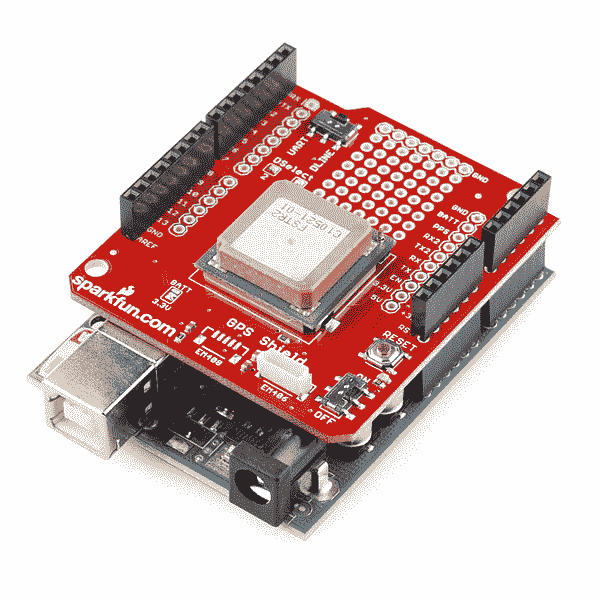

# GPS 屏蔽连接指南

> 原文：<https://learn.sparkfun.com/tutorials/gps-shield-hookup-guide>

## 介绍

[SparkFun GPS shield](https://www.sparkfun.com/products/10710) 有几个方便的功能，可以很容易地将 GPS 模块与 [Arduino Uno](https://www.sparkfun.com/products/11224) 和 [SparkFun RedBoard](https://www.sparkfun.com/products/12757) (或任何支持 Arduino shield 外形的开发板)一起使用。

[](https://cdn.sparkfun.com/assets/learn_tutorials/1/7/full-shield.jpg)*A GPS Shield sporting a [UP501 GPS module](https://www.sparkfun.com/products/retired/10702), atop an Arduino Uno.*

### 装配

使用前，您需要将接头焊接到屏蔽层上。[如果你需要复习，可以看看屏蔽装配教程](https://learn.sparkfun.com/tutorials/arduino-shields#installing-headers-preparation)。GPS 屏蔽使用 Uno R1 封装，带有[2 个 8 针和 2 个 6 针接头](https://www.sparkfun.com/products/10007)。

[](https://cdn.sparkfun.com/assets/learn_tutorials/1/7/header-assembly.jpg)

### 所需材料

[GPS 屏蔽套件](https://www.sparkfun.com/products/13199)带有屏蔽罩、接头、EM-506 GPS 模块和用于将模块连接到屏蔽罩的[泡沫胶带](https://www.sparkfun.com/products/12752)。

如果您单独购买了 GPS 屏蔽罩，您将需要获得您选择的 GPS 模块以及相应的电缆、接头或其他连接器。

### 推荐阅读

如果你以前没有使用过 GPS，你可能想在继续使用 GPS Shield 之前阅读下面的教程。

*   如果你一直想知道 GPS 是如何工作的，这是给你的教程。

如果您没有使用 Arduino 或其他微控制器，您仍然可以使用终端程序查看 GPS 模块的串行输出(并向 GPS 发送命令)。

*   [串行通信](https://learn.sparkfun.com/tutorials/serial-communication)
*   [串行终端基础知识](https://learn.sparkfun.com/tutorials/terminal-basics)

## 屏蔽概述

GPS 防护罩的顶部:

[](https://cdn.sparkfun.com/assets/learn_tutorials/1/7/shield-front1.jpg)

底部是:

[](https://cdn.sparkfun.com/assets/learn_tutorials/1/7/shield-back.jpg)

SparkFun GPS Shield 包括一个 6 针 JST-SH 插座(顶部标记为 EM406)，适用于 [EM-506(包含在 GPS Shield 套件中)](https://www.sparkfun.com/products/12751)及其停产的前身 [EM-406A](https://www.sparkfun.com/products/retired/465) 以及 [GP-635T](https://www.sparkfun.com/products/11571) 。有裸露的引脚和一个小的原型制作区域，用于其他 GPS 模块。在停产的 [EM-408 模块](https://www.sparkfun.com/products/retired/8234)(顶部标记为 EM408)上发现了用于 5 针 JST-SH 连接器的未组装焊盘。

**UART/DLINE 开关**将 GPS 模块的串行线连接到 Arduino 硬件串行(D0/RX 和 D1/TX)或一对用户可选的软件串行引脚(默认为 D2 和 D3)。

标有 **Dselect 2** 和 **3** 的闭合焊接跳线决定在 DLINE 模式中使用哪些引脚。

ATMega328-based boards (like the Uno, Sparkfun RedBoard, and Sparkfun Pro Mini) support **change interrupts**, a hardware function that's necessary for software serial, on all digital pins. Arduino boards based on other chips (ATmega32u4, etc) have different levels of support for change interrupts and software serial. A list of software-serial compatible pins on various official Arduino boards is [here.](http://arduino.cc/en/Reference/softwareSerial)

**开/关开关**控制 GPS 模块的电源。**复位**按钮连接到下方的 Arduino。

在防护罩的背面，有一个未占用的**[12 毫米硬币电池座](https://www.sparkfun.com/products/7948)足迹**用于添加电池备份和热启动功能。

在停产的 [85A GPS 模块](https://www.sparkfun.com/products/retired/8266)上可以看到，8 针 JST-SH 连接器有一个额外的未占用空间。

**BATT/3.3V 跳线**将未安装的 JST 连接器上的 VBAT 线路连接到(未安装的)备用电池或 Arduino 的 3.3V 线路。默认选择 3.3V。

## 代码示例

对于这个例子，您需要安装 [TinyGPSPlus 库](https://github.com/mikalhart/TinyGPSPlus)。如果你以前从未安装过 Arduino 库，看看我们的 [Arduino 库安装教程](https://learn.sparkfun.com/tutorials/installing-an-arduino-library)。

[Download TinyGPSPlus Library](https://github.com/mikalhart/TinyGPSPlus/archive/master.zip)

米卡勒·哈特的 Arduiniana.org[对 TinyGPS++库的所有功能有一个完整的概述](http://arduiniana.org/libraries/tinygpsplus/)，但是最重要的一个是将 GPS 模块的 [NMEA 语句](https://learn.sparkfun.com/tutorials/gps-basics/message-formats)输出解析成纬度和经度。

将完成的 Arduino 护罩(焊接了接头，插入或焊接了 GPS)压到 Arduino 上，用 USB 电缆将 Arduino 连接到电脑。

Make sure your DLINE/UART switch is in the DLINE position **every time you upload a sketch**, even if you're planning to use hardware serial. Having a GPS (or any other serial device) connected during upload will cause the upload to fail. If you want to use hardware serial, flip the switch back to UART after the upload finishes.

在本例中，您将使用软件串行，因此将开关留在 DLINE 中。

将下面的示例草图上传到您的 Arduino。

```
language:c
#include <TinyGPS++.h>
#include <SoftwareSerial.h>
/*
 This example uses software serial and the TinyGPS++ library by Mikal Hart
 Based on TinyGPSPlus/DeviceExample.ino by Mikal Hart
 Modified by acavis
*/

// Choose two Arduino pins to use for software serial
// The GPS Shield uses D2 and D3 by default when in DLINE mode
int RXPin = 2;
int TXPin = 3;

// The Skytaq EM-506 GPS module included in the GPS Shield Kit
// uses 4800 baud by default
int GPSBaud = 4800;

// Create a TinyGPS++ object called "gps"
TinyGPSPlus gps;

// Create a software serial port called "gpsSerial"
SoftwareSerial gpsSerial(RXPin, TXPin);

void setup()
{
  // Start the Arduino hardware serial port at 9600 baud
  Serial.begin(9600);

  // Start the software serial port at the GPS's default baud
  gpsSerial.begin(GPSBaud);

  Serial.println(F("DeviceExample.ino"));
  Serial.println(F("A simple demonstration of TinyGPS++ with an attached GPS module"));
  Serial.print(F("Testing TinyGPS++ library v. ")); Serial.println(TinyGPSPlus::libraryVersion());
  Serial.println(F("by Mikal Hart"));
  Serial.println();
}

void loop()
{
  // This sketch displays information every time a new sentence is correctly encoded.
  while (gpsSerial.available() > 0)
    if (gps.encode(gpsSerial.read()))
      displayInfo();

  // If 5000 milliseconds pass and there are no characters coming in
  // over the software serial port, show a "No GPS detected" error
  if (millis() > 5000 && gps.charsProcessed() < 10)
  {
    Serial.println(F("No GPS detected"));
    while(true);
  }
}

void displayInfo()
{
  Serial.print(F("Location: ")); 
  if (gps.location.isValid())
  {
    Serial.print(gps.location.lat(), 6);
    Serial.print(F(","));
    Serial.print(gps.location.lng(), 6);
  }
  else
  {
    Serial.print(F("INVALID"));
  }

  Serial.print(F("  Date/Time: "));
  if (gps.date.isValid())
  {
    Serial.print(gps.date.month());
    Serial.print(F("/"));
    Serial.print(gps.date.day());
    Serial.print(F("/"));
    Serial.print(gps.date.year());
  }
  else
  {
    Serial.print(F("INVALID"));
  }

  Serial.print(F(" "));
  if (gps.time.isValid())
  {
    if (gps.time.hour() < 10) Serial.print(F("0"));
    Serial.print(gps.time.hour());
    Serial.print(F(":"));
    if (gps.time.minute() < 10) Serial.print(F("0"));
    Serial.print(gps.time.minute());
    Serial.print(F(":"));
    if (gps.time.second() < 10) Serial.print(F("0"));
    Serial.print(gps.time.second());
    Serial.print(F("."));
    if (gps.time.centisecond() < 10) Serial.print(F("0"));
    Serial.print(gps.time.centisecond());
  }
  else
  {
    Serial.print(F("INVALID"));
  }

  Serial.println();
} 
```

通过工具>串行监视器打开你的 Arduino [串行终端](https://learn.sparkfun.com/tutorials/terminal-basics/arduino-serial-monitor-windows-mac-linux)

[](https://cdn.sparkfun.com/assets/learn_tutorials/1/7/nmea_data.png)

纬度，经度，和时间戳值应该流！你再也不会在电脑前迷路了！

## 使用 GPS 突破

如果你使用的是像 [Pro Mini](https://www.sparkfun.com/search/results?term=pro+mini) 这样的较小的 Arduino，你可以使用 [GPS 插座](https://www.sparkfun.com/products/11818)来代替 GPS 屏蔽，尽管你选择的兼容模块比屏蔽要少。

[](https://cdn.sparkfun.com/assets/learn_tutorials/1/7/gps-fritz.jpg)

## 解决纷争

#### “未检测到 GPS”错误

如果您使用的是 GPS 屏蔽套件中的 EM-506 GPS，请确保 JST-SH 电缆牢固地固定在模块侧和屏蔽插座上。

检查串行选择开关是否在**线**上

检查防护罩的电源开关**是否在**上

如果你使用的是基于 ATMega328 以外的芯片的 Arduino，确保你使用的是一对[软件串行兼容引脚](http://arduino.cc/en/Reference/softwareSerial)。

#### “无效”的位置、日期和时间

给你的 GPS 一些时间来定位。EM-506 模块在没有修复时显示稳定的红色灯，并在修复成功时闪烁。

如果你的模块在几分钟后仍未修复，试着移近窗户甚至室外。在严重的情况下，比如在城市峡谷中，或者在有厚重混凝土地板和天花板的建筑里，你可能不得不完全改变位置。

## 资源和更进一步

查看其他 GPS 相关教程。

*   [字母数字 GPS 挂钟](https://learn.sparkfun.com/tutorials/alphanumeric-gps-wall-clock)利用来自 GPS 模块的时间信号，制作一个无需设置的挂钟！
*   [Weather Shield 连接指南](https://learn.sparkfun.com/tutorials/weather-shield-hookup-guide) GPS 为您的个人气象站添加位置和时间数据
*   [GPS 跟踪对比](https://www.sparkfun.com/tutorials/169)天空中的卫星群，哪个模块在飞行中最漂亮？