# 住宅黑客-电子骨骼

> 原文：<https://learn.sparkfun.com/tutorials/hackers-in-residence---the-electricbone>

## 介绍

在我开始之前，我想感谢 SparkFun 邀请我来到这里，感谢所有善良的人们，是他们让我有了如此美好的体验。特别是，我要感谢 Toni Klopfenstein 一直在那里，并得到了我项目所需的一切。此外，非常感谢 Byron Jacquot 对 PureData 的所有建议、帮助和“速成班”;感谢肖恩·海默尔让我认识了树莓；感谢 Jiffer Harriman (CU)帮助我学习 PD 逻辑；当然，还有埃文·斯皮勒，机械商店的向导，耐心地帮助我制作我的疯狂长号。

[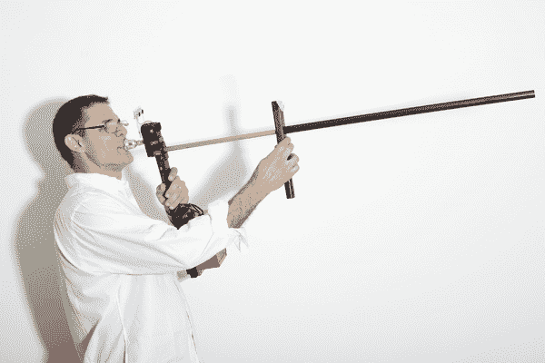](https://cdn.sparkfun.com/assets/learn_tutorials/2/1/2/Carlos_s_Tutorial-02.jpg)

我对这个项目的想法是使用电子设备来创造一种乐器，人们可以像吹长号一样演奏，但会产生合成的声音。像任何其他铜管乐器一样，长号是一种长的开口管，通过吹口在里面嗡嗡作响来演奏。然后乐器会产生共鸣，放大并改变声音。管道的长度决定了可以产生的螺距。这些基本上是从每个管道长度的基频开始的谐波分音。长号在其他铜管乐器中的独特之处在于，它使用滑块来改变管道的长度，并达到所有可能的音符。因此，为了实现我的“长号界面”，我需要跟踪两件事:嘴唇振动和滑动。

### 本教程涵盖的内容

在本教程中，我们将回顾:

*   什么样的电子硬件最适合这种应用
*   如何用机械零件复制长号
*   如何通过软件和嵌入式固件将一切连接在一起
*   如何将所有东西放在一个完整的包中

### 推荐阅读

如果你打算在家跟着做，在继续之前，确保你熟悉以下概念。

*   [模拟 vs 数字](https://learn.sparkfun.com/tutorials/analog-vs-digital)
*   [如何焊接](https://learn.sparkfun.com/tutorials/how-to-solder-through-hole-soldering)
*   [RedBoard 连接指南](https://learn.sparkfun.com/tutorials/redboard-hookup-guide)
*   [声音探测器连接指南](https://learn.sparkfun.com/tutorials/sound-detector-hookup-guide)

## 计划好了

测量载玻片的位置相当简单。有很多距离感测技术可用，在 SparkFun 的这两周，我还了解到一些我从未听说过的可能性。为了控制音符的基本形状，我需要从嘴唇的振动中识别出它的开始、结束和强度曲线。使用[声音探测器](https://www.sparkfun.com/products/12642)传感器，这一部分变得相当容易。

然而，从嗡嗡声中确定音高是一项更具挑战性的任务。在考虑了 SFE 工程人员的许多建议后，很明显我需要一些额外的火力。因此，在控制 I/O 的 Arduino 之上，该项目还包括一个 [Raspberry Pi](https://www.sparkfun.com/products/11546) 来处理音高检测的繁重工作。我们开始在一台普通计算机上用 [PureData](http://puredata.info/) 建模这个问题。我们创建了一组可调带通滤波器来识别最可能的谐波候选。计划是在 Pi 上安装软件，但是，尽管 PD 滤波器取得了一些非常有希望的结果，但由于时间限制，项目的这一部分不得不推迟。相反，我“作弊”加入了一个[软陶](https://www.sparkfun.com/products/8680)作为音高的手控。此外，在第一个版本中，我让乐器向外部合成器发送 MIDI 命令，然后合成器产生实际的声音。

[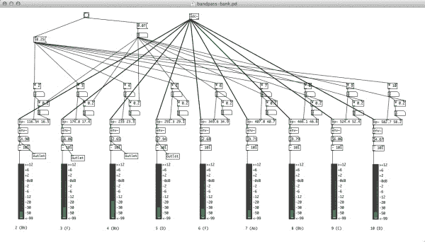](https://cdn.sparkfun.com/assets/learn_tutorials/2/1/2/pd.jpg)*Pure Data adjustable bandpass filters.*

## 电子组件

电子骨的基本设计非常简单。一个[红板](https://www.sparkfun.com/products/12757)控制一个超声波距离传感器( [HC-RS04](https://www.sparkfun.com/products/15569) )、一个[声音探测器](https://www.sparkfun.com/products/12642)和一个[软开关](https://www.sparkfun.com/products/8680)。距离传感器使用微控制器上的两个数字引脚:一个用于触发超声波脉冲，一个用于接收回波。声音检测器有三个输出引脚，其中我用了两个:gate 和 envelope。gate 引脚连接到 Redboard 上的一个数字引脚，而 envelope 则连接到一个模拟引脚。软电位计的输出进入第二个模拟输入。在这个基本电路的顶部，有两个额外的组件:一个[串行启用的 LCD](https://www.sparkfun.com/products/9068) ，在普通数字引脚上使用[软串行](http://arduino.cc/en/Reference/SoftwareSerial)，以及一个[连接到内置串行端口的 MIDI 连接器](https://www.sparkfun.com/products/9536)。最后，还有一个切换输出模式的按钮。

[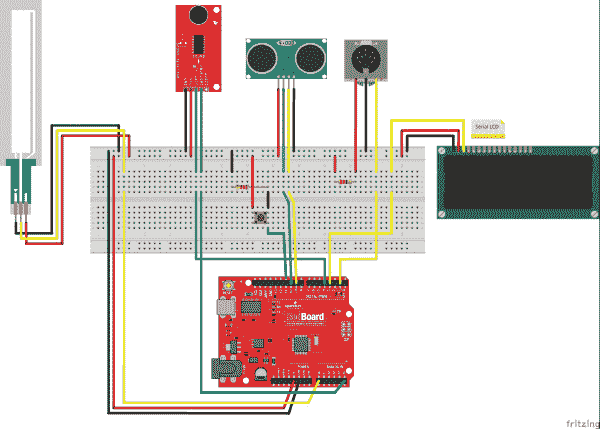](https://cdn.sparkfun.com/assets/learn_tutorials/2/1/2/electricBone_bb.jpg)

Redboard 通过声音检测器监听 gate pin 来知道玩家的嘴唇何时开始振动。如果它击中了，它就开始通过距离传感器和谐波数来跟踪滑动位置，软罐由玩家的左手拇指操作。通过结合两条信息(滑动位置和和声)，Redboard 可以确定需要播放哪个音符，因此它会向 MIDI 端口发出“音符开”信息。在音符开始后，它开始跟踪信封大头针，以控制音符的强度。当 gate 引脚读取低电平时，Redboard 发出 MIDI“音符关”，声音终止。

## 机械装配

该仪器的机械结构使用几种不同的材料。主手柄和滑撑由木头制成。用于连接控制箱的板也是如此。滑道本身采用两种不同的层:由黄铜管(9/16 英寸)制成的内滑道和一块 PVC 管(1/2 英寸)作为外滑道。除此之外，还有两个用激光切割机雕刻的丙烯酸板:一个用作超声波传感器的安装架，另一个用作偏转器。所有的零件都是用螺钉或压力装配的。

[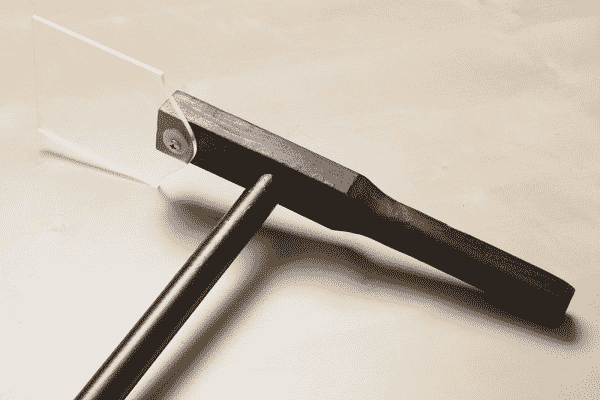](https://cdn.sparkfun.com/assets/learn_tutorials/2/1/2/Carlos_s_Tutorial-05.jpg)[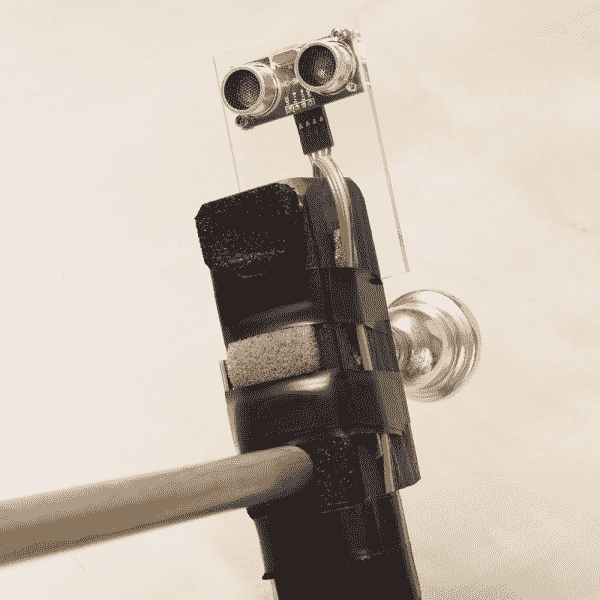](https://cdn.sparkfun.com/assets/learn_tutorials/2/1/2/Carlos_s_Tutorial-06.jpg)

内滑道连接到主手柄上，外滑道连接到另一个手柄上，两者都牢牢地固定在木头上的小孔里。距离传感器的亚克力板放在每个手柄的顶部。这使得滑动动作非常类似于演奏者用实际的长号所得到的，另外，它使距离传感器与弹跳板保持恒定的直角，有助于避免错误的读数。除了滑动连接点之外，在主手柄的另一侧上的另一个孔接收吸嘴。第三个侧孔用于在同一区域安装声音传感器，以捕捉嘴唇的振动。

[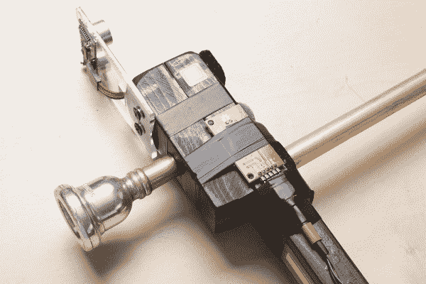](https://cdn.sparkfun.com/assets/learn_tutorials/2/1/2/Carlos_s_Tutorial-08.jpg)[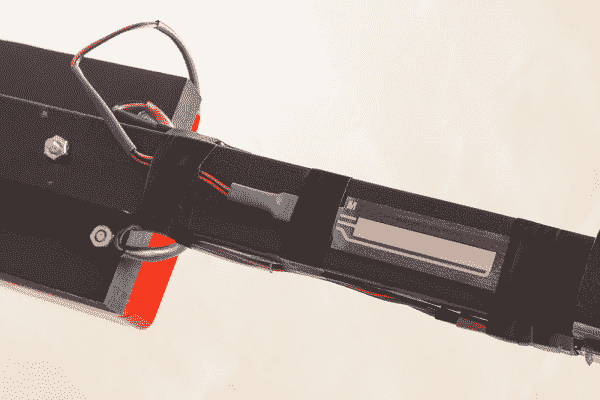](https://cdn.sparkfun.com/assets/learn_tutorials/2/1/2/Carlos_s_Tutorial-09.jpg)

## 围场

这个项目的大脑被放进一个带凸缘的红色盒子里。Redboard 和 LCD 安装在外壳的盖子上，为将来安装 Raspberry Pi 和声音屏蔽留出了很多空间，用于音频处理。盒子右侧的几个开口露出了 Redboard 的 MIDI 连接器、USB 和电源连接器。在另一侧，盒子接收来自传感器的所有电线。

[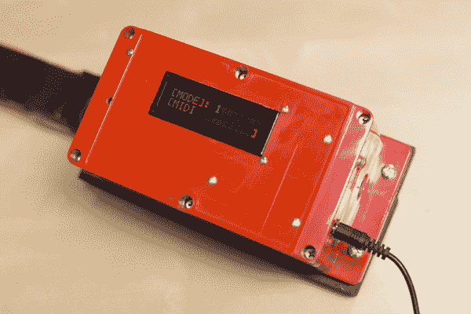](https://cdn.sparkfun.com/assets/learn_tutorials/2/1/2/Carlos_s_Tutorial-11.jpg)

一般来说，当安装一个这样的项目时，我不喜欢使用试验板，而是直接将引脚插入 Arduino。然而，由于这个项目中的每个组件都需要电源和接地，我需要一个地方来插入所有这些引脚。解决方案是将[电源轨](https://learn.sparkfun.com/tutorials/how-to-use-a-breadboard/anatomy-of-a-breadboard)从一个小试验板上剥离，然后将它们粘在盒子的盖子上。这给我留下了许多电源/接地连接点，没有浪费太多的空间。另一个技巧有助于将电线混乱程度降至最低。所有的电线都标有颜色，并用热缩管组合在一起。

[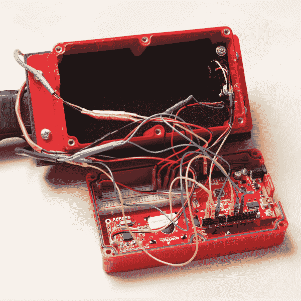](https://cdn.sparkfun.com/assets/learn_tutorials/2/1/2/Carlos_s_Tutorial-14.jpg)

这是成品...

[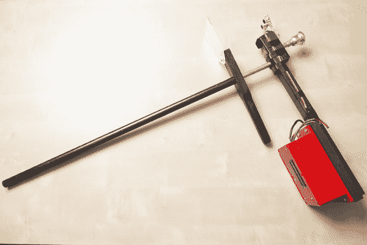](https://cdn.sparkfun.com/assets/learn_tutorials/2/1/2/Carlos_s_Tutorial-03.jpg)

## 固件

此处的电气骨骼草图[定义了三种输出模式，可以通过安装在控制盒上的小按钮进行切换。这三种模式中，目前只实现了第一种，MIDI 模式。在模式按钮的几行去抖代码之后，草图切换到所选择的模式来决定如何产生声音。](https://cdn.sparkfun.com/assets/learn_tutorials/2/1/2/ElectricBone.zip)

为了使 Arduino 代码更易于管理，我把它分成几个独立的块，放在不同的函数中。这样，只需浏览一下主循环，就可以立刻看到整个算法。

第一个函数`gateStatus()`返回 gate 引脚的当前状态。如果引脚刚从低变为高，`gateStatus()`返回`GATE_START`。如果引脚刚从高电平变为低电平，则函数返回`GATE_END`。在开始和结束之间，`gateSatus()`将返回`GATE_ON`。当没有门活动时，函数返回`GATE_OFF`。打开该功能的输出构成了电子骨骼算法的基本框架。

从那里，我们所要做的就是调用其他函数来检索传感器的当前状态:`trackSlide()`返回幻灯片的位置，单位为厘米；`slidePosition()`计算从`trackSlide()`接收的值的位置号；`harmonic()`从当前软点输入获得谐波数；`pitchNumber()`根据幻灯片位置和泛音编号挑选 MIDI 音符编号。一旦我们有了这些信息，我们就使用`sendMIDI()`向 MIDI 端口发送一条消息。当 gateStatus 报告一个`GATE_END`时，代码向 MIDI 发送音符关。

## 有兴趣了解更多关于距离感测的知识吗？

了解距离传感器使用的不同技术，以及哪些产品最适合您的下一个项目。

[Take me there!](https://www.sparkfun.com/distance_sensing)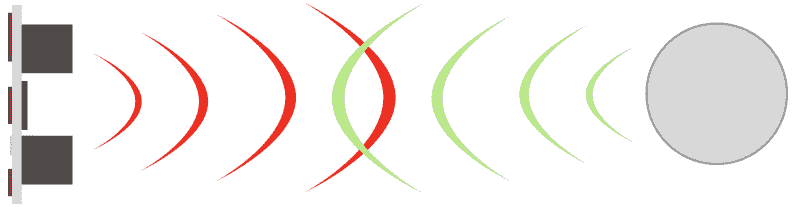

## 资源和更进一步

这个长号模拟的第一个实验当然不是全面的，但是作为该项目的概念证明。显然，即使在这个早期阶段，实施还需要许多改进，如果时间允许，我将从现在起继续努力。首先，声音检测器的灵敏度需要调整，以便在吹口嗡嗡作响的情况下更好地工作。我还需要找出一种有意义的方法来将包络信息与标准 MIDI 事件关联起来，以便使用传统合成器进行输出。对输出的另一个改进是用弯音信息实现长号滑音。然后，当然，还有音高检测算法，它将允许玩家完全控制声音，从吹/嗡嗡声到它。这将包括完善 Puredata 代码，使其在 Pi 上工作，并将所有这些与 Arduino 控制的传感器连接起来。希望通过大量的工作(和一些运气)，这个原型在不久的将来会成为一个实际的、富有表现力的乐器...我迫不及待地想用它来创作音乐！

[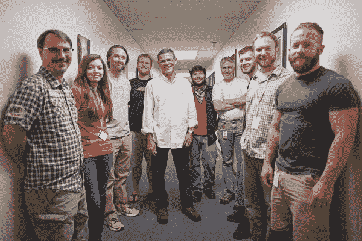](https://cdn.sparkfun.com/assets/learn_tutorials/2/1/2/Carlos_s_Tutorial-01.jpg)*Carlos and part of the SFE Engineering Team*

要获得更多与音乐相关的乐趣，请查看其他 SparkFun 教程:

*   [SparkPunk 连接指南](https://learn.sparkfun.com/tutorials/sparkpunk-hookup-guide)
*   [克琴装配指南](https://learn.sparkfun.com/tutorials/gram-piano-assembly-guide)
*   [构建 Auduino 步进序列器](https://learn.sparkfun.com/tutorials/build-an-auduino-step-sequencer)
*   [MiniGen 连接指南](https://learn.sparkfun.com/tutorials/minigen-hookup-guide)