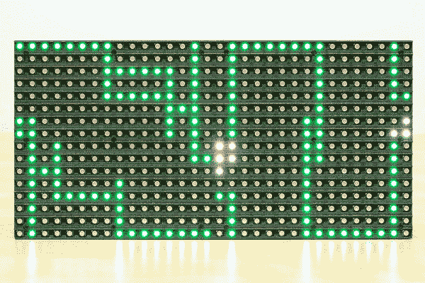
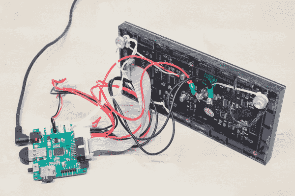
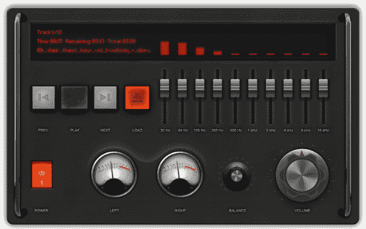
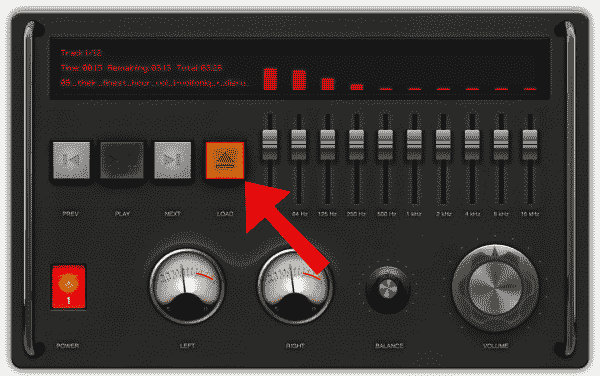

# 黑客在住宅:声音可视化 Pt。2

> 原文：<https://learn.sparkfun.com/tutorials/hackers-in-residence-the-sound-visualizer-pt-2>

## 介绍

本指南是我为[参加 SparkFun HIR 项目](https://www.sparkfun.com/news/1598)而写的[第一篇文章](https://learn.sparkfun.com/tutorials/hackers-in-residence-the-sound-visualizer)的后续。本指南介绍了如何为 PC/笔记本电脑设置音乐可视化工具。它使用 RGB LED 面板来显示音乐可视化。它播放 MP3，是 Java 驱动的。这个项目与第一个不同，它对输出到计算机声卡的数据进行采样，而不是用[麦克风](https://www.sparkfun.com/products/9964)或 [Sparkfun 声音检测器](https://www.sparkfun.com/products/12642)对环境噪声进行采样。

### 所需材料

这个项目假设你可以访问一个像素板。请注意，我与 [PIXEL 项目](http://ledpixelart.com/)没有任何关系，除了我为它写软件，Al 给我 PIXEL 硬件作为激励，让我写更多的软件。

像素通常带有 RGB LED 面板，但也可以单独使用该板。如果只获得了像素板，那么这个来自 Sparkfun 的[面板可以用于这个项目。](https://www.sparkfun.com/products/12583)

除了像素单元，你还需要一台支持 Java 8 的 PC 或笔记本电脑。要播放演示歌曲，需要互联网连接。如果没有可用的互联网连接，那么在文件系统上选择一些 MP3，用于音乐可视化工具。下面是关于从本地文件系统选择 MP3 的更多细节。

### 推荐阅读

在深入研究这个项目之前，您可能想先看看其他教程。

*   [连接器基础知识](https://learn.sparkfun.com/tutorials/connector-basics)
*   [发光二极管(LEDS)](https://learn.sparkfun.com/tutorials/light-emitting-diodes-leds)
*   [发光二极管是如何制造的](https://learn.sparkfun.com/tutorials/how-leds-are-made)
*   [RGB 面板连接指南](https://learn.sparkfun.com/tutorials/rgb-panel-hookup-guide)
*   [串行通信](https://learn.sparkfun.com/tutorials/serial-communication)

## 硬件装配

### 像素

使用本[快速入门指南](http://ledpixelart.com/downloads/PIXEL-Guts-Quick-Start-Guide.pdf)来熟悉 PIXEL 硬件。

该项目可以使用蓝牙或串行(USB)在 PC 和 PIXEL 之间进行通信。在继续之前，确保您可以从您的计算机与 PIXEL 配对/连接，并运行[示例“PC 应用程序”](http://ledpixelart.com/support/get-the-apps/)。

以下是像素组装后的样子:

## 软件先决条件和安装

### Java 运行时环境

这个项目需要 Java 8 标准版。幸运的是，Java 可以在许多平台上运行。为您的 PC/笔记本电脑的操作系统下载并安装 [JRE (Java 运行时环境)](http://www.oracle.com/technetwork/java/javase/downloads/index.html)。

### Java 应用程序

这个项目重用现有的应用程序从计算机的声卡采样数据。该应用程序使用 Java 的现代媒体 API Java FX 来播放 MP3。最初的开发商是碧玉壶。

[Download the Application](https://cdn.sparkfun.com/assets/learn_tutorials/3/4/2/onebeartoe-fx-experieince-player-0.0.1-SNAPSHOT.jar)

## 软件使用

### 运行应用程序

一旦安装了 Java 8 SE，双击上面下载的 JAR 文件运行应用程序。这将打开应用程序的用户界面。

如果使用蓝牙，则会显示系统托盘弹出窗口，提示输入密码以与像素配对。在弹出窗口自行消失之前，输入像素板的密码(V2 为 0000，V1 为 4545)。否则，需要重启应用程序来再次尝试配对。

像素连接初始化后，一条黄色消息会在 RGB LED 面板上滚动。然后，下载一个样本音乐文件，并在 RGB LED 面板上开始音乐可视化。

下面是一个快速演示:

[https://www.youtube.com/embed/XHuEiVm4SVA/?autohide=1&border=0&wmode=opaque&enablejsapi=1](https://www.youtube.com/embed/XHuEiVm4SVA/?autohide=1&border=0&wmode=opaque&enablejsapi=1)

### 播放本地 MP3 文件

使用“加载”按钮在本地文件系统上播放 MP3。

## 资源和更进一步

### 源代码

均衡器的原始源代码由 Jasper Pots 公司提供。我还添加了 PIXEL/IOIO 代码来可视化 LED 面板上的音乐。该项目的源代码可在 [this GitHub repo](https://github.com/onebeartoe/media-players/tree/master/music-visualizer) 获得。

### 改变颜色

声音可视化工具的颜色被硬编码为红色。这种硬编码的颜色在`Pixel#drawEqualizer()`方法中定义，但是可以在运行时进行配置。

请参见 [Sound Visualizer](https://learn.sparkfun.com/tutorials/hackers-in-residence-the-sound-visualizer) 教程的“修改 Java 应用程序”一节，了解有关如何使用 Netbeans 进行修改并重新构建应用程序以查看代码更改的更多详细信息。