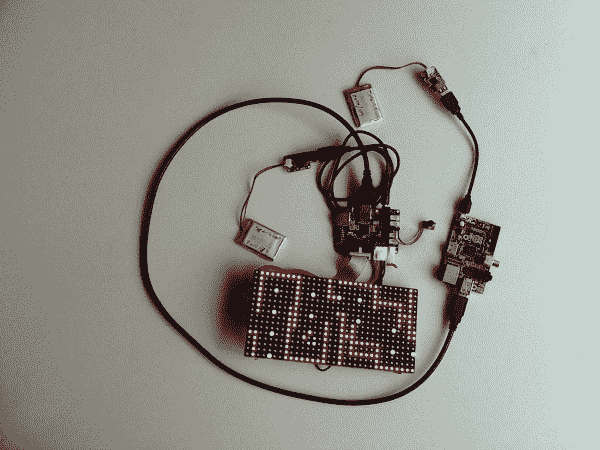

# 黑客住宅:声音可视化

> 原文：<https://learn.sparkfun.com/tutorials/hackers-in-residence-the-sound-visualizer>

## 介绍

本教程展示了如何将我在 SparkFun HIR 项目期间创建的一个声音可视化工具放在一起。该项目的最终目标是拥有一款声音感应式 LED 皮带扣。为了完成声音可视化的任务，Raspberry Pi 通过 USB 驱动像素板并与之通信。Pixel 从麦克风(或 SparkFun 声音检测器)获取输入，并将其传递回运行在 Raspberry Pi 上的 Java 应用程序。然后，Java 应用程序处理声音输入值，并向像素发送命令以驱动 RGB LED 面板。

*The final project, displaying a quick Pac-Man demo.*

### 所需材料

这里有一个在这个项目中使用的 SparkFun 部件的列表，如果你想跟随。