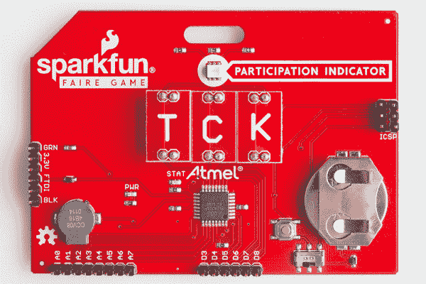
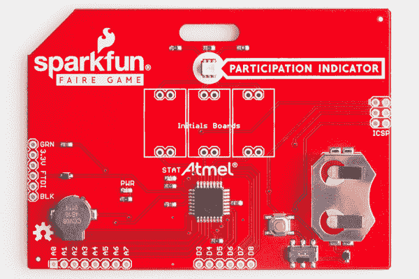
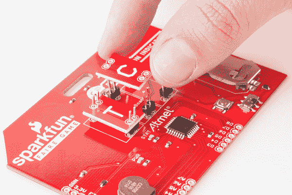
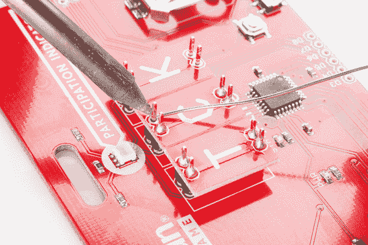
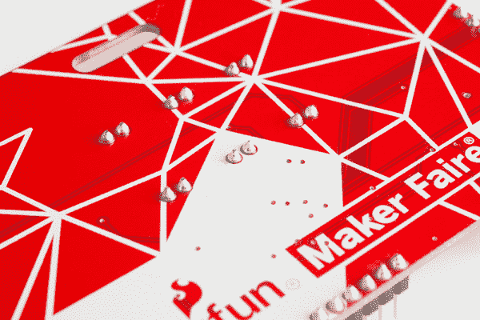
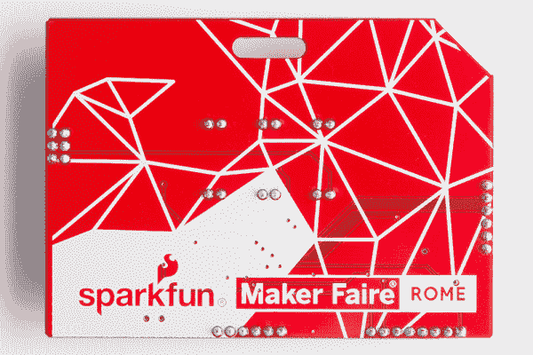

# 黑掉你的创造者大会徽章

> 原文：<https://learn.sparkfun.com/tutorials/hacking-your-maker-faire-badge>

## 介绍

SparkFun Faire 游戏徽章不仅在 Maker Faire 上很有趣，还能让你在家里使用完整的微控制器！本教程将带您完成将电路板连接到其他电子设备的过程，以及如何上传新代码。

### 推荐阅读

如果你不熟悉下面的概念，你可能想在黑你的徽章之前阅读这些额外的教程。

*   [安装 Arduino IDE](https://learn.sparkfun.com/tutorials/installing-arduino-ide)
*   [安装 Arduino 引导程序](https://learn.sparkfun.com/tutorials/installing-an-arduino-bootloader)
*   [安装 Arduino 库](https://learn.sparkfun.com/tutorials/installing-an-arduino-library)
*   [安装 FTDI 驱动程序](https://learn.sparkfun.com/tutorials/how-to-install-ftdi-drivers)
*   [通孔焊接](https://learn.sparkfun.com/tutorials/how-to-solder---through-hole-soldering)
*   [脉宽调制](https://learn.sparkfun.com/tutorials/pulse-width-modulation)

## 主板概述

这个徽章有几个你在黑它的时候应该知道的特征。

*Bare badge, showing all features discussed below.*

### 微控制器

这块板上的 IC 是 ATMega328。这是运行 [Arduino Uno](https://www.sparkfun.com/products/11021) 和我们几个 [LilyPad 板](https://www.sparkfun.com/categories/135)的同一芯片。然而，该板依赖于 328 的内部振荡器，而不是像 Uno 或 LilyPad 主板那样具有外部晶振。

### 电力系统

该板有一个用于 3V、20mm 纽扣电池的电池座。我们建议使用 [CR2032](https://www.sparkfun.com/products/338) ，因为它在 3V 时具有 250mAh 的更高容量。电路板底部的开/关开关允许用户在不使用徽章时关闭电池电源。

也可以通过电路板左侧 FTDI 接头上的 3.3V 和 GND 引脚为电路板供电。它不以任何方式连接到开/关开关，因此只要它连接，电路板就会运行。

### 沟通

有几种方法可以和你的徽章交流。第一个是电路板左侧的 FTDI 接头。该板与一个 [3.3V FTDI 分线板](https://www.sparkfun.com/products/9873)配合使用，使您能够通过 USB 接口与该板进行串行通信。

您也可以通过电路板右侧的 ICSP 接头进行通信或编程。这将使用 SPI 协议与电路板通信。

### 参与指标

这是一个 RGB LED，位于电路板的顶部中心(就在可爱的丝绸标签指向的地方！).该板预编程有此 LED，用作#makergame 的参与指示器，但您可以将它用于任何您想要的目的。LED 的蓝色通道连接到 ATMega328 上的 D9 引脚，红色通道连接到 D10 引脚，绿色通道连接到 D11/MOSI 引脚。请记住这一点，如果你决定使用 ICSP 头黑客你的徽章后-使用 MOSI 线将限制你的能力，使用绿色通道的 LED。

LED 连接的三个引脚能够进行脉宽调制(PWM)控制，因此当您考虑如何黑掉您的电路板时，这是一个很好的特性。

### 门铃

蜂鸣器位于电路板的左侧。这是预编程的，作为#makergame 的指示器，就像 LED 一样。同样，就像 LED 一样，你可以对你的电路板重新编程，以用于你喜欢的任何应用。蜂鸣器与 ATMega328 上的 D2 相连。

### 附加 I/O 引脚

还有 14 个额外的 pin 码供用户在您的徽章上进行配置。数字引脚 3-8 位于电路板的右下方。引脚 3、5 和 8 能够进行 PWM 控制，这使得这些引脚对于驱动伺服系统或其他小型电机非常有用。

模拟引脚 0-7 位于电路板的左下方。这些引脚可用于模数转换，非常有助于与具有模拟信号输出的传感器接口。

## 组装电路板

现在，您已经熟悉了徽章上的可用硬件，是时候组装它了。

在本教程中，我们将使用[公头](https://www.sparkfun.com/products/553)，但是请记住，如果你愿意，你也可以使用[母头](https://www.sparkfun.com/products/115)。

首先，将六组 2 针接头从公接头带上分开。将这些放入 pcb 顶部标有“首字母板”的孔中。然后，*不用焊接任何东西*，把三个首字母板放在头部。

你需要在焊接前放置首字母板，以确保所有东西都正确排列，并在徽章的正面贴合在一起。这样做时，接头会有点晃动，因此使用第三只手夹紧 pcb 可能会有所帮助。

既然你已经将三个首字母板排列好并放在你的徽章上，是时候开始焊接了。开始将首字母板焊接到头部。慢慢来，并根据需要重新放置电路板，这样一切都会继续保持一致。

一旦所有的首字母板被焊接到头部，是时候把你的徽章翻过来了。一次只将一个首字母板的背面焊接到徽章上可能更容易。然而，既然你已经保证了一切都会正常，这应该不是问题！

*The back of your badge should look like this once the intials boards are soldered.*

这些字母板只是作为标题之间的跳线，所以请记住，您可以使用连接线来代替首字母板。

现在是时候添加额外的标题了。至少要将接头焊接到 FTDI 连接，以及任何断开的数字或模拟引脚。如果你打算改变板上的引导装载程序，你也要焊接头到 ICSP。

为了让徽章在佩戴时相对平坦，您需要确保始终焊接在徽章的背面。一旦你完成了，它应该看起来像上面的图片。

一旦你完成，翻转你的徽章，并为你的工作感到自豪！你的徽章已经准备好作为一个完整的 Arduino 被黑了！

## 上传代码

随着您的电路板焊接完毕，您现在可以像对任何其他 Arduino 一样对您的徽章进行编程了！

如前所述，该板没有外部晶振。对于该板的生产运行，使用了来自 [OpenSegment](https://github.com/sparkfun/OpenSegment) 的引导加载程序。如果你决定通过 ICSP 重写引导程序或者需要[重新安装引导程序](https://learn.sparkfun.com/tutorials/installing-an-arduino-bootloader)，请记住这一点。为外部振荡器不正确地设置熔丝位将导致砖状徽章，所以在覆盖引导程序之前要非常小心地仔细检查！

从 Arduino IDE 上传代码到您的主板时，您需要选择“Pro 或 Pro Mini (3.3V，8MHz) w/ ATmega328”主板选项。请记住，在为您的主板编写新代码时，您确实有一些标准 Arduino 上没有的引脚，如#Board Overview 中所述。

## 资源和更进一步

### 更进一步

既然你已经想出了如何为其他项目黑掉你的徽章，是时候开始考虑你还能做什么了！

您可能需要考虑的一些事情是交换主板上的电池连接器，或者修改电源。这将允许您将不同的项目连接到电路，使电路板运行更长时间，或者运行更多高性能应用。

### 额外资源

如果您有任何反馈，请访问[评论](https://learn.sparkfun.com/tutorials/hacking-your-maker-faire-badge/discuss)或联系我们在 TechSupport@sparkfun.com[的技术支持团队](mailto:techsupport@sparkfun.com?subject=)。

查看这些附加资源，了解更多信息和其他项目想法。

*   [ATMega328 数据表](https://www.sparkfun.com/datasheets/Components/SMD/ATMega328.pdf)
*   [SPI 通信](https://learn.sparkfun.com/tutorials/serial-peripheral-interface-spi)
*   [I2C 通信](https://learn.sparkfun.com/tutorials/i2c)
*   [电池技术](https://learn.sparkfun.com/tutorials/battery-technologies)
*   [将 Arduino 连接到处理](https://learn.sparkfun.com/tutorials/connecting-arduino-to-processing)
*   [将数据推送到 Data.SparkFun.com](https://learn.sparkfun.com/tutorials/pushing-data-to-datasparkfuncom)
*   [阅读原理图](https://learn.sparkfun.com/tutorials/how-to-read-a-schematic)
*   [GitHub Repo 获取最新的代码和板文件](https://github.com/sparkfun/Interactive_Badges)