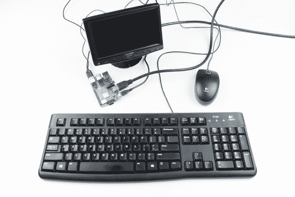
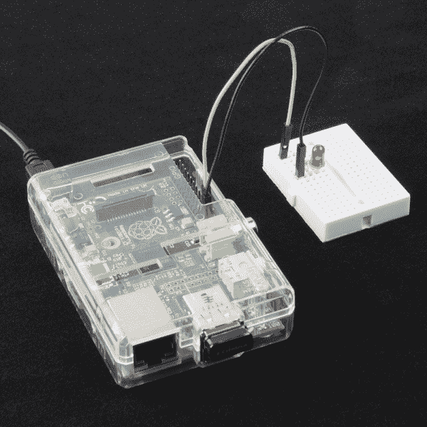

# 无头 Raspberry Pi 设置

> 原文：<https://learn.sparkfun.com/tutorials/headless-raspberry-pi-setup>

## 介绍

“无头”计算机是指没有显示器、键盘或鼠标也能运行的计算机。Raspberry Pi 作为一台廉价的电脑非常好用，可以帮助人们学习编程和创建有趣的项目(如果你打破了什么东西，不会有太多的影响——只需刷新 SD 卡！).一个缺点是，作为一台计算机(相对于微控制器)，它需要显示器、键盘和鼠标才能工作，这可能会迅速增加获取必要组件的成本。

*To use a Raspberry Pi, you often need a monitor, keyboard, and mouse*

Raspberry Pi 对于不需要监视器、键盘或鼠标的项目非常有用。缺点是设置 Pi 连接到互联网、扩展文件系统和运行代码通常需要这些计算机附件。

*An example of a simple headless Raspberry Pi project: [Twitter Monitor](https://learn.sparkfun.com/tutorials/raspberry-pi-twitter-monitor)*

本教程将向你展示三种不同的方式来配置你的 Raspberry Pi，而不需要显示器、键盘或鼠标。

*   串行终端(Serial Terminal)-这需要一个串行转 USB 适配器形式的额外硬件，但这是迄今为止最健壮的连接方式，因为你不依赖于任何网络设置。
*   **带静态 IP 地址的以太网**——这种方法需要 Linux 操作系统来更改 Raspberry Pi 映像上的一些文件。你可以给 Raspberry Pi 一个静态 IP 地址，然后使用以太网线缆(或者 WiFi)登录。
*   **带 DHCP 的 WiFi**-您需要访问您的路由器来找到您的 Raspberry Pi 的 IP 地址，以便通过 SSH 登录。因此，这在学校或办公室环境中可能不是最佳选择。

当然，有更多的方法可以连接到树莓派。这些展示了让您开始与 Pi 上的无头操作系统交互的三种常用方法。

### 所需材料

按照这个教程，你需要一个树莓 Pi，电源和微型 SD 卡。请注意，不需要显示器、键盘或鼠标！所需的任何额外硬件将在特定部分列出。

**Note:** The [Raspberry Pi Zero W](https://www.sparkfun.com/products/14277) should also work with this tutorial, if you want a smaller option for your project.