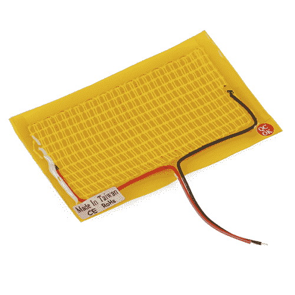
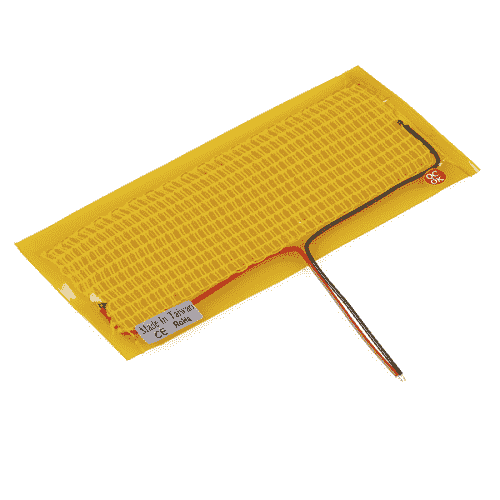

# 加热垫暖手毯

> 原文：<https://learn.sparkfun.com/tutorials/heating-pad-hand-warmer-blanket>

## 加热垫有什么用？

有很多很棒的项目你可以使用加热垫( [5x10cm](https://www.sparkfun.com/products/11288) 和 [5x15cm](https://www.sparkfun.com/products/11289) )，从保暖手套、拖鞋、毯子，或者任何你想保持舒适和温暖的东西。得到了一个[胡子面具](hhttps://www.etsy.com/search?q=beard%20mask)你想做烤面包吗？胡子需要保暖吗？不确定。这会是一个有趣的项目吗？绝对的。

 

将**添加到您的[购物车](https://www.sparkfun.com/cart)中！**

### [发热垫- 5x10cm](https://www.sparkfun.com/products/11288)

[Out of stock](https://learn.sparkfun.com/static/bubbles/ "out of stock") COM-11288

这些 DC 供电的加热垫非常适合近体加热应用。它们摸起来很暖和，但不会太热，因为我…

$4.501[Favorited Favorite](# "Add to favorites") 27[Wish List](# "Add to wish list")**** 

将**添加到您的[购物车](https://www.sparkfun.com/cart)中！**

### [发热垫- 5x15cm](https://www.sparkfun.com/products/11289)

[Out of stock](https://learn.sparkfun.com/static/bubbles/ "out of stock") COM-11289

这些 DC 供电的加热垫非常适合近体加热应用。它们摸起来很暖和，但不会太热，因为我…

$5.5010[Favorited Favorite](# "Add to favorites") 52[Wish List](# "Add to wish list")**** ****### 您应该考虑为您的项目获取哪些零件？

你可以简单到获得合适的电源和加热垫。一个加热垫额定为 **5V** ，消耗约 **600mA** 。如果您想在电路中添加某种形式的逻辑或控制，例如与传感器接口，最简单的方法是在项目中添加微控制器/开发板。如果你使用微控制器，你还需要一些电线和晶体管来控制加热垫。查看下一部分的愿望清单，了解本教程中使用的产品的更多详细信息。

**Warning!** Please make sure to use the appropriate power requirements when operating this heating pad. We do not recommend this product for beginners.

### 工具

你需要缝纫针、烙铁、焊料和一般的焊接附件。

 

### [威勒 WLC100 焊台](https://www.sparkfun.com/products/14228)

[Out of stock](https://learn.sparkfun.com/static/bubbles/ "out of stock") TOL-14228

Weller 的 WLC100 是一款多功能的 5 瓦至 40 瓦焊台，非常适合业余爱好者、DIY 爱好者和学生。…

2[Favorited Favorite](# "Add to favorites") 17[Wish List](# "Add to wish list") 

将**添加到您的[购物车](https://www.sparkfun.com/cart)中！**

### [无铅焊料- 100 克线轴](https://www.sparkfun.com/products/9325)

[In stock](https://learn.sparkfun.com/static/bubbles/ "in stock") TOL-09325

这是带有水溶性树脂芯的无铅焊料的基本线轴。0.031 英寸规格，100 克。这是一个好主意…

$9.957[Favorited Favorite](# "Add to favorites") 33[Wish List](# "Add to wish list")**** 

将**添加到您的[购物车](https://www.sparkfun.com/cart)中！**

### [针套](https://www.sparkfun.com/products/10405)

[Out of stock](https://learn.sparkfun.com/static/bubbles/ "out of stock") TOL-10405

这一套缝纫针是缝合你的下一个电子纺织品项目的必备工具。每个信封包含三个 4…

$2.10[Favorited Favorite](# "Add to favorites") 10[Wish List](# "Add to wish list")**** ****### 推荐阅读

如果您不熟悉以下概念，我们建议您在继续之前查看这些教程。

*   [基础 Lilypad 教程](https://www.sparkfun.com/tutorials/313)
*   [开始 LilyPad Arduino](https://www.sparkfun.com/tutorials/312)
*   [规划可穿戴电子产品项目](https://learn.sparkfun.com/tutorials/planning-a-wearable-electronics-project)
*   [LilyPad 基础:电子缝纫](https://learn.sparkfun.com/tutorials/lilypad-basics-e-sewing)
*   [晶体管](https://learn.sparkfun.com/tutorials/transistors)

## DIY 项目创意:暖手毯

一个毯子项目，配有两个加热垫，可在您使用电脑/笔记本电脑/平板电脑/手机/下棋/进行所有其他活动时为您的双手保暖。

### 所需材料

这个列表中有很多零件可以换成备用零件，或者根本不需要，这取决于您想要的安装类型。为了跟进这个项目，你需要以下材料。你可能不需要所有的东西，这取决于你拥有什么。将它添加到您的购物车，通读指南，并根据需要调整购物车。********