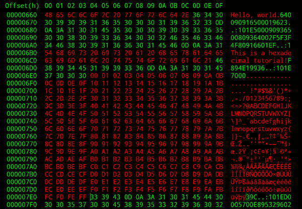
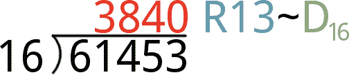
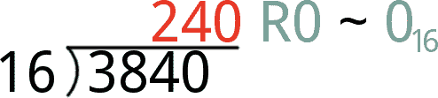
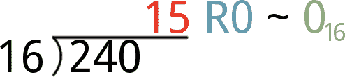
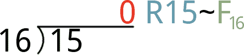
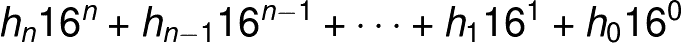
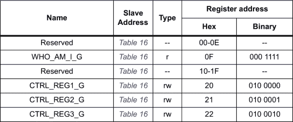
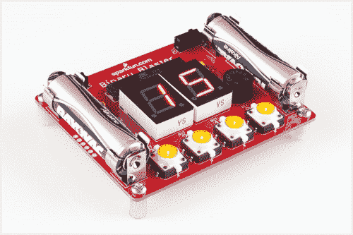

# 十六进制的

> 原文：<https://learn.sparkfun.com/tutorials/hexadecimal>

## 介绍

你有没有觉得只用 10 个数字组成数字很困难？或者想用更少的数字表示大数？或者无需查看二进制的催眠字符串 1 和 0 就能轻松识别字节值？对于这样的应用，十六进制经常成为工程师的数制选择。

*Once you understand hex, the next step is decoding the matrix!*

十六进制——也称为十六进制(T0)十六进制(T1)或以 16 为基数的 T2(T3)——是一种我们可以用来书写和共享数值的系统。在这方面，它与最著名的数字系统(我们每天都在使用的系统)没有什么不同:十进制。十进制是一个以 10 为基数的数字系统(非常适合有 10 个手指的人)，它使用 10 个唯一的数字集合，这些数字可以组合起来表示数字的位置。

十六进制和十进制一样，由一组数字组合而成。恰好 hex 使用了一组 **16 个唯一数字**。十六进制使用标准的 0-9，但它也包含了你通常不会看到的六位数字:A、B、C、D、E 和 f。

还有很多(无限！)其他的数字系统。二进制在工程界也很流行，因为它是计算机的语言。以 2 为基数的二进制系统仅使用两位数(0 和 1)来表示数字。

十六进制与十进制和二进制一样，是电子和编程领域中最常见的数字系统之一。理解十六进制的工作原理很重要，因为在许多情况下，用 16 进制表示比用二进制或十进制表示更有意义。

### 本教程涵盖的内容

本教程涵盖了你在电子或编程中可能遇到的所有与十六进制相关的内容。它分为以下几个部分:

*   [十六进制基础知识](https://learn.sparkfun.com/tutorials/hexadecimal/hex-basics) -十六进制概述。本页涵盖十六进制的 16 位数字，我们如何表示十六进制数字，以及如何用十六进制的**计算**。
*   [转换成/转换成十进制](https://learn.sparkfun.com/tutorials/hexadecimal/converting-tofrom-decimal) -这一页涵盖了我们在十六进制和十进制之间转换的首选方法。
*   这个页面展示了如何在二进制和十六进制之间转换。
*   这里你会发现一个简单的自动计算器，可以在十六进制、二进制和十进制之间进行转换。

### 推荐阅读

在钻研本教程之前，您应该对十进制数字略知一二。还记得长除法吗？余数？商数？产品？总和？指数？当你学习十六进制和它与十进制的关系时，这些都会回来困扰你。

除了温习你的算术，我们建议在此之前(或同时)通读一下我们的[二进制教程](https://learn.sparkfun.com/tutorials/binary)。

## 十六进制基础

这一页涵盖了十六进制的基础知识，包括我们用来表示十六进制数的数字的概述，以及我们用来表示一个数是十六进制值的工具。我们还将介绍非常简单的十六进制计数形式的“十进制到十六进制”转换。

### 数字:0-9 和 A-F

十六进制是一个以 16 为基数的数字系统。这意味着有 **16 个可能的数字**用来代表数字。十进制数字中你可能习惯看到的 10 个数值:0、1、2、3、4、5、6、7、8 和 9；这些值仍然代表你所习惯的值。剩下的六位数字由 A、B、C、D、E 和 F 表示，它们映射出值 10、11、12、13、14 和 15。

你可能会遇到 A-F 的大写和小写表示，两者都有效。大写和小写没有太多的标准。 *A3F* 与 *a3f* 的编号相同 *A3f* 的编号相同。

#### 下标

十进制和十六进制有 10 个相同的数字，所以它们可以创造出*许多*看起来相似的数字。但是十六进制的 10 和十进制的 10 完全不同。事实上十六进制 10 相当于十进制 16。我们需要一种方法来明确说明我们所说的数字是以 10 为基数还是以 16 为基数(或者以 8 为基数，或者以 2 为基数)。输入**基本下标**:

*Hexadecimal 10, indicated by a subscript 16, is equivalent to decimal 16 (notice the subscript 10).*

正如您将进一步看到的，下标并不是明确表示数字基数的唯一方式。下标是我们能使用的最直接的系统。

### 十六进制计数

十六进制计数很像十进制计数，只是多了六位数字要处理。一旦某个数位变得比“F”大，您就将该数位滚动到“0”，并将该数位向左递增 1。

让我们来数一数:

| 小数 | 十六进制的 | ... | 小数 | 十六进制的 |
| Zero | Zero |  | eight | eight |
| one | one |  | nine | nine |
| Two | Two |  | Ten | A |
| three | three |  | Eleven | B |
| four | four |  | Twelve | C |
| five | five |  | Thirteen | D |
| six | six |  | Fourteen | E |
| seven | seven |  | Fifteen | F |

一旦你到达 F [16] ，就像你将从十进制的 9 [10] 滚动到 10 [10] ，你滚动到 10 [16] :

| 小数 | 十六进制的 | ... | 小数 | 十六进制的 |
| Sixteen | Ten |  | Twenty-four | Eighteen |
| Seventeen | Eleven |  | Twenty-five | Nineteen |
| Eighteen | Twelve |  | Twenty-six | 1A |
| Nineteen | Thirteen |  | Twenty-seven | 1B |
| Twenty | Fourteen |  | Twenty-eight | 1C |
| Twenty-one | Fifteen |  | Twenty-nine | 1D |
| Twenty-two | Sixteen |  | Thirty | 1E |
| Twenty-three | Seventeen |  | Thirty-one | 1F |

一旦你达到 1F [16] ，滚动到 20 [16] 并保持从 0 到 f 的最右边的数字

### 十六进制标识符

“牛肉，是晚饭吃的”。我在引导我内心的[山姆·艾略特](http://www.youtube.com/watch?v=IlRbSMywTQg) ( [麦康纳)吗？](http://www.funnyordie.com/videos/538f0371f2/matthew-mcconaughey-creepy-beef-spokesman-from-that-happened))，还是表达我对十进制数 48879 的渴望？为了避免类似的混乱情况，您通常会看到一个十六进制数字以下列标识符之一为前缀(或后缀):

| 标识符 | 例子 | 笔记 |
| 0x | 0x47DE | 这个前缀在 UNIX 和基于 C 的编程语言中出现了很多(比如 Arduino！). |
| # | #FF7734 | HTML 和图像编辑程序中的颜色引用。 |
| % | %20 | 经常在 URL 中用来表示类似“空格”(%20)的字符。 |
| \x | \x0A | 通常用于表示字符控制代码，如“退格”(\x08)、“转义”(\x1B)和“换行”(\x0A)。 |
|  | & # 91 | 在 HTML、XML 和 XHTML 中用于表示 unicode 字符(例如：打印一个ω)。 |
| 0h | 0h5E | 许多可编程图形计算器(如 TI-89)使用的前缀。 |
| 数字/文本下标 | BE37 [16] ，13F [六角] | 这更像是以 16 为基数的数字的数学表示。十进制数可以用下标 10(基数为 10)来表示。二进制以 2 为基数。 |

还有各种其他特定于某些编程语言的前缀和后缀。例如，汇编语言可能使用“H”或“H”后缀(如 7Fh)或“$”前缀(6AD)。如果您不确定在编程语言中使用哪个前缀或后缀，请参考示例。

“0x”前缀是一个你会经常看到的前缀，尤其是当你正在做任何 [Arduino 编程](https://learn.sparkfun.com/tutorials/what-is-an-arduino)的时候。从现在开始，我们将在本教程中使用它。

综上:无咖啡因？令人讨厌的咖啡。0xDECAF？一个完全可以接受的 5 位十六进制数。

## 十进制之间的转换

到目前为止，我们已经知道如何在十进制和十六进制之间转换大约 16 个数值。为了转换更大的数字，这里有一些我们使用的技巧。

### 将十进制转换为十六进制

从十进制到十六进制的转换涉及许多除法和余数。如果你已经忘记了长除法， [wiki 总是在那里](http://en.wikipedia.org/wiki/Long_division)帮你复习。

将一个数字从十进制转换成十六进制的步骤如下:

1.  将 *N* 除以 16。那个除法的**余数**是你的十六进制数的第一(最低/最右)位。将**商**(除法结果)进行下一步。
    *   注意:如果余数是 10、11、12、13、14 或 15，那么它就是十六进制数字 A、B、C、D、E 或 f。
2.  **将上一步的商**再次除以 16。这个除法的余数是你的十六进制值的第二位**(从右数第二个)。将这个除法的商带入下一步。**
***   将步骤 2 的商再除以 16。这个除法的余数是十六进制转换的第三个数字。注意到一种模式？*   继续将上一步的商除以 16，并存储余数**，直到除法结果为 0** 。除法的余数是你的十六进制值的最左边的**，最高有效数字**。**

#### 十进制到十六进制的示例:转换 61453

数学说够了，让我们来做个例子。让我们把**61453[10]转换成十六进制:**

1.  将 61453 除以 16。结果是 3840 的**商和 13** 的**余数。该余数成为我们的第一个、最右边的、最低有效的十六进制数字 d，将 3840 带入下一步。
    ** 
2.  现在用 3840 除以 16。得到的商是 240，余数为 0。我们的第二个十六进制数字是 0，下一个数字是 240。

     

3.  用 240 除以 16，你会得到 15，余数是 0。我们的第三个十六进制数字是 0，取 15 到步骤 4。

     

4.  最后，用 15 除以 16。这将产生我们一直在等待的 0 商，余数为 15。如果 F.

     ，余数表示该位置的十六进制数字

最后，**组合所有四个十六进制数字**来创建我们的十六进制值: **0xF00D** 。

### 将十六进制转换为十进制

有一个丑陋的等式支配着十六进制到十进制的转换:

这个等式有几个重要的元素。每个 *h* 因子(*h[n]T5， *h [n-1]* )都是十六进制值的一个**个位数**。如果我们的十六进制值是 0xF00D，比如 *h [0]* 是 *D* ， *h [1]* ，*h[2]是 *0* ，*h[3]T31 是 *F* 。***

**16 的幂**是十六进制的关键部分。更重要的数字(数字左边的数字)乘以 16 的更大的幂。最低有效位*h[0]乘以 16 ⁰ (1)。如果一个十六进制值有四位数长，最高有效位乘以 16 ³ ，即 4096。*

**要将十六进制数转换成十进制数**，你需要在上面的等式中插入每个 *h* 因子的值。然后将每个数字乘以各自的 16 次方，并将每个乘积相加。我们的逐步方法是:

1.  从十六进制值的最右边的数字开始。乘以 16 ⁰ ，即:**乘以 1** 。换句话说，让它去吧，但是把那个值放到一边。
    *   记住将字母十六进制值(A、B、C、D、E 和 F)转换为它们的十进制等效值(10、11、12、13、14 和 15)。
2.  **向左移动一位数字**。将该数字乘以 16 ¹ (即**乘以 16** )。记住那个产品，把它放在一边。
3.  再左移一位数。将该数字乘以 16 ² (256)并存储该乘积。
4.  通过增加 16 的 (4096，65536，1048576，...)，并记住每个产品。
5.  一旦你将十六进制值的每个数字乘以 16 的适当次方，**将它们加起来**。这个和是你的十六进制值的十进制等效值。

#### 十六进制到十进制示例:转换 0xC0DE

下面是一个四位十六进制值的例子，0xC0DE，我们想把它转换成十进制。创建表格并将数字分类到单独的列中可以使转换过程更容易:

|  | 十六进制数字 | 笔记 |
| 数字位置( *n* | three | Two | one | Zero | 这些值是静态分配的，它们向左增长。 |
| 十六进制数字排序 | C | Zero | D | E | 这部分很简单，从右到左插入你的十六进制值。 |
| 转换 A-F | Twelve | Zero | Thirteen | Fourteen | 将十六进制值 A-F 转换为 10-15。 |
| 乘以 16 ^n | 12 乘以 16 ³ | 0 × 16 ² | 13 × 16 ¹ | 14 × 16 ⁰ | 16 的指数是位置， *n* 。 |
| 最终产品 | Forty-nine thousand one hundred and fifty-two | Zero | Two hundred and eight | Fourteen | 十六进制数字和 16 的幂的乘积。 |
| 总结所有产品 | Forty-nine thousand three hundred and seventy-four | 我们的十进制等价物！ |

这就是了。代码 [16] = 49374 [10] ！

这个表格方法非常适合于保持所有的十六进制数字、位置和 16 的幂在一条线上。要转换更大的十六进制数，只需向左添加一列，并增加 *n* 。

* * *

既然你知道如何手工计算，那就为自己节省一点时间，用计算器。

## 转换为二进制或从二进制转换

放松呼吸！我们已经解决了艰难的转换问题。我们在电子和计算机工程中使用十六进制，因为它非常容易在二进制(计算机的 1 和 0 的语言)之间转换。

十六进制和二进制之间的转换很容易，因为十六进制数字的每一位“映射”到二进制值的四位(一位是一个单独的二进制数字)。**所以一个字节**——八个二进制数字——总是可以用两个十六进制数字来表示**。这使得十六进制成为表示一个字节或一组字节的非常好的、简洁的方法。**

### 从二进制转换为十六进制

让我们从将前 16 个十六进制值映射到二进制开始。

| 小数 | 十六进制 | 二进制的 | ... | 小数 | 十六进制 | 二进制的 |
| 00 | Zero | 0000 |  | 08 | eight | One thousand |
| 01 | one | 0001 |  | 09 | nine | One thousand and one |
| 02 | Two | 0010 |  | Ten | A | One thousand and ten |
| 03 | three | 0011 |  | Eleven | B | One thousand and eleven |
| 04 | four | 0100 |  | Twelve | C | One thousand one hundred |
| 05 | five | 0101 |  | Thirteen | D | One thousand one hundred and one |
| 06 | six | 0110 |  | Fourteen | E | One thousand one hundred and ten |
| 07 | seven | 0111 |  | Fifteen | F | One thousand one hundred and eleven |

随着你的成长，继续使用十六进制和二进制，这 16 个值会在你的大脑中根深蒂固。这些是十六进制和二进制之间转换的关键。

为了在二进制和十六进制之间进行转换，我们希望利用四个二进制数字(位)映射到一个十六进制数字的事实。**按照以下步骤**从二进制转换为十六进制。

1.  从最右侧开始，将一个二进制值分成四个的**组。**
2.  对于每组四个，参考上表找到匹配的十六进制值，并用一个十六进制值替换四个二进制数字的组**。**

就是这样！让我们试一试。

#### 二进制到十六进制示例:转换 0b101111010100001

首先，从二进制数的最右端开始，将 1 和 0 分成四组:

| 排序的二进制数字: | 0101 | One thousand one hundred and ten | One thousand and ten | 0001 |

现在参考我们的大表-o '-16，将四进制转换为十六进制数字:

| 排序的二进制数字: | 0101 | One thousand one hundred and ten | One thousand and ten | 0001 |
| 十六进制当量: | five | E | A | one |

现在你知道了！0b101111010100001 = 0x5EA1。(唉。这个教程已经远远超出了大家对 [1337](http://en.wikipedia.org/wiki/1337_Speak) 的容忍度。我很抱歉。)

### 从十六进制转换为二进制

从十六进制到二进制的转换很像二进制到十六进制的转换。简单地取一个十六进制数字，并把它变成四个二进制数字。重复，直到你的数字充满 0 和 1。

#### 十六进制到二进制示例:转换 0xDEADBEEF

要转换 0xDEADBEEF(一个常用代码[表示系统崩溃)，首先将数字分类到“bin”:](http://en.wikipedia.org/wiki/Hexspeak)

| 十六进制数字排序: | D | E | A | D | B | E | E | F |

然后将每个十六进制数字转换为四位:

| 十六进制数字排序: | D | E | A | D | B | E | E | F |
| 十六进制数字排序: | One thousand one hundred and one | One thousand one hundred and ten | One thousand and ten | One thousand one hundred and one | One thousand and eleven | One thousand one hundred and ten | One thousand one hundred and ten | One thousand one hundred and eleven |

换句话说，0x dead beef = 0b 1101111101011011111011111111111111101111111111。有很多 1 和 0。

### 使用十六进制来表示和识别字节

上面的例子展示了 hex 最强大的功能之一:**轻松表示字节**的值。十六进制对我们来说更容易处理，因为它的值比一长串的 1 和 0 更短更容易记忆。

例如，上面的寄存器映射来自于 [LSM9DS0](https://www.sparkfun.com/products/12636) (一个[俏皮的 9DOF 传感器](https://learn.sparkfun.com/tutorials/lsm9ds0-hookup-guide))。它以十六进制和二进制形式列出了用于控制传感器的寄存器地址。如果要访问 CTRL_REG2_G 寄存器，记住 0x21 比记住 0b010001 容易得多，发现十六进制值中的错别字也比二进制容易得多。出于这个原因，我们更有可能在代码中使用十六进制值，而不是二进制值。

## 转换计算器

如果你在做长除法，试图将十进制转换成十六进制，或者在计算 16 的幂时迷路，试试这些计算器。

在下面的任何一个框中输入一个数字，将自动用匹配的值更新其他的框。您可以在中键入十六进制值，以转换为二进制和十进制。或者键入十进制或二进制数来生成十六进制值。你爱怎么用就怎么用！

| 十进制: |  | (0-9) |
| 二进制: |  | (0-1) |
| 十六进制: |  | (阿-福，阿-福，0-9) |

这个计算器需要 Javascript。如果它不起作用，请确保 JS 已启用(如果您愿意的话)。

## 资源和更进一步

理解十六进制是如何工作的是电子和编程许多领域的关键。

用你闪亮的新的十六进制知识武装起来，这里有一些相关的教程，你可能想从这里看看:

*   [数字逻辑](https://learn.sparkfun.com/tutorials/digital-logic)和[移位寄存器](https://learn.sparkfun.com/tutorials/shift-registers)——这些教程使用十六进制作为更大、更通用的电子概念的基础。数字逻辑是计算机所有决策背后的核心。移位寄存器可用于将单个输入或输出扇出至 8 个或更多。
*   I ² C 和[SPI](https://learn.sparkfun.com/tutorials/serial-peripheral-interface-spi)——这些通信接口几乎总是需要以某种方式使用 hex。通过 SPI 或 I ² C 通信的器件通常有一个寄存器列表，这些寄存器都映射有十六进制地址。I ² C 设备都分配有唯一的 7 位地址，通常以十六进制表示。

*   二进制爆能器连接指南 -如果你想练习你的十六进制转换，那么[二进制爆能器套件](https://www.sparkfun.com/products/12037)会很有帮助。这是一套焊接工具。一旦你把它们放在一起，用它来测试你对二进制、十六进制和十进制是如何联系的知识。**