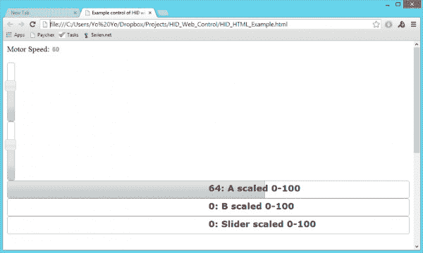

# 网页的隐藏控件

> 原文：<https://learn.sparkfun.com/tutorials/hid-control-of-a-web-page>

## HID 通信

在微控制器和计算机之间传输数据是很棘手的。到目前为止，[串行协议](https://learn.sparkfun.com/tutorials/serial-communication)和 [USB 到串行转换器](https://www.sparkfun.com/products/9716)已经填补了这个空白。今天，我们将向您展示如何通过网页监听和控制基于 USB HID 的主板。如果你正在设计一个需要对现实世界做出反应的交互式网页，这是非常有用的。

人机接口设备，或称 [HID](http://en.wikipedia.org/wiki/USB_human_interface_device_class) ，是为了允许许多不同类型的硬件通过 USB 来回传递信息而创建的。键盘是一个很好的 HID 例子，但是键盘只能单向传递数据(“你按了 k 按钮”)。全双工更复杂，但一旦启动并运行，它就更有价值。

*It's not pretty, but the sky is the limit when you can read and control hardware from a web page!*

### 本教程涵盖的内容

这不是一个“把你的达芬奇变成键盘”的例子。本教程演示了完全双向 HID 通信。如果您需要控制电机、led 和蜂鸣器等输出，这种技术会很有帮助。很抱歉，本教程中使用的某些工具仅适用于 Windows。如果你有类似的工具链来让 RawHID 在 Linux 和 Mac 上工作，请[让我们知道](https://learn.sparkfun.com/tutorials/hid-control-of-a-web-page/feedback)。

本教程主要基于 PJRC 的 Teensy RawHID 库。如果没有 Paul 开发 RawHID 库的出色工作，这一切都是不可能的。如果你想做一个真正的 USB 设备，考虑用来自 [PJRC](http://www.pjrc.com/teensy/index.html) 或 [SparkFun](https://www.sparkfun.com/search/results?term=teensy&what=products) 的 Teensy 来开发它。它们是真正易于使用的小设备。

本教程背后的想法来自一个项目，我们需要创建一个可以将传感器数据(模拟值、数字值)输出到网页的板。我们还需要根据用户在同一页面上点击的位置来控制电机和 led。为此，我们需要电路板能够来回传递 HID 数据包。同样，有大量的教程展示如何实现游戏杆或键盘，但这些通常是单向的，很少直接与网页对话。

### 所需材料

以下是您可能需要收集的零件列表: