# SparkFun RedBoard Artemis Nano 的连接指南

> 原文：<https://learn.sparkfun.com/tutorials/hookup-guide-for-the-sparkfun-redboard-artemis-nano>

## 介绍

我们喜欢开玩笑说，[spark fun red board Artemis Nano](https://www.sparkfun.com/products/15443)是前面的聚会，后面是所有的业务！这是一款重量轻、厚度为 0.8 毫米的 PCB，具有板载锂电池充电功能和一个 Qwiic 连接器，易于在非常小的项目中实施。双排接地连接可以轻松添加大量按钮、led 和任何需要自己的 GND 连接的东西。同时，如果焊接内侧引脚，该板与试验板兼容。再加上阿尔特弥斯模块的各种功能，你就有了一场盛大的派对。我们去看看吧！

[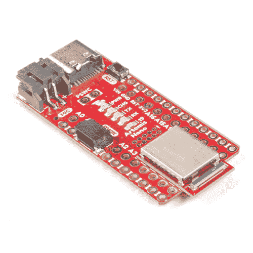](https://www.sparkfun.com/products/15443) 

将**添加到您的[购物车](https://www.sparkfun.com/cart)中！**

### [SparkFun RedBoard Artemis Nano](https://www.sparkfun.com/products/15443)

[In stock](https://learn.sparkfun.com/static/bubbles/ "in stock") DEV-15443

RedBoard Artemis Nano 是 Artemis 模块的一个微型的多功能实现。

$16.506[Favorited Favorite](# "Add to favorites") 50[Wish List](# "Add to wish list")** **[https://www.youtube.com/embed/-fJuLcr0CT8/?autohide=1&border=0&wmode=opaque&enablejsapi=1](https://www.youtube.com/embed/-fJuLcr0CT8/?autohide=1&border=0&wmode=opaque&enablejsapi=1)

[https://www.youtube.com/embed/sthuUZOTQ-U/?autohide=1&border=0&wmode=opaque&enablejsapi=1](https://www.youtube.com/embed/sthuUZOTQ-U/?autohide=1&border=0&wmode=opaque&enablejsapi=1)

### 所需材料

你需要一根 USB C 线来编程。任何 USB C 线都可以使用，包括手机充电器附带的那根。如果你还没有 USB C 线，你可以在这里选一根或者买一根别致的[可翻转的](https://www.sparkfun.com/products/15424)。

 

将**添加到您的[购物车](https://www.sparkfun.com/cart)中！**

### [SparkFun RedBoard Artemis Nano](https://www.sparkfun.com/products/15443)

[In stock](https://learn.sparkfun.com/static/bubbles/ "in stock") DEV-15443

RedBoard Artemis Nano 是 Artemis 模块的一个微型的多功能实现。

$16.506[Favorited Favorite](# "Add to favorites") 50[Wish List](# "Add to wish list")**** 

将**添加到您的[购物车](https://www.sparkfun.com/cart)中！**

### [可逆 USB A 转 C 线- 2m](https://www.sparkfun.com/products/15424)

[18 available](https://learn.sparkfun.com/static/bubbles/ "18 available") CAB-15424

这些 2 米长的电缆稍加修改后，就可以插入其端口，而不用考虑其在 U…

$8.951[Favorited Favorite](# "Add to favorites") 4[Wish List](# "Add to wish list")**** ****### 推荐阅读

|  |
| *[Qwiic 连接系统](https://www.sparkfun.com/qwiic)* |

[https://www.youtube.com/embed/NKyA5y44-0E/?autohide=1&border=0&wmode=opaque&enablejsapi=1](https://www.youtube.com/embed/NKyA5y44-0E/?autohide=1&border=0&wmode=opaque&enablejsapi=1)

我们还建议在继续之前查看这些教程:

 [### I2C](https://learn.sparkfun.com/tutorials/i2c) An introduction to I2C, one of the main embedded communications protocols in use today.[Favorited Favorite](# "Add to favorites") 128 [### 将 SparkFun Edge 板与 Ambiq Apollo3 SDK 配合使用](https://learn.sparkfun.com/tutorials/using-sparkfun-edge-board-with-ambiq-apollo3-sdk) We will demonstrate how to get started with your SparkFun Edge Board by setting up the toolchain on your computer, examining an example program, and using the serial uploader tool to flash the chip.[Favorited Favorite](# "Add to favorites") 7 [### 用 SparkFun Artemis 设计](https://learn.sparkfun.com/tutorials/designing-with-the-sparkfun-artemis) Let's chat about layout and design considerations when using the Artemis module.[Favorited Favorite](# "Add to favorites") 4 [### 用 Arduino 开发 Artemis](https://learn.sparkfun.com/tutorials/artemis-development-with-arduino) Get our powerful Artemis based boards (Artemis Nano, BlackBoard Artemis, and BlackBoard Artemis ATP) blinking in less than 5 minutes using the SparkFun Artemis Arduino Core 6

## 硬件概述

### 电源、GPIOs 和 GND 连接

Nano 突破了 17 GPIO 到 PTH 的漏洞。每个 GPIO 都配有一个接地连接。我们发现额外的场地在项目布线时非常有用；每个 LED、按钮或传感器通常都需要单独的接地。Nano 让一个想法的原型化变得更加容易。

⚡ **Warning:** All pins are **3.3V**. DO NOT expose the pins to 5V.

The Nano *is* breadboard compatible if you solder headers into only the inner rows of PTH holes. This will give your breadboard access to all GPIO, RST, 3.3V, VIN, and 1 ground pin.[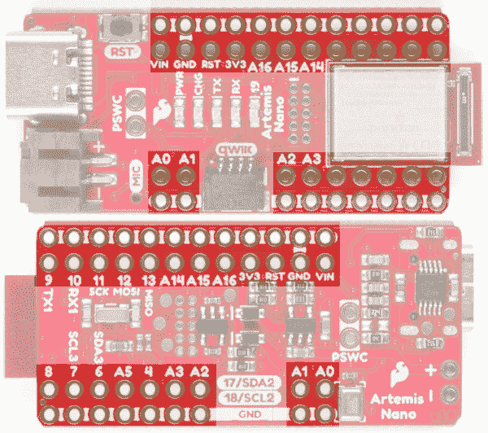](https://cdn.sparkfun.com/assets/learn_tutorials/9/2/6/15443-SparkFun-Artemis-Nano-GPIO_Pins.jpg)

电源在 USB、LiPo 和 Vin (Vin 优先)之间自动选择。VIN 引脚可以处理高达 **6V** 的电压，并将使用 AP2112 电压调节器(最大输出 600mA)调节至 3.3V。 **3.3V** 引脚可用于为高达 600mA 的各种 3.3V 设备供电。

**Advanced Trick:** If you need two more GPIO the Qwiic connector can be used to gain access to D17 and D18.

### USB C 和串行引导加载

我们设计了带有可逆 USB C 连接器的 Nano 和 CH340E USB 转串行 IC。这是一个令人惊叹的 IC，小到足以安装在 USB C 连接器下。

该驱动程序应该会自动安装在大多数操作系统上。然而，有各种各样的操作系统。第一次将芯片连接到计算机的 USB 端口时，或者有操作系统更新时，您可能需要安装驱动程序。更多信息，请查看我们的[如何安装 CH340 驱动教程](https://www.sparkfun.com/ch340)。

 [### 如何安装 CH340 驱动程序

#### 2019 年 8 月 6 日](https://learn.sparkfun.com/tutorials/how-to-install-ch340-drivers) How to install CH340 drivers (if you need them) on Windows, Mac OS X, and Linux.[Favorited Favorite](# "Add to favorites") 9

当前的 USB C 配置使用两个 5.1k 欧姆的电阻。这将允许从您的 USB 源获得高达 2 安培的 5 伏电压。几乎所有的现代计算机和电池组都有短路保护，但要知道 Nano 没有任何短路保护。

⚡ **Warning:** The Nano **does not** have a resettable fuse. In the rare event that your design shorts out the board may begin to consume more than 2 amps causing damage to the board or to your USB source.

### JTAG 编程

[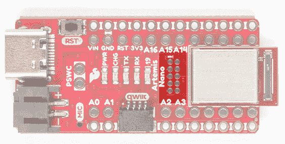](https://cdn.sparkfun.com/assets/learn_tutorials/9/2/6/RedBoard-Nano-JTAG.jpg)*JTAG Connection*

需要断点级别调试的高级用户可以使用未填充的 JTAG 足迹。我们建议检查我们的 [JTAG 部分](https://www.sparkfun.com/categories/tags/jtag)的兼容公头和兼容的 JTAG 编程器和调试器。

### 复位和电源控制

Nano 是嵌入项目的绝佳设备。但是如果它是嵌入式的，通常不可能接触到板上的复位和电源开关。我们已经暴露了复位引脚和一个*电源开关*引脚。这是焊接大型外部电源开关的绝佳位置。 **PSWC** 引脚控制 3.3V 调节器上的使能线。把这条线拉低，板子就会关掉。放开 PSWC 线，板卡就会正常运行。使能线用一个电阻拉高，所以如果你不连接任何东西，电路板将正常工作。

[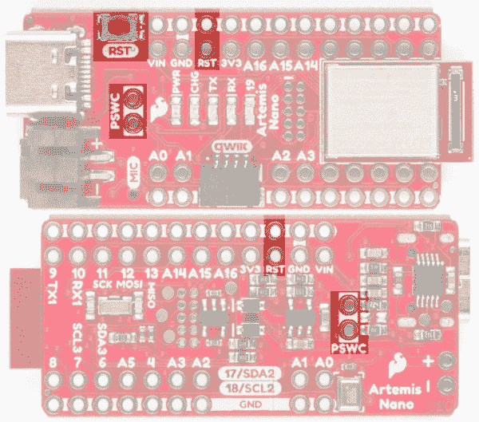](https://cdn.sparkfun.com/assets/learn_tutorials/9/2/6/15443-SparkFun-Artemis-Nano-Reset_And_Power_Switch.jpg)

### RTC 和 PDM 麦克风

如果给 Artemis 一个 32kHz 的源，它就有内置的 RTC 能力，所以我们给 Nano 增加了一个 32kHz 的晶体。此外，Artemis 的主要应用之一是语音识别，因此我们在电路板上增加了一个 MEMS 数字 PDM 麦克风，以便您可以捕捉和分析音频。

[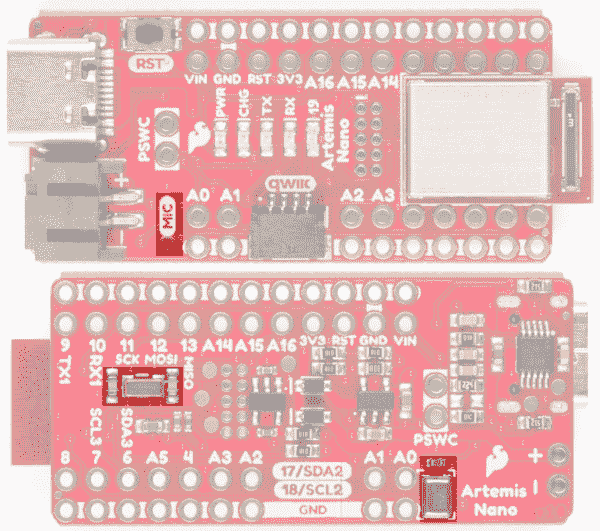](https://cdn.sparkfun.com/assets/learn_tutorials/9/2/6/15443-SparkFun-Artemis-Nano-RTC_MicroPhone.jpg)

### LiPo 电池和充电

Nano 集成了脂肪动力和充电功能。我们的任何一款 [LiPo 电池](https://www.sparkfun.com/categories/54)都能与 Nano 完美配合。当电池通过 USB 充电时， *CHG* LED 将点亮，当电池达到峰值电压时将熄灭。充电速率设置为 500 毫安。一般的经验法则是充电速度不要超过 1C，所以推荐的最小电池容量是 500mAh，但是任何更大的电池都可以。

[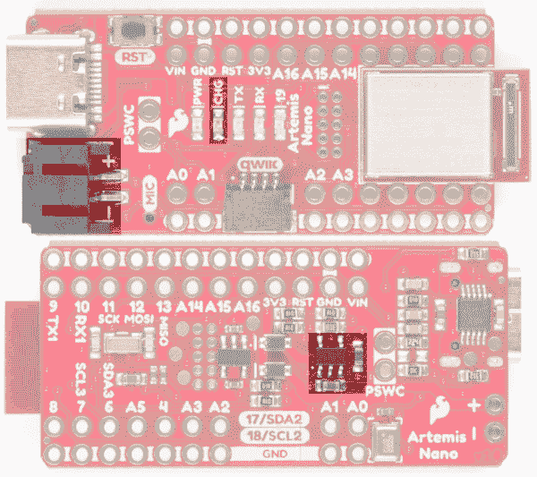](https://cdn.sparkfun.com/assets/learn_tutorials/9/2/6/15443-SparkFun-Artemis-Nano-JSTConnector_ChargeLED_ChargeCircuit.jpg)

## 软件设置

RedBoard Artemis Nano 运行 Arduino 和更高级的 Ambiq HAL/SDK。检查这些教程，让你在 5 分钟内起床并眨眼！

 [### 用 Arduino 开发 Artemis

#### 2019 年 6 月 20 日](https://learn.sparkfun.com/tutorials/artemis-development-with-arduino) Get our powerful Artemis based boards (Artemis Nano, BlackBoard Artemis, and BlackBoard Artemis ATP) blinking in less than 5 minutes using the SparkFun Artemis Arduino Core 6 [### 将 SparkFun Edge 板与 Ambiq Apollo3 SDK 配合使用

#### 2019 年 3 月 28 日](https://learn.sparkfun.com/tutorials/using-sparkfun-edge-board-with-ambiq-apollo3-sdk) We will demonstrate how to get started with your SparkFun Edge Board by setting up the toolchain on your computer, examining an example program, and using the serial uploader tool to flash the chip.[Favorited Favorite](# "Add to favorites") 7

## 解决纷争

### 我的 Nano 没有显示为 COM 端口？！

大多数 Artemis 载板使用 CH340C IC，不受此问题影响。这个问题只针对使用小得多的 CH340E 的 Nano。

[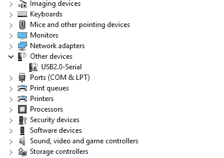](https://cdn.sparkfun.com/assets/learn_tutorials/9/1/3/CH340E_as_a_unknown_serial_device.jpg)

CH340E 的供应商 ID 不正确，我们遇到了一些问题。如果您的电脑将上述内容显示为未知的 **USB2.0 串行**设备，您可能会遇到此问题。

[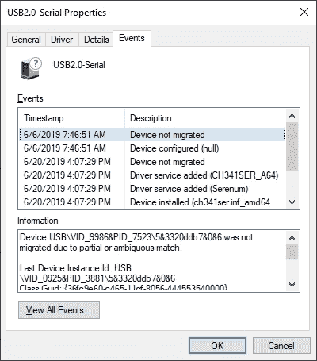](https://cdn.sparkfun.com/assets/learn_tutorials/9/1/3/CH340E_as_a_unknown_serial_device-Incorrect_VID_9986.jpg)*Device showing Vendor ID of 0x9986 when it should be 0x1A86*

对于 Nano，我们需要使用更小的 CH340E，它只有 RTS。CH340E 和 RTS 可以很好地重置 Artemis 模块并激活 SparkFun 变量引导加载程序，但有一个例外:根据该公司的说法，当 RTS 引脚具有太大的负载电阻时，IC 将错误地枚举 VID 0x9986(正确的 VID 是 0x1A86)。这是一种非常奇怪的故障模式，没有记录在案。我们将与 CH340 制造商 WCH 密切合作，在未来的纳米板上解决这个问题。

如果您遇到这种情况，有两种解决方案:

**选项 1:** 拔下并重新插入 USB 将导致 IC 在正确的 VID/PID 下正确枚举，并且驱动程序将按预期工作。如果你记得这样做的话，这很好，但是如果你像我一样，我会在两个星期后忘记，并想知道为什么 COM 端口没有出现。

**选项 2:** 强制 Windows 使用正确的驱动程序。WCH(ch 340 背后的公司)有很好的驱动程序，但 Windows 的 INF 预计 PID 为 0x1A86。以下是使驱动程序即使在 VID 为 0x9986 的情况下也能工作的步骤:

第一步:第五步:务必从 WCH 网站下载并安装 [Windows 驱动程序](http://www.wch.cn/downloads/CH341SER_EXE.html)。

步骤 2:打开设备管理器，找到有问题的串行设备。

[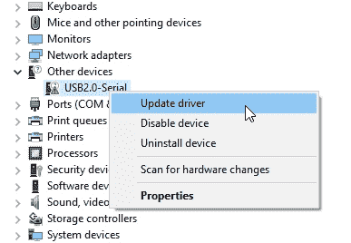](https://cdn.sparkfun.com/assets/learn_tutorials/9/1/3/CH340E_as_a_unknown_serial_device-Fix1.jpg)

步骤 3:右键单击设备并更新驱动程序

[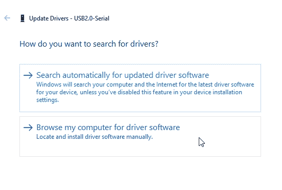](https://cdn.sparkfun.com/assets/learn_tutorials/9/1/3/CH340E_as_a_unknown_serial_device-Fix2.jpg)

步骤 4:从可用的驱动程序列表中选择驱动程序

[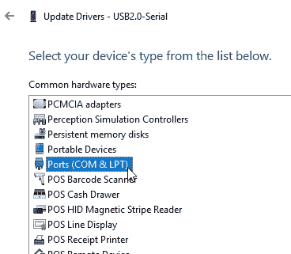](https://cdn.sparkfun.com/assets/learn_tutorials/9/1/3/CH340E_as_a_unknown_serial_device-Fix4.jpg)

步骤 5:导航到端口。

[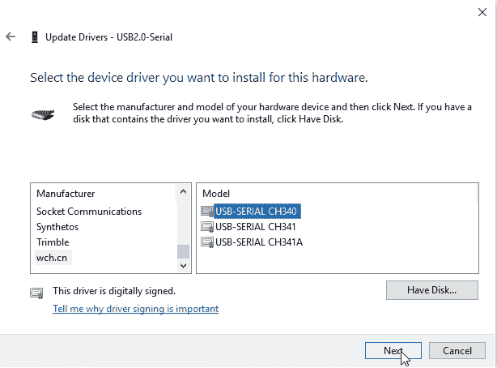](https://cdn.sparkfun.com/assets/learn_tutorials/9/1/3/CH340E_as_a_unknown_serial_device-Fix5.jpg)

第六步:滚动到制造商列表的底部，选择*wch.cn*。在右侧窗口中选择 CH340。如果您在列表中没有看到 wch.cn 的*然后从 WCH 网站下载并安装 [Windows 驱动程序](http://www.wch.cn/downloads/CH341SER_EXE.html)并重复上述步骤。*

[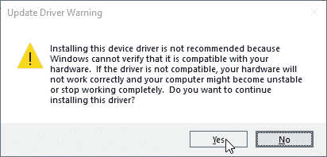](https://cdn.sparkfun.com/assets/learn_tutorials/9/1/3/CH340E_as_a_unknown_serial_device-Fix6.jpg)

第七步:告诉 Windows 你确定。

[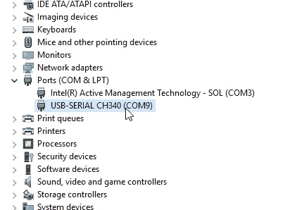](https://cdn.sparkfun.com/assets/learn_tutorials/9/1/3/CH340E_as_a_unknown_serial_device-Fix7.jpg)

步骤 8:验证 COM 端口是否正确显示。

一旦你为两个 vid 安装了驱动程序，你的计算机将会正确地枚举一个 COM 端口，不管那天 CH340E 感觉有多暴躁。

如上所述，我们将很快与 WCH 解决这个问题。

### 需要更多帮助吗？

**Technical Help**

If your product is still not working as you expected or you need technical assistance or information, head on over to the [SparkFun Technical Assistance](https://www.sparkfun.com/technical_assistance) page for some initial troubleshooting.

If you don't find what you need there, the [SparkFun Forums](https://forum.sparkfun.com/index.php) are a great place to find and ask for help. If this is your first visit, you'll need to [create a Forum Account](https://forum.sparkfun.com/ucp.php?mode=register) to search product forums and post questions.

[**SparkFun Artemis Forums**](https://forum.sparkfun.com/viewforum.php?f=167)

## 资源和更进一步

你知道吗，你可以用 RedBoard Artemis Nano 作为你自己的 Artemis 产品的起点？从我们的 repo [这里](https://github.com/sparkfun/RedBoard_Artemis_Nano)获取设计文件，并使用 Eagle PCB 编辑它们！

*   [示意图(PDF)](https://cdn.sparkfun.com/assets/5/5/1/6/3/RedBoard-Artemis-Nano.pdf)
*   [老鹰文件(ZIP)](https://cdn.sparkfun.com/assets/f/e/c/9/c/RedBoardArtemisNano.zip)
*   [Artemis 模块图形数据表(PDF)](https://github.com/sparkfun/Graphical_Datasheets/blob/master/Datasheets/Artemis/Artemis%20Module/ArtemisModulev2.pdf)
*   [Arduino 核心](https://github.com/sparkfun/Arduino_Apollo3)
*   [蒿属植物信息页](https://www.sparkfun.com/artemis)
*   [阿波罗 3 数据表(PDF)](https://cdn.sparkfun.com/assets/1/5/c/6/7/Apollo3-Blue-MCU-Datasheet_v0_15_0.pdf)
*   [Ambiq](https://ambiq.com/)
*   [GitHub 硬件回购](https://github.com/sparkfun/RedBoard_Artemis_Nano)
*   [CH340E USB 转串行 IC 驱动器](https://www.sparkfun.com/ch340)

你现在已经探索了棋盘，让我们开始用 Arduino 闪烁吧！或者您可能想了解更多关于 Artemis 模块本身的信息。查看这些教程！

 [### 用 SparkFun Artemis 设计](https://learn.sparkfun.com/tutorials/designing-with-the-sparkfun-artemis) Let's chat about layout and design considerations when using the Artemis module.[Favorited Favorite](# "Add to favorites") 4 [### 用 Arduino 开发 Artemis](https://learn.sparkfun.com/tutorials/artemis-development-with-arduino) Get our powerful Artemis based boards (Artemis Nano, BlackBoard Artemis, and BlackBoard Artemis ATP) blinking in less than 5 minutes using the SparkFun Artemis Arduino Core 6

你知道 Artemis 和我们的 Qwiic 系列兼容吗？检查这些产品，只需插入和工作！

[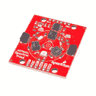](https://www.sparkfun.com/products/15050) 

将**添加到您的[购物车](https://www.sparkfun.com/cart)中！**

### [【spark fun Triad 光谱传感器- AS7265x (Qwiic)](https://www.sparkfun.com/products/15050)

[In stock](https://learn.sparkfun.com/static/bubbles/ "in stock") SEN-15050

SparkFun Triad 光谱传感器是一种功能强大的光学检测传感器，它将三个传感器与 led 结合在一起

$69.956[Favorited Favorite](# "Add to favorites") 47[Wish List](# "Add to wish list")****[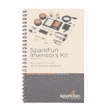](https://www.sparkfun.com/products/15884) 

将**添加到您的[购物车](https://www.sparkfun.com/cart)中！**

### [SparkFun 发明家工具包指南- v4.1a](https://www.sparkfun.com/products/15884)

[In stock](https://learn.sparkfun.com/static/bubbles/ "in stock") BOK-15884

《SIK 指南》4.1 版包含一步一步的说明，并附有构建每个项目和电路的电路图

$5.50[Favorited Favorite](# "Add to favorites") 8[Wish List](# "Add to wish list")****[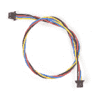](https://www.sparkfun.com/products/17258) 

将**添加到您的[购物车](https://www.sparkfun.com/cart)中！**

### [柔性 Qwiic 线缆- 200mm](https://www.sparkfun.com/products/17258)

[In stock](https://learn.sparkfun.com/static/bubbles/ "in stock") PRT-17258

这种极化 I2C 电缆绝缘是由硅制成的，比我们原来的 Qwiic 电缆更灵活，特别是在

$1.60[Favorited Favorite](# "Add to favorites") 4[Wish List](# "Add to wish list")****[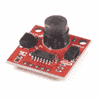](https://www.sparkfun.com/products/17374) 

将**添加到您的[购物车](https://www.sparkfun.com/cart)中！**

### 

[Out of stock](https://learn.sparkfun.com/static/bubbles/ "out of stock") SEN-17374

非常适合在小范围内检测运动，并针对小运动进行了优化，为连续运动提供了运动感应选项

$22.501[Favorited Favorite](# "Add to favorites") 6[Wish List](# "Add to wish list")******** ********[https://www.youtube.com/embed/NKyA5y44-0E/?autohide=1&border=0&wmode=opaque&enablejsapi=1](https://www.youtube.com/embed/NKyA5y44-0E/?autohide=1&border=0&wmode=opaque&enablejsapi=1)**************