# FPGA 是如何工作的？

> 原文：<https://learn.sparkfun.com/tutorials/how-does-an-fpga-work>

## 介绍

让我们从头开始。什么是 [FPGA](https://www.sparkfun.com/fpga) ？嗯，FPGA 代表**F**field**P**可编程的 **G** ate **Array** ，这对理解它们是什么或做什么没有帮助，但是我们必须把它去掉。

FPGAs 属于被称为可编程逻辑或者有时被称为可编程硬件一类设备。本质上，FPGA 本身不做任何事情，但它可以被配置成任何你想要的数字电路。这里的神奇之处在于没有任何物理变化。您只需将配置加载到 FPGA 中，它就会像您想要的电路一样工作。没有焊接，没有跳线，没有忙乱。然后，FPGA 可以重新配置为像另一个电路一样工作，一个又一个。该配置是基于 RAM 的，这意味着它基本上可以无限次数地重新配置。

| [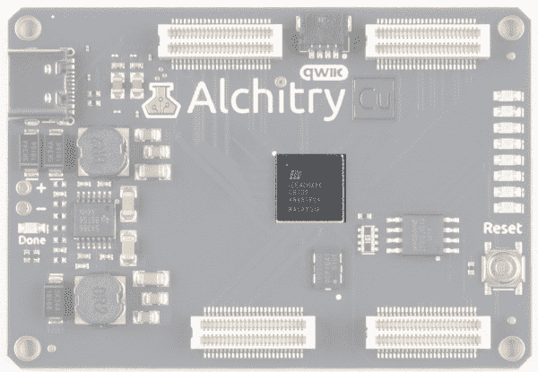](https://cdn.sparkfun.com/assets/learn_tutorials/1/1/9/0/16526-Alchitry_Cu_FPGA.jpg) | [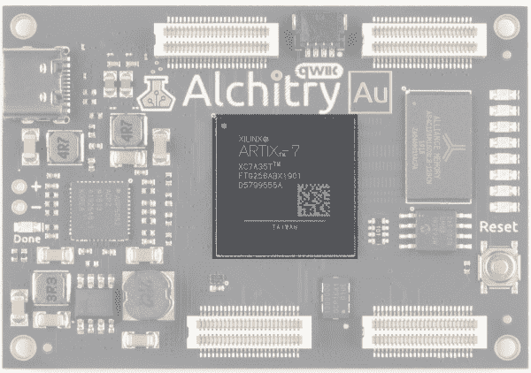](https://cdn.sparkfun.com/assets/learn_tutorials/1/1/9/0/16527-Alchitry_Au_FPGA.jpg) |
| *晶格 iCE40 HX FPGA 在 Alchitry Cu 板上高亮显示* | *在 Alchitry Au 板上突出显示的 Xilinx Artix 7 FPGA】* |

即使我们谈论使用 FPGAs 来创建数字*电路*，你通常不会绘制原理图来创建它们的设计。如果你真的画出原理图，FPGAs 所能包含的电路的尺寸和复杂性会变得非常麻烦。相反，您可以描述所需电路的行为，工具将使用它来创建与该行为相匹配的电路。

在这方面，它可以感觉像编程，因为你只是输入文本。然而，当您创建硬件时，基本的实现是完全不同的。

如果用文本创建硬件看起来像魔术，不要担心。它们的工作方式实际上在概念上非常简单，在本教程中，我们将对其进行分解。

### 推荐阅读

在本教程中，我们将探讨什么是 FPGA 以及它们是如何工作的。我假设你对电(电压、电流等)和二进制值有很好的理解。其他一切都将很快建立在基础之上。这是对什么是 FPGA 及其基本设计的概述，而不是设计自己的指南。

如果您不熟悉以下概念，我们建议您在继续之前查看这些教程。

 [### 电压、电流、电阻和欧姆定律](https://learn.sparkfun.com/tutorials/voltage-current-resistance-and-ohms-law) Learn about Ohm's Law, one of the most fundamental equations in all electrical engineering.[Favorited Favorite](# "Add to favorites") 132 [### 什么是电？](https://learn.sparkfun.com/tutorials/what-is-electricity) We can see electricity in action on our computers, lighting our houses, as lightning strikes in thunderstorms, but what is it? This is not an easy question, but this tutorial will shed some light on it 83 [### 模拟与数字](https://learn.sparkfun.com/tutorials/analog-vs-digital) This tutorial covers the concept of analog and digital signals, as they relate to electronics.[Favorited Favorite](# "Add to favorites") 66 [### 晶体管](https://learn.sparkfun.com/tutorials/transistors) A crash course in bi-polar junction transistors. Learn how transistors work and in which circuits we use them.[Favorited Favorite](# "Add to favorites") 84

[https://www.youtube.com/embed/-qpfv8KLXOk/?autohide=1&border=0&wmode=opaque&enablejsapi=1](https://www.youtube.com/embed/-qpfv8KLXOk/?autohide=1&border=0&wmode=opaque&enablejsapi=1)

## 数字电路和逻辑门

### 数字电路

FPGAs 的一个警告是它们只能创建数字电路。一些较新的 FPGAs 包括板载模数转换器，但即使这些转换器也能尽快将模拟输入转换为数字信号。但是什么是数字电路呢？

在电子学中， *digital* 用于描述提取连续电压值以支持离散 1 和 0 的电路。实际使用的电压和阈值实际上对更高层次的设计无关紧要，但您会经常在 FPGA 内部看到类似 0V 为 0，1.2V 为 1 的情况。如果实际电压是 0.8V，非常接近 1.2V，可以认为是 1，一切都一样。

数字电路旨在将电压推向极端，使其对噪声和其他现实世界的干扰具有难以置信的弹性。*数字*的概念也为我们提供了一种将复杂行为设计到电路中的方法，而不必担心较低层次的设计。我们在一个理想的世界里工作。我们将使用的简单构造块的设计中考虑到了细节问题。

这些积木就是*逻辑*门。

### 逻辑门

有几种不同的逻辑门，但最常见的是**和**、**或**、**异或**和**非**。每个都接受数字输入，执行其逻辑功能，并输出一个数字值。

一个**门取两个输入，只有当第一个输入*和第二个输入*为 1 时才输出 1。如果任一输入为 0，则输出为 0。与门的符号看起来像这样:**

**[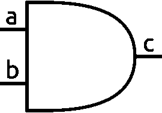](https://cdn.sparkfun.com/assets/learn_tutorials/1/1/9/0/AND_Gate.png)

一个 [**或**](https://en.wikipedia.org/wiki/OR_gate) 门接受两个输入，当第一个输入*或*第二个输入为 1 时输出 1。只有当两者都为 0 时，才是输出 0。这是或门符号:

[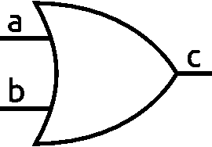](https://cdn.sparkfun.com/assets/learn_tutorials/1/1/9/0/OR-Gate.png)

[**XOR**](https://en.wikipedia.org/wiki/XOR_gate) 门类似于 OR 门，但仅当第一输入或第二输入为 1 时输出 1，而当两者都为 1 时不输出 1。当输入不同时，也可以认为是输出 1。XOR 中的 X 代表 exclusive。这是它的标志:

[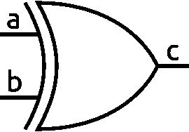](https://cdn.sparkfun.com/assets/learn_tutorials/1/1/9/0/XOR-Gate.png)

一个 [**而不是**](https://en.wikipedia.org/wiki/Inverter_(logic_gate)) 门是最简单的门。它有一个输入，只是输出相反的东西。所以 1 变成了 0，0 变成了 1。

[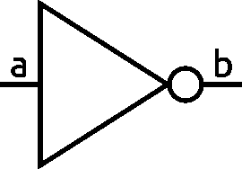](https://cdn.sparkfun.com/assets/learn_tutorials/1/1/9/0/NOT-Gate.png)

有被称为[与非门](https://en.wikipedia.org/wiki/NAND_gate)、[或非门](https://en.wikipedia.org/wiki/NOR_gate)和 [XNOR](https://en.wikipedia.org/wiki/XNOR_gate) 的基本门的变体。这些只是输出反转的标准版本。

只是为了一些额外的背景，一个与门，像所有的逻辑门，可以使用晶体管。下图显示了如何实现与门的示例。原理图使用 NMOS 和 PMOS MOSFET 晶体管。这种设计被称为 CMOS(互补金属氧化物半导体),是大多数现代电路中使用的设计。

[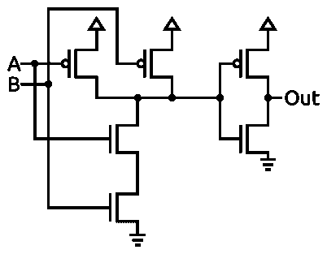](https://cdn.sparkfun.com/assets/learn_tutorials/1/1/9/0/and.png)

请注意，上面的示意图实际上是一个与非门后跟一个非门。这是因为 CMOS 电路反相输出。

## 多路器

现在我们已经有了从晶体管到逻辑门的基本构件，我们可以用它们做一些更有用的东西。只要有逻辑门，你就可以描述任何数字电路。然而，有许多重复出现的高级函数有自己的符号，如用于二进制数学的符号(加法器、乘法器等)。

我们来看看 FPGAs 的基本构建模块之一，多路复用器。

多路复用器基于其选择输入的值从集合中选择单个输入。这是它的标志:

[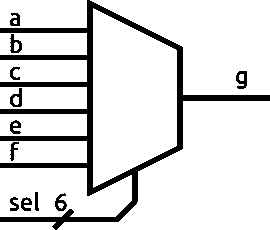](https://cdn.sparkfun.com/assets/learn_tutorials/1/1/9/0/multiplexer.png)

*sel* 线上的/用来表示它是 6 位宽。

输入的数量会变化，但多路复用器总是只有一个输出。

选择输入的编码方式也会有所不同。通常，你会看到它是一个二进制数，但更简单的电路使用的是[一键编码](https://en.wikipedia.org/wiki/One-hot)。独热编码只是一个二进制值，其中总是正好有一个 1。1 的位置才是重要的。

一个*解码器*获取一个二进制值，并将其转换成一个独热信号。一个*编码器*将一个独热值转换成一个二进制数。这些可以用来使一位热复用器接受二进制值。

看看我们如何使用一些 AND 和 OR 门实现一位热码编码多路复用器。

[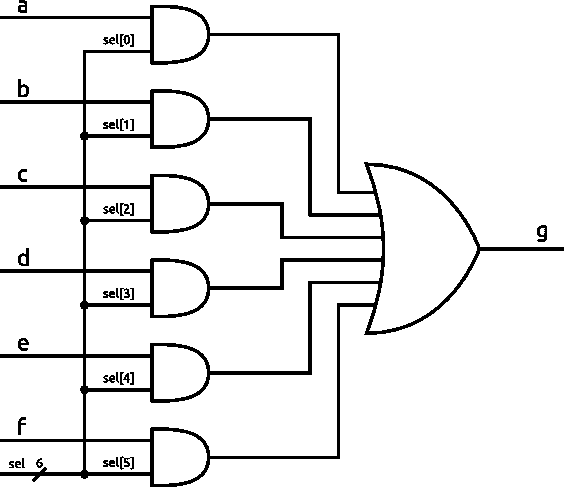](https://cdn.sparkfun.com/assets/learn_tutorials/1/1/9/0/multiplex_circuit.png)

如果我们将 *sel* 的值设置为 000010，意味着只有 sel[1]为 1，那么我们可以看到，对于每个与门，除了具有 *b* 输入的那个之外，其中一个输入将为 0。这意味着无论输入 *a、c、d、e、*和 *f* 是什么，它们中的每一个都将总是输出 0。唯一重要的输入是 *b* 。当 *b* 为 1 时，它与 1 进行 and 运算，AND 门的输出为 1。当 *b* 为 0 时，它与 1 进行“与”运算，与门的输出为 0。

换句话说，与门的输出就是简单的 *b* 。

[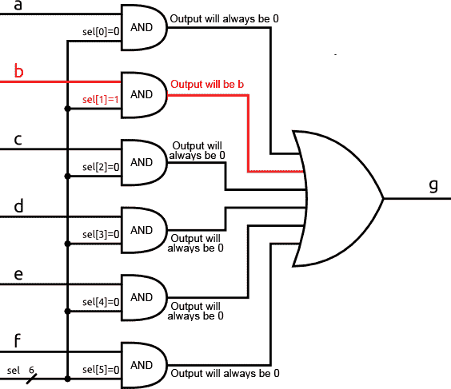](https://cdn.sparkfun.com/assets/learn_tutorials/1/1/9/0/multiplex_circuit_highlighted.jpg)*Result of the AND gates with sel[1] set to 1*

该原理图中的 OR 门有两个以上的输入。这可以通过创建两个输入或门的树来实现，其中两个输入一起进行或运算，然后输出一起反复进行或运算，直到得到一个输出。多输入 OR 门的行为就像你所期望的，如果任何一个输入为 1，则输出为 1。

然而，在这个电路中，除了来自与门的输入为 *b* 之外，到或门的每个输入都保证为 0。这意味着当 *b* 为 1 时, *b* 为 0 时,“或”门将简单地输出 1。

换句话说，OR 门的输出就是简单的 *b* 。

[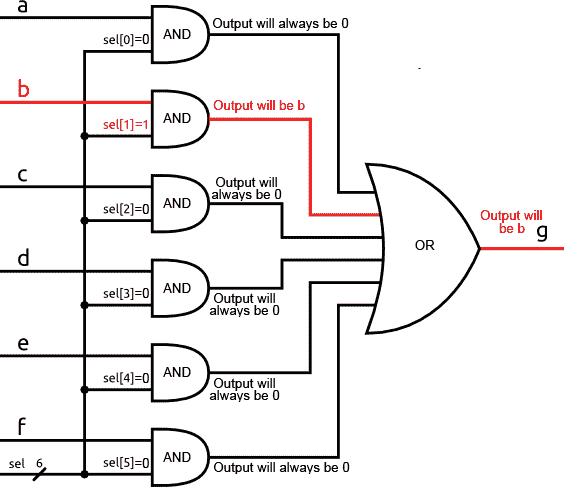](https://cdn.sparkfun.com/assets/learn_tutorials/1/1/9/0/multiplex_circuit_highlighted_complete.jpg)*Result of the OR gate will be b*

您可以对任何输入重复这个逻辑，只要输入是一位热码，对应于给定 1 的输入将被传递到输出。

你可以想象有一个带可编程 *sel* 输入的大型多路复用器矩阵。这将允许您在设计中根据需要将信号路由到任何地方。这就是 FPGAs 如何将信号发送到需要的地方，它被称为通用路由矩阵。

显然，路由成千上万个信号的细节变得混乱，但从根本上说，它只是使用一组多路复用器，选择输入连接到可编程存储器。

## 查找表

现在我们有了一种方法来动态地将信号路由到它们需要的地方，我们需要一种方法来执行任意的逻辑。我们将再次使用多路复用器，或者更确切地说是它们的后代，称为 lut 或查找表。

假设我们有一个多路复用器，它有四个输入和一个 2 位二进制选择(而不是一位热码)。现在，不要把主要输入暴露给外界，让我们把它们连接到一些可编程存储器上。这意味着我们可以将每个输入编程为某个常量值。把这些都打包成一个模块，我们就有了一个双输入 LUT。

[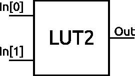](https://cdn.sparkfun.com/assets/learn_tutorials/1/1/9/0/lut2.png)

LUT 的两个输入是多路复用器的选择输入。通过将多路复用器输入编程为我们想要的任何值，我们可以使用这个 LUT 来实现**任何**二对一二进制函数。

例如，我们可以通过如下设置内存的内容，使它像一个简单的与门一样工作。

| 地址(在[1:0]中) | 值(输出) |
| 00 | Zero |
| 01 | Zero |
| Ten | Zero |
| Eleven | one |

这是一个简单的例子，通常 lut 大于两个输入，Alchitry Au 上的 FPGA 基于大约五个输入 lut。

Xilinx 实际上将两个五输入 LUT 与另一个多路复用器放在一起，以创建一个六输入 LUT 或一个具有两个独立输出的五输入 LUT。

[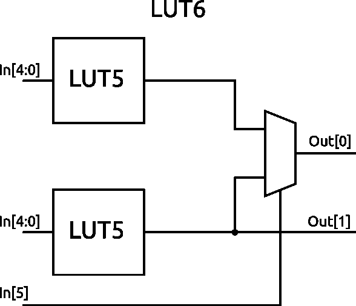](https://cdn.sparkfun.com/assets/learn_tutorials/1/1/9/0/lut6.png)

如果您想深入了解 FPGA 中的 lut 和资源，请查看 Artix 7 上 Xilinx 的文档。这份文件很密。已经警告过你了。不过，第 20 页还是值得一看的。它显示了切片器的简化示意图。切片是 lut 之上的一个构造块。左侧的四个框是如上所示的 lut。

在某些情况下，Alchitry Au 上的 FPGA 有 20，800 个双通道 lut。这是一个很大的 lut 数量，但还不到现有最大 FPGAss 的水平，在撰写本文时，FPGA 的数量约为 lut 数量的 260 倍。你可以想象，光是这些信号的路由就非常复杂。幸运的是，要使用 FPGAs，你不需要做任何事情。这些工具负责所有低级路由和 LUT 编程。我们只需要描述我们想要的电路。

## 为什么要使用 FPGA？

希望本教程已经让你对 FPGAs 的实际工作原理有了一个模糊的感觉，但是你为什么要使用它呢？

当这个问题出现时，通常是在选择使用处理器还是使用 FPGA 创建定制设计的背景下。很多人知道如何编码，但很少有人知道如何为 FPGAs 创造设计。编写代码通常更容易创建复杂的行为，并彻底改变某些东西的实现方式。

然而，FPGAs 在处理时间和提供非常紧凑的时序方面效率更高。为了说明这一点，让我们来看一个简单的例子，当你按下一个按钮时，LED 就会打开。如果你用 Arduino 之类的东西写代码来做这件事，处理器会运行一个小的代码循环，读取一个管脚的状态，然后根据这个值更新另一个管脚的状态。

如果你优化了代码，你可能会得到每秒数百万次的更新。这听起来可能很棒，但让我们看看用 FPGA 会是什么样子。在用 FPGA 简单地将按钮连接到 LED 的情况下，只需简单地连接按钮和 LED。来自按钮的值通过某个输入缓冲区，通过路由矩阵馈送，然后通过输出缓冲区输出。这个过程一直在持续发生。唯一的延迟来自芯片中晶体管的开关延迟，非常小。

为了进一步说明这一点，现在让我们在设计中增加一个麦克风。我们可以从麦克风采集样本，并对其进行一些处理，以计算出捕捉到的音频中的频率。从一些第一手经验来看，我知道在一个小的微控制器上以任何像样的采样速率实时地做这件事是相当困难的。处理器需要从麦克风读取样本，将它们存储在某个缓冲区中，执行一系列数学运算，然后将值输出到可能是 led 的显示器上。这些步骤中的每一步都需要时间，处理器实际上一次只能做一步。

借助 FPGA，您可以将一小部分设计用于从麦克风读入样本。然后，这可以将样本传递到缓冲器，当缓冲器装满时，会将样本传递到进行计算的电路。该电路可以将结果传递给另一个电路，后者可以在一些发光二极管上显示这些结果。

这些阶段中的每一个都将彼此完全独立地运行，因为它们只是在硬件中存在。它们不是争夺处理器时间的代码行。

现在想象一下，我们仍然希望按钮连接到 LED。我们以前惊人的百万分之一秒的响应时间现在是糟糕的五分之一秒，因为我们不能腾出处理器时间来经常读取按钮。然而，在 FPGA 中，按钮和 LED 仍然只是连接在一起，并像以前一样以接近瞬时的速度响应。

这种独立性使 FPGAs 成为控制任何要求严格定时的对象的绝佳候选。例如， [WS2812B](https://www.sparkfun.com/products/13282) LED(又名 NeoPixel)需要严格定时的脉冲流来向其写入数据。当你使用微控制器时，你通常需要写一些内嵌汇编来保证脉冲的时序足够精确。您还需要禁用中断，因为任何停顿都会对信号造成损害。

有了 FPGA，很容易创建一系列严格控制的脉冲来驱动这些 led，并且您不需要担心设计中的任何其他问题与时序冲突。

## 何时使用 FPGA

考虑到使用 FPGAs 的所有优点，您可能会问自己“为什么我不在所有情况下都使用一个呢！”很棒的问题！

在描述 FPGAs 的工作原理时，你可能已经注意到有很多额外的“东西”需要动态地实现，甚至是最简单的电路。这不是没有代价的，我指的是在$$$和设计资源上。

FPGAs 往往很贵。大一点的芯片很容易卖到数万美元。这是因为制造它们需要大量的硅，设计芯片和工具需要大量的研发费用，与手机中使用的微型处理器相比，体积相对较小。

另一个成本是电力。与直接实现电路所需的晶体管数量相比，lut 中使用了大量晶体管。所有这些晶体管都需要电源才能工作。因此，FPGAs 不太适合电池供电设备。当然，您可以将电路设计成高能效，但即使什么也不做，Alchitry Au 上的 FPGA 功耗也只有 100mA 多一点。开始推芯片就能轻松过 1000mA。作为对比，Arduino Leonardo 上使用的芯片 ATmega32U4 在全速运行 5V 时使用 27mA。就算阿尔奇特里.奥更有能力。

那么，为什么要使用 FPGAs 呢？创建定制数字电路有两种主要选择。首先，您可以用离散逻辑自己构建它。这将花费大量的时间，很可能花费更多的钱，而且如果你需要改变什么的话，灵活性也很小。

第二种，也是更现实的方法，是直接在硅片上制作电路。这创造了一个非常快速、非常高效的电路，但代价是零灵活性和$美元的载重量。定制硅具有与工具和设置相关的巨大前期成本。不过，每个芯片的增量成本将低于单个 FPGAs。然而，除非你正在制造成千上万的芯片，这将是更昂贵的整体。即便如此，将你的设计锁定在硅片上有时也是没有意义的。有了 FPGA，你可以在任何需要的时候改变它，而不会有损失。

与替代方案相比，FPGAs 具有灵活性和低成本的特点，这为在任何设计中添加定制数字电路打开了大门。但是，你真的需要定制电路吗？

重要的是要记住，FPGAs 就像任何其他工具一样。锤子钉钉子很厉害，拧螺丝很可怕。就像试图用螺丝刀钉钉子是徒劳的一样。

创建自定义回路可能很困难，您通常需要自问是否有更好的解决方案。有许多非常强大的处理器，拥有大量外设，可以处理您需要解决的大多数问题。使用 FPGA 尝试通过 WiFi 发送和接收数据是一项艰巨的任务，但使用 ESP8266 等几美元的微控制器就可以轻松完成。

我经常把 FPGAs 描述成一条流水线。装配线上的每一个工位都独立工作，它们的工作效率令人难以置信。然而，最初设置生产线可能会很困难，如果您想要进行重大更改，从零开始通常会更容易。

另一方面，处理器就像人一样。只要有足够的时间和训练，一个人几乎可以完成任何任务。复杂的连续任务对一个人来说很容易完成。

你真的想建立一个完整的三明治制造工厂，只是为了给你做一个三明治当午餐吗？

FPGAs 令人惊叹，对于它们擅长的任务来说往往是不可或缺的，但它们只是添加到您工具箱中的另一个工具。一个非常强大和值得投资的工具，但仍然只是另一个工具。

## 解决纷争

**Need help?**

If your product is not working as you expected or you need technical assistance or information, head on over to the [Alchitry Forums](https://forum.alchitry.com/). This is a great place to do some initial troubleshooting as well as to find and ask for help.

**Alchitry Forums**

## 资源和更进一步

这些是 FPGAs 如何工作以及它们由什么组成的基础知识。Alchitry 的网站有更多的资源，包括教程、项目和 Alchitry 论坛。

*   [酒精饮料](https://alchitry.com/)
    *   [教程](https://alchitry.com/pages/lucid-fpga-tutorials)
    *   [项目](https://alchitry.com/blogs/projects)
    *   [论坛](https://forum.alchitry.com/)
*   [Alchitry Au+示意图(PDF)](https://cdn.sparkfun.com/assets/1/3/d/d/b/alchitry_gold_plus_schematic.pdf)
*   [Alchitry Au 原理图(PDF)](https://cdn.sparkfun.com/assets/b/6/2/f/b/alchitry_au_sch_update.pdf)
*   [Alchitry Cu 原理图(PDF)](https://cdn.sparkfun.com/assets/2/6/e/5/e/alchitry_cu_sch_update.pdf)
*   [Xilinx Artix 7 用户指南](https://www.xilinx.com/support/documentation/user_guides/ug474_7Series_CLB.pdf)

如果你想更深入地研究 FPGA 和 Lucid 的世界，请查看 Justin Rajewski 的[“学习 FPGA:用 Mojo 和 Lucid HDL 为初学者进行数字设计”。它在亚马逊上可以买到，是了解并最终设计自己的 FPGAs 的一个很好的资源。](https://www.amazon.com/dp/1491965495/ref=cm_sw_em_r_mt_dp_U_GZ75EbYT1Q4M2)

我们不断扩大与 FPGAs 相关的教程和产品。看看下面的一些教程！

 [### FPGA 编程](https://learn.sparkfun.com/tutorials/programming-an-fpga) Come look at the basics of working with Field Programmable Gate Arrays.[Favorited Favorite](# "Add to favorites") 9 [### 第一个 FPGA 项目——对 PWM 着迷](https://learn.sparkfun.com/tutorials/first-fpga-project---getting-fancy-with-pwm) An initial project using Alchitry's onboard FPGA to manipulate PWM[Favorited Favorite](# "Add to favorites") 4 [### 外部 IO 和亚稳定性](https://learn.sparkfun.com/tutorials/external-io-and-metastability) Why external signals can cause metastability and how to use constraint files to manage this[Favorited Favorite](# "Add to favorites") 3

&nbsp

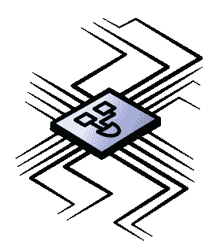

&nbsp**