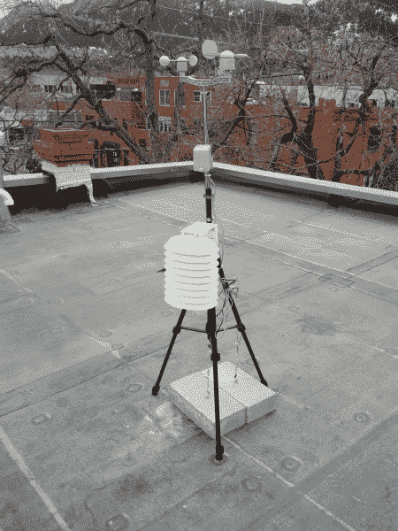
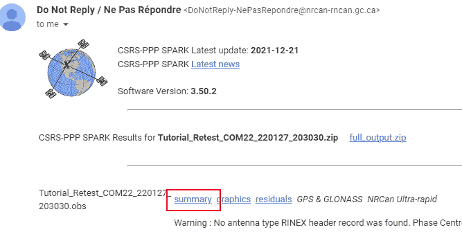
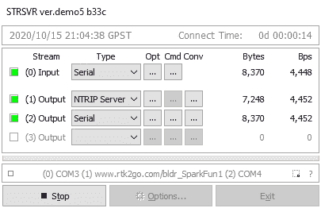
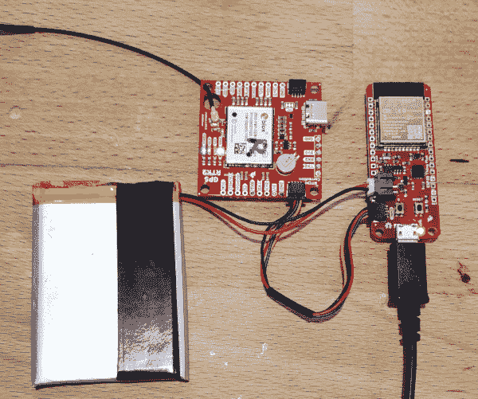
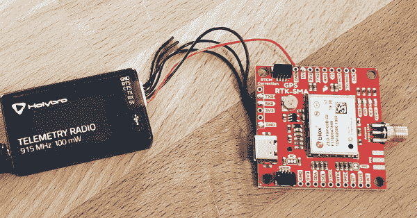

# 如何建立一个 DIY GNSS 参考站

> 原文：<https://learn.sparkfun.com/tutorials/how-to-build-a-diy-gnss-reference-station>

## 介绍

*The SparkFun RTK Base Station complete with an NTRIP internet connection and a 915MHz RF connection*

GNSS 实时运动学(RTK)令人惊叹，但主要困惑点之一是获取校正数据。我们已经在之前的教程中介绍了如何公开获取 RTCM 修正数据，但这可能是不稳定的。我们已经介绍了如何[建立自己的临时基地](https://learn.sparkfun.com/tutorials/setting-up-a-rover-base-rtk-system)通过遥测无线电链路发送 RTCM 校正数据，但是如果你离你的基地有一公里或更远呢？本教程将着重于在您的屋顶或其他固定结构上安装您自己的固定天线，并配置一台小型计算机通过互联网提供这些数据，这些数据可以通过 WiFi 访问，或者更常见的是通过手机或调制解调器访问。考虑这是[建立一个漫游者基地 RTK 系统](https://learn.sparkfun.com/tutorials/setting-up-a-rover-base-rtk-system)的续集。

### 推荐阅读

在开始之前，请确保您对使用 U-Center 开始使用[感到舒适，并确保查看我们的](https://learn.sparkfun.com/tutorials/getting-started-with-u-center)[什么是 GPS RTK？](https://learn.sparkfun.com/tutorials/what-is-gps-rtk)教程。

 [### 什么是 GPS RTK？](https://learn.sparkfun.com/tutorials/what-is-gps-rtk) Learn about the latest generation of GPS and GNSS receivers to get 14mm positional accuracy 9 [### u-blox 的 U-Center 入门](https://learn.sparkfun.com/tutorials/getting-started-with-u-center-for-u-blox) Learn the tips and tricks to use the u-blox software tool to configure your GPS receiver.[Favorited Favorite](# "Add to favorites") 2 [### GPS-RTK2 连接指南](https://learn.sparkfun.com/tutorials/gps-rtk2-hookup-guide) Get precision down to the diameter of a dime with the new ZED-F9P from u-blox.[Favorited Favorite](# "Add to favorites") 9 [### 设置基于流动站的 RTK 系统](https://learn.sparkfun.com/tutorials/setting-up-a-rover-base-rtk-system) Getting GNSS RTCM correction data from a base to a rover is easy with a serial telemetry radio! We'll show you how to get your high precision RTK GNSS system setup and running.[Favorited Favorite](# "Add to favorites") 15

我们将会谈论很多关于旅行的事情。我发现所有描述 NTRIP 的描述和图形都令人困惑。NTRIP 只是一种通过互联网从一个地点向漫游者获取修正数据的奇特方法。把它想象成你漫游者的音乐流。要想让你的漫游者卡壳，你需要为它提供源源不断的音乐。有很多音乐服务(youtube，Spotify，Pandora)。同样，RTCM 也有各种各样的来源(天宝、徕卡、Telit 等)。所有这些 RTCM 服务收取不同金额的费用，行为方式也大相径庭，令人困惑。但我想要的只是我的音乐！

本教程将向您展示如何生成您自己的 GNSS 校正数据，并将其推送到互联网上，所有这些都是免费的(如果您需要，也可以支付专用迷你 PC 的费用)！你将成为自己的音乐流媒体服务！你的漫游者将能够通过手机连接收听修正数据。是的，我们将讨论 NTRIP 客户机和服务器以及挂载点，但是不要担心；它只是通过互联网将字节从一台计算机传递到另一台计算机。

## 静态基地设置和激光器！

在上一个教程中，我们描述了如何用 1 到 10 分钟的调查方法[创建一个临时基站](https://learn.sparkfun.com/tutorials/setting-up-a-rover-base-rtk-system)。临时基础方法是灵活的，但是它不精确，并且在所需的时间上可能变化很大。ZED-F9P 有一个更快的方法来提供基本校正:如果你知道你的天线的位置，你可以设置接收器的坐标，它会立即开始提供 RTCM 校正。问题是“天线的位置在哪里？”。这就好像你需要一个烙铁来组装你的[烙铁套件](https://www.sparkfun.com/products/retired/10624)。我们从哪里开始？

**为什么我不直接用我的固定天线来测量它的位置呢？**

虽然勘测式基站易于设置，并且非常适合在野外确定基站的位置，但不建议将其用于获取静态基站的固定位置，因为它不太准确。相反，PPP 或精确点定位要精确得多，建议用于获取天线的位置。这是一个类似的过程，但涉及到卫星反弹 frick'n 激光！

> 一个主要的问题是预测的轨道经常会偏离一米或更多。当单个卫星经过头顶时，地面站从卫星上反射激光，并使用这些新数据来计算卫星的实际轨道。使用这个新的星历数据，当它变得可用时，结合接收机的原始数据，可以计算更好的定位。这是 PPP 的基础。

*From Gary Miller’s [PPP HOWTO](https://gpsd.gitlab.io/gpsd/ppp-howto.html)**[L1/L2 antenna](https://www.sparkfun.com/products/17751) semi-fixed to a flat roof*

PPP 流程是这样运作的:

*   在固定位置安装天线
*   从该天线收集 24 小时的原始 GNSS 数据
*   将原始数据传递到 PPP 的处理中心
*   获得高度精确的天线位置，我们用它来设置接收器的“固定模式”

有一些关于 PPP 的很棒的文章。我们将略知皮毛，但要了解更多信息，请查看:

*   加里·米勒的伟大 [PPP HOWTO](https://gpsd.gitlab.io/gpsd/ppp-howto.html)
*   Emlid 的[购买力平价](https://docs.emlid.com/reachm2/tutorials/post-processing-workflow/ppp-introduction/)
*   蔡素琳， [GNSS PPP](https://www.unoosa.org/documents/pdf/icg/2018/ait-gnss/16_PPP.pdf)

## 贴上天线

一旦确定了天线的位置，你就不希望它移动了。考虑投资一个[高级天线](https://www.sparkfun.com/products/17751)，但是我们已经使用经典的 [u-blox L1/L2 天线](https://www.sparkfun.com/products/15192)取得了很好的成功。将天线安装在一个合适的地面上，固定在一个可以清楚看到天空的表面上。附近什么都没有。

*The u-blox antenna attached to SparkFun’s parapet*

我们将 u-blox 天线安装在 SparkFun 建筑顶部周围的铁质防水板上。虽然不是完全永久的，但 u-blox 天线上的磁铁经过测试，可以承受汽车强度的风，所以它应该可以承受科罗拉多州 front range 经历的 100+ MPH 的风。u-blox ANN-MB-00 天线连接了一根 5 米长的电缆，但这不够长，无法从 SparkFun 屋顶连接到接收器，因此我们连接了一根 10 米长的 SMA 延长线。诚然，大多数 L1/L2 天线都有内置放大器，但每一米的延长线和每个连接器都会略微降低 GNSS 信号。限制连接器转换器的使用，并使用尽可能短的延长线到达您需要的地方。

如果你想使用没有磁性底座的[高级天线](https://www.sparkfun.com/products/17751)，我们想出了一个很好的方法来创建一个稳定的固定点，而不需要在你的屋顶上戳洞！

*Yes that’s a cinder block. Don’t laugh. It works!*

大多数测量级天线在天线底部有一个⅝11-TPI(每英寸螺纹数)螺纹。幸运的是，⅝11-TPI 是美国五金店楔形锚上的螺纹。楔形锚的设计是为了将墙壁固定在地基上，但幸运的是，我们可以使用相同的硬件来固定天线。(我们也听说过使用环氧树脂的混凝土锚，所以一定要货比三家。)

我需要在我的屋顶安装一个天线。幸运的是，我有两个，是一个气象站剩下的煤渣砖，基于电动 Imp T1，早已退役。

第一步是在煤渣砖上钻一个⅝洞。圬工钻头花了我 20 美元，但是不到 10 美元就能买到更便宜、不那么花哨的钻头。蓝色胶带显示了我试图达到的深度。煤渣砖有 3.5 英寸厚，所以我选择了 2.5 英寸深。一旦钻好孔，把砖块倒过来，让大部分水泥粉末出来。然后把锚敲到位。

*Ooops!*

不要贪心！我使劲敲打锚，直到它把木块劈开。幸运的是，我有第二个街区！

一旦锚进入孔中约 2 英寸，拧紧螺栓。这将拉起阿克尔回来压缩衣领到位。**注:**我用手指拧紧螺栓，用扳手加了一圈。如果你真的去追螺栓并把它拧得太紧，你会冒着把颈圈推得更远的风险，并把煤渣砖打碎成两半(见 Ooops！上图)。我们这里不是锚定墙，只是一个 [400g 天线](https://www.sparkfun.com/products/17751)。

我使用了第二个螺栓，拧紧天线基座，将其锁定到位，并防止在任何方向旋转。敏锐的读者会注意到上图中我的 TNC 到 SMA 适配器。性别不对。最初，我用一个 SMA 延长线将我的 T2 GPS-RTK-SMA 连接到我屋顶上的 u-blox L1/L2 天线。GPS-RTK-SMA 需要常规的 SMA 连接，因此扩展的末端不会连接到此适配器。所以在你下梯子之前，测试连接所有的东西！幸运的是，我有一套适配器，并找到了合适的 TNC 到 SMA 转换器来满足我的需求。

*It’s a bit of work getting 35lbs of concrete onto a roof but the view is pretty spectacular!*

我在底座周围缠绕了一次 SMA 扩展。如果有任何东西拉动 SMA 电缆，张力将转移到螺栓上，而不是 TNC 连接到天线上。

**Lightning Warning:** My antenna profile is lower than the parapet so lightning strikes are unlikely. Your antenna may be the highest point around so consider lightning protection.

## 收集原始 GNSS 数据

一旦你把天线放在一个它不会移动或被移动的位置，我们需要确定它的位置。打开 u-center，验证你能用 ZED-F9P 锁定并看到 25+颗卫星。假设你有良好的接收，我们现在需要设置接收器输出卫星的原始数据。

一旦 USB 的 *RXM-RAWX* 消息被启用，在数据包查看器中验证接收。

*Viewing a RAWX packet in the Packet Viewer*

RAWX 消息是二进制的，因此您无法在文本查看器中看到它们。

*Pressing the record button*

按下录音按钮。这将把来自接收器的所有数据(NMEA、UBX 和 RAWX)记录到 a *中。ubx 文件。让它运行 24 小时。如果你要运行很长时间，不要担心，但是要意识到一个 24 小时的文件大约需要 300MB，所以不要让它运行一个月。

*From Suelynn Choy ‘[GNSS Precision Point Positioning](https://www.unoosa.org/documents/pdf/icg/2018/ait-gnss/16_PPP.pdf)’ presentation 2018*

捕捉 6 小时是好的，24 小时稍好(注意上图中位置误差的对数标度)。大多数 PPP 分析服务将接受超过 24 小时的数据，但他们可能会将其截断为 24 小时。如果你捕获了 30 小时的 RAWX 数据，没关系，我们将向你展示如何修剪一个太长的文件。

300MB 的 UBX 文件将需要转换为 RINEX(接收器独立的交换格式)。广受欢迎的 RTKLIB 是来帮忙的。我们推荐 rtklibexplorer 的 RTKLIB 修改版(可以在这里下载[，但是你也可以在这里](http://rtkexplorer.com/downloads/rtklib-code/)获得原版的 RTKLIB [。打开 RTKCONV。选择你的 UBX 文件，点击“转换”。我们的 300MB 文件花了大约 30 秒转换。您应该会看到一个*。obs 文件一旦完成。](http://www.rtklib.com/)

*An OBS file with 14 hours of data*

如果您的数据文件是 25 小时或更长一点，这没问题。如果你需要削减你的 RINEX 文件，因为它太大了(或 40 小时长)，你可以修剪时间窗口。转换整个文件，然后单击记事本图标打开 OBS 文件。您将会看到这次捕获的 GPS 开始时间和停止时间。

利用这些时间，您可以根据需要限制时间窗口，并重新转换文件。

我们为什么不提高固定利率呢？Moar 更好！

ZED-F9P 可以达到 30Hz。为什么不获取大于 1Hz 的 RAWX 数据？因为大自然不会走得那么快。大多数 PPP 分析服务将忽略任何大于 1Hz 的信号。OPUS 甚至“将所有录制速率降低到 30 秒”。而且，你的 OBS 文件会非常大。如果 24 小时在 1Hz 下是 300MB，那么 24 小时在 30Hz 下将是大约 9gb。所以不，保持在 1Hz。

我们现在需要以 RINEX 格式( **)传递原始 GNSS 卫星数据。obs* )通过一个后处理中心试图得到天线的实际位置。有一些服务，但我们很幸运地使用了加拿大 [CSRS-PPP 服务](https://webapp.geod.nrcan.gc.ca/geod/tools-outils/ppp.php?locale=en)。美国国家大地测量局提供一项名为 [OPUS](https://www.ngs.noaa.gov/OPUS/) 的服务，但我们发现它受到文件大小和格式问题的限制，令人沮丧。您的里程可能会有所不同。

压缩你的 obs 文件，然后用 [CSRS](https://webapp.geod.nrcan.gc.ca/geod/tools-outils/ppp.php?locale=en) 创建账户。选择 ITRF，然后上传您的文件。摆弄你的拇指几个小时，你应该会收到一封类似这样的电子邮件:

单击“摘要”链接打开结果摘要。该摘要包含您的天线在大地坐标、UTM 坐标和笛卡尔坐标中的坐标。

*The SparkFun antenna with +/-2mm of accuracy! :O*

这封邮件还将包括一份关于你的天线位置的[精美的 PDF 报告](https://cdn.sparkfun.com/assets/learn_tutorials/1/3/6/3/SparkFun-PPP.pdf)，但不包括我们以后需要的笛卡尔坐标。

如果一切顺利，你应该有一个非常精确的天线位置。对于 u-blox 接收机，我们最感兴趣的是 ECEF 坐标。 [ECEF](https://en.wikipedia.org/wiki/ECEF) 是*引人入胜*。ECEF 不是纬度和经度，而是距离国际公认的地球质心参考系的米数。基本上，你的 ECEF 坐标就是你到地球中心*的距离*。干净利落。

现在你已经得到了你的天线的 ECEF 位置，让我们告诉 ZED-F9P 它的天线在哪里，精度只有几毫米。

返回 TMODE3 消息，输入报告中的 ECEF 坐标。假设该接收器连接到固定天线，我们建议将这些设置保存到 BBR/闪存，这样每次该接收器通电时，它将立即进入时间模式并开始输出 RTCM 数据。

几乎在 ECEF 进入之后，您的模块应该立即开始输出 RTCM 消息。使用数据包查看器进行确认。如果您没有看到它们，请务必查看描述如何设置基站的[之前的教程](https://learn.sparkfun.com/tutorials/setting-up-a-rover-base-rtk-system)。很可能您没有启用所需的 RTCM 消息。同样，请务必将您的设置保存到 BBR/闪光灯，以便在每次开机时，该接收器将开始广播校正数据，而无需用户干预。

## 小型计算机设置(选项 1)

您已经完成了天线设置。你让 ZED-F9P 输出 RTCM。干得好！现在我们如何将这些数据传播到世界各地的漫游者那里呢？

校正数据在距给定基准位置 10 公里以内是有效的。也就是说，每超过 10 公里，位置就会增加 1.5 厘米的误差(我需要找到这个说法的来源，但我很确定这是真的)。通过无线链路传输 10 公里是一段很长的距离，所以让我们使用互联网吧！

*NUC connected to a ZED-F9P and a 915MHz radio over USB*

你身边有 ESP32 吗？你可能想跳过这一节，检查一下 [ESP32 设置](https://learn.sparkfun.com/tutorials/how-to-build-a-diy-gnss-reference-station#esp32-setup-option-2)。

您需要一台连接互联网的专用计算机来连接 ZED-F9P，接收串行数据，然后将数据转发到互联网。我们建议使用 PC 进行铸造。是的，Windows 是痛苦的，不像 Linux 那么稳定，但因为 u-center 是 Windows 唯一的，所以它是唯一的选择。这是非常方便的，能够远程桌面到专用机器，使用 u-center 旋转一些接收器设置，并继续广播。我不确定如何在 Linux 中获得同样的灵活性。此外，我远远不是一个系统管理员。以下可能是一个有用的方法来配置您的专用计算机，但实际上只有我，记录我的笔记，以便我可以在需要时重新创建系统。

*   购买一台带窗户的废弃机器。我们花了大约 100 美元买了一台迷你电脑。任何旧电脑都可以，你当然不需要强大的处理能力。如果可能的话，买一台包括安装硬件的迷你电脑。这将使它更容易连接到墙上或室外外壳。
*   在 mini-PC 的 BIOS 中，在断电后启用[自动上电](https://www.intel.com/content/www/us/en/support/articles/000054773/intel-nuc.html)。启用远程桌面。有很多教程展示了如何做到这一点。我们的目标是让迷你电脑达到这样一种程度，即您可以在舒适的办公桌上配置和控制电脑，而不是在屋顶上。
*   考虑通过迷你 PC 的 MAC 地址，从迷你 PC 或您的路由器将迷你 PC 的 IP 地址设为静态。这将使通过 RDP(远程桌面协议)访问迷你 PC 变得更加容易。
*   如果您计划从外部网络访问微型电脑，您需要在端口 3389(用于 RDP)上启用端口转发到微型电脑的静态 IP 地址。
*   如果您计划将 u-center 用作 caster，您需要在端口 2101 上启用端口转发(对于 NTRIP)到微型 PC 的静态 IP 地址(更多信息请见以下章节)。
*   禁用 windows 节能。迷你电脑应该永远不会关闭。如果你担心能源成本，它不是零，但我们测量了大约 4.4W，而该单位拴到 GNSS 接收器和广播。这相当于每年 5.07 美元，每千瓦时 0.13 美元(2020 年美国平均水平)。

此时，请确保您可以通过远程桌面访问电脑。如果成功，将迷你电脑安装到现场。我们应该能够远程配置其他一切。

*   如果电脑将在室外，考虑一个内置 GFCI 插座。这个[轨道围栏](https://www.amazon.com/Orbit-57095-Weather-Resistant-Outdoor-Mounted-Controller/dp/B000VYGMF2)很好看。
*   关闭所有 Windows 通知(使用通知和操作子菜单)。
*   出于安全原因，请禁用蓝牙，如果您使用有线以太网，请考虑禁用 WiFi。
*   安装 [u 形中心](https://www.u-blox.com/en/product/u-center)。
*   安装 [RTKLIB](http://www.rtklib.com/) 的 [rtkexplorer 版本](http://rtkexplorer.com/downloads/rtklib-code/)的本地副本。
*   安装您选择的[串行终端](https://learn.sparkfun.com/tutorials/terminal-basics)。
*   通过 USB C 连接 ZED-F9P。
*   连接天线(固定或半固定)。
*   考虑通过 *USB 微波*连接一个 [915MHz 无线电](https://www.sparkfun.com/products/19032)(没有焊接到 ZED-F9P 分线点)。稍后将详细介绍。

每个站点的硬件安装都是独特的。在我家，我把迷你电脑放在室内，天线电缆从窗户的缝隙中穿过。在 SparkFun，迷你电脑被安置在一个带电源的[轨道外部外壳中(非常方便！).](https://www.amazon.com/Orbit-57095-Weather-Resistant-Outdoor-Mounted-Controller/dp/B000VYGMF2)[图片悬挂条](https://www.amazon.com/gp/product/B073XS3CHW)便于将电子设备安装到外壳上；velcro 背衬将设备固定到位，同时允许用户在需要时拆开系统。一旦一切安装完毕，RDC 进入机器，并确认您可以使用 u-center 配置 GNSS 接收器。

如果您还没有，或者如果您的天线已经移动了*，请考虑按照上一节所述重新对您的天线进行 PPP 调查。*

## 脚轮设置

现在你已经有了 Windows mini-PC 设置，让我们来谈谈选角。如前所述，NTRIP 是通过互联网进行 RTCM 校正的行业标准。出于我们的目的，我们需要从基站“施法”,并在漫游器上使用“客户端”来访问施法者。

有多种选项可供选择:

*   使用 u-center 的内置脚轮/客户端
*   使用 STRSVR 的内置脚轮
*   使用 STRSVR 作为服务器，使用 RTK2GO 作为 Caster

有几种方法可以将数据从 ZED-F9P 传输到互联网。我们从最简单的开始:

### 作为脚轮的 U-center

*Select Receiver->NTRIP Server/Caster*

U-center 有一个非常容易使用的 NTRIP 脚轮。就易用性而言，这是迄今为止最简单的(仅次于使用不需要配置的无线电)。只需输入用户名、密码和挂载点信息，然后单击 ok。U-center 将*自动*配置接收器来广播 RTCM 的句子，并开始通过端口 2101 向任何使用正确凭证(通常使用 NTRIP 客户端)命中这台 PC 的 IP 地址的人传输校正数据。

**优点:**

*   非常容易设置。

**缺点:**

*   您需要在路由器上为端口 2101 戳一个洞(不是最安全的)。
*   目前还没有在主销后倾角模式下自动启动 u-center 的方法。这意味着每次迷你电脑断电或重启时，您都需要登录机器，打开 u-center，并重启脚轮。

我们建议使用 u-center 来‘踢轮胎’NTRIP。获得校正数据是非常令人满意的，也是一种很好的学习体验，但长期 u-center 不是我们的选择。

### STRSVR 作为脚轮

*It says caster! Don't be fooled.*

真的很快，只是因为我花了一天的时间来做这个工作:RTKLIB 不支持 NTRIP 转换，即使它显示它。

**优点:**

*   STRSVR 可以自动启动

**缺点:**

*   卡斯特什么都不做

### STRSVR 和 RTK2GO

真正的赢家是使用 STRSVR 作为 NTRIP 服务器(这令人困惑，但这意味着将数据上传到互联网上的服务器),然后使用 [RTK2GO](http://www.rtk2go.com/) 作为 NTRIP Caster。

有各种各样的 Windows 应用程序声称自己是 NTRIP caster。我们发现它们通常都很糟糕。最简单的解决方案是使用 RTK2GO。RTK2GO 似乎是 SNIP 的一个宠物项目。我们建议通过 RTK2GO.com 的[创建一个挂载点和密码。是的，它看起来很垃圾，但我们发现这是最好的解决方案。](http://www.rtk2go.com/new-reservation/)

**注意:**我们很快就被 RTK2GO 封禁了，因为在完成注册后，我们启动了 STRSVR，并用临时密码指向了 rtk2go.com。很快(1-2 分钟)我们的帐户和密码被激活。也就是说我们用临时密码在 RTK2GO 的广播失效了。在大约 60 秒的 STRSVR 无效连接(因为 PW 从临时变为永久)后，我们的 IP 被禁止几分钟，然后几小时。我们的建议是等待几分钟。*不要*使用临时密码将 STRSVR 连接到 RTK2GO。只需等待 RTK2GO 的确认电子邮件，回复“是的，我不是机器人电子邮件”，并等待 RTK2GO 的电子邮件，说明您的挂载点和密码有效。此时，使用您的凭证启动 STRSVR。

您的挂载点和密码点 STRSVR 位于 RTK2GO。因为我们将数据推送到 NTRIP 服务器，所以不需要在本地网络上打开端口 2101。

然后按“开始”。在几秒钟内，灯应该变成绿色，表明来自 ZED-F9P 的数据正确地传输到 RTK2GO。很好。给自己 60 秒，然后打开浏览器，进入[rtk2go.com:2101](http://rtk2go.com:2101/)。这应该会显示当前挂载点的列表。你的挂载点应该在那里。如果没有，检查你有正确的密码输入，基地是正确设置的 RTCM 信息打开，并在时间模式。

**注意:**当您关闭 STRSVR 时，它将保存这些设置。如果你运行' strsvr.exe -auto '它将启动 strsvr 并自动开始转换。

*Two mount points, reporting for duty!*

恭喜你。你已经非常接近终点线了。欢迎您使用内置的 NTRIP 客户端获取测量员设置，进入现场，并使用 SW Maps 连接到您的校正数据。也可以用 u-center 做客户端。

**高级技巧-添加收音机**

*The SparkFun 915MHz Antenna*

当然，我们在 SparkFun 的屋顶上有一个 915MHz 的天线。为什么不把它挂起来呢？与上一节中的小型 GNSS 天线不同，该天线具有*显著的*防雷功能。

STRSVR 很强大。您可以将您的 RTCM 数据传输到多个地方，而不仅仅是 NTRIP 服务器。我们把一个 100 毫瓦 915 兆赫的收音机连接到 USB 上。它枚举为一个 COM 端口。然后，我们可以将 COM 端口(记得将波特率设置为 57600bps 以匹配无线电)添加到 STRSVR，这样 RTCM 数据就可以同时到达 NTRIP 服务器和无线电*。这使得我们可以使用无线电连接进行本地 RTK，如果超出无线电范围，则可以切换到蜂窝网络。*

 ***为什么不像[之前的教程](https://learn.sparkfun.com/tutorials/setting-up-a-rover-base-rtk-system#setting-up-a-temporary-base)那样把无线电焊接到 UART2 上？**

*Changing the settings on the radio via AT commands*

通过将收音机连接到 USB，我们可以通过终端窗口[配置收音机](https://ardupilot.org/copter/docs/common-3dr-radio-advanced-configuration-and-technical-information.html)。如果它直接连接到 ZED-F9P 上的 UART2，校正数据将会传输，但这样我们可以修改无线电的 [AIR_SPEED](https://ardupilot.org/copter/docs/common-3dr-radio-advanced-configuration-and-technical-information.html#choosing-the-air-data-rate) 和其他设置以获得更大的范围。

## 安排任务

我们需要 STRSVR 自动启动。STRSVR 将记住其设置，并通过运行`strsvr.exe -auto`自动从上次使用的设置开始。现在，让我们在 windows 中创建一个任务，以确保它在每次开机时启动。

打开 Windows 任务计划程序应用程序并创建一个新任务。

告诉任务使用'-auto '运行 STRSVR。

主要的事情是运行可选的'-auto '命令，任务应该在启动时开始，不需要登录，任务应该延迟 30 到 60 秒。我们发现此任务(STRSVR)在 Windows 启动时将无法启动，可能是因为 ZED-F9P 和/或无线电 COM 端口尚未枚举。延迟 30 秒或更长时间可以解决问题。如果程序由于某种原因关闭或崩溃，任务调度应该每小时重新启动 STRSVR，如果它还没有运行的话。

一旦你的任务被定义，重置你的迷你电脑，并验证它自动启动 STRSVR 并开始广播。

## ESP32 设置(选项 2)

好吧，我承认我在这方面有点落后，但是 [ESP32 加上](https://www.sparkfun.com/products/15663)是一个令人震惊的硬件。如果您不想设置专用的 Windows 机器，ESP32 可以通过 WiFi 直接发送您的 RTCM 校正数据。这大大简化了硬件和软件。为了强调这一点，下面是我的 NTRIP 服务器的全部内容:

*SparkFun GPS RTK transmitting RTCM over Qwiic to ESP32 Thing Plus*

没错。就是这样。你甚至真的不需要 USB，那只是为了电源。你同样可以从脂肪中获取能量。此外，附加一个 LiPo *和* USB，你的系统有一个 UPS，以防停电！

作为我们不断增长的 Arduino u-blox GNSS 库的一部分，我们增加了一个 T2 NTRIP 服务器的例子(位于 T4)... - > **示例**->**ZED-F9P**->**示例 14_NTRIPServer** 。

对于此代码，您需要:

*   本地 WiFi SSID 和密码
*   一个强制转换服务，如 [RTK2Go](http://www.rtk2go.com) 或 [Emlid](http://caster.emlid.com) (端口几乎总是 2101)
*   挂载点和密码
*   固定或半固定天线的 ECEF 坐标(本教程前面的内容)

修改 secrets.h 以匹配您的本地 WiFi SSID 和 PW。修改挂载点和主销后倾角信息。一旦所有设置都是最新的，就将代码加载到 ESP32 Thing Plus 上。需要帮助开始吗？参见 [ESP32 Thing Plus 连接指南](https://learn.sparkfun.com/tutorials/esp32-thing-plus-hookup-guide)。

*Successfully connected to WiFi*

一旦运行，您将被提示按下一个键，开始发送 RTCM 数据。这是为了确保我们在准备好之前不会不必要地敲打或敲打脚轮。RTK2Go 特别注意阻止滥用服务的 IP 地址(这是理所当然的)。因此，请小心行事，确保您的数据传输正确。同样，你可以在任何时候按下一个键来停止传输，并断开插座与脚轮的连接。

*Successfully transmitting data*

假设你有一个很好的静态位置，并且你的天线可以清晰地看到天空，你应该开始看到大约 600 字节被传输到施法者。

就是这样！移除按键等待，您的 NTRIP 服务器将自动连接到 WiFi 和 Caster 服务，您的 NTRIP 服务器就完成了。史上最简单的 NTRIP 服务器。

*Radio connected to UART2 on GNSS Receiver*

如果您还想通过无线电发送 RTCM 校正数据，您可以将标准 SiK1000 无线电挂在 ZED-F9P 的 UART2 端口上。接收器将努力传递 RTCM 串行数据，收音机将广播该数据。

### 优点:

*   基于 ESP32 的系统的功耗约为 0.5W。对于太阳能 NTRIP 服务器来说，这是非常棒的！
*   不容易因为 Windows 更新或 COM 端口问题而停机。
*   *需要安装和配置的软件更少*。

### 缺点:

*   配置可选的无线电并不像打开终端窗口并键入 AT 命令那么简单。也就是说，使用 at 命令让 ESP32 动态配置无线电是完全可能的，但出于我们的目的，我们通常设置无线电并将其遗忘。
*   以太网不是有线的，所以它只和你的 WiFi 路由器一样稳定。

## Raspberry Pi 设置(选项 3)

GNSS 基站也可以使用 SBC(单板计算机)来创建。感谢 [SparkFun 论坛](https://forum.sparkfun.com/viewtopic.php?f=116&t=57954#p234364)上的 **originaldev** 创建了基于 Raspberry Pi 的设置。你可以在这里查看他们的建造说明。

## 部署！

*Using [SW Maps](https://play.google.com/store/apps/details?id=np.com.softwel.swmaps) to get correction data over NTRIP*

就是这样！现在，您应该能够使用您的挂载点和密码将您选择的 NTRIP 客户端指向位于[RTK2GO.com](http://www.rtk2go.com)或[埃姆利德](http://caster.emlid.com)的 2101 端口，并从您的基地接收校正数据到距离您的基地 10 公里范围内的任何数量的漫游器。我们衷心推荐 [SW Maps](https://play.google.com/store/apps/details?id=np.com.softwel.swmaps) ，因为通过蜂窝网络从 RTK2GO 下载校正数据并自动将数据传递回配置了 ZED-F9P 的漫游车非常容易。建立一个专用的校正基站可能需要一些工作，但是如果设置正确，基站应该可以在没有监督的情况下运行几个月或几年。

我从学习 RTK 和测量中获得了很多乐趣。但是我已经学会了不要太执着于学习这个确切的地点在世界上的什么地方。空间是相对的，就像时间一样在变化。我不想动摇你的世界，但是北美板块正在以每年 2 厘米的速度[移动](https://www.nrcan.gc.ca/maps-tools-publications/tools/geodetic-reference-systems-tools/tools-applications/10925#ppp)。所以只要[享受现在的现在](http://www.youtube.com/watch?v=nRGCZh5A8T4&t=1m17s)。

### 进一步阅读

需要更多 RTK？查看以下附加教程:

 [### 什么是 GPS RTK？](https://learn.sparkfun.com/tutorials/what-is-gps-rtk) Learn about the latest generation of GPS and GNSS receivers to get 14mm positional accuracy 9 [### u-blox 的 U-Center 入门](https://learn.sparkfun.com/tutorials/getting-started-with-u-center-for-u-blox) Learn the tips and tricks to use the u-blox software tool to configure your GPS receiver.[Favorited Favorite](# "Add to favorites") 2 [### GPS-RTK2 连接指南](https://learn.sparkfun.com/tutorials/gps-rtk2-hookup-guide) Get precision down to the diameter of a dime with the new ZED-F9P from u-blox.[Favorited Favorite](# "Add to favorites") 9 [### 设置基于流动站的 RTK 系统](https://learn.sparkfun.com/tutorials/setting-up-a-rover-base-rtk-system) Getting GNSS RTCM correction data from a base to a rover is easy with a serial telemetry radio! We'll show you how to get your high precision RTK GNSS system setup and running.[Favorited Favorite](# "Add to favorites") 15**