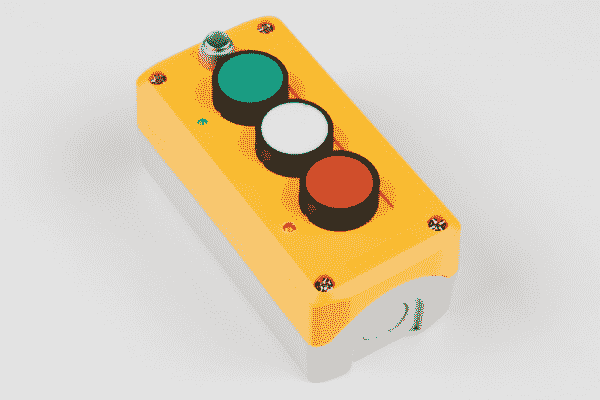
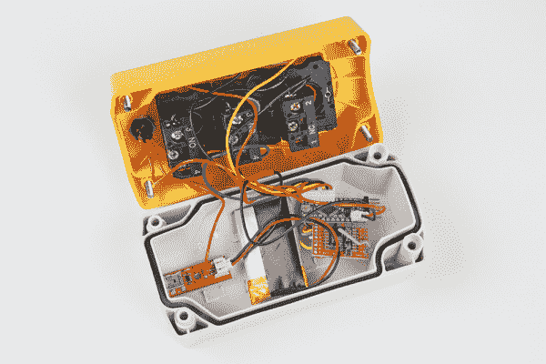
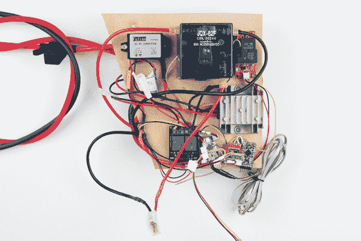
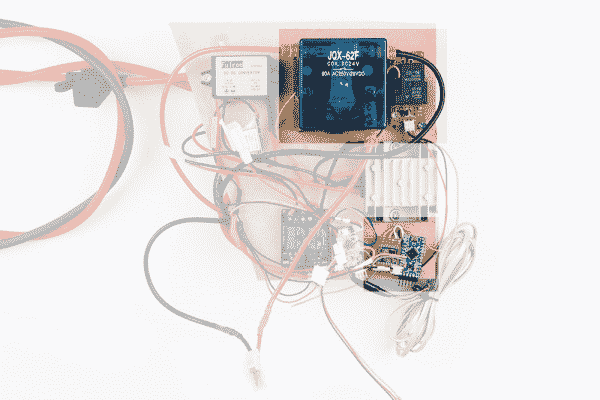
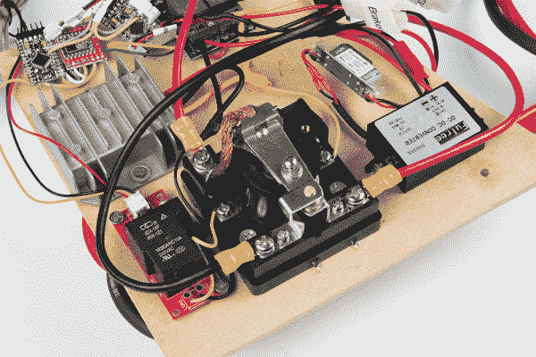
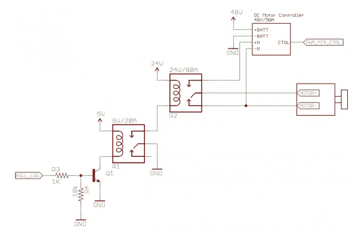
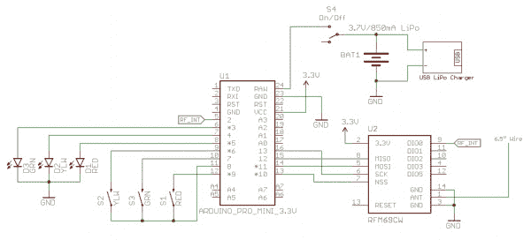

# 如何建立一个远程断路开关

> 原文：<https://learn.sparkfun.com/tutorials/how-to-build-a-remote-kill-switch>

## 当事情失去控制时

[](https://cdn.sparkfun.com/assets/learn_tutorials/5/3/2/Kill_Switch_Images-01.jpg)*Kill Switches: It's not a question of if, but when.*

我强烈建议建造一些时不时会让你害怕的东西。在这种情况下，我打算在 2016 年让一辆自动驾驶汽车参加 [AVC，它正在挑战我的舒适极限。一个 1000 瓦的马达后面有一个大电池组，这意味着如果出了问题，它可能是危险的。出于这个原因，AVC 的新安全要求之一是远程切断开关，允许用户远程关闭车辆。本教程是我的解决方案，安全地从电机控制器断开电机，以防事情失控...](https://avc.sparkfun.com/)

替换打开

[https://www.youtube.com/embed/idKhC2QLU6c](https://www.youtube.com/embed/idKhC2QLU6c)

替换关闭

这里有一个简短的视频，显示了控制 1kW 电机的 kill 开关(恰好连接到搅拌机上)。

## 系统需求

以下是我的系统的设计要求。这些应满足 [A+PRS 规则](https://avc.sparkfun.com/2016/rules#APRS_StopSwitch)的安全要求。

*   如果用户按下绿色按钮，系统应给切断继电器通电，使电源流向电机。
*   如果用户按下红色按钮，系统应断开切断继电器，使电机的+和-短路，导致电机制动。
*   如果用户按下黄色按钮，系统应声明一个信号引脚。这将连接到主控制器，让它知道比赛是在“黄旗”模式。
*   如果车辆在一定时间后未能收到来自遥控器的声音，则车辆应进入安全关闭状态(切断继电器电源，使发动机制动)。
*   如果遥控器未能听到车辆的响应(超出范围)，则进入断开模式(闪烁所有三个 led)。
*   如果链接重新建立，则以安全关闭模式启动。

我把 killswitch 系统分成两部分:位于车辆上的**车辆控制单元**和人类握在手中的**遥控单元**。

[](https://cdn.sparkfun.com/assets/learn_tutorials/5/3/2/Kill_Switch_Images-02.jpg)*The electronics in the hand held remote (RCU)*[](https://cdn.sparkfun.com/assets/learn_tutorials/5/3/2/Kill_Switch_Images-03.jpg)*The electronics on the vehicle (VCU)*

## VCU 零件清单

[](https://cdn.sparkfun.com/assets/learn_tutorials/5/3/2/Kill_Switch_Images-03.jpg)*Click on the image to see the electronics without highlighting*

在更大的蓝色 24V/80A 继电器旁边可以看到 Beefcake 继电器。VCU 本身(连接到 RFM69 分线板的 Pro Mini)可以在右下角看到。

车辆控制单元上使用的零件:

*   [Arduino Pro Mini 328-3.3V/8 MHz](https://www.sparkfun.com/products/11114)
*   [RFM69 突破](https://www.sparkfun.com/products/12823)
*   [大块头继电器控制套件](https://www.sparkfun.com/products/11042)
*   [24VDC 80A 继电器](http://www.ebay.com/itm/270773291995)
*   [48V 至 24V DC 至 DC 降压转换器](http://www.amazon.com/gp/product/B00XKL6M8U)
*   [48V 至 5V DC 至 DC 降压转换器](http://www.amazon.com/GERI-Converter-Module-8-50V-Output/dp/B00W52N8XW)
*   少量 [3 针](https://www.sparkfun.com/products/9915)和 [2 针](https://www.sparkfun.com/products/9914) JST 跳线组件

出于各种原因，我使用我们的 [SparkFun RFM69 突破](https://www.sparkfun.com/products/12823):

*   加密:这让我可以高枕无忧，没有人(好吧，我肯定有人*可以*破解它)会打开/关闭我的车。
*   **软件定义无线电:**AVC 有近 100 个团队，都有自己的无线电和遥测系统。能够坐在 434MHz 或 915MHz 频谱而不是非常拥挤的 2.4GHz 舞台上是非常棒的。
*   **数据速率缩放:**数据速率可以降低，频率可以改变，因此范围可以显著增加。 [UKHASnet](https://ukhas.net/) 甚至在整个欧洲建立了一个基于 RFM69 的中继器网络，传输范围达到 65 公里(40 英里)！我计划一直在我的自主动力轮的视线范围内，但很高兴知道 RFM69 的 100mW 传输功率可以完成这项工作。
*   库支持:多年来，社区一直在编写各种库来支持 RFM 类型的模块。我在这个项目中使用的最新产品是 AirSpayce 的[RadioHead](http://www.airspayce.com/mikem/arduino/RadioHead/)。它完成了我所需要的一切，并提供了一些不错的文档。

## 车辆控制单元

[](https://cdn.sparkfun.com/assets/learn_tutorials/5/3/2/Kill_Switch_Images-03-VCU.jpg)*RFM69, Arduino Pro Mini, and two relays make up the VCU*

车辆控制单元(VCU)位于[电机控制器](https://cdn.sparkfun.com/assets/learn_tutorials/5/3/2/Kill_Switch_Images-06.jpg)和电机之间。只有当远程控制单元(RCU)通电并发送*‘用户按下绿色按钮，开始’*信号时，VCU 才会将电机连接到电源。

我决定以 48V 运行我的 PRS 车辆，这是允许的系统电压的高端。幸运的是，有一些非常好的 DC 到 DC 降压转换器，可以将 48V 降至 24V(控制切断继电器)和 5V(为 3.3V Pro Mini 供电)。参见[零件列表](https://learn.sparkfun.com/tutorials/how-to-build-a-remote-kill-switch#vcu-parts-list)获取我使用的特定零件的链接。

[](https://cdn.sparkfun.com/assets/learn_tutorials/5/3/2/Kill_Switch_Images-04.jpg)

在负载和最高速度下，电机控制器将在 48V 输出 10 安培的电流。VCU 需要一个足够大的继电器来处理这个负载。我能找到的一些成本最低、电流最大的继电器是 24V 继电器。因为我的 3.3V/8MHz Pro Mini 只能打开/关闭 3.3V，所以我决定使用两个继电器设置。

[](https://cdn.sparkfun.com/assets/learn_tutorials/5/3/2/KillSwitch-Relay-Setup.jpg)*The relay setup*

这是一个“自举”中继系统的例子。自举允许小信号控制大负载。Pro Mini 的 3.3V 信号不能直接控制大的 24V 继电器，所以我用 3.3V 信号控制一个 5V 继电器来激活 24V 继电器。

当我们想要给电机供电时，Pro Mini 会用 3.3V 的信号激活[beefeake 继电器](https://www.sparkfun.com/products/11042)(KILL _ LOW 从 0 变为 3.3V)。这个信号使 Q1 晶体管接地，让电流流过 R1 的线圈。接下来，R1 上的簧片从正常关闭位置(没有连接任何东西)移动到正常打开位置。24V 的电流开始通过 R2 线圈自由流向地面。这种流动导致 R2 上的簧片从正常关闭位置移动到上部位置，将电机的+引线连接到电机控制器上的+M。在现实生活中，这整个过程产生了最令人满意的 **thunk** 。注意，这不会给电机供电；相反，它允许电机控制器控制电机。如果电机控制器输出 0%的功率，电机将愉快地静止不动。

### 48V / 24V / 5V 子系统

你可能想知道为什么我运行 24V 子系统？对于我的 A+PRS 条目，我用 12V 线性致动器控制转向，我用 24V 过度驱动。致动器很强但很慢，额外的电压驱动致动器快得多。24V 切断继电器(R2)也非常适合这种设计。

### 电机制动

当 R2 处于常闭(未激活)位置时，电机的+和-短路在一起。这就是所谓的电机制动。想知道这是什么感觉，找一个大的 DC 马达，试着转动轮轴。应该比较容易。现在，把电机的+和-短接在一起；车轴将很难转动。通过以这种方式设置 R2，我们有了另一层安全保障，如果一切都出了问题，而断路开关出了故障，系统应该自动防故障，关闭所有继电器，使电机短路，然后刹车停止。我还不清楚这种制动力有多强。如果制动太突然(因为它弹出人类骑手)，可能会更危险，而不是有益的，在这种情况下，我会将**马达-** 从 R2 的下部销断开，并在安全关闭的情况下让马达空转。这样，乘客就有能力用刹车来控制刹车，而不是他们无法控制的东西。

## RCU 零件清单

[](https://cdn.sparkfun.com/assets/learn_tutorials/5/3/2/Kill_Switch_Images-02.jpg)*Inside the remote control unit*

遥控器上使用的零件:

*   [三按钮开关站箱](http://www.amazon.com/Momentary-Green-Button-Switch-Station/dp/B00D0YRX1M)
*   [Arduino Pro Mini 328-3.3V/8 MHz](https://www.sparkfun.com/products/11114)
*   [RFM69 突破](https://www.sparkfun.com/products/12823)
*   [红色/黄色/绿色 5 毫米发光二极管](https://www.sparkfun.com/products/12062)
*   [850mAh LiPo 电池](https://www.sparkfun.com/products/341)
*   [Lipo 充电器基本-迷你-USB](https://www.sparkfun.com/products/10401)
*   [小闭锁电源开关](https://www.sparkfun.com/products/11975)或[开/关滑动开关](https://www.sparkfun.com/products/102)
*   [4 针](https://www.sparkfun.com/products/9916)和 [3 针](https://www.sparkfun.com/products/9915) JST 跳线组件
*   [FTDI 基本分线点- 3.3V](https://www.sparkfun.com/products/9873) 用于编程
*   [直角接头](https://www.sparkfun.com/products/553)如果你的 Pro Mini 需要的话

## 遥控装置

[](https://cdn.sparkfun.com/assets/learn_tutorials/5/3/2/Kill_Switch_Images-01.jpg)*The remote control kill switch*

RCU 是用户握在手中的东西，在自动驾驶汽车变得有感知能力或正在做一些它不应该做的事情时，卡住红色按钮。

[](https://cdn.sparkfun.com/assets/learn_tutorials/5/3/2/KillSwitch-Remote-Control-Unit.jpg)*Schematic for kill switch*

让我们从简单的部分开始:led 只是简单的开/关，不需要 PWM 引脚。我选择将 led 连接到引脚 3、4 和 5，因为这允许我焊接一个 [3 引脚 JST 连接器](https://www.sparkfun.com/products/9915)。开关站内的三个按钮为常开(NO)型。我将它们连接到引脚 6、7 和 9，其中 8 用作接地引脚。我这样做是因为我用完了 Pro Mini 上的 GND 别针。你可以用一个 GPIO 作为地，你只要把它设置为输出和低。此外，通过创建一个四引脚库，我可以将 4 引脚 JST 直接焊接到 Pro Mini 上。

RFM69 根据 Mike 出色的[连接指南](https://learn.sparkfun.com/tutorials/rfm69hcw-hookup-guide)进行接线。**注意:**需要从 Pro Mini 上的引脚 2 到 RFM69 上的 DIO0 的连接，并作为从 RFM 到 Pro Mini 的中断。您不能在 Pro Mini 上使用不同的引脚，因为引脚 2 是硬件中断引脚，库依赖于中断。

遥控器需要有电池！我用的是 [3.7V 850mA LiPo](https://www.sparkfun.com/products/341) 。平均电流消耗约为 42mA，因此一次充电应该可以持续 20 小时左右。我没有做任何功耗最小化的努力，因为 20 小时对我来说已经足够了。为了避免打开和关闭外壳来给电池充电，我安装了一个带迷你连接器的 [LiPo 充电器](https://www.sparkfun.com/products/10401)。插上迷你电缆就可以随时给电池充电，按下 S4(一个闭锁开关)就可以打开/关闭遥控器。请注意，如果遥控器关闭，车辆将进入自动安全关闭状态(这是一件好事)。

我真的很喜欢开关站中三个按钮的质量和感觉，但它们非常大，将所有电子产品包装到外壳中是一个挑战。如果我要制造另一个遥控器，我会在更多空间和质量之间寻找更好的平衡(亚马逊上有许多低质量的开关站，外壳内有更多空间)。

## 密码

**注意:**此示例假设您在桌面上使用的是最新版本的 Arduino IDE。如果这是你第一次使用 Arduino，请回顾我们关于[安装 Arduino IDE 的教程。](https://learn.sparkfun.com/tutorials/installing-arduino-ide)

If you have not previously installed an Arduino library, please check out our [installation guide.](https://learn.sparkfun.com/tutorials/installing-an-arduino-library)

你可以在这个 [github repo](https://github.com/sparkfun/Wireless_Kill_Switch) 中找到 RCU 和 VCU 的最新代码。

```
language:c
/*
 Remote Kill Switch - On the Car
 By: Nathan Seidle
 SparkFun Electronics
 Date: March 23rd, 2016
 License: This code is public domain but you buy me a beer if you use this and we meet someday (Beerware license).

 This is the part of the remote kill switch that lives on the car.

 If we receive 'R' (kill) system turns off the relay.
 If we receive 'Y' (pause) from the remote then set pin PAUSE high to signal master
 computer to pause.
 If we receive 'G' (go) system turns on relay, sets PAUSE pin to low.
 If we don't receive a system status from the remote every MAX_TIME_WITHOUT_OK ms, system goes into safety shutdown (relay off).

 Locomotion controller requires a 5V FTDI. The kill switch requires a 3.3V FTDI.
*/

#include <SPI.h>
#include <RH_RF69.h> //From http://www.airspayce.com/mikem/arduino/RadioHead/
#include <SimpleTimer.h> //https://github.com/jfturcot/SimpleTimer
#include <avr/wdt.h> //We need watch dog for this program

//If we don't get ok after this number of milliseconds then go into safety-shutdown
//This must be longer than MAX_DELIVERY_FAILURES * CHECKIN_PERIOD
//250ms is good
//L defines the value as a long. Needed for millisecond times larger than int (+32,767) but doesn't hurt to have.
#define MAX_TIME_WITHOUT_OK 250L

unsigned long lastCheckin = 0;

RH_RF69 rf69;

#define RELAY_CONTROL 9
#define PAUSE_PIN 6

#define LED_RED 5
#define LED_YLW 4
#define LED_GRN 3

//Define the various system states
#define RED 'R'
#define YELLOW 'Y'
#define GREEN 'G'
#define DISCONNECTED 'D'

char systemState;

void setup()
{
  wdt_reset(); //Pet the dog
  wdt_disable(); //We don't want the watchdog during init

  Serial.begin(9600);

  pinMode(RELAY_CONTROL, OUTPUT);
  turnOffRelay(); //During power up turn off power

  pinMode(LED_RED, OUTPUT);
  pinMode(LED_YLW, OUTPUT);
  pinMode(LED_GRN, OUTPUT);

  pinMode(PAUSE_PIN, OUTPUT);
  digitalWrite(PAUSE_PIN, LOW); //Resume

  if (!rf69.init())
    Serial.println("init failed");
  // Defaults after init are 434.0MHz, modulation GFSK_Rb250Fd250, +13dbM
  if (!rf69.setFrequency(915.0))
    Serial.println("setFrequency failed");

  // If you are using a high power RF69, you *must* set a Tx power in the range 14 to 20 like this:
  rf69.setTxPower(20);

  //This key is the same on the remote. Pick your own random sequence.
  uint8_t key[] = { 0xAB, 0x1C, 0x0E, 0x39, 0xF8, 0xFF, 0xA6, 0xFC,
                    0x7B, 0x44, 0xC3, 0xC0, 0x2D, 0x2D, 0x2D, 0xD2
                  };
  rf69.setEncryptionKey(key);

  systemState = RED; //On power up start in red state
  setLED(LED_RED);

  Serial.println("Power Wheels Kill Switch Online");

  wdt_reset(); //Pet the dog
//  wdt_enable(WDTO_1S); //Unleash the beast
}

void loop()
{
  if (millis() - lastCheckin > MAX_TIME_WITHOUT_OK)
  {
    if (systemState != DISCONNECTED)
    {
      setLED(LED_RED); //Turn on LED
      turnOffRelay();
      systemState = DISCONNECTED;

      Serial.println("Remote failed to check in! Turn off relay!");
    }
  }

  if (rf69.available())
  {
    uint8_t buf[RH_RF69_MAX_MESSAGE_LEN];
    uint8_t len = sizeof(buf);

    if (rf69.recv(buf, &len))
    {
      sendResponse(); //Respond back to the remote that we heard it loud and clear

      Serial.print("Received: ");
      Serial.println((char*)buf);

      if (buf[0] == RED || buf[0] == YELLOW || buf[0] == GREEN || buf[0] == DISCONNECTED) lastCheckin = millis(); //Reset timeout

      if (buf[0] == RED)
      {
        if (systemState != RED)
        {
          setLED(LED_RED); //Turn on LED
          turnOffRelay();
          systemState = RED;

          Serial.println("Kill!");
        }
      }
      else if (buf[0] == YELLOW)
      {
        if (systemState != YELLOW)
        {
          setLED(LED_YLW); //Turn on LED
          digitalWrite(PAUSE_PIN, HIGH);
          systemState = YELLOW;

          Serial.println("Pause!");
        }
      }
      else if (buf[0] == GREEN)
      {
        if (systemState != GREEN)
        {
          digitalWrite(PAUSE_PIN, LOW); //Turn off pause
          setLED(LED_GRN); //Turn on LED
          turnOnRelay();
          systemState = GREEN;

          Serial.println("Go!");
        }
      }
      else if (buf[0] == DISCONNECTED)
      {
        //If we've received a 'D' from the remote it means
        //it is trying to get back in touch
        setLED(LED_RED); //Turn on LED
        turnOffRelay();
        systemState = DISCONNECTED; //Remote will move the state from disconnected

        Serial.println("Reconnecting!");
      }

      Serial.print("RSSI: ");
      Serial.println(rf69.lastRssi(), DEC);
    }
  }
}

//If we receive a system state we send a response
void sendResponse()
{
  uint8_t response[] = "O"; //Send OK
  rf69.send(response, sizeof(response));
  rf69.waitPacketSent(50); //Block for 50ms before moving on

  Serial.println("Sent a reply");
}

//Turns on a given LED
void setLED(byte LEDnumber)
{
  digitalWrite(LED_RED, LOW);
  digitalWrite(LED_YLW, LOW);
  digitalWrite(LED_GRN, LOW);

  digitalWrite(LEDnumber, HIGH);
}

//Turn on the relay
void turnOnRelay()
{
  digitalWrite(RELAY_CONTROL, HIGH);
}

//Turn off the relay
void turnOffRelay()
{
  digitalWrite(RELAY_CONTROL, LOW);
} 
```

*Above is the code for the VCU*

```
language:c
/*
 Remote Kill Switch - Hand Held Controller
 By: Nathan Seidle
 SparkFun Electronics
 Date: March 23rd, 2016
 License: This code is public domain but you buy me a beer if you use this and we meet someday (Beerware license).

 This is the part of the remote kill switch that the user holds in their hand.

 If red button pressed we send 'R' (kill). Turn on red LED.
 If yellow button pressed we send 'Y' (pause). Turn on yellow LED.
 If green button pressed we send 'G' (go). Turn on green LED.
 Send the system state every CHECKIN_PERIOD ms. Car turns off if nothing is received after MAX_TIME_WITHOUT_OK ms.

 Indicator LEDs: Green/Yellow/Red

 Measured current: 42mA roughly

*/

#include <SPI.h>
#include <RH_RF69.h> //From: http://www.airspayce.com/mikem/arduino/RadioHead/s
#include <SimpleTimer.h> //https://github.com/jfturcot/SimpleTimer
#include <avr/wdt.h> //We need watch dog for this program

RH_RF69 rf69;

SimpleTimer timer;
long secondTimerID;

#define BUTTON_RED 9
#define BUTTON_GND 8
#define BUTTON_GRN 7
#define BUTTON_YLW 6

#define LED_RED 5
#define LED_YLW 4
#define LED_GRN 3

//Define the various system states
#define RED 'R'
#define YELLOW 'Y'
#define GREEN 'G'
#define DISCONNECTED 'D'

//Number of milliseconds between broadcasting our system state to the vehicle
//L defines the value as a long. Needed for millisecond times larger than int (+32,767) but doesn't hurt to have.
//25ms is good.
#define CHECKIN_PERIOD 25L

//Number of milliseconds to block for sending packets and waiting for the radio to receive repsonse packets
//This should be not be longer than the CHECKIN_PERIOD
//10ms is good. 
#define BLOCKING_WAIT_TIME 10L

//How many failed responses should be allowed from car until we go into disconnect mode
#define MAX_DELIVERY_FAILURES 3
byte failCount = 0;

char systemState;

unsigned long lastBlink = 0;
#define BLINK_RATE 500 //Amount of milliseconds for LEDs to toggle when disconnected

void setup()
{
  wdt_reset(); //Pet the dog
  wdt_disable(); //We don't want the watchdog during init

  Serial.begin(9600);

  pinMode(BUTTON_RED, INPUT_PULLUP);
  pinMode(BUTTON_YLW, INPUT_PULLUP);
  pinMode(BUTTON_GRN, INPUT_PULLUP);
  pinMode(BUTTON_GND, OUTPUT);
  pinMode(LED_RED, OUTPUT);
  pinMode(LED_YLW, OUTPUT);
  pinMode(LED_GRN, OUTPUT);

  digitalWrite(BUTTON_GND, LOW);

  secondTimerID = timer.setInterval(CHECKIN_PERIOD, checkIn); //Call checkIn every 500ms

  if (!rf69.init())
    Serial.println("init failed");
  // Defaults after init are 434.0MHz, modulation GFSK_Rb250Fd250, +13dbM
  // No encryption

  if (!rf69.setFrequency(915.0))
    Serial.println("setFrequency failed");

  // If you are using a high power RF69, you *must* set a Tx power in the range 14 to 20 like this:
  rf69.setTxPower(20);

  //This key is the same on the car. Pick your own random sequence.
  uint8_t key[] = { 0xAB, 0x1C, 0x0E, 0x39, 0xF8, 0xFF, 0xA6, 0xFC,
                    0x7B, 0x44, 0xC3, 0xC0, 0x2D, 0x2D, 0x2D, 0xD2
                  };
  rf69.setEncryptionKey(key);

  systemState = RED; //On power up start in red state
  setLED(LED_RED);

  Serial.println("Remote Controller Online");

  wdt_reset(); //Pet the dog
//  wdt_enable(WDTO_1S); //Unleash the beast
}

void loop()
{
  timer.run(); //Update any timers we are running
  wdt_reset(); //Pet the dog

  if (digitalRead(BUTTON_RED) == HIGH) //Top priority (Red is NC to ground so high = pressed)
  {
    systemState = RED;
    setLED(LED_RED); //Turn on LED

    //Check the special case of hitting all three buttons
    if (digitalRead(BUTTON_YLW) == LOW && digitalRead(BUTTON_GRN) == LOW) shutDown(); //Go into low power sleep mode
  }
  else if (digitalRead(BUTTON_YLW) == LOW)
  {
    systemState = YELLOW;
    setLED(LED_YLW); //Turn on LED
  }
  else if (digitalRead(BUTTON_GRN) == LOW)
  {
    systemState = GREEN;
    setLED(LED_GRN); //Turn on LED
  }
}

//Powers down all LEDs, radio, etc and sleeps until button interrupt
void shutDown()
{
  //Turn off LEDs
  digitalWrite(LED_RED, LOW);
  digitalWrite(LED_YLW, LOW);
  digitalWrite(LED_GRN, LOW);

  //Turn off radio

  //Sleep microcontroller and wake up on button interrupt

  Serial.println("Powering down");
}

//Send the system status notification every CHECKIN_PERIOD number of ms
void checkIn()
{
  wdt_reset(); //Pet the dog

  if(systemState == RED)
  {
    sendPacket("R");
  }
  else if (systemState == YELLOW)
  {
    sendPacket("Y");
  }
  else if (systemState == GREEN)
  {
    sendPacket("G");
  }
  else if (systemState == DISCONNECTED)
  {
    if(millis() - lastBlink > BLINK_RATE)
    {
      lastBlink = millis();
      digitalWrite(LED_RED, !digitalRead(LED_RED));
      digitalWrite(LED_YLW, !digitalRead(LED_YLW));
      digitalWrite(LED_GRN, !digitalRead(LED_GRN));

      sendPacket("D"); //Attempt to re-establish connection
    }
  }
}

//Sends a packet
//If we fail to send packet or fail to get a response, time out and go to DISCONNECTED system state
void sendPacket(char* thingToSend)
{
  Serial.print("Sending: ");
  Serial.println(thingToSend);

  rf69.send((uint8_t*)thingToSend, sizeof(thingToSend));

  rf69.waitPacketSent(BLOCKING_WAIT_TIME); //Wait for a bit of time

  //Wait for a "O" response from the car
  boolean responseFromCar = rf69.waitAvailableTimeout(BLOCKING_WAIT_TIME); //Wait some ms time to get a response

  //Read in any response from car
  uint8_t buf[RH_RF69_MAX_MESSAGE_LEN];
  uint8_t len = sizeof(buf);
  if (rf69.recv(buf, &len))
  {
    Serial.print("Heard from car: ");
    Serial.println((char*)buf);
  }

  if(responseFromCar == true) //We got a response
  {
    failCount = 0; //Reset the count

    if(systemState != DISCONNECTED)
    {
      Serial.println("System status delivered");
    }
    else if(systemState == DISCONNECTED)
    {
      //We are back online!
      Serial.println("Back online!");
      setLED(LED_RED);
      systemState = RED; //Default to stop if we are regaining connection
    }
  }
  else if (responseFromCar == false)
  {
    Serial.println("No response from car");

    //Go into triple blink mode indicating disconnect
    if(systemState != DISCONNECTED)
    {
      if(failCount++ > MAX_DELIVERY_FAILURES)
      {
        failCount = MAX_DELIVERY_FAILURES; //Don't let it increase and roll over
        digitalWrite(LED_RED, HIGH);
        digitalWrite(LED_YLW, HIGH);
        digitalWrite(LED_GRN, HIGH);
        systemState = DISCONNECTED;
      }
    }

    rf69.setModeIdle(); //This clears the buffer so that rf69.send() does not lock up
  }
}

//Turns on a given LED
void setLED(byte LEDnumber)
{
  digitalWrite(LED_RED, LOW);
  digitalWrite(LED_YLW, LOW);
  digitalWrite(LED_GRN, LOW);

  digitalWrite(LEDnumber, HIGH);
} 
```

*Above is the code for the RCU*

RCU 等待用户按下按钮，并监控到 VCU 的链接。如果未检测到链接，RCU 会闪烁所有三个 led，让用户知道 VCU 离线(未通电或超出范围)。一旦用户按下绿色按钮，RCU 将 LED 变为绿色，并开始发送“好，开始吧”信号。一旦接收到，VCU 将 **KILL_LOW** 引脚设置为高，从而激活两个继电器并将电机连接到电机控制器。

针对您的特定应用，可以在代码中更改某些设置:

*   **MAX_DELIVERY_FAILURES:** 原来 RF 链路每隔一段时间就会丢一个包，所以 MAX_DELIVERY_FAILURES 设置为三。如果我们在 3 次尝试后没有得到有效的发送/响应，系统将进入断开模式。设置低于 3 意味着汽车可能会过早关闭，因为我们有一些射频交通/碰撞。
*   **CHECKIN_PERIOD:** 遥控器会每隔 25 毫秒广播一次系统状态。
*   **MAX_TIME_WITHOUT_OK:** 如果 250 毫秒后没有收到遥控器的声音，车辆将会关闭。

这些设置对我来说效果很好，创建了一个反应灵敏、可靠的链接，如果事情变得糟糕，它会在 250 毫秒内关闭车辆。您可能需要调整这些设置，以适应其他更长距离的应用。

## 未来改进-反转！

这个关闭开关在很长的范围内工作得很好，我已经转移到了车上的其他挑战。测试将告诉电机制动是否是一件好事。我也很确定 Auto 先生会在测试中经常把我撞到护栏上，我需要停车和倒车的能力。按照设计，这个系统没有倒车的能力。为此，我研究了[连续工作螺线管](http://www.amazon.com/Reversing-Continuous-Solenoid-Relay-Windlass/dp/B004VAGKZE)。这些都是常见的高尔夫球车和其他小型 DC 车辆。我在等着找一个便宜的二手汽车，以免超出 500 美元的 PRS 预算。

我希望你能从我的设置中学到一些东西。如果你有类似的项目，请在评论中链接它们。AVC 的一个伟大的方面是我从其他人那里学到的所有伟大的东西，所以请让我知道你是如何做你的死亡开关的！