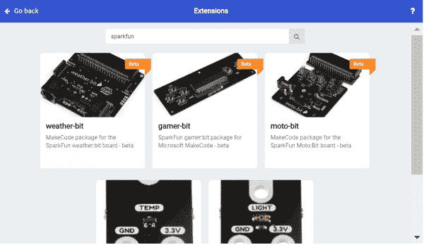

# 如何为 Micro:Bit 创建 MakeCode 包

> 原文：<https://learn.sparkfun.com/tutorials/how-to-create-a-makecode-package-for-microbit>

## 介绍

Microsoft MakeCode 是一种基于块的编码语言，旨在向人们介绍编码。MakeCode 很好，因为它允许算法设计中使用的基本结构和思维过程发生，而不必担心语法或数据类型。在幕后，MakeCode 基于[静态类型脚本](https://makecode.com/language)和 javascript。在本教程中，我们将使用现有的 SparkFun 扩展为[土壤湿度传感器](https://www.sparkfun.com/products/13322)开发一个 MakeCode 扩展。

[](https://cdn.sparkfun.com/assets/learn_tutorials/6/4/4/MicroBit_SparkFun_Extensions.jpg)*A Few Existing SparkFun Extensions in MakeCode for micro:bit*

## 你需要的东西

首先，让我们设置我们的构建环境，我们将从下载和安装 [Node.js](https://nodejs.org/) 开始。

[Download Node.js](https://nodejs.org/)

你还需要一个 GitHub 账户。现在继续,[打开任何旧的命令提示符](https://learn.sparkfun.com/tutorials/terminal-basics/command-line-windows-mac-linux),导航到你存储 GitHub 文件的地方(我在我的 **C: & bsol 上创建了一个 GitHub 文件夹；**开车所以对我来说这是**C:&bsol；GitHub** )。然后继续运行下面的命令。这将安装一些要使用的 npm 软件包。

```
language:bash
npm install
npm install jake
npm install typings 
```

然后，我们将把 PXT 目录克隆到 GitHub 文件夹中，并运行我们刚刚安装的这些 npm 包。最后，再次返回到 GitHub 文件夹。这是通过以下命令完成的。

```
language:bash
git clone https://github.com/microsoft/pxt
cd pxt
git checkout
npm install
typings install
jake
cd.. 
```

然后我们将克隆 Micro:Bit 目标，并在那里安装 pxt。

```
language:bash
git clone https://github.com/Microsoft/pxt-microbit
cd pxt-microbit
npm install -g pxt
npm install
cd.. 
```

这应该是我们构建项目所需的一切，现在让我们克隆一个现有的 SparkFun MakeCode 包并开始编辑它。

```
language:bash
git clone https://github.com/sparkfun/pxt-gator-light 
```

## 要改变什么

让我们继续[为我们新的 MakeCode 包创建一个新的 GitHub 库](https://help.github.com/en/articles/create-a-repo)，我们称它为 **pxt-gator-moisture** 。将这个 repo 克隆到你的 GitHub 文件夹中，然后继续复制 **pxt-gator-light** repo 的内容。我们将主要关注两个 **gatorlight** 文件，即 **pxt。JSON** 文件，**自述文件。MD** ，以及最终的**icon.png**。

[](https://cdn.sparkfun.com/assets/learn_tutorials/8/9/6/folder.JPG)*We must change these files. Click the image to enlarge*

首先，我们将遍历并重命名所有内容为 **gatormoisture** ，因此继续重命名两个 **gatorlight** 文件，一旦我们重命名了它们，继续打开 **pxt.json** ，并将单词 **light** 的每个实例替换为 **moisture** 。 ***。json** file 告诉 MakeCode 要包含哪些文件，因为我们更改了文件名，所以我们也必须在这里更改它们。不要忘记将版本号回滚到 **0.0.1** 以及将描述更改为更有意义的内容。然后，我们将打开两个 **gatormoisture** 文件，再次用湿气替换光的每个实例。

现在让我们看看我们的块背后的代码实际上位于哪里，这些块位于 ***中。ts** 文件，而实际的函数则存在于 ***中。cpp** 。让我们来看看 ***。cpp** 第一。我们确保每个包中都包含`pxt.h`，并使用`pxt`名称空间。然后我们创建一个名称空间，“`gatormoisture`”，并放入从给定 ADC 值计算 lux 的函数。这是一个非常简单的函数，但是我们可以从我们的 ***中调用它。ts** 文件，这是我们真正想要的。

```
language:c
#include "pxt.h"
#include <cstdint>
#include <math.h>

using namespace pxt;

namespace gatorMoisture {
    /*
    * Calculates the light in Lux based on the ADC value passed in. 1 step in adcVal is equal to .488 uA or .976 lux at 5V
    */
    //%
    uint16_t getLux(int16_t ADCVal) {
        return ADCVal * .976;
    }

} 
```

现在，让我们将`getLux`改为一个`getMoisture`函数，返回一个介于 0 和 1 之间的浮点数，而不是一个 lux 值。为此，我们将简单地将传入的`ADCVal`除以 ADC 的满量程范围(1023)。最后，我们的 **gatormoisture.cpp** 看起来如下。

```
language:c
#include "pxt.h"
#include <cstdint>
#include <math.h>

using namespace pxt;

namespace gatorMoisture {
    /*
    * Calculates the light in Lux based on the ADC value passed in. 1 step in adcVal is equal to .488 uA or .976 lux at 5V
    */
    //%
    float getMoisture(int16_t ADCVal) {
        return ADCVal / 1023.0;
    }
} 
```

现在让我们看看我们的块是如何在 ***中创建的。ts** 文件，在我们将所有的东西从光照改变为潮湿后，它应该看起来像下面这样。

```
language:c
enum gatorMoistureType{
    moisture=1,
    adcVal=2,
}

//% color=#f44242 icon="\uf185"
namespace gatorMoisture {

    // Functions for reading moisture from the gatormoisture in moisture or straight adv value

    /**
    * Reads the number
    */
    //% weight=30 blockId="gatorMoisture_moisture" block="Get moisture on pin %pin | in %gatorMoistureType"
    export function moisture(pin: AnalogPin, type: gatorMoistureType): number{
        let ADCVal = pins.analogReadPin(pin)
        switch(type){
            case gatorMoistureType.moisture: return getMoisture(ADCVal)
            case gatorMoistureType.adcVal: return ADCVal
            default: return -11111111
        }
    }

    /**
     * Function used for simulator, actual implementation is in gatormoisture.cpp
     */
    //% shim=gatorMoisture::getMoisture
    function getMoisture(ADCVal: number) {
        // Fake function for simulator
        return 0
    }
} 
```

如果我们希望块的下拉列表中有选项，我们可以使用枚举来创建它们。我们将能够选择是否需要湿度，一个介于 0 和 1 之间的值，或者直接的 adcVal。所以在名称空间之外，我们为可能的数据类型创建了一个枚举(如下所示)。

```
language:c
enum gatorMoistureType{
    moisture=1,
    adcVal=2,
} 
```

然后，我们必须为我们的扩展选择一种颜色和图标，这是在我们声明名称空间之前的代码行中完成的。颜色可以是任何 6 位十六进制值，而图标将使用来自 [FontAwesome](https://fontawesome.com/icons?from=io) 图标库中的标识符。颜色和图标声明如下所示。

```
language:c
//% color=#f44242 icon="\uf185" 
```

然后，我们需要定义我们的块看起来像什么，以及它相对于其他块的位置。这通过设置**重量**、**块 Id** 和**块**来完成。权重为 100 的块将在权重低于 100 的块之上和权重高于 100 的块之下列出自身。这允许您决定如何列出所有的块。blockId **必须**是`mynamespacetitle_functionTitle`，所以对于我们的`moisture`块，它在`gatorMoisture`名称空间中，我们的 blockId 将是`gatorMoisture_moisture`。最后，我们使用`block`字符串来决定块的文本内容。我们希望成为下拉列表的任何变量都将以`%`开头。以下代码将创建一个块，该块带有一个用于引脚选择的下拉列表和一个允许您在**湿度**和 **adcVal** 之间进行选择的下拉列表。该块将使用从下拉列表中选择的任何参数调用函数`moisture`。

```
language:c
//% weight=30 blockId="gatorMoisture_moisture" block="Get moisture on pin %pin | in %gatorMoistureType" 
```

最后，我们需要编写实际读取 pin 的函数。任何被声明为`export`的函数将在 MakeCode 中显示为一个块。该函数的参数将是我们声明的任何下拉变量，我们通常需要根据类型设置一个 switch 语句，以返回每个所选类型的正确值。注意我们如何调用包含在我们的 ***中的函数`getMoisture`。cpp** 当我们的类型是`moisture`的时候。我们还必须声明函数返回的内容，在本例中是一个数字。

```
language:c
export function moisture(pin: AnalogPin, type: gatorMoistureType): number{
    let ADCVal = pins.analogReadPin(pin)
    switch(type){
        case gatorMoistureType.moisture: return getMoisture(ADCVal)
        case gatorMoistureType.adcVal: return ADCVal
        default: return -11111111
    }
} 
```

我们的 ***中的任何函数。cpp** 将需要一个模拟器的虚拟功能。我们为我们的`getMoisture`函数创建如下模拟。注意，由于它没有被导出，我们在 MakeCode 中看不到它。

```
language:c
//% shim=gatorMoisture::getMoisture
function getMoisture(ADCVal: number) {
    // Fake function for simulator
    return 0
} 
```

最后，我们需要将`README`(第 49 行)的最后一部分更改为我们的名称空间，后跟 GitHub 地址，看起来像`gatorMoisture=github:sparkfun/pxt-gator-soil`，并允许将包识别为 MakeCode 扩展。

## 编译您的代码

现在我们已经编写了所有的代码，是时候编译和测试它了，继续打开一个命令提示符窗口，导航到 MakeCode 包所在的目录。在那里，运行以下命令来链接安装必要的 PXT 工具来构建您的代码

```
language:bash
npm install
npm install typings
npm install jake
npm link ../pxt
pxt target microbit
pxt install 
```

然后，我们希望构建我们的代码，并将我们的更改提交到 GitHub。

```
language:bash
pxt build
git add -A
git commit -m "changing names to gator:moisture"
pxt bump 
```

`pxt bump`命令将提示您输入一个版本号，用它来标记您的发布，只要确保它高于或等于提示您输入的版本。然后，该命令将标记您的提交，并将其作为一个版本推送到 GitHub。

[](https://cdn.sparkfun.com/assets/learn_tutorials/8/9/6/pxtbump.JPG)*PXT Bump*

## 测试，冲洗，重复！

为了测试我们的代码，让我们打开 [MakeCode 网站](https://makecode.microbit.org/#editor)并向下导航到扩展。

[](https://cdn.sparkfun.com/assets/learn_tutorials/8/9/6/ext.png)*Extensions*

从那里，我们将使用一个令牌登录到我们的 GitHub，要做到这一点，只需在单击`login to GitHub`时按照说明进行操作。

[](https://cdn.sparkfun.com/assets/learn_tutorials/8/9/6/ext2.png)*Login to Github*

登录后，我们可以将 GitHub repo 的 URL 粘贴到扩展搜索栏中，单击结果以包含它！如果它没有弹出，请确保您的存储库是公共的。

一旦你包含了你的扩展，你可以随意检查它的各种特性，根据需要编辑代码，然后重新上传到 GitHub，直到你满意为止！

## 资源和更进一步

最后，我们最终希望我们的扩展得到微软的批准。请务必查看 [MakeCode 扩展批准清单](https://support.microbit.org/support/solutions/articles/19000054952-makecode-extension-approval)。然后填写[这张表格](https://form.jotformeu.com/90075019358357)，开始让你的包裹获得批准。

[MakeCode for micro:bit Extension Approval Form](https://form.jotformeu.com/90075019358357)

查看下面的参考资料。

*   [Node.js](https://nodejs.org/)
*   [MakeCode 文档>技术文档>编程语言](https://makecode.com/language)
*   [MakeCode 帮助&支持:MakeCode 扩展批准](https://support.microbit.org/support/solutions/articles/19000054952-makecode-extension-approval)
*   [制作微代码:bit 扩展审批表](https://form.jotformeu.com/90075019358357)
*   [微软 MakeCode](https://makecode.microbit.org/#editor)