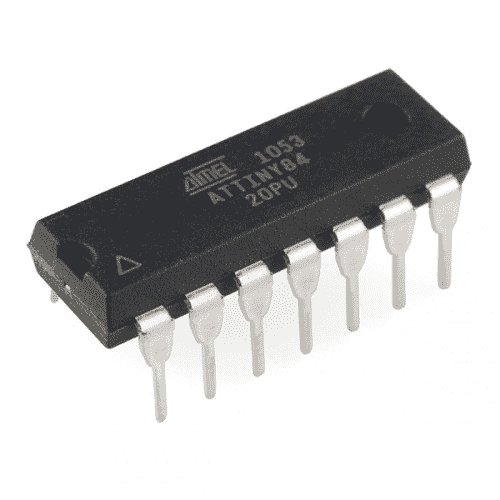

# 如何用虚拟 USB 安装 ATtiny 引导程序

> 原文：<https://learn.sparkfun.com/tutorials/how-to-install-an-attiny-bootloader-with-virtual-usb>

## 介绍

在本教程中，我们将向您展示如何使用 Arduino 在 ATtiny84 上安装带有 [V-USB](https://www.obdev.at/products/vusb/index.html) 的[微核引导程序](https://github.com/micronucleus/micronucleus)。这些步骤将适用于其他 ATtiny 芯片，但您需要更改类似于 *pins_arduino.h* 文件和 *avrdude* 中的目标参数。

**遵循本指南，您将能够通过 USB 将 Arduino 草图直接上传到 ATtiny84，而无需使用编程设备(如另一个 Arduino 或 FTDI 芯片)。**

Atmel AVR [ATtiny84](https://www.sparkfun.com/products/11232) 与 [ATtiny85](https://www.sparkfun.com/products/9378) 非常相似，但多了几个 I/O 引脚(确切地说，多了六个)。如果你喜欢使用非常小、便宜的微控制器，ATtiny84 和低功率 [ATtiny84A](http://www.atmel.com/devices/ATTINY84A.aspx) 是不错的选择。ATtiny84 或 ATtiny84A 将适用于本教程。

 

将**添加到您的[购物车](https://www.sparkfun.com/cart)中！**

### [AVR 14 引脚 20MHz 8K 12A/D - ATtiny84](https://www.sparkfun.com/products/11232)

[In stock](https://learn.sparkfun.com/static/bubbles/ "in stock") COM-11232

ATtiny84 是 Atmel 的另一款小型 8 位处理器。8K 程序空间、12 条 I/O 线和 8 通道 10 位 ADC。…

$4.951[Favorited Favorite](# "Add to favorites") 22[Wish List](# "Add to wish list")******Warning:** To make this work, we'll need to run the ATtiny84 at 12MHz during the bootloader phase. This tutorial shows how to do that with the internal RC clock at 3.3V. Note that this is out of spec for the ATtiny84! We're essentially overclocking/hacking the ATtiny to do something it's not supposed to do. Do this at your own risk! SparkFun takes no responsibility if you brick/smoke/blow up your ATtiny. Good thing they're cheap.

在本教程中，我们将向您展示如何:

1.  在 Arduino 上加载 Arduino ISP(系统内程序员)
2.  在 ATtiny84 上安装微核引导程序
3.  手动更换 ATtiny84 中的保险丝，以允许 USB 编程
4.  在 Arduino 中为 ATtiny84 创建新的电路板定义
5.  安装任何必要的 USB 驱动程序
6.  将示例固件从 Arduino IDE 上传到 ATtiny84

ATtiny 微控制器是奇妙的小芯片，但经常受到低编程空间的困扰。ATtiny84 和 85 具有 8k 闪存(相比之下，Arduino 平台上最常见的微控制器 ATmega328p 具有 32k 闪存)。像 [micronucleus](https://github.com/micronucleus/micronucleus) 这样的引导加载程序允许我们通过“虚拟”USB (V-USB)连接将固件上传到微控制器，而不是使用单独的微控制器进行编程。缺点是微核使用了 2k 的可用闪存，只给我们的程序留下了 6k 的闪存！

然而，如果你不想依赖[单独的硬件](https://www.sparkfun.com/products/11460)进行编程，使用引导加载程序可能会降低定制 Arduino 板的生产成本。

**Note:** If you don't want to use the bootloader, you can still [program the ATtiny84 directly from Arduino](https://www.sparkfun.com/news/2237) using another Arduino device as an ISP.

### 零件目录表

要跟进，您将需要以下部件:**