# 如何阅读原理图

> 原文：<https://learn.sparkfun.com/tutorials/how-to-read-a-schematic>

## 概观

原理图是我们设计、构建和排除电路故障的地图。对于任何电子工程师来说，理解如何阅读和理解原理图是一项重要的技能。

本教程应该把你变成一个完全识字的原理图读者！我们将讨论所有基本的原理图符号:

然后，我们将讨论如何在原理图上将这些符号连接起来，以创建电路模型。我们还将回顾一些需要注意的提示和技巧。

### 推荐阅读

原理图理解是一个非常基本的电子技能，但在你阅读本教程之前，有一些事情你应该知道。看看这些教程，如果它们听起来像是你成长中大脑的缺口:

*   [什么是电？](https://learn.sparkfun.com/tutorials/what-is-electricity)
*   [什么是电路？](https://learn.sparkfun.com/tutorials/what-is-a-circuit)
*   [电压、电流、电阻和欧姆定律](https://learn.sparkfun.com/tutorials/voltage-current-resistance-and-ohms-law)

## 示意图符号(第 1 部分)

你准备好面对接二连三的电路元件了吗？以下是各种组件的一些标准化的基本示意图符号。

### 电阻

最基础的电路元件和符号！原理图上的[电阻](https://learn.sparkfun.com/tutorials/resistors)通常用几条之字形线表示，**的两个端子**向外延伸。使用国际符号的示意图可能会使用无特征的矩形，而不是波浪线。

#### 电位计和可变电阻器

可变电阻器和电位计每个都用一个箭头增加标准电阻器符号。可变电阻仍然是一个双端器件，因此箭头正好位于中间的对角线上。电位计是三端器件，因此箭头成为第三端(游标)。

### 电容器

常用的[电容符号有两种](https://learn.sparkfun.com/tutorials/capacitors)。一个符号代表一个[极化](https://learn.sparkfun.com/tutorials/polarity)(通常是电解或钽)电容器，另一个代表非极化电容。在每种情况下，有两个终端，垂直进入板。

[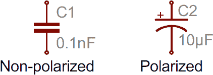](https://cdn.sparkfun.com/assets/9/c/9/c/5/51cc9e55ce395fcd6c000000.png)

带有一个曲板的符号表示电容器被极化。曲板通常代表电容的阴极，其电压应低于正极引脚。极化电容器符号的正极引脚也应加上一个加号。

### 感应器

电感器通常用一系列弯曲的凸起或多圈线圈来表示。国际符号可能只是将电感器定义为实心矩形。

[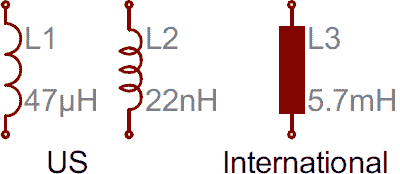](https://cdn.sparkfun.com/assets/3/f/a/4/0/51cca0f8ce395fa06c000001.png)

### 开关

[开关](https://learn.sparkfun.com/tutorials/button-and-switch-basics)以多种不同的形式存在。最基本的开关，单刀单掷(SPST)，是两个端子，半连接线代表执行器(将端子连接在一起的部分)。

像下面的 SPDT 和 SP3T 这样的多掷开关为致动器增加了更多的着陆点。

[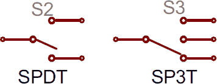](https://cdn.sparkfun.com/assets/f/a/b/3/3/51cc9e55ce395f7a6c000001.png)

具有多个电极的开关通常具有多个相似的开关，虚线与中间致动器相交。

### 电源

正如[为您的项目](https://learn.sparkfun.com/tutorials/how-to-power-a-project)供电有许多选项一样，也有各种各样的电源电路符号来帮助指定电源。

#### DC 或交流电压源

大多数时候，当与电子设备一起工作时，你将使用恒压源。我们可以使用这两个符号中的任何一个来定义电源是提供直流电(DC)还是交流电(AC):

#### 电池

[电池](https://learn.sparkfun.com/tutorials/battery-technologies)，无论是那些圆柱形、[碱性 AA 电池](https://www.sparkfun.com/products/9100)还是可充电的[锂聚合物电池](https://www.sparkfun.com/products/339)，通常看起来像一对不成比例的平行线:

[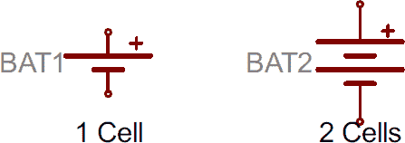](https://cdn.sparkfun.com/assets/b/a/5/0/8/51cc9e54ce395ff06d000001.png)

更多的线对通常表示电池中有更多的串联电池。此外，较长的线通常用于表示正极端子，而较短的线连接到负极端子。

#### 电压节点

有时——特别是在非常繁忙的原理图上——可以给节点电压分配特殊的符号。您可以将设备连接到这些**单端**符号，它将直接连接到 5V、3.3V、VCC 或 GND(地)。正电压节点通常由一个向上的箭头表示，而接地节点通常由一至三条扁平线组成(有时是一个向下的箭头或三角形)。

[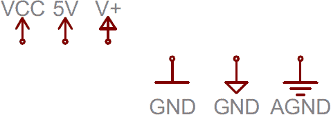](https://cdn.sparkfun.com/assets/f/7/5/4/2/51cc9e55ce395fcc74000000.png)

## 示意图符号(第二部分)

### 二极管

基本[二极管](https://learn.sparkfun.com/tutorials/diodes)通常用一个压在一条线上的三角形表示。二极管也是[极化的](https://learn.sparkfun.com/tutorials/polarity)，所以两个端子中的每一个都需要区分标识符。正极是伸入三角形平边的终端。负的阴极延伸到符号线之外(把它想象成一个符号)。

二极管有各种不同的[类型，每一种在标准二极管符号上都有一个特殊的 riff。**发光二极管**用两条指向远处的线增加二极管符号。**光电二极管**，它从光产生能量(基本上是微小的太阳能电池)，翻转箭头并指向二极管。](../diodes/types-of-diodes)

[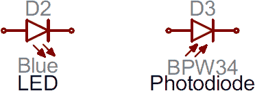](https://cdn.sparkfun.com/assets/c/5/7/4/4/51cca2cace395f5e6d000000.png)

其他特殊类型的二极管，如肖特基二极管或齐纳二极管，有自己的符号，符号的条形部分略有不同。

[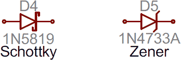](https://cdn.sparkfun.com/assets/1/6/9/2/0/51cca2cace395f6369000000.png)

### 晶体管

晶体管，无论是 BJT 还是 MOSFETs，都有两种配置:正掺杂或负掺杂。所以对于每一种类型的晶体管，至少有两种方法来绘制。

#### 双极结型晶体管

BJT 是三端器件；它们有一个集电极(C)，一个发射极(E)和一个基极(B)。有两种类型的 BJT-npn 和 PNPs 并且每一种都有自己独特的符号。

[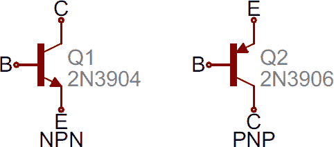](https://cdn.sparkfun.com/assets/9/8/4/c/5/51cca2f8ce395f6469000000.png)

集电极(C)和发射极(E)引脚相互成一直线，但发射极上应该总是有一个箭头。如果箭头指向内，它是一个 PNP，如果箭头指向外，它是一个 NPN。记住哪个是哪个的助记法是“NPN:**n**ot**p**ointing I**n**”

#### 金属氧化物场效应晶体管(MOSFETs)

像 BJT 一样，MOSFETs 有三个端子，但这次它们被命名为源极(S)、漏极(D)和栅极(G)。同样，该符号有两种不同版本，取决于您使用的是 n 沟道还是 p 沟道 MOSFET。每种 MOSFET 类型都有许多常用符号:

[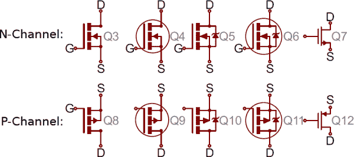](https://cdn.sparkfun.com/assets/d/f/6/3/d/51cc9e55ce395fea4b000000.png)

符号中间的箭头(称为主体)定义 MOSFET 是 n 沟道还是 p 沟道。如果箭头指向内，表示它是一个 n 沟道 MOSFET，如果指向外，则表示它是一个 p 沟道 MOSFET。记住:“n 是 in”(与 NPN 助记符相反)。

### 数字逻辑门

我们的标准逻辑函数“与”、“或”、“非”和“异或”都有独特的示意符号:

向输出**添加一个气泡会使**函数取反，从而创建 NAND、NORs 和 XNORs:

它们可能有两个以上的输入，但是形状应该保持不变(嗯，可能会大一点)，并且应该只有一个输出。

### 集成电路

集成电路完成如此独特的任务，而且数量如此之多，以至于它们实际上没有一个独特的电路符号。通常，集成电路由一个矩形表示，引脚从侧面伸出。每个引脚都应标有数字和功能。

[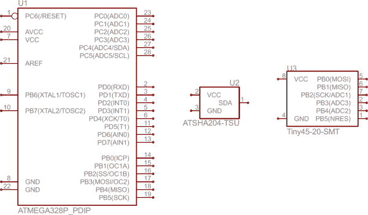](https://cdn.sparkfun.com/assets/4/4/a/d/0/51cc9e55ce395f7f69000001.png)*Schematic symbols for an ATmega328 microcontroller (commonly found on [Arduinos](https://learn.sparkfun.com/tutorials/what-is-an-arduino)), an ATSHA204 encryption IC, and an ATtiny45 MCU. As you can see, these components greatly vary in size and pin-counts.*

因为 ic 有这样一个通用电路符号，所以名称、值和标签就变得非常重要。每个 IC 都应该有一个精确识别芯片名称的值。

#### 独特的 IC:运算放大器、稳压器

一些更常见的集成电路有一个独特的电路符号。你通常会看到运算放大器的布局如下，共有 5 个端子:一个同相输入(+)、反相输入(-)、输出和两个电源输入。

*Often, there will be two op amps built into one IC package requiring only one pin for power and one for ground, which is why the one on the right only has three pins.*

简单的电压调节器通常是带输入、输出和接地(或调节)引脚的三端元件。这些引脚通常呈矩形，在左侧(输入)、右侧(输出)和底部(接地/调整)有引脚。

### 混合物

#### 晶体和谐振器

晶体或谐振器通常是微控制器电路的关键部分。它们有助于提供时钟信号。晶体符号通常有两个端子，而在晶体中增加两个电容的谐振器通常有三个端子。

[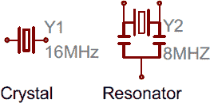](https://cdn.sparkfun.com/assets/a/e/5/6/f/51ccac08ce395f776c000000.png)

#### 接头和连接器

无论是供电还是发送信息，大多数电路都需要连接器。这些符号因连接器的外观而异，以下是一个示例:

[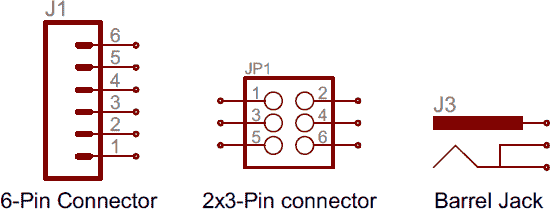](https://cdn.sparkfun.com/assets/e/3/7/a/d/51ccac08ce395f6569000000.png)

#### 电机、变压器、扬声器和继电器

我们将把这些放在一起，因为它们(大部分)都以某种方式利用了线圈。**变压器**(不是[那种看上去比实际多的](http://www.youtube.com/watch?v=nLS2N9mHWaw)变压器)通常包括两个线圈，彼此对接，用几条线将它们分开:

[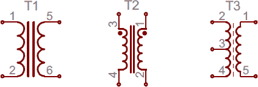](https://cdn.sparkfun.com/assets/f/b/e/a/f/51ccac08ce395fe06d000001.png)

**继电器**通常将线圈与开关配对:

扬声器和蜂鸣器通常采用与现实生活中相似的形式:

[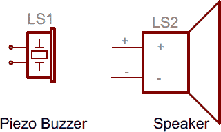](https://cdn.sparkfun.com/assets/2/9/a/a/6/51ccac08ce395f8c2b000002.png)

**电机**通常包含一个带圆圈的“M ”,有时会在端子周围稍加修饰:

#### 保险丝和 PTC

保险丝和 PTC(通常用于限制大电流涌入的设备)都有自己独特的符号:

PTC 符号实际上是一个**热敏电阻**的通用符号，这是一个与温度相关的电阻(注意这里的国际电阻符号吗？).

* * *

毫无疑问，这个列表中还有很多电路符号没有列出来，但是上面的这些符号应该让你 90%的了解原理图。一般来说，符号应该与它们所建模的现实生活中的组件有相当多的共同点。除了符号之外，原理图上的每个元件都应该有一个唯一的名称和值，这有助于进一步识别它。

## 名称指示器和值

了解原理图的最大关键之一是能够识别哪些元件是哪些元件。组件符号讲述了故事的一半，但是每个符号都应该与名称和值配对，以使故事完整。

### 名称和值

**值**有助于准确定义组件是什么。对于电阻、电容和电感等原理图元件，数值告诉我们它们有多少欧姆、法拉或亨利。对于其他组件，如集成电路，该值可能只是芯片的名称。晶体可能会列出它们的振荡频率作为它们的值。基本上，一个原理图元件的值引出了它的**最重要的特性**。

组件名称通常由一两个字母和一个数字组成。名称中的字母部分标识了元件的类型- *R* 代表电阻器， *C* 代表电容器， *U* 代表集成电路，等等。原理图上的每个组件名称应该是唯一的；例如，如果一个电路中有多个电阻，它们应该被命名为 R [1] ，R [2] ，R [3] 等。元件名称有助于我们参考原理图中的特定点。

名字的前缀非常规范。对于某些元件，如电阻器，前缀只是元件的第一个字母。其他名字前缀没有这么字面；比如电感是 *L* 的(因为电流已经花了 *I* 【但是它是以 *C* 开始的...电子是个傻地方】)。下面是常见组件及其名称前缀的快速表格:

| 名称标识符 | 成分 |
| 稀有 | 电阻 |
| C | 电容器 |
| L | 感应器 |
| S | 开关 |
| D | 二极管 |
| Q | 晶体管 |
| U | 集成电路 |
| Y | 晶体和振荡器 |

尽管这些是组件符号的“标准化”名称，但它们并没有被普遍遵循。例如，你可能会看到以 *IC* 为前缀的集成电路，而不是 *U* ，或者标签为 *XTAL* 而不是 *Y* 的晶体。在诊断哪个部分是哪个部分时，使用你的最佳判断。符号通常应该传达足够的信息。

## 阅读示意图

理解原理图上的元件是什么，是理解原理图的一半以上。现在剩下的就是识别所有的符号是如何连接在一起的。

### 网络、节点和标签

原理图网络告诉您元件如何在电路中连接在一起。网络表示为元件端子之间的线。有时(但不总是)它们是独特的颜色，就像示意图中的绿线:

[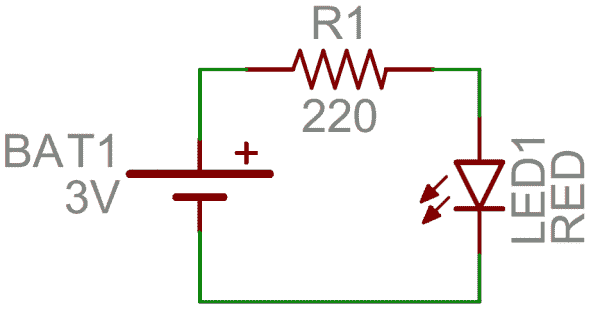](https://cdn.sparkfun.com/assets/d/2/9/c/c/51cdbd5fce395fc80b000000.png)

#### [交叉点和节点](#junction_node)

电线可以把两个终端连在一起，也可以连几十个。当一根电线分成两个方向时，它会产生一个**接点**。我们在示意图上用**节点**表示连接点，这些小点位于导线的交叉点。

[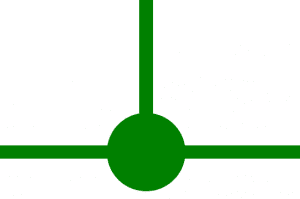](https://cdn.sparkfun.com/assets/7/d/2/c/8/51cdb29dce395fa40b000000.png)

节点给了我们一种方式来说“穿过这个连接点*的导线是*连接的”。节点的缺失意味着两条独立的线只是经过，没有形成任何形式的连接。(设计原理图时，尽可能避免这些不相连的重叠通常是一种好的做法，但有时这是不可避免的)。

[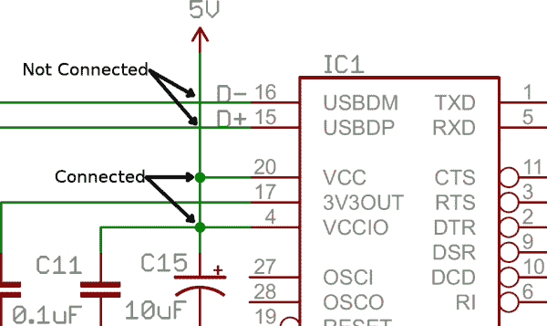](https://cdn.sparkfun.com/assets/0/1/7/4/5/51cdb378ce395f4309000000.png)

#### 网名

有时，为了使原理图更清晰，我们会给网络起一个名字并贴上标签，而不是在整个原理图上布线。同名的网络被认为是相连的，即使它们之间没有可见的连线。名字可以直接写在网上，也可以是“标签”，挂在网上。

[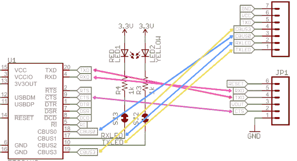](https://cdn.sparkfun.com/assets/6/0/2/4/e/51cdb9d0ce395f2c0b000000.png)*Each net with the same name is connected, as in this [schematic](http://cdn.sparkfun.com/datasheets/BreakoutBoards/ft231x-breakout-v01.pdf) for an [FT231X Breakout Board](https://www.sparkfun.com/products/11736). Names and labels help keep schematics from getting too chaotic (imagine if all those nets were actually connected with wires).*

网络通常有一个名称，专门说明该线上信号的用途。例如，电源网络可能标记为“VCC”或“5V”，而[串行通信](https://learn.sparkfun.com/tutorials/serial-communication)网络可能标记为“RX”或“TX”。

### 图解阅读提示

#### 识别块

真正扩展的原理图应该分成功能块。可能有一个用于电源输入和电压调节的部分，或者微控制器部分，或者专用于连接器的部分。试着识别哪个部分是哪个部分，并遵循从输入到输出的电路流程。真正优秀的原理图设计师甚至可能像书本一样布置电路，输入在左边，输出在右边。

*If the drawer of a schematic is really nice (like the engineer who designed this [schematic](http://cdn.sparkfun.com/datasheets/Dev/Arduino/Boards/RedBoard-v06.pdf) for the [RedBoard](https://www.sparkfun.com/products/11804)), they may separate sections of a schematic into logical, labeled blocks.*

#### 识别电压节点

电压节点是单端子原理图元件，我们可以将元件端子连接到这些元件，以便将它们指定给特定的电压等级。这些是网络名称的特殊应用，意味着连接到同名电压节点的所有端子都连接在一起。

*Like-named voltage nodes -- like GND, 5V, and 3.3V -- are all connected to their counterparts, even if there aren't wires between them.*

接地电压节点尤其有用，因为许多元件都需要接地。

#### 参考元件数据表

如果原理图上有什么东西没有意义，试着找到最重要元件的数据手册。通常，电路中工作最多的元件是集成电路，如微控制器或传感器。这些通常是最大的元件，通常位于原理图的中心。

## 有兴趣学习更多基础主题吗？

查看我们的 **[工程要点](https://www.sparkfun.com/engineering_essentials)** 页面，了解电气工程相关基础主题的完整列表。

带我去那里！

## 资源和更进一步

这就是图式阅读的全部内容！了解元件符号，遵循网络，识别常用标签。理解一个原理图是如何工作的，为你打开了整个电子世界！查看这些教程，练习你新发现原理图知识:

*   [分压器](https://learn.sparkfun.com/tutorials/voltage-dividers) -这是最基本的电路之一。了解如何只用两个电阻将高电压转换成低电压！
*   [如何使用试验板](https://learn.sparkfun.com/tutorials/how-to-use-a-breadboard) -既然你知道如何阅读原理图，为什么不做一个呢！试验板是制作临时的、功能性的原型电路的好方法。
*   [用电线工作](https://learn.sparkfun.com/tutorials/working-with-wire) -或者，跳过试验板，直接进入布线工作。知道如何切割、剥离和连接电线是一项重要的电子技能。
*   [串联和并联电路](https://learn.sparkfun.com/tutorials/series-and-parallel-circuits) -构建串联或并联电路需要对原理图有很好的理解。
*   [用导电线缝纫](https://learn.sparkfun.com/tutorials/sewing-with-conductive-thread) -如果你不想用电线工作，用导电线搭建一个电子纺织品电路怎么样？这就是原理图的美妙之处，同样的原理图电路可以用多种不同的方式和多种不同的介质构建。