# 如何在启动时运行 Raspberry Pi 程序

> 原文：<https://learn.sparkfun.com/tutorials/how-to-run-a-raspberry-pi-program-on-startup>

## 介绍

树莓派是一台很棒的单板计算机，但是像大多数计算机一样，它的功能主要依赖于人类的输入。这意味着无论何时你启动(或引导)你的电脑，它都会等待你的输入来运行程序。那太好了，但是我们如何让我们的程序在计算机启动时自动运行呢？

Linux 是一个相当复杂的操作系统，因此，通常有多种方法来执行任何一个操作。为了让程序在启动时运行，我们将介绍几种方法。为了展示一些示例程序，我们将闪烁一个 LED，并将 Raspberry Pi 变成一个时钟。

[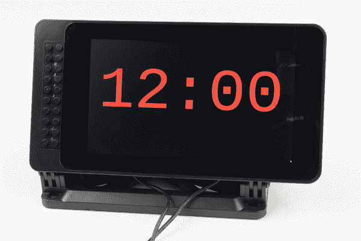](https://cdn.sparkfun.com/assets/learn_tutorials/8/1/2/Raspberry_Pi_tutorial-01.jpg)

虽然使用 Raspberry Pi 作为时钟可能看起来有些多余，但是请随意用您自己的程序或脚本来代替。您也可以使用示例代码作为您自己的仪表板的基础(例如，当您醒来时显示本地天气预报、您的个人服务器正常运行时间、离您最喜欢的节目还有多少天等等。)或者电子项目。

**Notice:** This tutorial was written with Raspbian version "June 2018" and Python version 3.5.3\. Other versions may affect how some of the steps in this guide are performed.

在将你的程序添加到任何启动脚本之前，**非常重要的一点是**,你首先要对它进行独立测试！只用`python`命令运行它，以确保你的程序没有问题。当代码作为引导过程的一部分运行时，跟踪代码中的错误要困难得多。

本教程中介绍的三种方法是:

*   rc.local -这可能是让你的程序在启动时运行的最简单的方法。缺点是用 rc.local 启动的任务发生在 X windows 系统启动之前，这意味着您将无法访问图形用户界面(GUI)元素。
*   [自动启动](https://learn.sparkfun.com/tutorials/how-to-run-a-raspberry-pi-program-on-startup#method-2-autostart) -用于在[LXDE](https://wiki.lxde.org/en/Main_Page)(Raspbian 使用的图形桌面环境)启动后自动运行你的程序。它比 rc.local 稍微复杂一些，但是它允许您运行需要图形元素的程序。
*   systemd -在 Linux 中自动启动程序的新的和流行的方法。它肯定是三个中最复杂的，但它允许您在 LXDE 启动之前运行，等待直到您可以访问其他进程(例如网络、图形桌面)，或者只是一次又一次地重新启动您的程序，直到它工作为止。因此，这是一种创建和管理在后台运行的服务的可靠方法。

### 所需材料

在本教程中，您至少需要一个 Raspberry Pi、SD 卡和电源。如果您计划制作一个仪表板(或时钟，如下一节中的示例代码所示)，您将需要一个显示器和键盘来显示您的 Pi。如果您想要完整的桌面设置，我们建议您:

## 示例代码

在本教程的剩余部分，我们将通过两个例子展示在引导时启动 Python 程序: *blink.py* 和 *clock.py* 。注意，任何程序(编译的、脚本等。)可以使用，但是选择正确的方法来启动脚本是很重要的。例如，使用 rc.local 虽然很容易，但不能让您访问 X 服务器(给你一个 GUI 桌面的东西)。因此，rc.local 对于 GUI 程序来说不是正确的工具，您应该尝试另一种方法。

Linux 引导序列是一个相当复杂的事件序列，可以很容易地在另一篇文章中讨论。如果您想了解更多信息，请查看以下链接:

*   [Linux 引导过程的 6 个阶段](https://www.thegeekstuff.com/2011/02/linux-boot-process)
*   [Linux 引导和启动过程介绍](https://opensource.com/article/17/2/linux-boot-and-startup)
*   [了解 Linux 启动过程(YouTube 视频)](https://www.youtube.com/watch?v=mHB0Z-HUauo)

### blink.py

虽然硬件的外部连接对于显示如何在引导时运行程序不是必需的，但是它可以是一种有用的方式来显示某些东西正在后台运行，即使您在屏幕上看不到任何东西。在 GPIO12 和 Raspberry Pi 上的 GND 之间连接一个 LED 和一个 330ω电阻。

[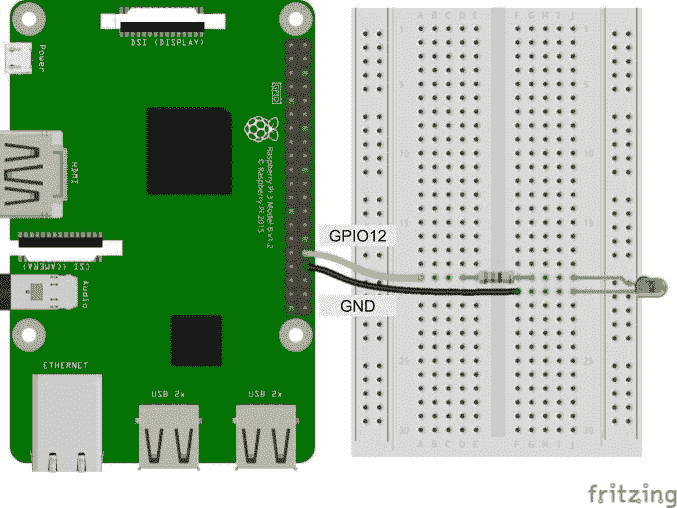](https://cdn.sparkfun.com/assets/learn_tutorials/8/1/2/Pi_LED_Fritzing.jpg)

在您的 Raspberry Pi 上，打开一个终端，并确保您在您的主目录中:

```
language:shell
cd /home/pi 
```

打开名为 *blink.py* 的新文档

```
language:shell
nano blink.py 
```

复制以下代码:

```
language:python
import time
import RPi.GPIO as GPIO

# Pin definitions
led_pin = 12

# Use "GPIO" pin numbering
GPIO.setmode(GPIO.BCM)

# Set LED pin as output
GPIO.setup(led_pin, GPIO.OUT)

# Blink forever
try:
    while True:
        GPIO.output(led_pin, GPIO.HIGH) # Turn LED on
        time.sleep(1)                   # Delay for 1 second
        GPIO.output(led_pin, GPIO.LOW)  # Turn LED off
        time.sleep(1)                   # Delay for 1 second

# When you press ctrl+c, nicely release GPIO resources
finally:
    GPIO.cleanup() 
```

用 *ctrl* + *x* 保存，要求保存时按 *y* ，按*回车*。使用以下命令运行程序:

```
language:shell
python blink.py 
```

您应该会看到 LED 开始闪烁。按下 *ctrl* + *c* 停止程序。

[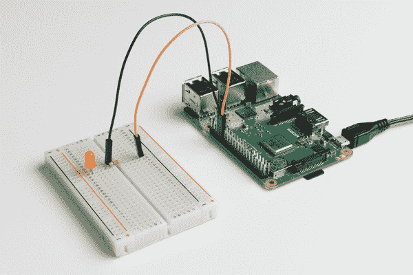](https://cdn.sparkfun.com/assets/learn_tutorials/8/1/2/Raspberry_Pi_tutorial-02.jpg)

### clock.py

我们将使用的下一个例子稍微复杂一些，因为它依赖于用 Tkinter 包制作的 GUI。当我们想要演示如何在启动时启动一个需要 X windows 系统的程序时，我们将使用这个程序(例如，您想要制作一个在启动时显示的图形仪表板)。

在您的 Raspberry Pi 上(在您的主目录中，`/home/pi`)，打开一个名为 *clock.py* 的新文档:

```
language:shell
nano clock.py 
```

复制以下代码:

```
language:python
import tkinter as tk
import tkinter.font as tkFont
import time

###############################################################################
# Parameters and global variables

# Default font size
font_size = -24

# Declare global variables
root = None
dfont = None
frame = None
dtime = None

# Global variable to remember if we are fullscreen or windowed
fullscreen = False

###############################################################################
# Functions

# Toggle fullscreen
def toggle_fullscreen(event=None):

    global root
    global fullscreen

    # Toggle between fullscreen and windowed modes
    fullscreen = not fullscreen
    root.attributes('-fullscreen', fullscreen)
    resize()

# Return to windowed mode
def end_fullscreen(event=None):

    global root
    global fullscreen

    # Turn off fullscreen mode
    fullscreen = False
    root.attributes('-fullscreen', False)
    resize()

# Automatically resize font size based on window size
def resize(event=None):

    global time_dfont
    global button_dfont
    global frame

    # Resize font based on frame height (minimum size of 12)
    # Use negative number for "pixels" instead of "points"
    new_size = -max(12, int((frame.winfo_height() / 2)))
    time_dfont.configure(size=new_size)
    new_size = -max(12, int((frame.winfo_height() / 30)))
    button_dfont.configure(size=new_size)

# Read values from the sensors at regular intervals
def update():

    global root
    global dtime

    # Get local time
    local_time = time.localtime()

    # Convert time to 12 hour clock
    hours = local_time.tm_hour
    if hours > 12:
        hours -= 12

    # Add leading 0s
    shours = str(hours)
    smin = str(local_time.tm_min)
    if hours < 10:
        shours = '0' + shours
    if local_time.tm_min < 10:
        smin = '0' + smin

    # Construct string out of time
    dtime.set(shours + ':' + smin)

    # Schedule the poll() function for another 500 ms from now
    root.after(500, update)

###############################################################################
# Main script

# Create the main window
root = tk.Tk()
root.title("My Clock")

# Create the main container
frame = tk.Frame(root, bg='black')

# Lay out the main container (expand to fit window)
frame.pack(fill=tk.BOTH, expand=1)

# Variables for holding temperature and light data
dtime = tk.StringVar()

# Create dynamic font for text
time_dfont = tkFont.Font(family='Courier New', size=font_size)
button_dfont = tkFont.Font(size=font_size)

# Create widgets
label_time = tk.Label(  frame, 
                        textvariable=dtime, 
                        font=time_dfont, 
                        fg='red', 
                        bg='black')
button_quit = tk.Button(frame, 
                        text="Quit", 
                        font=button_dfont, 
                        command=root.destroy,
                        borderwidth=0,
                        highlightthickness=0, 
                        fg='gray10',
                        bg='black')

# Lay out widgets in a grid in the frame
label_time.grid(row=0, column=0, padx=20, pady=20)
button_quit.grid(row=1, column=0, padx=5, pady=5, sticky=tk.E)

# Make it so that the grid cells expand out to fill window
frame.rowconfigure(0, weight=10)
frame.rowconfigure(1, weight=1)
frame.columnconfigure(0, weight=1)

# Bind F11 to toggle fullscreen and ESC to end fullscreen
root.bind('<F11>', toggle_fullscreen)
root.bind('<Escape>', end_fullscreen)

# Have the resize() function be called every time the window is resized
root.bind('<Configure>', resize)

# Schedule the poll() function to be called periodically
root.after(20, update)

# Start in fullscreen mode and run
toggle_fullscreen()
root.mainloop() 
```

用 *ctrl* + *x* 保存，要求保存时按 *y* ，按*回车*。使用以下命令运行程序:

```
language:shell
python clock.py 
```

你的整个屏幕应该被一个相当大的时钟占据！

[](https://cdn.sparkfun.com/assets/learn_tutorials/8/1/2/Raspberry_Pi_tutorial-01.jpg)

如果你有兴趣了解这个程序是如何制作的(例如，用 Tkinter 创建你自己的图形用户界面)，请查看我们的 [Python GUI 指南:Tkinter 简介](https://learn.sparkfun.com/tutorials/python-gui-guide-introduction-to-tkinter)。

## 方法 1: rc.local

从 rc.local 运行程序可能是最简单的方法，但是因为 rc.local 是在 X 启动之前执行的，所以您不能访问 GUI 元素。因此，建议您只使用 rc.local 来启动没有图形元素的程序。

当您的 Linux 操作系统(OS)在您的 Raspberry Pi 上启动时，它会经历一系列的[运行级别](https://en.wikipedia.org/wiki/Runlevel)，这些级别定义了系统在启动时的状态。每当运行级别改变时，各种*运行控制* (rc)脚本就会运行，它们处理各种系统服务的启动和停止。如果你想了解更多关于 rc 脚本的知识，请看[这篇文章](https://www.linux.com/news/introduction-services-runlevels-and-rcd-scripts)，但是出于我们的目的，我们只需要担心 *rc.local* 。

rc.local 脚本在所有正常的系统服务都已启动(包括联网，如果启用的话)之后执行，就在系统切换到多用户运行级别之前(传统上您会得到一个登录提示)。虽然大多数 Linux 发行版不需要 rc.local，但这通常是用 Raspbian 引导程序运行的最简单方法。

### 修改 rc.local

修改 rc.local 需要根级别的访问权限，所以使用 sudo:

```
language:shell
sudo nano /etc/rc.local 
```

向下滚动，在`exit 0`行之前，输入以下内容:

```
language:shell
python /home/pi/blink.py & 
```

**Note:** the ampersand (&) at the end of the line is needed so that your Python script runs in a different process and does not block execution of the boot process. Without it, the rc.local script would wait for your script to end before continuing, and if you have an infinite loop (like in our *blink.py* program), you would never get a login prompt.[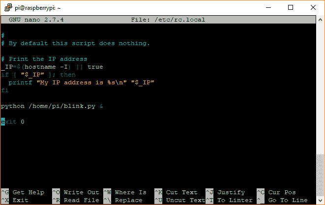](https://cdn.sparkfun.com/assets/learn_tutorials/8/1/2/screen_03.png)

请注意，我们使用绝对文件位置(`/home/pi/blink.py`)调用我们的脚本，因为从 rc.local 内部调用`python blink.py`将导致 python 查找本地文件(即位于与 rc.local 相同目录中的 blink.py 文件)。我们使用绝对文件位置使它对 Python 来说是显式的，在那里可以找到我们的程序。

用 *ctrl* + *x* 保存并退出，提示保存时再按 *y* ，然后*进入*。

用`sudo reboot`重启你的 Pi 来测试它。

### 解决纷争

#### 什么都没发生

如果您的脚本没有运行，请确保使用绝对目录名(例如`python /home/pi/blink.py &`)调用您的脚本。

如果您不能访问桌面，因为您的脚本阻止 Linux 完成它的引导序列，那么您可能必须通过串口获得一个终端。按照这些指令将串行终端接入 Pi。

如果您不能在 Raspberry Pi 中获得串行终端，那么您可能需要将 SD 卡插入另一台计算机(Linux 或 macOS)，导航到 etc/rc.local，并删除调用您的 Python 脚本的行。

#### 排除故障

您可能会注意到，您在脚本中看不到任何错误或输出，因为 rc.local 不记录或输出任何信息。为此，将 rc.local 文件中的 python 调用更改为:

```
sudo bash -c 'python /home/pi/blink.py > /home/pi/blink.log 2>&1' & 
```

这会创建一个具有`sudo`(超级用户权限)的新 shell，运行您的脚本，并将输出( *stdout* )重定向到 *blink.log* 文件。`2>&1`表示错误( *stderr* )也应该被重定向到同一个日志文件。重启后，Python 脚本的任何输出(如`print()`语句)以及错误都应保存到 *blink.log* 。要查看日志，请在终端中输入以下内容(注意，您可能需要先停止程序才能查看日志文件的内容):

```
language:shell
cat blink.log 
```

#### 使用特定版本的 Python

事实证明，rc.local 以前运行过。bashrc，所以命令`python`在我们的启动脚本中还是指 Python 2！要显式调用 Python 3，我们应该将 rc.local 命令改为:

```
language:shell
sudo bash -c '/usr/bin/python3 /home/pi/blink.py > /home/pi/blink.log 2>&1' & 
```

#### 如何停止你的程序

您可能会注意到您的程序运行得很好，但是没有简单的方法来停止它！最简单的方法是删除(或注释掉)您在 rc.local 中添加的代码行，然后重新启动，但是这需要很长时间。

停止你的程序的最快方法是终止它的 Linux 进程。在终端中，输入以下命令:

```
language:shell
sudo ps -ax | grep python 
```

告诉 Linux 列出当前所有的进程。我们通过管道将列表发送给`grep`，这允许我们搜索关键字。我们在这个例子中寻找的是 *python* ，但是你可以随意把它改成你的程序名或者任何你用来运行你的程序的名字。找到所列进程左侧的进程 ID (PID)号，并使用`kill`命令终止该进程:

```
language:shell
sudo kill <PID> 
```

**Heads up!** Make sure you type the PID correctly! If you kill the wrong process, you could halt Linux, and you would need to reboot again.[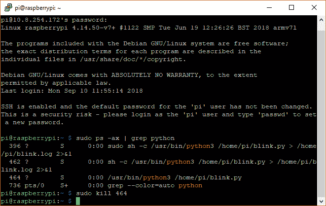](https://cdn.sparkfun.com/assets/learn_tutorials/8/1/2/screen_04.png)

如果您使用的是 *blink.py* 示例，您应该会看到 LED 停止闪烁。

#### 如何阻止你的程序在启动时运行

如果您不再希望您的程序在启动时运行，只需打开 rc.local:

```
language:shell
sudo nano /etc/rc.local 
```

删除您添加的运行程序的行，保存并使用 *ctrl* + *x* 和 *y* 退出。重新启动你的计算机，你的程序在启动后应该不再运行。

### 另一种选择

每当系统启动时(在用户可以登录或与系统交互之前)，rc.local 是启动程序的好地方。如果您希望您的程序在用户登录或打开一个新终端时启动，可以考虑在`/home/pi/.bashrc`中添加一行类似的代码。

## 方法 2:自动启动

如果您需要访问 X Window 系统中的元素(例如，您正在制作一个图形化的仪表板或游戏)，那么您需要等待 X 服务器完成初始化，然后再运行您的代码。实现这一点的一个方法是使用`autostart`系统。

**Note:** Raspbian is based on the LXDE desktop environment. As a result, the location of the autostart script might be different depending on your particular Linux computer and distribution version.

在您的桌面环境启动后(在本例中是 LXDE-pi)，它运行它在配置文件的 *autostart* 脚本中找到的任何命令，该脚本位于 */home/pi/。我们的树莓 pi 的 config/LX session/LXDE-Pi/auto start*。注意，如果您为您的 Raspberry Pi 创建了一个新用户，那么目录 *pi* 可能会有所不同。如果没有找到用户*自动启动*脚本，Linux 将改为运行全局*/etc/xdg/LX session/LXDE-pi/自动启动*脚本。

除了运行 *autostart* 中的命令，Linux 还会寻找并执行*。桌面*脚本位于 */home/pi/。配置/自动启动*。在启动时执行 GUI 程序的最简单的方法是创建一个这样的程序。桌面脚本。

### 创建一个. desktop 文件

您不需要根级别的访问权限来修改您的配置文件(用户的)自动启动和。桌面文件。事实上，建议您使用**而不是**使用`sudo`，因为您可能会影响文件的权限(例如，文件将归 root 所有)并使它们无法被 autostart(具有用户级权限)执行。

打开一个终端，执行以下命令来创建一个 *autostart* 目录(如果还不存在的话),并为我们的时钟示例编辑一个. desktop 文件:

```
language:shell
mkdir /home/pi/.config/autostart
nano /home/pi/.config/autostart/clock.desktop 
```

将以下文本复制到 *clock.desktop* 文件中。根据您的具体应用，随意更改*名称*和*执行*变量。

```
[Desktop Entry]
Type=Application
Name=Clock
Exec=/usr/bin/python3 /home/pi/clock.py 
```

**Note:** We are calling *python3* explicitly here to prevent any confusion about which Python version to use.[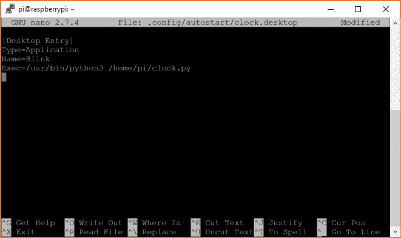](https://cdn.sparkfun.com/assets/learn_tutorials/8/1/2/screen_06.png)

用 *ctrl* + *x* 保存并退出，提示保存时再按 *y* ，然后*进入*。重新启动:

```
language:shell
sudo reboot 
```

当您的 Raspberry Pi 启动时，请确保登录到桌面(如果它不会自动登录)。您的脚本应该立即开始运行！

### 解决纷争

#### 什么都没发生

如果您的脚本没有在您看到桌面时立即运行，可能有几个问题。首先，确保您已经登录(只有登录后，自动启动才会启动)。您也可以尝试在`raspi-config`中启用自动登录。其次，确保使用绝对目录名(例如`/home/pi/clock.py`)。第三，尝试按照下面的一些建议来启用 *stdout* 和 *stderr* 来看看发生了什么。

#### 使用特定版本的 Python

事实证明，*自动启动*运行在前。bashrc，所以命令`python`还是指 Python 2。为了显式调用 Python 3，我们应该将 *autostart* 中的命令改为:

```
@/usr/bin/python3 /home/pi/clock.py 
```

#### 排除故障

不幸的是，从 autostart 运行程序很难输出或记录到文件中，LX terminal(Raspbian 中的默认终端程序)过于简单，无法在这里帮助我们。为了获得某种日志记录，我们需要使用不同的终端程序(我们将使用 xterm)。打开终端，输入以下命令

```
language:shell
sudo apt-get install xterm -y 
```

在你的。桌面文件，将您的`Exec`命令改为如下:

```
Exec=xterm -hold -e '/usr/bin/python3 /home/pi/clock.py' 
```

重启你的树莓派。现在，在您登录到您的桌面后，您应该看到一个新的终端窗口打开，然后您的程序运行。如果您停止您的程序(退出程序，在 xterm 窗口中按下 *ctrl* + *c* ，或者终止下面详述的进程)，xterm 窗口将保持打开，允许您从程序中读取所有的输出和错误语句。

#### 如何停止你的程序

如果你的程序在后台运行，可能没有明显的方法停止它。您可以随时删除您的。桌面文件并重新启动，但这可能需要一段时间。一个更好的选择可能是终止与你的程序相关的进程。在终端中，输入以下内容:

```
language:shell
sudo ps -ax | grep python 
```

告诉 Linux 列出当前所有的进程。我们将输出发送给`grep`，它允许我们搜索关键字。在这里，我们要找的是 *python* ，不过可以随意把它改成你的程序名。找到所列进程左侧的进程 ID (PID)号，并使用`kill`命令终止该进程:

```
language:shell
sudo kill <PID> 
```

**Heads up!** Make sure you type the PID correctly! If you kill the wrong process, you could halt Linux, and you would need to reboot again.[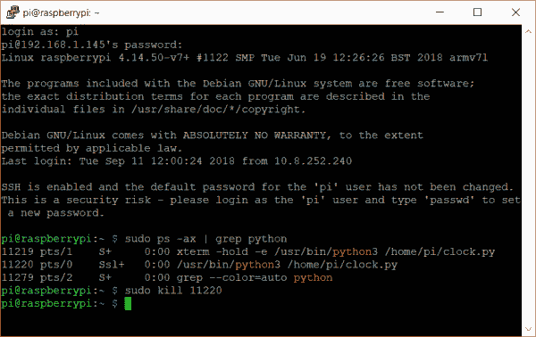](https://cdn.sparkfun.com/assets/learn_tutorials/8/1/2/screen_07.png)

如果您使用的是 *clock.py* 示例，您应该会看到应用程序退出。

#### 如何阻止你的程序在启动时运行

为了防止您的程序在启动时运行，您只需要删除。桌面文件。在终端中，输入命令(用您的特定名称替换 *clock.desktop* )。桌面文件):

```
language:shell
rm /home/pi/.config/autostart/clock.desktop 
```

重新启动您的 Pi，您的程序应该不再在启动时运行。

## 方法 3:系统 d

systemd 是在启动时启动应用程序的首选方法，但也是使用起来最复杂的方法之一。使用 systemd，您可以告诉 Linux 只在某些服务启动后才启动某些程序。因此，它是初始化脚本和应用程序的一个非常健壮的工具。

systemd 是 Linux 世界中相对较新的一套工具，它的预期目的之一是在引导后管理系统进程。当 systemd 第一次发布的时候，它是用来代替启动程序的工具。截至 2015 年，大多数主要发行版都包含 systemd，由于许多发行版都保留了 init.d 以提供遗留支持，因此您可以选择使用其中任何一个。但是要注意，init.d 可能会被弃用，所以 systemd 似乎是未来的发展方向(就目前而言)。

systemd 可能相当复杂，本教程只涵盖了让您在引导时开始运行程序的绝对基础知识。如果您想更深入地了解 systemd，我们建议您阅读[这本入门指南](https://www.digitalocean.com/community/tutorials/understanding-systemd-units-and-unit-files)。

### 创建一个单元文件

单元文件是一个纯文本文件，它向 systemd 提供关于服务、设备、挂载点等的信息。我们将创建一个单元文件，以服务的形式启动我们的程序(一个在后台运行的进程)。下面是两个单元文件的例子:第一个在图形桌面加载之前运行 *blink.py* 例子(对无头环境有用)，第二个在图形桌面加载之后运行 *clock.py* 例子(如果你正在制作一个仪表板或 GUI，这很有用)。

#### 单元文件(无图形用户界面)

如果你的程序不需要 GUI(比如我们的 *blink.py* 例子)，那么你可以使用下面的模板来创建一个 systemd 服务。如果您确实需要 GUI(例如，您需要 X Windows 系统已经启动)，请参见下一节。创建一个不需要 GUI 的单元文件意味着你也可以在一个[无头环境](https://learn.sparkfun.com/tutorials/headless-raspberry-pi-setup)中引导运行你的程序。

创建新的*。systemd 目录中的服务*文件:

```
language:shell
sudo nano /lib/systemd/system/blink.service 
```

在文档中输入以下文本:

```
[Unit]
Description=Blink my LED
After=multi-user.target

[Service]
ExecStart=/usr/bin/python3 /home/pi/blink.py

[Install]
WantedBy=multi-user.target 
```

根据需要随意更改`Description`。`After`键表示我们的程序应该何时运行。 *multi-user.target* 是在 X Windows 系统启动之前将控制权交给用户(一个“多用户外壳”)的系统状态。这意味着我们的程序将运行，即使没有登录！你可以改变这一点，这取决于在运行你的程序之前你需要激活哪些服务(例如，`network.target`如果你需要联网)。查看[此处](https://www.freedesktop.org/software/systemd/man/systemd.special.html)的所有目标列表。

是用来启动我们程序的命令(或命令集)。注意，我们使用了我们想要的 Python 版本的绝对路径以及程序的位置。

`[Install]`部分中的`WantedBy`指定了我们希望我们的服务包含的目标。在这个例子中，我们希望我们的服务在*多用户目标*单元运行时运行(或者，更具体地说，根据`After`参数，在它之后运行)。

[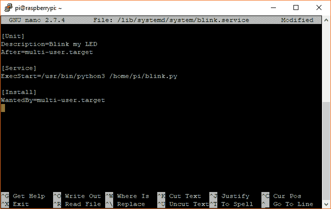](https://cdn.sparkfun.com/assets/learn_tutorials/8/1/2/screen_08.png)

用 *ctrl* + *x* 保存并退出，提示保存时再按 *y* ，然后*进入*。

我们需要告诉 systemd 识别我们的服务，所以输入:

```
language:shell
sudo systemctl daemon-reload 
```

请注意，每次更改您的。服务文件，因为 systemd 需要知道它已经被更新。

然后我们需要告诉 systemd 我们希望我们的服务在引导时启动，所以输入:

```
language:shell
sudo systemctl enable blink.service 
```

用`sudo reboot`重启来验证你的程序是否工作。Pi 启动后，LED 应开始闪烁！

#### 单元文件(GUI)

如果您的程序需要图形组件(如我们的 *clock.py* 示例)，那么推荐使用下面的模板来创建 systemd 服务。

创建新的*。systemd 目录中的服务*文件:

```
language:shell
sudo nano /lib/systemd/system/clock.service 
```

在文档中输入以下文本:

```
[Unit]
Description=Start Clock

[Service]
Environment=DISPLAY=:0
Environment=XAUTHORITY=/home/pi/.Xauthority
ExecStart=/usr/bin/python3 /home/pi/clock.py
Restart=always
RestartSec=10s
KillMode=process
TimeoutSec=infinity

[Install]
WantedBy=graphical.target 
```

`Description`可以是任何你想帮助你记住这项服务是做什么的文字。

在`[Service]`下，我们指定一些环境变量。我们想要连接到我们的主显示器(假设只有一个显示器连接到我们的 Pi)，所以我们将`DISPLAY`设置为`:0`，并告诉我们的应用程序在哪里可以找到使用带有`XAUTHORITY`的 X windows 系统所需的凭证。`ExecStart`是我们想要运行的命令(在本例中，启动我们的 Python 时钟程序)。

不幸的是，对于 systemd，我们不能准确地告诉 X 系统何时启动，也不能保证用户会登录(除非您已经使用`sudo raspi-config`启用了自动登录)。考虑到这一点，如果程序失败或退出，我们将强制程序每 10 秒钟重启一次(用`Restart`)(用`RestartSec`)。`KillMode`告诉 systemd 如果服务失败(或退出)就终止任何与我们程序相关的进程，`TimeoutSec=infinity`意味着我们永远不想停止执行我们的程序。

[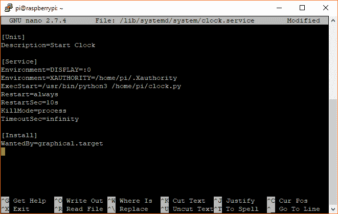](https://cdn.sparkfun.com/assets/learn_tutorials/8/1/2/screen_09.png)

用 *ctrl* + *x* 保存并退出，提示保存时再按 *y* ，然后*进入*。

我们需要告诉 systemd 识别我们的服务，所以输入:

```
language:shell
sudo systemctl daemon-reload 
```

请注意，每次更改您的。服务文件，因为 systemd 需要知道它已经被更新。

然后我们需要告诉 systemd 我们希望我们的服务在引导时启动，所以输入:

```
language:shell
sudo systemctl enable clock.service 
```

用`sudo reboot`重启来验证你的程序是否工作。登录到图形桌面后，您应该会看到 Python 时钟程序正在运行。

### 解决纷争

#### 什么都没发生

如果你的程序在启动时不能运行，可能有几个原因。要深入了解 systemd 服务，请尝试将输出记录到文件中或检查服务的状态(请参见下面的故障排除技术)。

#### 排除故障

systemd 的输出(如`print()`语句或错误消息)由 *journalctl* 系统捕获，并可通过以下命令查看:

```
language:shell
journalctl -u clock.log 
```

这可以让你对你服务或项目有更深入的了解。

#### 记录到文件

如果 journalctl 不符合您的期望，您可以尝试将输出记录到文件中。为此，将`ExecStart`调用更改如下(以 clock.py 为例):

```
ExecStart=/bin/bash -c '/usr/bin/python3 /home/pi/clock.py > /home/pi/clock.log 2>&1' 
```

这将启动一个新的 bash shell，运行您的程序，并将输出( *stdout* )重定向到一个新的 *clock.log* 文本文件。`2>&1`命令表示任何错误( *stderr* )也应该被重定向(写入)到同一个日志文件中。任何输出(例如来自 Python `print()`命令)或错误将被保存到 *clock.log* 。您可以使用以下命令查看日志(注意，在查看日志之前，您可能需要停止服务和程序):

```
language:shell
cat clock.log 
```

#### 使用特定版本的 Python

因为您的 systemd 单元文件很可能会在*之前运行。bashrc* 可以将命令`python`别名为 Python 3，您可能需要显式调用`python3`命令。为此，只需确保对 Python 的调用是一个绝对文件位置，例如，`/usr/bin/python3`。

#### 检查服务

如果您怀疑您的服务没有运行，那么您可能想要检查它的状态。为此，请输入以下命令:

```
language:shell
systemctl status clock.service 
```

这将显示您的服务是否正在运行，或者是否有任何错误。

[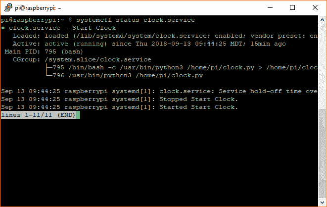](https://cdn.sparkfun.com/assets/learn_tutorials/8/1/2/screen_10.png)

#### 启动和停止服务

对于某些服务，比如我们的 *clock.service* 示例，您需要在停止程序之前停止服务。这是因为即使你停止了程序(例如我们的 Python GUI 时钟)，服务也会在 10 秒钟后重启它！要停止服务，请输入以下命令:

```
language:shell
sudo systemctl stop clock.service 
```

请注意，停止服务应该向您的程序发送一个停止命令( *SIGTERM* - terminate signal)。在大多数情况下，这应该会停止服务和您的程序。如果您的程序没有停止，请参见下面的停止程序。

要启动一个服务(比如我们的 *clock.service* 示例)，您可以输入命令:

```
language:shell
sudo systemctl start clock.service 
```

如果您已经对服务进行了更改，而不必重新启动系统，这将有助于重新启动服务。如果您对. service 文件做了任何更改，请记住运行`sudo systemctl daemon-reload`!

#### 如何停止你的程序

即使您停止了该服务，您的程序可能仍在后台运行。就像在 *rc.local* 和 *autostart* 的例子中一样，我们需要找到进程 ID 号并手动终止它。在终端中输入以下内容:

```
language:shell
sudo ps -ax | grep python 
```

告诉 Linux 列出当前所有的进程。我们将输出发送到`grep`，它允许我们搜索关键字“python”(可以随意将其更改为您程序的名称)。找到所列进程左侧的进程 ID (PID)号，并使用`kill`命令终止该进程:

```
language:shell
sudo kill <PID> 
```

**Heads up!** Make sure you type the PID correctly! If you kill the wrong process, you could halt Linux, and you would need to reboot again.[](https://cdn.sparkfun.com/assets/learn_tutorials/8/1/2/screen_07.png)

如果您使用的是 *clock.py* 示例，您应该会看到应用程序退出。

#### 如何阻止你的程序在启动时运行

您可以使用以下命令停止您的服务在启动时运行(用您的特定服务文件名替换 *clock.service* ):

```
language:shell
sudo systemctl disable clock.service 
```

请注意，您不需要删除。服务文件，因为禁用它将阻止它在启动时运行。但是，如果您想要删除该文件，您可以使用以下命令(再次用您的服务文件名替换 *clock.service* ):

```
language:shell
sudo rm /lib/systemd/system/clock.service
sudo systemctl daemon-reload 
```

之后，重新启动你的系统，以确保你的程序不再启动运行。

## 资源和更进一步

和大多数 Linux 一样，完成一项任务通常有多种方法。本教程向您展示了在引导时启动程序(或脚本)的三种不同方法。所有这三种方法都应该是 Raspbian 的默认设置，这意味着每种方法都应该适用于完整的 Raspbian 安装。如果您使用另一个操作系统(或 Raspbian Lite ),您可能会发现只有部分方法可用，所以请选择适合您的方法！

如果您想深入了解每种方法，请参阅以下文档:

*   rc.local 是一个更大的 rc 工具套件的一部分，您可以使用它在启动时调度任务
*   [autostart](https://wiki.lxde.org/en/Autostart) 自带 Raspbian 中的 LXDE 桌面环境。其他环境可能有不同的应用程序启动工具。
*   systemd 是一套用于在 Linux 中启动各种任务的工具

还有很多其他的 Linux 工具可以帮助您在启动时启动任务。如果以上三个都不适合你，我们建议你看看:

*   SysVinit 是一种在引导时运行程序的传统方法
*   crontab 用于计划定期运行的任务(例如，每天在特定时间运行一次)

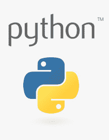

寻找更多灵感？查看其他树莓 Pi 项目:

[](https://learn.sparkfun.com/tutorials/building-large-led-installations) [### 建造大型 LED 装置](https://learn.sparkfun.com/tutorials/building-large-led-installations) Learn what it takes to build large LED installations from planning to power requirements to execution.[Favorited Favorite](# "Add to favorites") 20[](https://learn.sparkfun.com/tutorials/bark-back-interactive-pet-monitor) [### 吠叫互动宠物监视器](https://learn.sparkfun.com/tutorials/bark-back-interactive-pet-monitor) Monitor and interact with pets through this dog bark detector project based on the Raspberry Pi 7[](https://learn.sparkfun.com/tutorials/raspberry-pi-zero-helmet-impact-force-monitor) [### Raspberry Pi 零头盔冲击力监控器](https://learn.sparkfun.com/tutorials/raspberry-pi-zero-helmet-impact-force-monitor) How much impact can the human body handle? This tutorial will teach you how to build your very own impact force monitor using a helmet, Raspberry Pi Zero, and accelerometer 2[](https://learn.sparkfun.com/tutorials/using-flask-to-send-data-to-a-raspberry-pi) [### 使用 Flask 向 Raspberry Pi 发送数据](https://learn.sparkfun.com/tutorials/using-flask-to-send-data-to-a-raspberry-pi) In this tutorial, we'll show you how to use the Flask framework for Python to send data from ESP8266 WiFi nodes to a Raspberry Pi over an internal WiFi network.[Favorited Favorite](# "Add to favorites") 7[](https://learn.sparkfun.com/tutorials/headless-raspberry-pi-setup) [### 无头 Raspberry Pi 设置](https://learn.sparkfun.com/tutorials/headless-raspberry-pi-setup) Configure a Raspberry Pi without a keyboard, mouse, or monitor.[Favorited Favorite](# "Add to favorites") 16[](https://learn.sparkfun.com/tutorials/setting-up-a-raspberry-pi-3-as-an-access-point) [### 将 Raspberry Pi 3 设置为接入点](https://learn.sparkfun.com/tutorials/setting-up-a-raspberry-pi-3-as-an-access-point) This guide will show you how to configure a Raspberry Pi as an access point and connect it to your local Ethernet network to share Internet to other WiFi devices.[Favorited Favorite](# "Add to favorites") 8[](https://learn.sparkfun.com/tutorials/how-to-use-remote-desktop-on-the-raspberry-pi-with-vnc) [### 如何用 VNC 在树莓 Pi 上使用远程桌面](https://learn.sparkfun.com/tutorials/how-to-use-remote-desktop-on-the-raspberry-pi-with-vnc) Use RealVNC to connect to your Raspberry Pi to control the graphical desktop remotely across the network.[Favorited Favorite](# "Add to favorites") 8[](https://learn.sparkfun.com/tutorials/graph-sensor-data-with-python-and-matplotlib) [### 用 Python 和 Matplotlib 绘制传感器数据](https://learn.sparkfun.com/tutorials/graph-sensor-data-with-python-and-matplotlib) Use matplotlib to create a real-time plot of temperature data collected from a TMP102 sensor connected to a Raspberry Pi.[Favorited Favorite](# "Add to favorites") 14