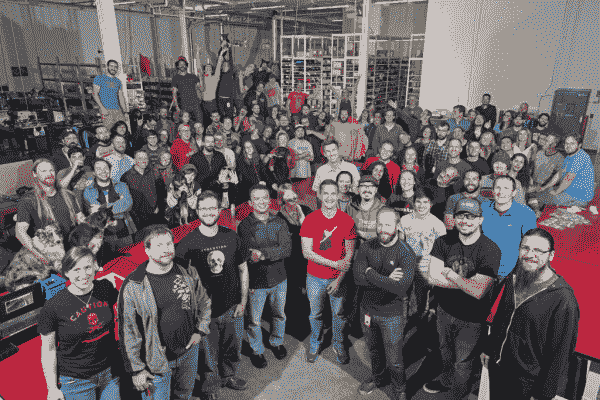
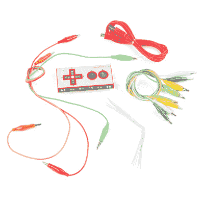
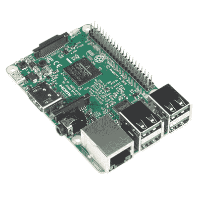
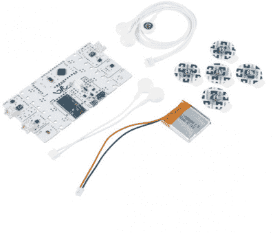
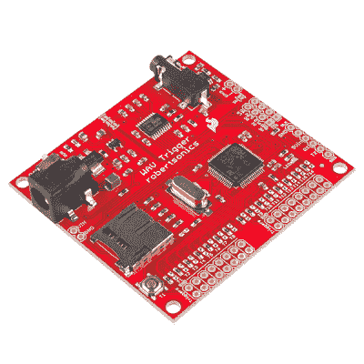
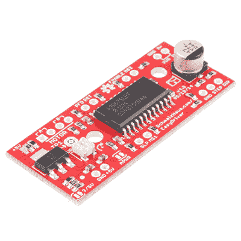
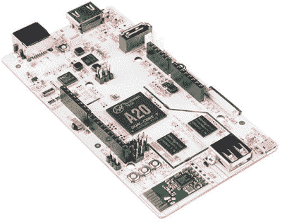
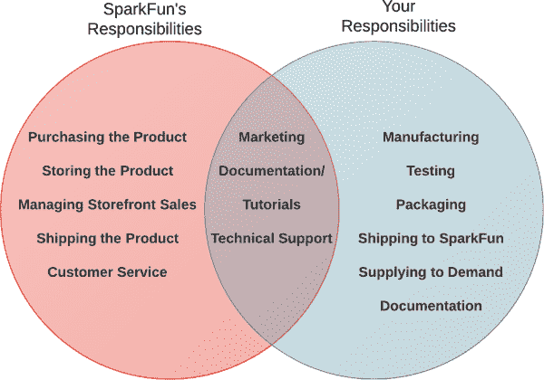
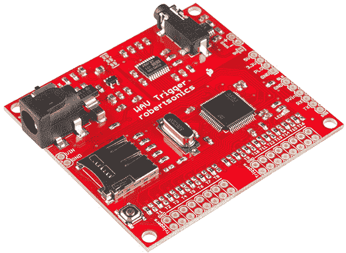
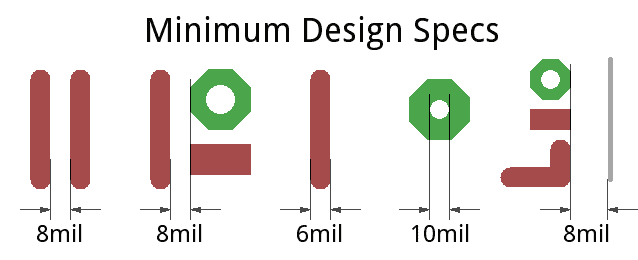

# 如何在 SparkFun 上出售您的小工具

> 原文：<https://learn.sparkfun.com/tutorials/how-to-sell-your-widget-on-sparkfun>

## 选择你的冒险

你有一个很棒的电子产品想要上市吗？太好了！我们一直在倾听来自客户和社区的新想法。我们收到很多关于这个话题的询问，所以请仔细阅读本教程，以免你的产品定位在混乱中丢失。

* * *

我们很幸运，在 SparkFun，拥有一群极具创造力和才华的顾客。他们不仅能发现电子产品供应商目录中的漏洞，还能*创造*一个小发明来填补这个漏洞。但是，超越一个原型或者甚至是一个限量的生产运行，通常最困难的任务是生产、营销和/或向大众销售你的改变世界的产品。这就是我们的问题所在。我们认识到将您的产品列入我们的目录会带来一定的好处，我们希望给您最好的机会。然而，这种伙伴关系需要对双方(也许是更多方)都有意义。

我们努力保持 SparkFun 产品目录的策划。我们将使用一系列产品来帮助您完成项目。很遗憾，我们不能带走所有带给我们的产品。下面，我们概述了我们所寻求的，我们如何可能一起工作，以及采取步骤，以正确提交您的产品进行评估。

SparkFun 旨在销售与 DIY 电子产品相关的零件和电路板。这可能涉及到与教育、原型和产品设计相关的领域。在购买某些产品的原因中，我们寻找有用的、前沿的、广泛有用的、对社区有吸引力的东西。我们希望产品能让用户感到简单，但同时又不限制产品的可能用途。

多年来，SparkFun 已经为众多电子爱好者、艺术家和学生带来了数十种独特的小工具和有用的电子快捷方式——由我们的客户构想和设计。我们已经经历了这个过程足够多，知道如何引导任何产品通过它。本教程的目标是带你走完以前的合作者在 SparkFun 上出售他们的小工具的两个最常见的路线。你选择哪条路线主要取决于谁在制造你的产品。是时候选择你的冒险了。

* * *

### [选项 1:你生产，SparkFun 购买并转售](https://learn.sparkfun.com/tutorials/how-to-sell-your-widget-on-sparkfun/option-1-you-manufacture-sparkfun-resells)

您是否已经为您的设计建立了制造流程？无论你是在地下室的回流焊烤面包机里烹饪电路板，还是与一家已建立的装配厂合作，我们都有兴趣转售它。真正重要的是，你有一个可靠的、经过测试的设计，一个为它建立的制造流程，以及一个渴望购买它的市场。

SparkFun 目录中的数百种产品都经过这一过程，包括:

*   Makey Makey Classic——最初是与[杰伊·西尔弗、埃里克·罗森鲍姆](http://joylabz.com/)和 SparkFun 合作。最新的主板版本现在在我们的目录中与 JoyLabz 一起重新发布。

*   Raspberry Pi 3-spark fun 购买的强大 SBC，存储在我们的仓库中，然后转售。

*   [BITalino -生物医学开发套件](https://www.sparkfun.com/products/12750)-spark fun 通过我们的在线目录购买和分销的另一种产品。

如果你最感兴趣的话，这是去我们店面的最快路线。查看这一半教程，了解更多关于如何**推销你的产品**。

[Option 1: You Manufacture, SparkFun Resells](https://learn.sparkfun.com/tutorials/how-to-sell-your-widget-on-sparkfun/option-1-you-manufacture-sparkfun-resells)

* * *

### [选项 2: SparkFun 制造并向您支付每笔销售的版税](https://learn.sparkfun.com/tutorials/how-to-sell-your-widget-on-sparkfun/option-2-sparkfun-manufactures-you-get-a-royalty)

你有没有设计出原型，并证明它是可行的，但是在生产和销售时遇到了困难？碰巧我们有[贴片机](https://learn.sparkfun.com/tutorials/electronics-assembly/pick-and-place)、[回流焊炉](https://learn.sparkfun.com/tutorials/electronics-assembly/reflow)和[全明星制作团队](https://learn.sparkfun.com/tutorials/electronics-assembly/manual-soldering)来帮助制造。此外，我们的工程师可以帮助完善设计。

这个选择最好的部分是你仍然可以得到报酬。我们不是预先购买产品，而是根据售出的每件产品向您支付一定比例的**版税**。

我们的生产和设计资源确实有限，所以不能保证我们能接受你们的产品。但是，如果它足够独特，并且符合我们的制造能力，我们当然有兴趣与您合作，帮助您的部件产品化。这里有几个例子包括:

*   LilyPad 生态系统——lily pad 系统是由 [Leah Buechley](http://leahbuechley.com/) 在科罗拉多大学博尔德分校攻读计算机科学博士学位时设计的。该套件的商业版本于 2007 年推出，由 Leah 和 SparkFun Electronics 合作设计。

*View the full line of LilyPad boards [here](https://www.sparkfun.com/lilypad_products).*

*   [WAV Trigger](https://www.sparkfun.com/products/13660)-WAV Trigger 是一款独特的高保真复音音频播放器，拥有惊人的功能。董事会是与[杰米·罗伯森](http://robertsonics.com/)的合作。我们制造的另一种产品，并为持续的支持和开发支付每笔销售的版税。

*   [easy driver](https://www.sparkfun.com/products/10267)-easy driver 是一款简单易用的步进电机驱动器。该板是与[布莱恩·施马尔兹](http://www.schmalzhaus.com/)共同设计的。这是我们生产的另一种产品，并为持续的支持和开发支付销售版税。

这些产品都经历了这一过程，现在是我们目录中最畅销、最重要的产品。查看教程的这一部分，了解更多关于如何**推销你的设计**。

[Option 2: SparkFun Manufactures, You Get a Royalty](https://learn.sparkfun.com/tutorials/how-to-sell-your-widget-on-sparkfun#option-2-sparkfun-manufactures-you-get-a-royalty)

* * *

所以，这一切都从弄清楚谁在生产小部件开始。请继续阅读，了解每个选项的更多信息。最后是一个表格，你可以用它来提交你的项目/产品/想法供审查。请在提交之前阅读整个教程，因为其中涉及到非常相关的信息。

* * *

## 选择 1:你生产，SparkFun 转售

对于那些已经有资源支持制造业的人来说，这是一个很好的选择。在这种关系中，SparkFun 承担店面管理、库存存储、运输和客户服务的责任。另一方面，你与制造业打交道，承担所有固有的风险。这允许你对你的产品有更多的控制(修改，定价，文档等)。

这种关系的一个很好的例子就是 [pcDuino](https://www.sparkfun.com/products/12856) 。

pcDuino 是我们在 [LinkSprite](http://www.linksprite.com/) 的朋友设计制造的。他们支持一个社区，发布文档，并处理所有的生产，但对托管店面不感兴趣。所以我们转卖它！额外的好处是，当电阻器、电池、开关和其他组件不可避免地添加到订单中时，最终客户可以节省运费(或者[免费获得](https://www.sparkfun.com/news/1477))。

### 职责分工

以下是这种关系中谁做什么的概述:

#### SparkFun 的责任

为了帮助存储、销售、运输和营销您的产品，我们有一群才华横溢的员工，他们精通各种技能。以下是我们在这一关系中唯一拥有的角色:

*   **购买您的产品** -首先，我们的采购人员可以与您一起制定价格、付款方式和入境运输要求。我们需要一个合适的经销商利润，为我们的经销商和教育定价提供空间。我们将在电子邮件中解决这些细节。
*   储存你的产品 -一旦我们把产品带进来，我们就有一个仓库来储存它，直到它卖出去。
    T3[T5](https://cdn.sparkfun.com/assets/learn_tutorials/2/5/2/inventory.jpg)
*   **管理店面** -我们将发布一个产品页面，上面有所有相关的描述和文档-产品链接。
*   **运送您的产品** -一旦订单到来，我们将从库存货架上抓取并运走。
*   **客服** -如果订单前后有任何问题，我们的[客服团队](https://www.sparkfun.com/static/customer_service)可以帮助解决。
*   **(第一级)技术支持** -我们的[破解技术支持团队](https://www.sparkfun.com/static/technical_assistance)可以回答最初的技术问题(通过电子邮件、聊天或电话)，但我们可能需要将棘手的问题提交给您。

#### 你的责任

*   **制造** -在这种关系中，你将管理所有的零件采购、制造和装配职责。这包括**测试**产品的完整功能。
*   **保持供应满足需求**——一些最伟大的产品因为无法保持库存而沉没。我们希望尽可能多地保留您的产品库存，因此我们将提前与您合作，了解您产品的交付周期。
*   **文档** -产品受到数据表、用户手册和教程的良好支持，确实吸引了我们。这是我们愿意分担的负担(见下文)，但对我们来说最有吸引力的产品是那些有适当文档支持的产品。
*   **替换** -没有完美的测试程序。即使是久经考验的产品也可能有隐藏的缺陷，我们的客户会发现的。如果发现有缺陷的产品，我们将依靠你来帮助替换它。(但第一道防线是技术支持。见下文。)
*   **逗留** -无论您的产品是否需要未来的固件更新或客户支持，我们都需要能够与您保持长期联系。

#### 分担责任

这仍然是一个团队的努力。你已经有了一个你喜欢的产品，并希望看到它出现在尽可能多的用户手中。我们想帮助宣传和销售一些产品！在我们的探索中，我们可能会分担一些责任:

*   我们都想看到你的产品卖出去。我们将参与宣传，但我们也需要你的帮助。
*   **文档/教程** -一般来说，我们会通过教程、数据表和用户指南寻找已经得到良好支持的产品。不过，我们总是对玩新玩具和记录我们的经历感到兴奋——所以我们可以在这里或那里用教程帮忙。
*   **技术支持** -我们可以处理一级电话和电子邮件。对于真正的脑筋急转弯，我们会把客户的问题提交给你，无所不知的产品创造者。

### 众筹？众筹？

#### Kickstarter 和 Indiegogo

我们目录中的许多产品都诞生于众筹网站，如 [Kickstarter](https://www.kickstarter.com/) 或 [Indiegogo](https://www.indiegogo.com/) 。如果你的产品走上这条道路，我们很高兴与你合作，但有几个警告。

如果你的目标是通过众筹产品接近我们，最好是在获得资金后*进行，或者至少是在它即将获得资金的时候。但是，最重要的是，我们需要提前知道**你的产品离发货还有多远**。显然，这是很多众筹项目的症结所在。*

如果你的产品未能实现众筹目标，我们或许可以一起努力，让它成为现实。查看下一页，了解我们如何合作制作您的小工具。

#### GroupGets + SparkFun = GetSparked！

你计划在 SparkFun 的产品目录中销售现有产品，但它需要较高的最低订购量？尝试与团体合作通过与他人合作并向一群购买者销售，可以获得数量上更便宜的东西。

GroupGets 是一种众筹平台，供硬件开发者在市场上测试他们的原型。开发者在 GroupGets 网站上发起一场“运动”，而不是像 Kickstarter 那样接受资金捐赠，该产品的支持者下订单。当下了一定数量的订单后，GroupGets 会帮助开发人员运行一小批他们的产品。对于硬件领域的创业者来说，它们是创业过程中至关重要的一步，因为它们促进了创业者、客户和小批量生产之间的联系。

如果你的产品在 GroupGets 上的销售和用户反馈表现良好，他们会将你与 SparkFun 联系起来，指导你如何进入我们的在线目录。更多信息，请点击下面的按钮。

[Learn More About GetSparked!](https://www.sparkfun.com/getsparked)

* * *

## 选项 2: SparkFun 制造，你得到版税

对于那些希望避开组织制造和一般经营业务的麻烦的人来说，这是一个很好的选择。我们将与您保持联系，进一步修改或更改您的设计，但我们会处理制造风险。我们购买零件和 PCB 来构建您的小部件。我们监控需求并订购库存以满足需求。这样做，我们通常可以显著降低 BOM(物料清单)的成本，并为您的小部件提供可靠、稳定的供应。

这种关系的一个例子是 [WAV 触发器](https://www.sparkfun.com/products/12000)。硬件和固件由[杰米·罗伯森](http://robertsonics.com/)牵头，我们的一名工程师指导设计，以帮助利用 SparkFun 制造流程。

对于这种关系，我们通常更喜欢[开源硬件设计](https://www.sparkfun.com/news/tags/open-hardware)。几乎所有这些设计都会在[知识共享许可](http://creativecommons.org/licenses/by-sa/4.0/)下发布，所以请看看并决定这是否适合你。要了解更多信息，请查看以下相关帖子:

 [### 在美国司法机构面前作证

August 13, 2013](https://www.sparkfun.com/news/1229 "August 13, 2013: Read about Nathan's testimony on Copyright and Intellectual Property in front of the House Judiciary Committee. ")[Favorited Favorite](# "Add to favorites") 0 [### Enginursday: OSHWA 更新

March 19, 2015](https://www.sparkfun.com/news/1779 "March 19, 2015: An update on your friendly neighborhood Open Source Hardware Association. ")[Favorited Favorite](# "Add to favorites") 0 [### Enginursday:许可这个！

June 11, 2015](https://www.sparkfun.com/news/1852 "June 11, 2015: Open-sourcing is fun; licensing is hard. ")[Favorited Favorite](# "Add to favorites") 1

### 职责分工

在这段关系中，我们的负担要重得多，但我们仍然需要你的帮助。以下是我们将要做的事情、我们对您的期望以及我们将分担的职责的示例:

#### SparkFun 的责任

*   **零件采购、制造和测试** -我们将处理制造和组装您产品的一切事宜。从订购 PCB、电阻、IC 和其他元件，到填充电路板，以及测试完整的功能。这些是我们引以为豪的公司技能。
    T3[T5](https://cdn.sparkfun.com/assets/learn_tutorials/2/5/2/production.jpg)
*   **管理店面，发送订单** -就像任何其他产品一样，您的小工具将有自己的产品页面，可以通过我们的在线零售系统订购。
*   **按售出产品的百分比向您支付版税** -在产品上线之前，我们会找到一个合适的百分比向您支付每件售出产品的版税。然后坐等我们给你寄季度支票。
*   **客户服务和技术支持** -我们的客户服务团队将解决客户的所有订单相关问题。我们的 ace 技术支持团队将对您的小工具进行培训，并帮助回答任何技术问题。如果有必要，我们将处理[更换或返回](http://www.sparkfun.com/static/38)。

#### 你的责任

*   **初始设计(原型)** -尽可能多地向我们提供信息和经过测试的硬件。通常我们希望看到至少第一轮的原型印刷电路板。我们可以从那里共同努力，把你的产品完全纳入折叠。
*   **保持联系** -我们希望你的产品能存在一段时间，只要它还在，我们也需要你在。在产品的生命周期中，我们需要您保持联系，以回答可能出现的任何问题或修改。

#### 分担责任

*   **为(SparkFun)制造业设计**——在[的下一节](https://learn.sparkfun.com/tutorials/how-to-sell-your-widget-on-sparkfun#designing-for-sparkfun-manufuacture)中有更多关于这方面的内容。我们将指派一名才华横溢的工程师帮助创建一个 SparkFun 制造友好型设计，尽可能基于您的原始设计。
*   **文档** -最起码我们会在你的产品旁边发布一个[连接指南](https://learn.sparkfun.com/tutorials/tags/hookup)。我们可以共同努力，帮助实现这一目标。我们很乐意根据需要帮助发布和创建更多内容。
*   **宣传** -我们的营销团队将帮助世界了解你的产品。我们希望你也一样！

### 协作设计过程

由于我们将制造主板，因此我们通常会对可制造性设计进行一些调整，以降低成本，缩短生产时间。这些变化包括:

*   **“清理”物料清单(BOM)** -我们将寻找较小的物料清单调整，允许我们使用生产库存中已有的零件，而不是采购新组件。例如，我们可能想用一个几乎兼容的(已经在公司生产的) [MIC5205](http://www.micrel.com/_PDF/mic5205.pdf) 来替换你的 [TC1185](http://ww1.microchip.com/downloads/en/DeviceDoc/21335e.pdf) 稳压器。或者(假设不会损坏任何东西)尝试使用 2.2kΩ电阻，而不是您指定的 2.1kΩ电阻。
*   **PCB 布局调整** -我们将希望使用来自 [EAGLE 库](https://github.com/sparkfun/SparkFun-Eagle-Libraries)的零件足迹，我们可能希望调整一些元件布局，以给取放机一些喘息空间。
*   **测试程序注意事项** -我们的每一款主板都以这样或那样的方式进行了完整的功能测试。在一些设计中，这意味着增加测试点，在其他设计中，这意味着在你的固件下工作一些测试代码。

为了帮助实施这些 DFM 调整，我们将指派一名有才华的工程师与您一起将它引入公司。无论如何，我们都会与您一起工作和沟通，以确保我们的改变不会改变您对产品的看法。

作为“设计磨合”的结果，该选项比之前提到的路线花费的时间更长。我们将至少经历一轮**原型**设计，以解决任何生产问题，并确保事情按预期进行。如果你想领先一步，让事情进行得更顺利一点，试着尽可能多地遵循我们的设计规则来设计你的产品。查看下一页了解更多细节！

## 为(火花)制造而设计

原理图和 PCB 设计是大多数 SparkFun 产品的核心。在过去的 10 多年里，我们设计了数百种独特的 PCB，生产了数百万个小部件，因此我们知道如何调整设计才能使我们的生产流程尽可能顺畅。

这些调整已经形成了一套松散的规则，我们知道要遵循这些规则，但你可能不会。在设计你的产品时牢记这些规则会给你一个良好的开端，也会让你的产品对我们更有吸引力。我们为修改你的设计所做的工作越少，我们就能越快地开始构建和发布它！

*   **在 EAGLE** 中设计你的 PCB 如果我们都在说同一种 [EDA](http://en.wikipedia.org/wiki/Electronic_design_automation) 语言，协作过程是最容易的。有很多设计工具，但是我们已经习惯了 EAGLE。如果你不熟悉这个软件，可以考虑看看[我们的一些教程](https://learn.sparkfun.com/tutorials/how-to-install-and-setup-eagle)来帮助你入门。
*   **使用我们的 [EAGLE libraries](https://github.com/sparkfun/SparkFun-Eagle-Libraries)** -通过使用我们的 EAGLE footprints 和零件，您可以更好地确保您设计中的零件也会出现在我们的库存货架上。您还将使用我们的质量保证团队精心制作的足迹来帮助优化 [AOI](https://learn.sparkfun.com/tutorials/electronics-assembly/inspection-and-testing) 和其他测试。
    *   除非你的零件是一个套件，否则尽量使用更多的**表面贴装(SMD)零件**。当我们的生产团队让取放/回流焊炉组合完成大部分繁忙的工作时，他们的效率最高。
    *   对于常见的无源器件(电阻、电容等。)，尝试 us 0603 零件或更大(0805，1206，...).
    *   如果一个器件有多个封装，而您不确定使用哪一个，可以考虑检查我们其中一个实时板的 Eagle 文件，并与之进行比较。

### PCB 设计规格

在尽可能多的设计中，我们尽量将电路板布局保持在以下规格范围内:

*   **最小走线宽度:** 0.006 英寸(6 密耳)
*   **最小走线间隙:** 0.008 英寸(8 密耳)
*   **走线至电路板边缘间隙:** 0.008 英寸(8 密耳)
*   **最小通孔钻直径:** 0.01 英寸(10 密耳)
*   **默认板宽:**1.6 毫米

### EAGLE 设计规则

除了这些最低规格外，这里还有一些更具体的 EAGLE 设计规则:

*   **板框**
    *   在 **0.1 英寸网格**上创建板框架。使左下角从(0，0)开始。
    *   将板框的**线宽**改为 **0.008"**
    *   除非设计有特殊要求，否则板框为方形。
*   **网格**
    *   所有零件都放置在 0.005 英寸的网格上。如果可能，使用 0.05 英寸的网格。
    *   确保所有 0.1 英寸接头在 0.1 英寸网格上对齐。保持它与试验板兼容！
*   **套餐**
    *   电阻和电容使用 0603 封装。
*   **痕迹**
    *   通常使用 10 密耳(0.010 英寸)的走线。
    *   必要时可以使用 8 密耳走线，绝对最小值为 6 密耳。
    *   在电源和充电走线上使用更粗的走线(尽可能粗)。
    *   走线之间至少保持 8 密耳的间距。
    *   仅使用直线和 45 度角的路线。跟踪布线没有直角，但丁字交叉是可以的。
    *   从衬垫开始布线。避免走线进入焊盘——这会导致走线不在焊盘上居中。走线应以 90 度角进出焊盘中心。
*   **倒酒**
    *   在顶层和底层使用地面浇筑。
    *   将地面浇注的“隔离”设置更改为 12 密耳(0.012 英寸)。
*   **过孔**
    *   如果某些东西被焊接到一个孔中(接头、连接器、原型过孔等)，使用具有较大环形圈的过孔，以便更容易焊接。对于普通的原型过孔，使用直径为 0.074 英寸的 0.04 英寸孔。
    *   将默认过孔大小设置为 0.020。"
    *   0.010”是允许的最小过孔尺寸。只有在绝对必要的情况下才更改默认设置。
    *   过孔尺寸由 DRC 中的“钻孔”参数定义。
*   **杂项**
    *   在底层铜层加一个版本号，每次修改都要修改版本号！
    *   使用标准化的 I ² C 布局:GND、VCC、SDA、SCL。
    *   自动布线器只能在原型上使用。生产电路板需要手工布线和修整自动布线器。

确保**加载 Sparkfun.dru** 进行 DRC 检查。从 GitHub 拉最新[版本的 Sparkfun.dru。不要使用默认设置！](https://github.com/sparkfun/SparkFun_Eagle_Settings)

[GitHub Repo: SparkFun Eagle Settings](https://github.com/sparkfun/SparkFun_Eagle_Settings)

### PCB 美学(标签)

当裸露的 PCB 是你的产品时，把它打扮一下，让电路板看起来很漂亮，抛光一下也无妨。这里有一些 EAGLE 特有的设计规则，我们遵循这些规则来使我们的电路板看起来尽可能的好。

*   **标签**
    *   适当标注板的**名称。**
    *   标记任何 LED 的用途(电源、状态、D4、锁定等)。
    *   标记所有连接器(Vin、端口 1、电池、5-9V 等)。
    *   在适用的地方贴上标签(Tx、Rx、电源、+、充电器等)。
    *   标记开关和开关状态(开/关、USB 等)。
    *   标注任何额外信息(即陀螺仪、加速度计等上的轴)。
    *   确保标签在一条直线上-在 tDocu 图层中添加一条线以确保标签对齐。
    *   文本最小应为 0.032 英寸，比例为 15%，矢量字体。
*   **标志**
    *   每块板子都应该有完整的 **SparkFun 标志**或者至少是较小的 SFE 火焰。将`LOGO-SFE`零件添加到原理图中。确保将该部件放在原理图的右下角。
    *   除非另有说明，每块板都应该有**开源硬件标志**。在库中查找`OSHW-LOGO`，并将其添加到原理图中。这也应该放在右下角。
*   **杂项**
    *   PCB 布局中组合在一起的元件将在原理图中组合在一起。画方框来显示功能组。

## 推销你的产品

推销产品可能是一项艰巨的任务。为了方便您，我们在下面提供了所需信息的指南。当推销你的产品时，请尽可能地提供信息。我们从这封电子邮件中获得的信息将是我们是否感兴趣的一个强有力的指标。以下是对您在电子邮件中要解决的不同问题的解释:

*   **联系方式**:非常简单明了。至少，包括姓名和电子邮件地址。

*   告诉我们你的产品/项目:描述你正在推销的东西。对你的产品做什么以及如何做的非常详细的描述。从一个非常基本的观点来解释一切。要包括的内容(如果适用)是使用的主要组件、范围、时间等。

*   中的这个项目处于哪个发展阶段:你们进行了多长时间？到目前为止你做了什么工作？同样，我们只考虑至少已经达到工作原型或经过验证的设计的音高。

*   SparkFun 如何融入您的项目:spark fun 将在其中扮演什么角色？我们将如何使项目受益？

*   **你的目标建议零售价是多少**:在考虑你产品的目标零售时，要考虑物料清单成本、分销利润和利润率等因素。如果您已经设置了定价结构，请包括所有数量价格分段。

*   **描述你的产品与最接近的竞争对手相比的优势**:告诉我们为什么你的产品优于市场上的同类产品。如果你觉得它是市场上独一无二的，什么产品比较接近？如有可能，请举例说明。

*   您是否为该产品制定了时间表？如果是，请概述:我们认识到战略发布时间表的好处。请在你的时间框架内现实一点，并理解在任何时候你的项目都不会是 SparkFun 的唯一焦点。这一部分特别强调了这样一个观点，即它必须对双方都有意义。

*   你对这种产品的预计年销售额是多少？我们理解，尤其是对我们的市场来说，这很难衡量。请提供一个我们预计能销售多少单位的估计。如果你有任何市场调查来支持你的数字，请也引用。

*   描述一下你设想的制造过程(你将如何制造这个产品？):我们想知道你们用谁来制造，他们在哪里。这有助于我们估计运输成本和可能的瓶颈。我们可以期待什么样的交货时间？

*   **如果你的产品需要编程，用什么编程语言？**你建议在什么工具链中编程:与第二个问题有些重叠，但在这个问题中，要深入到项目的软件方面。有没有不开源的部分？它使用特定的库吗？

*   该产品是否需要任何机构的批准(UL、CE、FCC、RoHS)？如果是，你打算如何解决:这是一个棘手的问题。如果可能的话，提供一个有根据的答案。大多数信息都可以在网上找到。

*   **任何附加评论:**这是一个包含您认为相关的任何网页链接的好地方。

### 考虑

如果您正在考虑设计产品或与 SparkFun 合作，请查看以下附加考虑事项:

 [### 今日英语:尖端技术的成本

February 4, 2016](https://www.sparkfun.com/news/2025 "February 4, 2016: It always starts the same; I get an amazing new device or technology dumped in my lap. Then sets in the reality of doing my job.")[Favorited Favorite](# "Add to favorites") 2 [### 有标题还是没有标题？

February 3, 2016](https://www.sparkfun.com/news/2027 "February 3, 2016: Some surprising findings about a recent product release ")[Favorited Favorite](# "Add to favorites") 4 [### Enginursday:可怕的生命终结

April 21, 2016](https://www.sparkfun.com/news/2080 "April 21, 2016: All good things must come to an end, especially the availability of the component or product you need. ")[Favorited Favorite](# "Add to favorites") 1 [### 连接器的狂野世界

March 9, 2017](https://www.sparkfun.com/news/2328 "March 9, 2017: The market for connectors is enormous. Let's discuss how to find the connector that works for you.")[Favorited Favorite](# "Add to favorites") 7 [### 英语日:DIY 与现成的

May 11, 2017](https://www.sparkfun.com/news/2382 "May 11, 2017: A lot of the questions we field are related to accomplishing something cheaper via DIY. Until recently, chances of succeeding were variable, but things are starting to change.")[Favorited Favorite](# "Add to favorites") 0 [### 每日英语:我对新产品的期待

December 7, 2017](https://www.sparkfun.com/news/2548 "December 7, 2017: Tips for taking your hardware design to market")[Favorited Favorite](# "Add to favorites") 0

### 提交电子邮件

下面是您在推销产品时发送的电子邮件。同样，请包括尽可能多的信息。提交后，您将收到一封自动发送的电子邮件，通知您我们已收到您的提交。我们希望能够为每一份提交的材料提供回应和有意义的反馈，但考虑到我们收到的数量，这根本不可能。如果您在一个月内没有收到自动消息以外的回复，请假设我们必须传达您的想法。

**Note:** Please do not send unsolicited samples or evaluation units. We cannot guarantee that we can return them should you decide you need it back.[Submit Your Idea!](mailto:widget@sparkfun.com)

* * *