# 如何升级 u-blox GNSS 接收机的固件

> 原文：<https://learn.sparkfun.com/tutorials/how-to-upgrade-firmware-of-a-u-blox-gnss-receiver>

## 介绍

对于 GNSS 定位，u-blox 拥有一些最不可思议的接收器。随着时间的推移，他们将发布在这些接收器上运行的固件的新版本。本教程将演示如何升级 ZED-F9P 上的固件，但可用于几乎所有 u-blox 接收机，包括:

*   [ZED-F9P](https://www.sparkfun.com/products/16481)
*   [RTK 测量员](https://www.sparkfun.com/products/17369)(使用 ZED-F9P)
*   [RTK Express](https://www.sparkfun.com/products/18442) (使用 ZED-F9P)
*   [RTK Express Plus](https://www.sparkfun.com/products/18590) (使用 ZED-F9R)
*   [RTK 刻面](https://www.sparkfun.com/products/19984)(使用 ZED-F9P)
*   [ZED-F9R](https://www.sparkfun.com/products/16344)
*   [近地天体 M8P-02](https://www.sparkfun.com/products/15005)
*   [近地天体 M8U](https://www.sparkfun.com/products/16329)
*   [近地天体 M9N](https://www.sparkfun.com/products/15712)
*   [SAM-M8Q](https://www.sparkfun.com/products/15210)
*   [佐伊-M8Q](https://www.sparkfun.com/products/15193)

## 连接

如果您尚未安装 [u 形中心](https://www.u-blox.com/en/product/u-center)，请现在安装。如果这是你第一次使用 u-center，你应该没问题，但现在我们有一个[开始使用 u-center](https://learn.sparkfun.com/tutorials/getting-started-with-u-center-for-u-blox/all) 教程，可能会有所帮助。

[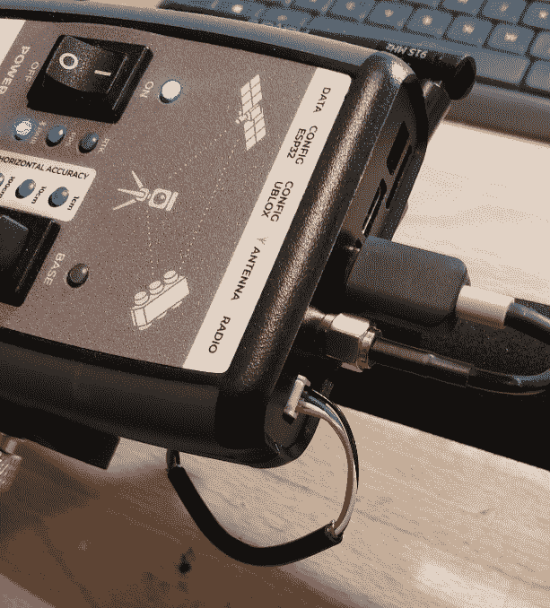](https://cdn.sparkfun.com/assets/learn_tutorials/1/6/9/2/u-blox_firmware_upgrade_-_19.jpg)*Connecting the [RTK Surveyor](https://www.sparkfun.com/products/17369) over USB*

对于许多模块，如 ZED-F9P(显示在上面的 [RTK Surveyor](https://www.sparkfun.com/products/17369) 中)或 NEO-M8P，USB 连接就像插入 USB 电缆一样简单。

[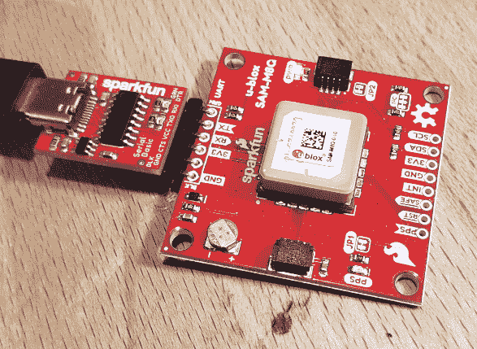](https://cdn.sparkfun.com/assets/learn_tutorials/1/6/9/2/u-blox_firmware_upgrade_-_18.jpg)*A [USB adapter](https://www.sparkfun.com/products/15096) providing the serial connection*

对于没有内置 USB 的模块，您需要使用一个[串行转 USB 适配器](https://www.sparkfun.com/products/15096)并焊接一个 6 针[直角接头](https://www.sparkfun.com/products/553)。注意串行适配器和 SAM-M8Q 评估板上的 **GRN** 和 **BLK** 标签是如何对齐的。

[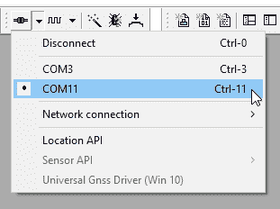](https://cdn.sparkfun.com/assets/learn_tutorials/1/6/9/2/u-blox_firmware_upgrade_-_3.jpg)

打开 u-center 并连接到适当的 COM 端口。不确定使用什么 COM 端口？最简单的方法是查看列出的 COM 端口，然后从 USB 上拔下您的设备。现在重新打开列表。哪个 COM 消失了？那是你想要的。

或者，您可以打开设备管理器(按 Windows 按钮，然后键入“设备”)。

[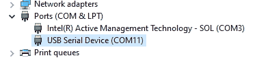](https://cdn.sparkfun.com/assets/learn_tutorials/1/6/9/2/u-blox_firmware_upgrade_-_4.jpg)

上图中的 COM3 是我电脑上的一个永不消失的 COM 端口。当我拔掉我的 ZED-F9P 时，COM11 消失了，所以 COM11 是我需要从 u-center 连接的端口。

## 备份设备设置

更新固件将覆盖设备配置。如果你使用股票设置或调整只是一些功能，那么你可以跳过这一步。如果您有一个高度配置的接收器，并且不想再次手动配置，请继续阅读。

[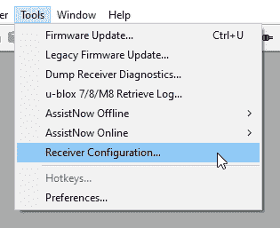](https://cdn.sparkfun.com/assets/learn_tutorials/1/6/9/2/u-blox_firmware_upgrade_-_11.jpg)

打开接收器配置窗口。在**工具**下面。

[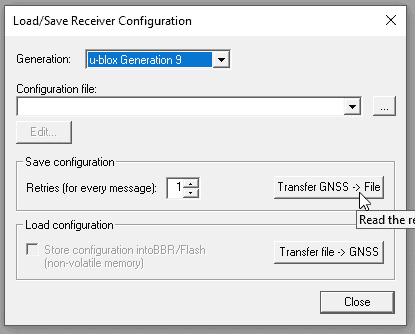](https://cdn.sparkfun.com/assets/learn_tutorials/1/6/9/2/u-blox_firmware_upgrade_-_12.jpg)

我们想从接收器传输到一个文件。为配置文件取一个容易记住的名称。一旦完成，接收器的设置将被提交到文件。

[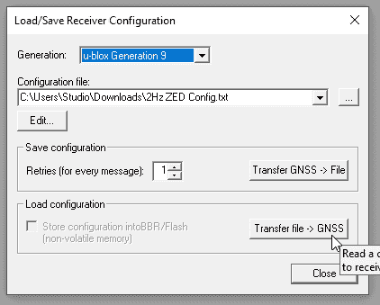](https://cdn.sparkfun.com/assets/learn_tutorials/1/6/9/2/u-blox_firmware_upgrade_-_13.jpg)

同样容易的是，您可以将配置文件加载回接收器。这是一个很方便的工具，如果有一些不同的配置，或者如果你有一批接收机，都需要有相同的设置应用。

## 识别当前固件版本

这可能是这个过程中最困难的一步！点击*消息*窗口按钮。

[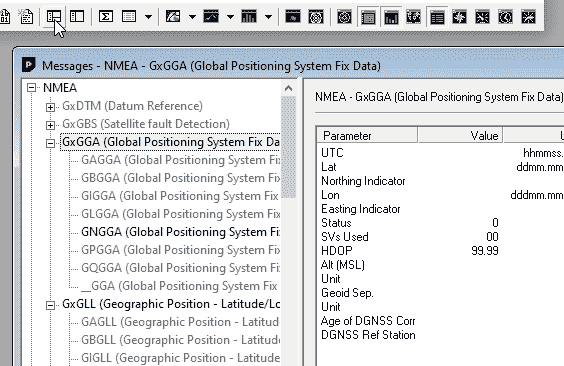](https://cdn.sparkfun.com/assets/learn_tutorials/1/6/9/2/u-blox_firmware_upgrade_-_14.jpg)

在消息窗口中，您会看到大量的子树。关闭它们，这样你只能看到 NMEA，RTCM3 和 UBX

[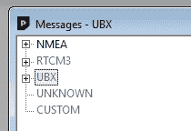](https://cdn.sparkfun.com/assets/learn_tutorials/1/6/9/2/u-blox_firmware_upgrade_-_15.jpg)

现在展开 UBX。我们需要找到并扩展 MON，最后找到 VER。

[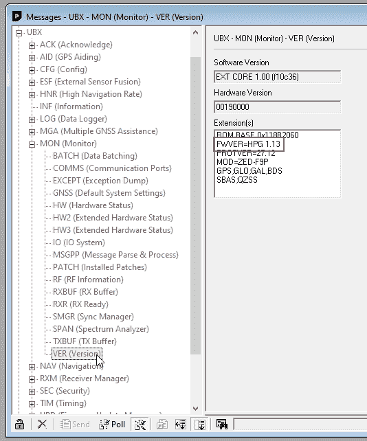](https://cdn.sparkfun.com/assets/learn_tutorials/1/6/9/2/u-blox_firmware_upgrade_-_16.jpg)

您设备的固件将在右窗格中列出。在本例中，固件版本为 1.13，模块为 ZED-F9P。

## 获取最新固件

现在你知道了你当前的固件，是时候看看是否有更新的了。SparkFun 一般不会托管 u-blox 发布的二进制文件。这是因为我们想让你直接从 u-blox 获得最新最好的版本。您通常可以在给定产品的“文档和资源”选项卡下找到该产品的固件。下面以 [ZED-F9P](https://www.u-blox.com/en/product/zed-f9p-module#tab-documentation-resources) 为例。

[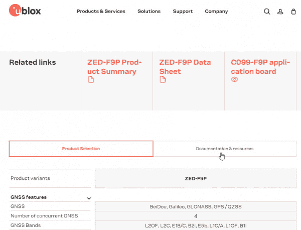](https://cdn.sparkfun.com/assets/learn_tutorials/1/6/9/2/u-blox_firmware_upgrade_-_1.jpg)

滚动或搜索此页面查找“固件”

[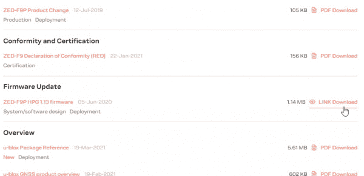](https://cdn.sparkfun.com/assets/learn_tutorials/1/6/9/2/u-blox_firmware_upgrade_-_2.jpg)

将这个二进制文件下载到一个容易找到的文件夹中。

## 升级固件

[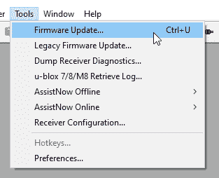](https://cdn.sparkfun.com/assets/learn_tutorials/1/6/9/2/u-blox_firmware_upgrade_-_5.jpg)

从**工具**菜单中选择*固件更新*。注意，虽然菜单上说 Ctrl+U 是快捷方式，但它是**而不是**！Ctrl+U 将打开传统固件更新工具。小心使用你的鼠标。

[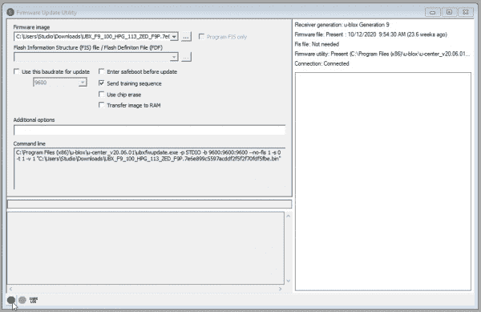](https://cdn.sparkfun.com/assets/learn_tutorials/1/6/9/2/u-blox_firmware_upgrade_-_8.jpg)

按下带有三个点“...”的按钮并找到您刚刚下载的固件映像。准备好后，按左下角标有“GO”的绿点按钮。

[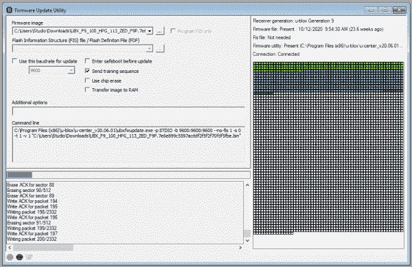](https://cdn.sparkfun.com/assets/learn_tutorials/1/6/9/2/u-blox_firmware_upgrade_-_9.jpg)

坐下来等着。这次升级大约需要 60 秒，但你的里程数可能会有所不同。

[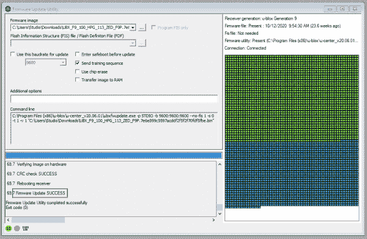](https://cdn.sparkfun.com/assets/learn_tutorials/1/6/9/2/u-blox_firmware_upgrade_-_17.jpg)

完成后，您应该会看到“固件更新成功”消息。GNSS 接收器将重置并通过 USB 重新枚举(如果它有内置 USB)。在 ZED-F9P 上，所有设备设置和配置都被覆盖，因此如果您之前保存了设备的配置，现在是重新加载它们的好时机。

## 进一步阅读

感谢阅读！我们希望这能让固件升级过程不那么令人生畏。如果您不确定每个固件版本的变化和优势，请务必查看给定 u-blox 接收器文档页面上列出的“发行说明”。

想要更多 GNSS 的好处？查看这些伟大的教程:

 [### 建造自主车辆:蝙蝠战车](https://learn.sparkfun.com/tutorials/building-an-autonomous-vehicle-the-batmobile) Documenting a six-month project to race autonomous Power Wheels at the SparkFun Autonomous Vehicle Competition (AVC) in 2016\.[Favorited Favorite](# "Add to favorites") 8 [### 什么是 GPS RTK？](https://learn.sparkfun.com/tutorials/what-is-gps-rtk) Learn about the latest generation of GPS and GNSS receivers to get 14mm positional accuracy 9 [### u-blox 的 U-Center 入门](https://learn.sparkfun.com/tutorials/getting-started-with-u-center-for-u-blox) Learn the tips and tricks to use the u-blox software tool to configure your GPS receiver.[Favorited Favorite](# "Add to favorites") 2 [### GPS-RTK2 连接指南](https://learn.sparkfun.com/tutorials/gps-rtk2-hookup-guide) Get precision down to the diameter of a dime with the new ZED-F9P from u-blox.[Favorited Favorite](# "Add to favorites") 9 [### SparkFun GPS 突破(ZOE-M8Q 和 SAM-M8Q)连接指南](https://learn.sparkfun.com/tutorials/sparkfun-gps-breakout-zoe-m8q-and-sam-m8q-hookup-guide) The SparkFun ZOE-M8Q and SAM-M8Q are two similarly powerful GPS units but with different project applications. We'll compare both chips before getting each up and running.[Favorited Favorite](# "Add to favorites") 1 [### 设置基于流动站的 RTK 系统](https://learn.sparkfun.com/tutorials/setting-up-a-rover-base-rtk-system) Getting GNSS RTCM correction data from a base to a rover is easy with a serial telemetry radio! We'll show you how to get your high precision RTK GNSS system setup and running.[Favorited Favorite](# "Add to favorites") 15 [### 如何建立一个 DIY GNSS 参考站](https://learn.sparkfun.com/tutorials/how-to-build-a-diy-gnss-reference-station) Learn how to affix a GNSS antenna, use PPP to get its ECEF coordinates and then broadcast your own RTCM data over the internet and cellular using NTRIP to increase rover reception to 10km 14 [### MicroMod 资产追踪器载板连接指南](https://learn.sparkfun.com/tutorials/micromod-asset-tracker-carrier-board-hookup-guide) Get started with the SparkFun MicroMod Asset Tracker Carrier Board following this Hookup Guide. The Asset Tracker uses the u-blox SARA-R510M8S LTE-M / NB-IoT module to provide a host of data communication options.[Favorited Favorite](# "Add to favorites") 0