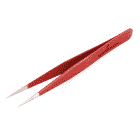

# 如何使用热风返工站

> 原文：<https://learn.sparkfun.com/tutorials/how-to-use-a-hot-air-rework-station>

## 介绍

热风站或热风枪是非常有用的工具，对任何电子工作台都是必不可少的。当使用或制造印刷电路板时，有很大的误差空间。无论你是依靠机器来建造还是手工建造，焊料通常都有自己的思想。有时，做建筑的人(或给做建筑的机器编程的人)会犯错误。其他时候，PCB 上的焊料或元件可能会在回流期间发生不良反应。不过不要害怕，有办法补救！SparkFun 热风返工站- 303D 就是这样一种解决方案。

 

将**添加到您的[购物车](https://www.sparkfun.com/cart)中！**

### [热风返工站- 303D](https://www.sparkfun.com/products/19101)

[Only 14 left!](https://learn.sparkfun.com/static/bubbles/ "only 14 left!") TOL-19101

这个热空气返工站是伟大的专业人士和爱好者需要严格的温度公差和大气流…

$134.95[Favorited Favorite](# "Add to favorites") 8[Wish List](# "Add to wish list")** **[https://www.youtube.com/embed/Oe5Kjn9DlzM/?autohide=1&border=0&wmode=opaque&enablejsapi=1](https://www.youtube.com/embed/Oe5Kjn9DlzM/?autohide=1&border=0&wmode=opaque&enablejsapi=1)

### 工具

除了热风返工站，你还需要一些工具来返工电路板上的表面贴装元件。镊子的类型取决于工作和个人喜好。助焊剂也有助于回流焊点。

 

将**添加到您的[购物车](https://www.sparkfun.com/cart)中！**

### [SparkFun 第三手工具包](https://www.sparkfun.com/products/11784)

[17 available](https://learn.sparkfun.com/static/bubbles/ "17 available") TOL-11784

你对大多数第三只手不够灵活感到沮丧吗？SparkFun 第三只手让你有能力握住…

$37.5060[Favorited Favorite](# "Add to favorites") 86[Wish List](# "Add to wish list")**** 

将**添加到您的[购物车](https://www.sparkfun.com/cart)中！**

### [绝缘硅胶焊垫](https://www.sparkfun.com/products/14672)

[In stock](https://learn.sparkfun.com/static/bubbles/ "in stock") TOL-14672

有了这种绝缘硅胶焊接垫，您将能够保护您的桌面、焊接站或…

$10.959[Favorited Favorite](# "Add to favorites") 93[Wish List](# "Add to wish list")**** 

将**添加到您的[购物车](https://www.sparkfun.com/cart)中！**

### [【镊子弯曲(ESD 安全)](https://www.sparkfun.com/products/10602)

[In stock](https://learn.sparkfun.com/static/bubbles/ "in stock") TOL-10602

你可以从我们种类繁多的镊子看出，我们 SparkFun 非常擅长拾取细小的东西。为了确保我们…

$4.507[Favorited Favorite](# "Add to favorites") 47[Wish List](# "Add to wish list")**** 

### [小帕纳维斯-真空底座](https://www.sparkfun.com/products/retired/10410)

[Retired](https://learn.sparkfun.com/static/bubbles/ "Retired") TOL-10410

Panavise Jr .是一个真空底座的大虎钳。它的钳口可张开约 3 英寸，并有用于印刷电路板的凹槽。非常适合…

2 **Retired**[Favorited Favorite](# "Add to favorites") 23[Wish List](# "Add to wish list") 

将**添加到您的[购物车](https://www.sparkfun.com/cart)中！**

### [芯片快克免清洗助焊剂笔- 10mL](https://www.sparkfun.com/products/14579)

[In stock](https://learn.sparkfun.com/static/bubbles/ "in stock") TOL-14579

这款来自 Chip Quik 的 10 毫升免清洗助焊剂笔非常适合您的所有焊接、脱焊、返工和回流目的！

$8.954[Favorited Favorite](# "Add to favorites") 36[Wish List](# "Add to wish list")**** 

将**添加到您的[购物车](https://www.sparkfun.com/cart)中！**

### [【镊子直(ESD 安全)】](https://www.sparkfun.com/products/10603)

[In stock](https://learn.sparkfun.com/static/bubbles/ "in stock") TOL-10603

你可以从我们种类繁多的镊子看出，我们 SparkFun 非常擅长拾取细小的东西。为了确保我们…

$4.504[Favorited Favorite](# "Add to favorites") 36[Wish List](# "Add to wish list")**** 

将**添加到您的[购物车](https://www.sparkfun.com/cart)中！**

### [【弯镊子】](https://www.sparkfun.com/products/12572)

[In stock](https://learn.sparkfun.com/static/bubbles/ "in stock") TOL-12572

这些是漂亮的、交叉锁定的弯曲镊子，不像传统的镊子，这些镊子的尖端会保持闭合，直到…

$4.502[Favorited Favorite](# "Add to favorites") 20[Wish List](# "Add to wish list")**** 

将**添加到您的[购物车](https://www.sparkfun.com/cart)中！**

### [【镊子-直(十字锁，防静电安全)](https://www.sparkfun.com/products/12573)

[In stock](https://learn.sparkfun.com/static/bubbles/ "in stock") TOL-12573

这些是很好的，交叉锁定的，直的镊子，不像传统的模型，这些镊子的尖端会保持闭合状态…

$4.501[Favorited Favorite](# "Add to favorites") 23[Wish List](# "Add to wish list")************** ************### 附加工具

为了保护桌子的表面，我们建议使用耐热材料。

*   耐热材料
    *   一块中密度纤维板(MDF)
    *   硅胶垫

如果这是你第一次返工电路板，在返工昂贵的 PCB 之前，试着从我们的丁和凹痕中返工一个[废料板！](https://www.sparkfun.com/categories/100)

 

### [废铁板](https://www.sparkfun.com/products/retired/8477)

[Retired](https://learn.sparkfun.com/static/bubbles/ "Retired") DD-08477

让我们的失败成为你的创造。我们有很多杯垫——这些是因为硬件原因而退役的 PCBs

4 **Retired**[Favorited Favorite](# "Add to favorites") 23[Wish List](# "Add to wish list") 

### [取放备件抓取袋](https://www.sparkfun.com/products/retired/10351)

[Retired](https://learn.sparkfun.com/static/bubbles/ "Retired") DD-10351

以我们目前的规模，生产中不可避免地会有一些浪费。这是一些零件的收集袋…

**Retired**[Favorited Favorite](# "Add to favorites") 29[Wish List](# "Add to wish list")

## 硬件概述

让我们从 303D 热风返工站的右上方开始，看看这些功能。

**电源开关**-303d 使用**标准北美插头/插座(~110VAC)** 。希望电源开/关开关是不言自明的。将开关拨到“开”打开热风返工站，将开关拨到“关”关闭热风返工站。很简单。

**Please Note!** The device will not power off immediately after turning the switch to the "OFF" position. It will continue to blow air until the air temperature is below 100°C.

**LED 数字输出**-LED 数字输出列出了您的温度范围和空气流量。当你转动空气或温度旋钮时，显示会改变。

**Note:** Temperature scale (Celsius vs Fahrenheit) is set during the manufacturing stage. By default, the display will show your current temperature in degrees **Celsius.**

**气流等级** -气流等级范围从 **A25 ~ A99** 。你可以通过转动空气调节旋钮来调节空气流量。LED 输出将显示设定的气流等级 2 秒钟，然后返回到喷嘴的当前空气温度。

**温度范围** -输出温度范围从 **100 ~ 480 摄氏度**。你可以通过转动温度设置旋钮来调节工作温度。LED 输出将显示设定温度 3 秒钟，然后返回到喷嘴的实际空气温度。当达到所需温度时，温度框中的指示器将闪烁。

**喷嘴**-303d 配备了 2 个可更换的热空气喷嘴。较小的喷嘴有利于将热空气集中在较小的部件上。如果你想把热空气集中在电路板的一个大区域，大喷嘴是很好的选择。

**棒座** -该装置配有热风枪棒座。它可以贴在热空气返工站的任何一侧。

*Wand Holder Attached to the Right Side While Powered*

## 有什么好处？

热风返工站非常方便。如上所述，它们是返工电路板的重要工具。术语[返工](https://en.wikipedia.org/wiki/Rework_%28electronics%29)仅仅意味着你正在对已经[回流焊过的](https://en.wikipedia.org/wiki/Reflow_soldering)电路板进行整修或修复，这是电子世界中常用的术语。你就把它想象成对电路板做任何与实际生产过程无关的工作。以下是一些常见的返工场景:

*   **极化组件** -放置不正确的零件(向后，偏离 x 度)。其中包括集成电路、二极管、一些电容、连接器等。

*   **墓碑形零件** -这是指一个零件(通常是一个电阻或电容)只在一侧回流。这部分通常像墓碑一样竖起来。

*   **冷接点** -这类似于一个墓碑，除了零件可能不会粘在一起，这样就很难看到没有形成的连接。

*   **移除有缺陷的零件** -有时，在 IC 制造过程中，可能会出现错误，但却没有被注意到。然后将这些 IC 放在非常好的 PCB 上。热空气对更换这些坏零件很有帮助。

*   **缺失组件** -越小的组件越容易消失。这可能发生在回流之前或回流过程中，导致出现应该出现但没有出现的点。在这个返工站中，热烘一个新零件在它的位置上是很容易的。

*   **无意的焊料跳线** -如果使用了过多的焊料或焊膏，结果可能是一个或多个表面贴装 IC 引脚上出现跳线。热空气有时可以和[焊剂笔](https://www.sparkfun.com/products/14579)一起使用来清除这些讨厌的家伙。

## 其他用途

返工并不是热风返工站唯一擅长的事情。其他用途包括:

*   从旧印刷电路板中回收电子元件。
*   用模板在 SMD 元件和 PCB 之间回流[焊膏。](https://cdn.sparkfun.com/datasheets/Kits/SFE03-0010-SimonSMDStenciling-Kitcard-ReaderSpreads.pdf)
*   收缩[热收缩](https://www.sparkfun.com/products/9353)以固定电线连接。
*   加热和弯曲某些塑料(使用正确的设置)。
*   加热热胶以移除或重新放置粘合不正确的物品。

## 如何使用热风返工站

**Warning:** Do not use hot-air on surfaces you don't want ruined. Having a piece of scrap wood or something similar to work with hot-air on is highly recommended.

Third hands or other vice grips help tremendously. Remember, metal heat sinks and PCBs with ground planes can make reworking take a lot longer.

### 选择您的喷嘴

为工作选择合适的技巧。将喷嘴连接到棒上，并使用[螺丝刀](https://www.sparkfun.com/products/9146)拧紧螺钉以将其固定到位。

将 303D 的北美标准插头插入您最喜欢的美国插座(~110VAC)。加热元件和鼓风机将保持关闭，直到您将电源开关转到 ON。

### 通电

将所述电源开关拨到 ON。加热元件会升温，空气会变得非常热，非常快，因此相应地瞄准喷嘴。“设置温度”旁边的红色 LED 将会闪烁，表示“嘿，我准备好融化一些东西了。”使用前，请等待热风站预热。

**Note:** It’s possible that little whimsical puffs of white smoke will emit from the nozzle. Those are just magical solder clouds and are normal. They will go away, so enjoy them while they last.

### 调节空气和温度

有两个控制旋钮，一个用于控制气流，一个用于控制温度。调整它们以适应你的需要。

**Note:** Set the temp and air-flow to the appropriate settings (slightly higher than the melting point of the solder, and not too much air to blow your parts away). We recommend setting the air flow and temperature knobs to the middle and then test reflow on a small component.

### 修订

当你调整好设置后，小心地将喷嘴对准你工作的区域。念着魔咒(meltum，meltum，meltum)，来回移动喷嘴，直到焊料开始流动(焊料应该看起来有光泽和熔化)。然后用镊子轻推或抓住想要返工的零件，小心地将其移除/重新定位。请记住，热空气是热的。

*A micro-B connector being removed from a Pro Micro for a [Tech Prank](https://learn.sparkfun.com/tutorials/tech-prank-hardware-mouse-jiggler). Be sure to rework the board on a heat resistant material!***Warning:** Make sure to keep the hot-air gun moving to prevent any damage to the component or the PCB from burning. Aiming the heat gun at the same point can melt the board after a certain period of time. Certain components may be heat sensitive. Make sure to check the datasheet on the IC. The black plastic on male and female headers can melt while [surface mount buttons](https://www.sparkfun.com/products/8720) can become discolored. Be sure to aim the hot air at a component carefully!

If you also see smoke, warping, or black goo coming from your board, remove the heat and turn your heat setting down.

### 冷静

完成后，将电源开关拨到 OFF，让工作站在完成后冷却下来。自冷却将开始并持续几分钟。

### 干净的

完成[后清洗电路板，去除残留在电路板](https://learn.sparkfun.com/tutorials/electronics-assembly#washing)上的任何水溶性助焊剂，随着时间的推移，这些助焊剂会导致腐蚀。

### 演示视频

下面是我们的朋友戴夫·斯蒂尔曼的演示视频，向我们展示如何正确使用我们的 SparkFun 热风返工站！

[https://www.youtube.com/embed/9D0oTGeheBA/?autohide=1&border=0&wmode=opaque&enablejsapi=1](https://www.youtube.com/embed/9D0oTGeheBA/?autohide=1&border=0&wmode=opaque&enablejsapi=1)

## 替换零件

### 喷嘴

 

### [热风返工喷嘴- Y1126](https://www.sparkfun.com/products/retired/7925)

[Retired](https://learn.sparkfun.com/static/bubbles/ "Retired") TOL-07925

热风返工喷嘴与我们所有的返工站兼容。按型号以**个* *单位出售。

**Retired**[Favorited Favorite](# "Add to favorites") 9[Wish List](# "Add to wish list")

### 加热元件

**Heads up!** If you decide to replace the heating element, the following directions listed further below are for [TOL-10706](https://www.sparkfun.com/products/retired/10706). When replacing the heating element in the wand for [TOL-14557](https://www.sparkfun.com/products/14557), there will be some epoxy/glue in the handle that seals it shut. After removing the screws, you may need to force it open which may damage the handle! We recommend replacing the heating element at your own risk for TOL-14557. 

将**添加到您的[购物车](https://www.sparkfun.com/cart)中！**

### [热风返工更换元件-温控](https://www.sparkfun.com/products/11130)

[27 available](https://learn.sparkfun.com/static/bubbles/ "27 available") TOL-11130

这是我们热空气返工站的替换加热元件。它与太阳站和我们自己的品牌兼容…

$21.50[Favorited Favorite](# "Add to favorites") 5[Wish List](# "Add to wish list")** **#### 更换加热元件:

| 拆下螺钉 | 去掉…的障碍物 | 拆下加热元件 |
|  |  |  |

## 解决纷争

### “空气”旋钮向上时气流低

如果当“空气”旋钮打开时气流变弱，请确保喷嘴连接牢固。有了喷嘴，你将有更多的空气流过热空气返工站的手柄。

### 标准差误差

“S-E”通常表示传感器错误。这是一个常见的错误。有时弄乱表盘后会消失，温度会再次正常显示。其他时候，它表示热传感器出现故障。通过移除并重新连接加热器，返工站可能能够恢复。另一个技术支持代表认为是氧化物在连接处堆积。这导致愚弄控制器，使其认为加热器发生了故障。

### 光电误差

显示“H-E”的装置通常意味着存在加热错误。可能是加热元件出现故障或连接不正确。试着检查连接，看看加热元件是否需要重新安装。最后一招是更换加热元件。最后一个办法是得到一个替换加热元件 T1。

### 空气转向过高

如果你的气流开得太高，很有可能你会看到小弹丸从你的冲浪板上射出。那些是你的零件。我们建议从较低的气流开始，然后根据您的需要向上移动。

[https://www.youtube.com/embed/DPsbr6Ojhdk/?autohide=1&border=0&wmode=opaque&enablejsapi=1](https://www.youtube.com/embed/DPsbr6Ojhdk/?autohide=1&border=0&wmode=opaque&enablejsapi=1)

### 毁坏印刷电路板

如果你在用热空气工作时在 PCB 上的给定位置坐得太久，将铜层固定在下面的 FR4 层压板上的胶水就会散开，变成黑色粘性物。顶部的绿色阻焊膜也开始脱落。因为我们还没有嗅觉视觉，我们可以试着描述这种气味——太可怕了。它闻起来像燃烧的电子产品(惊喜)，但这种气味似乎粘在你的皮肤和衣服上。不酷。所以练习吧，如果你在第一次尝试重新工作时闻到不好的味道，不要感到惊讶。

[https://www.youtube.com/embed/x_ryyX27J_E/?autohide=1&border=0&wmode=opaque&enablejsapi=1](https://www.youtube.com/embed/x_ryyX27J_E/?autohide=1&border=0&wmode=opaque&enablejsapi=1)

### 拉垫

当检查某个部件是否可以移动时，我们建议轻轻推动该部件。如果用力过猛，可以拉垫。

## 资源和更进一步

如果您有任何问题或意见，请随时在下面的评论框中提出。返工愉快！

有关热空气返工站的更多信息，请查看以下资源:

*   [303D 手动](https://cdn.sparkfun.com/datasheets/Tools/SFE03.0010Packaging.HotAirRework.303D.Manual-05.pdf)
*   [SMD 操作指南- 4:用热风返工=良好](https://www.sparkfun.com/tutorials/98)
*   [SMD How-8:热风返工实际上是如何工作的？](https://www.sparkfun.com/tutorials/102)

查看来自 Sparkfun 的其他优秀教程，提升你的技能！

 [### 安装 Arduino 引导程序](https://learn.sparkfun.com/tutorials/installing-an-arduino-bootloader) This tutorial will teach you what a bootloader is and why you would need to install or reinstall it. We will also go over the process of burning a bootloader by flashing a hex file to an Arduino microcontroller.[Favorited Favorite](# "Add to favorites") 25 [### 在 EAGLE 中制作定制脚印](https://learn.sparkfun.com/tutorials/making-custom-footprints-in-eagle) This tutorial will show you how to make custom, 1:1 footprint for any IC in EAGLE.[Favorited Favorite](# "Add to favorites") 14 [### 如何安装和设置 EAGLE](https://learn.sparkfun.com/tutorials/how-to-install-and-setup-eagle) Not just how to download and install EAGLE, but how to install the SparkFun EAGLE Libraries and scripts.[Favorited Favorite](# "Add to favorites") 39 [### 自定义 LilyPad LED 颜色](https://learn.sparkfun.com/tutorials/customizing-lilypad-led-colors) A short guide to creating a rainbow of new LilyPad LED colors at home 12

或者看看这篇博文，了解更多回流焊接的想法！

 [### 回流多士炉烤箱 Qwiic 黑客！

June 25, 2020](https://www.sparkfun.com/news/3319 "June 25, 2020: Grab some parts, strap a servo on it, and you'll be reflowing solder in no time!")[Favorited Favorite](# "Add to favorites") 2****************