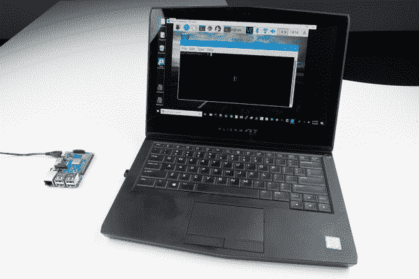

# 如何用 VNC 在树莓 Pi 上使用远程桌面

> 原文：<https://learn.sparkfun.com/tutorials/how-to-use-remote-desktop-on-the-raspberry-pi-with-vnc>

## 介绍

如果你喜欢为你的 [Raspberry Pi](https://www.sparkfun.com/raspberry_pi) 设置一台无头电脑(即没有键盘、鼠标或显示器的电脑)，但想访问完整的图形桌面，那么你很幸运！通过使用虚拟网络计算(VNC)程序，您可以通过网络访问远程桌面！

适用于需要使用完整桌面来运行某些应用程序(Scratch，创建自己的图形界面等)的学校和个人。)，使用 VNC 客户端访问您的树莓 Pi 可能是一个不错的选择。

*Using RealVNC to access the Raspberry Pi's graphical desktop*

好消息是 Raspbian(推荐的 Raspberry Pi 操作系统)默认安装了 RealVNC。坏消息是，我们需要使用其他方法来启用它。

### 所需材料

按照这个教程，你需要一个树莓 Pi，电源和微型 SD 卡。请注意，不需要显示器、键盘或鼠标！

**Note:** The [Raspberry Pi Zero W](https://www.sparkfun.com/products/14277) should also work with this tutorial, if you want a smaller option for your project.