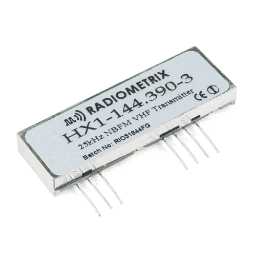
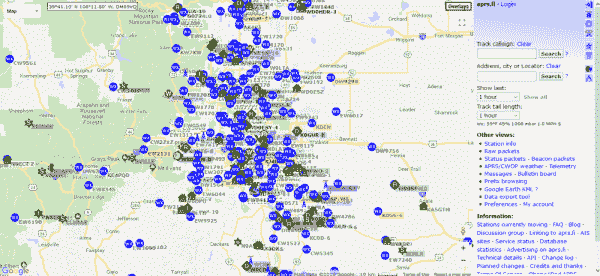
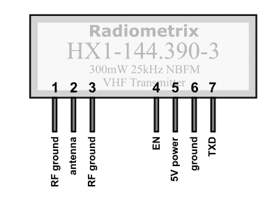
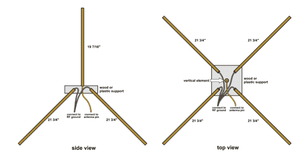
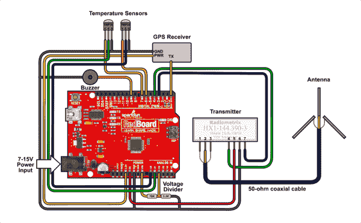
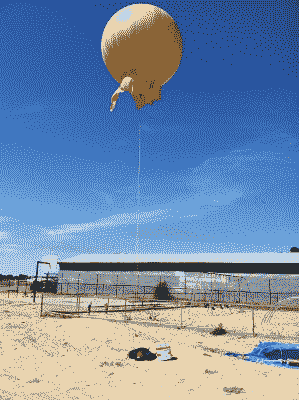

# HX1 APRS 变送器连接指南

> 原文：<https://learn.sparkfun.com/tutorials/hx1-aprs-transmitter-hookup-guide>

## 介绍

[HX1](https://www.sparkfun.com/products/14740) 是一个低功率无线电发射机，设置为 144.390MHz 的固定频率。在北美，该频率用于自动数据包报告系统，或 [APRS](http://www.aprs.org) 。

 

### [【HX1-VHF 窄带调频 APRS 发射机(144.39Mhz - NA)](https://www.sparkfun.com/products/retired/14740)

[Retired](https://learn.sparkfun.com/static/bubbles/ "Retired") WRL-14740

HX1 是一种窄带无线电发射机模块，用于 10 公里范围内的远程数据传输应用。

**Retired**[Favorited Favorite](# "Add to favorites") 8[Wish List](# "Add to wish list")

APRS 是业余无线电运营商用来广播位置和传感器数据的标准。任何拥有适当设备的人都可以接收到这些数据，并通过 APRS 社区运行的网关在互联网上进行汇总。

APRS 用于共享实时数据，包括车辆定位(GPS)、气象站、高空气球跟踪、远程传感器平台、救灾协调等。它实际上是一个开源、开放数据、社区运营、免费使用的物联网系统，有可能覆盖全球。

### 所需材料

要遵循本指南，您需要以下材料。

*   一个 [HX1 发射器](https://www.sparkfun.com/products/14740)。
*   5V Arduino，如 [SparkFun RedBoard](https://www.sparkfun.com/products/13975) 。
    *   由于 HX1 是一个“裸”发射机，你需要一个微控制器编程，以正确格式化传输。在本指南的后面，我们将介绍一个 Arduino 项目来实现这一点。
*   150 毫安以上的电源，如 [9V 壁式适配器](https://www.sparkfun.com/products/298)。
*   您的应用需要的任何传感器。
    *   我们稍后将运行的 Arduino 代码利用了一个 [GPS 接收器](https://www.sparkfun.com/products/11058)、[天线](https://www.sparkfun.com/products/177)和[温度传感器](https://www.sparkfun.com/products/10988)。
*   调谐到 144.39 兆赫(或更一般的 2 米波段)的天线
    *   HX1 需要外部天线才能工作。我们将在本指南的后面向您展示如何构建一个。
*   业余无线电执照。

## 获得许可

在我们走得更远之前，我们要提醒你，因为这个发射机使用业余无线电频率，你需要一个业余无线电执照来操作它。不用担心；获得许可证很容易，并为你打开了一个全新的技术能力的世界。

最基本的执照等级**技师**将足以使用该变送器。你需要通过一个 35 道题的测试，所有的问题和答案都可以提前提供给你学习。如果你玩电子产品已经有一段时间了，并且知道[欧姆定律(V=IR)](https://learn.sparkfun.com/tutorials/voltage-current-resistance-and-ohms-law) ，那么你已经成功了一半。剩下的包括记忆一些简单的规则和条例。

第一步是去[美国无线电接力联盟(ARRL)网站](http://www.arrl.org/)。ARRL 是业余无线电社区组织。尽管你的执照将由联邦通信委员会(FCC)颁发，ARRL 处理培训和测试。在 ARRL 网站上，您可以找到您附近即将举行的考试的列表，以及练习题和其他有用的信息。

[ARRL Amateur Radio License Training and Testing](http://www.arrl.org/getting-licensed)

一旦你选择了考试日期和地点，学习！除了 ARRL 网站，还有许多书籍、网站和应用程序可以帮助你学习。在考试当天，带上所需的费用、带照片的身份证、2 号铅笔和不可编程的计算器(不允许使用手机)。当你完成考试时，考官会马上告诉你是否通过。如果你通过了，你会在几周内收到你的呼号。一旦你有了呼号，你就可以合法地用 HX1 进行传输(以及做许多其他事情)。

**Pro Tip:** Although you'll only need a technician-class license to transmit with the HX1, you can also take the higher class tests on the same day at no additional cost. It may be worth a bit more studying!

## 什么是 APRS？

APRS 是由鲍勃·布鲁宁加(WB4APR)在 20 世纪 80 年代构思的，他目前是美国海军学院的高级研究工程师，在 APRS 社区仍然非常活跃。它满足了在多个业余无线电台之间传输少量文本数据而不必手动复制语音消息的简单方法的需求。自那以后，APRS 已经发展成为一个丰富的全球系统，用于传输其他人可以接收和使用的位置和传感器值。

### 接收 APRS 信息

说到接收，如果 HX1 只是一个发射机，如何接收 APRS 信息？

有了适当的设备，你可以很容易地收到 APRS 的包裹。一个调谐到 144.390 兆赫的廉价 2 米接收器将接收构成 APRS 包的音频音调。然后，你可以通过管道将音频传输到运行适当软件的计算机上，对数据包进行解码。然后，您可以使用数据包中的信息在地图上显示位置，用图表显示数据包中包含的其他数据，等等。

但是你不一定要设置你自己的接收器。APRS 社区的许多人已经建立了称为“网关”的接收站，接收 APRS 数据包，并通过管道将数据传输到互联网上，供各种网站汇总。最大的网站之一是 [APRS.fi](http://aprs.fi) 。它接收来自世界各地的实时 APRS 数据，在地图上显示台站位置和数据。(如果你成为 APRS 的狂热爱好者，我们鼓励你建立自己的网关并加入网络。)

### 什么是数据包？

APRS“数据包”是一个简短(25 到 200 个字符)的自包含文本消息。APRS 有严格的格式规则，字段用于各种类型的数据(电台呼号、GPS 定位、时间、天气数据等)。).因为格式是标准的，所以用一个软件包生成的包可以被其他人接收和解码。格式化的细节可以在 APRS.org 的 APRS 规范中找到。

[APRS Packet Specification](http://APRS.org)

因为 APRS 使用单一的共享频率(在北美是 144.390MHz)，每个人都可以看到其他人在做什么。通过保持数据包简短并在发送之间关闭发射机，许多人可以共享相同的频率。数据包通常在稍微随机的时间发送，以避免数据包冲突(两个人同时发送)。如果有冲突，两个数据包的数据都是乱码。然而，APRS 系统通常设置为每隔几分钟重新发送一次新的数据包，保证在不久之后会有新的数据。

### 我能拿 APRS 怎么办？

如果你去 [APRS.fi](http://aprs.fi) 看实时地图，你会看到车辆、飞机，有时还有高空气球的当前位置。你还会看到固定的气象站和其他环境传感器。这些传输都是由个人或业余爱好者使用各种数据(如车辆或气球位置)，或希望为更大的社区提供有用数据(如家中的气象站)的人进行的。

[Google Maps APRS](http://aprs.fi/)

### 我不能和 APRS 做什么？

值得注意的是，由于 APRS 使用业余无线电频率，传输必须遵守业余无线电社区的规则和精神。具体来说:

*   业余无线电频率仅用于非商业用途。你**可以**将 APRS 用于你自己的爱好或科学用途，但你**不能**将 APRS 用于任何商业用途。(业余爱好者对此非常认真——无线电波段是一种有价值的商品，业余爱好者经常不得不努力防止他们拥有的东西被卖给商业竞标者。)

*   你发送的数据必须*打开*。因为你是在一个开放的系统上传输，所以每个人都可以看到你的数据，但是你不允许通过加密或隐藏来隐藏它。按照这些思路，鼓励你发送的数据对社区有意义——气象站和其他公共服务数据源总是很受欢迎。

## 硬件概述

HX1 有两组七个引脚:

| 别针 | 功能 | 笔记 |
| one | 射频接地 | *天线接地或同轴屏蔽* |
| Two | 天线输出 | *天线或同轴电缆中心* |
| three | 射频接地 | *天线接地或同轴屏蔽* |
|   |   |   |
| four | EN(启用)输入 | *5V 发射，0V 待机* |
| five | 5V 电源输入(VCC) | ***稳压 5V** 电源 140 毫安* |
| six | 地面 | *稳压电源接地* |
| seven | TXD(传输数据)输入 | *带调制和格式化的 5V 信号* |

**Caution!** Note that the pins on the HX1 are fragile. Be sure to mount everything securely to avoid repeated bending that could break the pins.

### 电源

HX1 需要一个稳压的 **5V** 电源，能够在发射时提供 140mA 电流(待机时基本不使用电流)。5V Arduino 上已经存在的电压调节器应该能够处理这个问题。

### EN(启用)输入

EN 或 enable 引脚控制模块是正在发送还是处于待机模式(有时这被称为 PTT 或“一键通”控制)。因为 APRS 使用共享频率，所以重要的是只在发送数据包的短暂时间内进行传输，否则保持静默；这让许多人分享频率。要进行传输，EN 引脚必须设为高逻辑电平(5V)。

启用发射器后，最好等待 5ms，然后再向 TXD 引脚发送任何数据。您的软件应该会自动处理这个问题。

### TXD(传输数据)输入

值得注意的是，HX1 是一个裸发射机，本身不做任何调制或打包。必须对 TXD 数据输入进行适当调制，以便正确传输。调制和打包是一个广泛的话题，超出了本教程的范围，但有几个 Arduino 项目旨在连接到 HX1 的 TXD 引脚和发送数据。我们将在下面介绍其中的一个项目。

### 天线

**WARNING:** Do not transmit without an antenna or equivalent load connected to the antenna pin. Without an antenna, RF energy can reflect back into the module, damaging it.

HX1 需要一个天线来传输。你可以买一个(搜索“2 米天线”，因为 APRS 频率在 2 米业余无线电波段)，或者你可以建立一个。

有许多天线设计，但简单的四分之一波长接地平面天线工作良好，易于制作。这种天线的特点是垂直元件被四个向下倾斜 45 度的径向元件包围:

*Having a hard time seeing the circuit? Click on the image for a closer look.*

天线元件的长度取决于频率。对于我们将使用的 144.390MHz 频率，元件长度为:

| 天线 | 长度 |
| 垂直元素(1x): | 19 + 7/16" | 493 毫米 |
| 径向元件(4x): | 21 + 3/4" | 553 毫米 |

这些元件可以由任何导电金属制成，但是黄铜和铜棒很容易焊接。杆可以由任何非导电材料(塑料、木头等)支撑就位。).

**Tip:** There are numerous online calculators to help you design antennas. We used the [M0UKD site](https://m0ukd.com/calculators/quarter-wave-ground-plane-antenna-calculator/) to determine the above element lengths. This website also has pictures of assembled antennas and tips for their construction.

[MØUKD: Quarter Wave Ground Plane Antenna Calculator](https://m0ukd.com/calculators/quarter-wave-ground-plane-antenna-calculator/) 

要将天线连接到 HX1，将垂直元件连接到天线输出引脚(2)，将径向元件连接到天线引脚两侧的射频接地引脚(1，3)。

如果 HX1 发射机距离天线超过几英寸，使用 50 欧姆同轴电缆将 RF 引脚连接到天线。将天线输出针脚(2)连接到同轴电缆的中心导体上，将外部射频接地针脚(1，3)连接到屏蔽层上。在天线侧，将中心导体连接到垂直元件，将屏蔽层连接到径向元件或接地层。

为了获得最大的覆盖范围，尽可能将天线放在高处，并远离附近的金属物体。PVC 管是一种良好的绝缘结构材料。

请注意，这种天线设计是全向的，这意味着它在所有方向上都能很好地工作，但范围会有所缩小。定向天线会给你更大的范围，但你需要把它们指向远程接收器。业余无线电书籍和网站有许多其他天线设计的信息；如果你有兴趣，可以看看。

## 连接到 Trackuino

**注意:**此示例假设您在桌面上使用的是最新版本的 Arduino IDE。如果这是你第一次使用 Arduino，请回顾我们关于[安装 Arduino IDE 的教程。](https://learn.sparkfun.com/tutorials/installing-arduino-ide)确保包含的头文件在同一个文件夹中，以便编译*轨迹编号*草图。

有几个开源的 Arduino APRS 项目可用，有各种各样的特性和限制。这里我们将展示一个由 Javi Martin 编写的名为 [Trackuino](https://github.com/trackuino/trackuino) 的项目。Trackuino 是由[硬件](https://github.com/trackuino/shield)和[软件](https://github.com/trackuino/trackuino)组合而成，用于追踪高空气球。它有点老，但可能是最容易与 HX1 一起使用的 Arduino APRS 实现。

**Note:** We recommend that you download SparkFun's fork of the Trackuino software from the link below. We are working to improve this project for general APRS use:

[GitHub Repo Fork: SparkFun Trackuino](https://github.com/sparkfun/SparkFun_Trackuino)

### 硬件装配

默认的 Trackuino 系统包括一个 GPS 接收器、两个温度传感器、一个电池电压传感器和一个蜂鸣器(用于在气球着陆时定位气球)。要连接默认系统，请使用以下接线图和表格。(我们将在下一节讨论修改默认系统。)

*Having a hard time seeing the circuit? Click on the image for a closer look.*

#### 连接表

| 从 | 到 | 描述 |
| HX1 VCC (5) | Arduino 5V | *HX1 电源* |
| HX1 GND (6) | 阿尔杜伊诺·GND | *HX1 电源接地* |
| HX1 EN (4) | 阿尔杜伊诺·D4 | *HX1 发送使能* |
| HX1 TXD (7) | Arduino D3 | *HX1 发送数据* |
|   |   |   |
| HX1 右前接地(1) | 天线接地 | *天线接地面* |
| HX1 天线输出(2) | 天线 | *天线* |
| HX1 右前接地(1) | 天线接地 | *天线接地面* |
|   |   |   |
| GPS TX | Arduino D0 (RX) | *GPS 数据* |
| GPS 电源 | Arduino 3.3V | *GPS 电源* |
| GPS 地面 | Arduino 地面 | *GPS 地面* |
|   |   |   |
| 内部 TMP36 电源 | 阿尔杜伊诺·D6 | *温度传感器功率* |
| 内部 TMP36 信号 | Arduino A0 | *温度传感器信号* |
| 内部 TMP36 接地 | Arduino 地面 | *温度传感器接地* |
|   |   |   |
| 外部 TMP36 电源 | Arduino D7 | *温度传感器功率* |
| 外部 TMP36 信号 | Arduino A1 | *温度传感器信号* |
| 外部 TMP36 接地 | Arduino 地面 | *温度传感器接地* |
|   |   |   |
| 蜂鸣器电源 | Arduino D9 | *蜂鸣器功率* |
| 蜂鸣器接地 | Arduino 地面 | *蜂鸣器接地* |
|   |   |   |
| Arduino VIN(电池电压) | Arduino A2 通过 10k 电阻 | *电池电压传感器* |
| Arduino A2 | Arduino 通过 3.3k 电阻接地 | *电池电压传感器* |

## 配置 Trackuino

开箱即用，Trackuino 被配置为在高空气球上使用，但只要稍加修改，你就可以为自己的目的改变它。

**Note:** We're going to be working on SparkFun's fork of Trackuino to make it more general-purpose and easier to configure. Keep an eye on the forked GitHub repository at [SparkFun Trackuino](https://github.com/sparkfun/SparkFun_Trackuino) for changes and updates.

[GitHub Repo Fork: SparkFun Trackuino](https://github.com/sparkfun/SparkFun_Trackuino) 

你*必须*做一个改变:打开 *config.h* 文件，在第 42 行插入你的呼号和电台 ID。APRS 在每个数据包中都发送你的呼号；这是法律要求。

在文件 *aprs.cpp* 中你可能想要改变的另一件事是在第 62 行定义的“符号”字符。这将控制当您使用 APRS 地图软件或网站时，在您的位置上会显示什么图形符号。提供的“O”表示气球，但还有许多其他符号可用，如“-”表示固定位置，“K”表示学校，“T2”表示汽车，“Y”表示船等。要获得完整的列表，请点击下面的链接。

[APRS Display Symbols](http://www.aprs.net/vm/DOS/SYMBOLS.HTM)

默认情况下，Trackuino 会发送一个 APRS 数据包，其中包括 GPS 时间、GPS 位置、海拔高度、电池电压和几个温度传感器值。如果你想构建自己的 APRS 包，你可以修改 *aprs.cpp* 中的`aprs_send()`函数，删除各种传感器值或添加你自己的值。

**Note:** The Trackuino currently uses a nonstandard way of sending telemetry data. If you'd like to make it universal, refer to the following notes and specifications:

[GitHub Repo: APRS Notes - Telemetry Format](https://github.com/PhirePhly/aprs_notes/blob/master/telemetry_format.md)
[APRS Specification (PDF)](http://www.aprs.org/doc/APRS101.PDF)
We'll be updating our fork of Trackuino as well.

## 跑步跑道

一旦你设置了硬件和软件，运行 Trackuino。这应该开始传输 APRS 数据包后，它获得了 GPS 锁定。

如果你有一个 2 米的接收器或 SDR，你可以把它设置为 144.390 兆赫，以听取正在发送的数据包。如果你把音频传输到一台电脑，并运行适当的软件([巨狼](http://info.aprs.net/index.php?title=Dire_Wolf)就是一个这样的包)，你就能解码这些包并看到原文。

如果你离 APRS 网关足够近，你的数据包就会被接收并通过管道传送到互联网。你应该能够进入 [APRS.fi](http://aprs.fi) 并搜索你的呼号来查看收到的数据包及其包含的数据。

## 后续步骤

互联网上有大量关于 APRS 的信息。人们可以建造天线，运行网关，跟踪气球，帮助协调救灾等。甚至天空也不是极限，因为许多业余卫星接收和传输 APRS 数据包。

当我们在 APRS 和其他业余无线电项目上工作时，SparkFun 也将更新这个和其他教程。获得许可，敬请关注！

## 资源和更进一步

现在，您已经成功安装并运行了 HX1 APRS 发射机，是时候将它集成到您自己的项目中了！

有关更多信息，请查看以下资源:

*   [数据表(PDF)](https://cdn.sparkfun.com/assets/d/1/1/4/b/HX1_APRS.pdf)
*   [莫 UKD:四分之一波长地平面天线计算器](https://m0ukd.com/calculators/quarter-wave-ground-plane-antenna-calculator/)
*   [美国无线电转播联盟(ARRL)](http://www.arrl.org/)
    *   [获得许可](http://www.arrl.org/getting-licensed)
*   [APRS.org](http://www.aprs.org/)
    *   [APRS 协议参考:协议版本 1.0 (PDF)](http://www.aprs.org/doc/APRS101.PDF)
*   [GitHub Repo: APRS 笔记-遥测格式](https://github.com/PhirePhly/aprs_notes/blob/master/telemetry_format.md)
*   [APRS 显示符号](http://www.aprs.net/vm/DOS/SYMBOLS.HTM)
*   [巨狼](http://info.aprs.net/index.php?title=Dire_Wolf)
*   [谷歌地图 APRS](https://aprs.fi)
*   [GitHub Repo: Trackduino 硬件](https://github.com/trackuino/shield)
*   [GitHub Repo Fork:spark fun track uino](https://github.com/sparkfun/SparkFun_Trackuino)

你的下一个项目需要一些灵感吗？查看一些相关教程:

 [### 光子远程水位传感器](https://learn.sparkfun.com/tutorials/photon-remote-water-level-sensor) Learn how to build a remote water level sensor for a water storage tank and how to automate a pump based off the readings 15 [### 无线连接到地下的气象站](https://learn.sparkfun.com/tutorials/weather-station-wirelessly-connected-to-wunderground) Build your own open-source, official Wunderground weather station that connects over WiFi via an Electric Imp.[Favorited Favorite](# "Add to favorites") 32 [### 光子远程温度传感器](https://learn.sparkfun.com/tutorials/photon-remote-temperature-sensor) Learn how to build your own Internet-connect, solar-powered temperature collection station using the Photon from Particle.[Favorited Favorite](# "Add to favorites") 11

寻找更多关于高空气球项目的信息？查看一些相关教程:

|  |  |
| [内特的高空气球系列](https://www.sparkfun.com/tutorials/180) | [亚伦的高空气球发射](https://www.sparkfun.com/tutorials/361) |

或者看看这篇相关的博文:

 [### 关于业余无线电的一切

July 26, 2018](https://www.sparkfun.com/news/2680 "July 26, 2018: An introduction to the world of amateur radio.")[Favorited Favorite](# "Add to favorites") 2