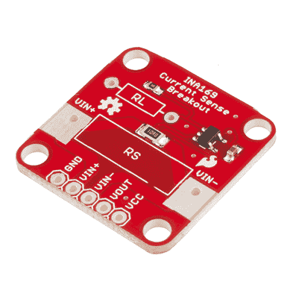
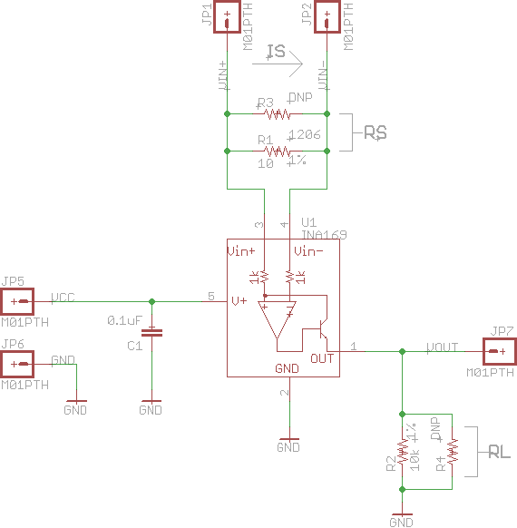
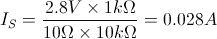
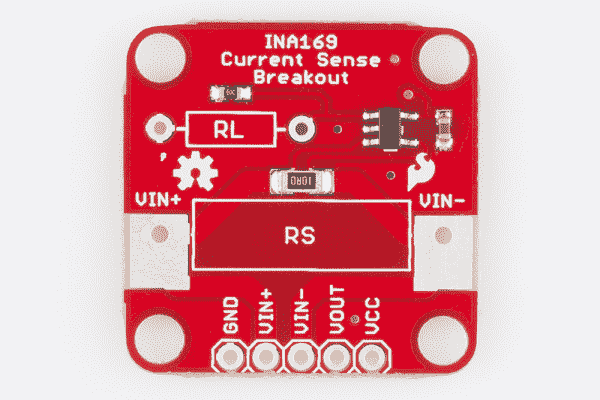
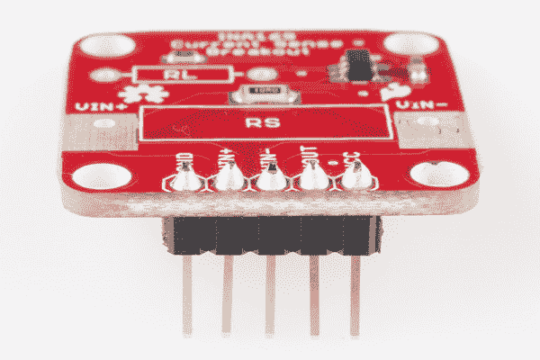
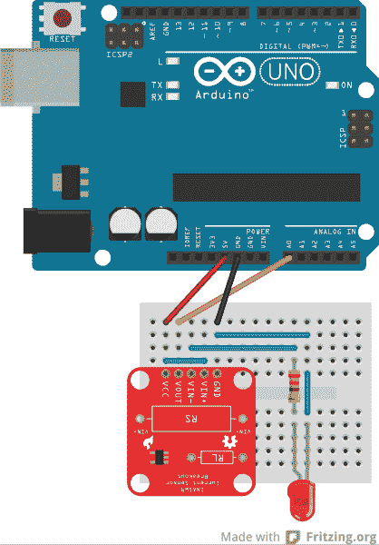
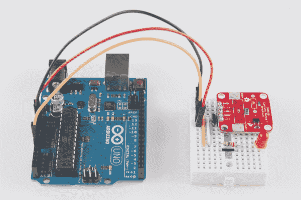
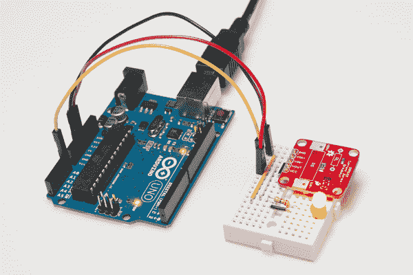
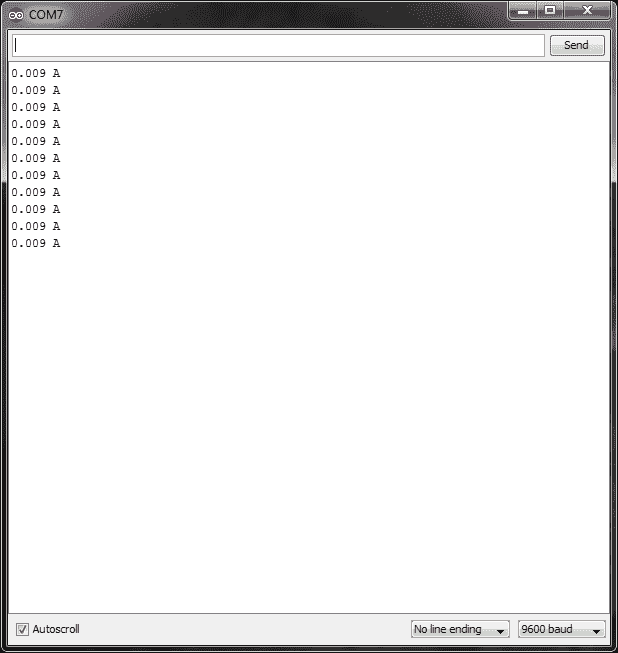

# INA169 分线板连接指南

> 原文：<https://learn.sparkfun.com/tutorials/ina169-breakout-board-hookup-guide>

## 介绍

有一个项目需要测量电流消耗吗？需要仔细监控流经 LED 的低电流？INA169 的[就是给你的芯片！](https://www.sparkfun.com/products/12040)

[](https://www.sparkfun.com/products/12040) 

将**添加到您的[购物车](https://www.sparkfun.com/cart)中！**

### [火花电流传感器分接头- INA169](https://www.sparkfun.com/products/12040)

[In stock](https://learn.sparkfun.com/static/bubbles/ "in stock") SEN-12040

INA169 是一个“高端电流监控器”，这意味着您将一个电阻(一个“分流电阻”)放在正端

$11.501[Favorited Favorite](# "Add to favorites") 9[Wish List](# "Add to wish list")** **INA169 是一个“高端电流监控器”，这意味着在正电源轨上放置一个电阻(“分流电阻”)，INA169 测量该电阻上的压降。INA169 根据测得的压降输出小电流。如果在 INA169 的输出端与地之间放置一个电阻，就可以测量输出端的电压。通过一些基本的数学计算，输出电压可以得出流经分流电阻的电流。

### 本教程涵盖的内容

在本教程中，我们将介绍如何使用该板。“电路板概述”部分介绍了电流检测工作原理的一些理论和数学知识，如果您只是想了解电路板的工作情况，可以直接跳到连接示例。连接示例显示了如何将电路板连接到 Arduino，以便测量通过 LED 的电流，示例代码提供了一个快速 Arduino 示意图，用于向串行监视器显示测得的电流。

### 所需材料

*   [Arduino](https://www.sparkfun.com/products/11021) 、 [RedBoard](https://www.sparkfun.com/products/11575) 或任何 [Arduino 兼容](https://www.sparkfun.com/categories/242)板卡。
*   [公接头](https://www.sparkfun.com/products/116)焊接到电路板上，使其与试验板兼容。
*   [跳线](https://www.sparkfun.com/products/11026)从试验板连接到 Arduino。
*   将所有东西连接在一起的试验板。
*   基本红色 LED 灯这样我们就有东西可以点亮了。
*   [330ω电阻器](https://www.sparkfun.com/products/8377)用于限制通过 LED 的电流。

### 推荐阅读

*   [电压、电流、电阻和欧姆定律](https://learn.sparkfun.com/tutorials/voltage-current-resistance-and-ohms-law)
*   [电阻器](https://learn.sparkfun.com/tutorials/resistors)
*   [发光二极管](https://learn.sparkfun.com/tutorials/light-emitting-diodes-leds)
*   [如何使用试验板](https://learn.sparkfun.com/tutorials/how-to-use-a-breadboard)
*   什么是 Arduino？
*   [如何焊接](https://learn.sparkfun.com/tutorials/how-to-solder-through-hole-soldering)
*   [使用焊线](https://learn.sparkfun.com/tutorials/working-with-wire)

## 主板概述

看一下[原理图](https://learn.sparkfun.com/tutorials/how-to-read-a-schematic)，你会注意到分线板由一个分流电阻(R [S] )、INA169 芯片和一个输出电阻(R [L] )组成。虽然 R [S] 和 R [L] 看似有 2 个电阻，但电路板上只安装了一个。如果你想改变电阻值，你可以替换它们或者并联另一个电阻。

[](https://cdn.sparkfun.com/assets/6/d/4/b/1/52827c00757b7f75648b4567.png)*INA169 Current Sensing Breakout Schematic*

当电流从 V [IN+] 经过 R [S] 到 V [IN-] 时，它在 R [S] 两端产生一个电压降。INA169 芯片内部的运算放大器测量 V [IN+] 和 V [IN-] 电压之间的差值，并根据该差值输出电压。运算放大器的输出通过内部晶体管放大，晶体管从 INA169 芯片流出一个电流。当该电流通过 R [L] 到达地时，在 V [OUT] 处产生一个电压电平。

**IMPORTANT:** The INA169 is configured to measure DC only. The VIN+ pin must be at a higher potential than the VIN- pin, which means that the INA169 cannot measure AC.

### 测量电流

可以使用示波器或模数转换器测量 V [OUT] 处的电压。转换为源电流(I [S] )需要一点数学计算:

[](https://cdn.sparkfun.com/assets/b/5/1/6/6/528285ae757b7fd3648b4568.gif)

***I[S]*就是我们要测量的电流。**

***V[OUT]*是我们在 INA169 的输出端测得的电压。**

***1kω***是由于 INA169 的内部原因，我们需要包含的恒定电阻值。

***R[S]*是分流电阻的值。如果不修改电路板，则设置为 10ω。**

***R[L]*是输出电阻的值。如果不修改电路板，则设置为 10kΩ。**

### 例子

例如，假设您连接电路板，在 V [OUT] 处测得 2.8V。将这个代入我们的等式，我们会得到:

[](https://cdn.sparkfun.com/assets/4/4/2/2/4/52828c74757b7faa358b4567.gif)

这表明您有 0.028A(或 28mA)电流通过您的线路。

### 引脚排列

分线板上只有 5 个引脚。

[](https://cdn.sparkfun.com/assets/5/0/a/4/2/528502c5757b7f5c468b456a.jpg)

**GND** 应该连接到你要测量的电路的地

**VIN+** 需要连接到信号源的正极(如电池、输出引脚等)。)

**VIN-** 需要连接到负载的正极侧(例如 Arduino 上的 VCC、LED 的正极侧等)。)

**VOUT** 是测量输出，应连接到测量电压电平的设备，如万用表、示波器或 Arduino ADC 引脚

**VCC** 为 INA169 的供电电源，需要接 3.3V、5V 等。这可以是从 0 到 75V 的任何值。注意，V [OUT] 范围取决于 VCC 提供的电压。

除了 VIN+和 VIN-上的引脚之外，该板还在 R [S] 周围有两个大焊盘，如果您想要临时连接，可以使用鳄鱼夹。请注意，GND 和 VCC 仍然需要连接，板才能工作。

### 修改功能

INA169 无法检测 R [S] 上大于 500mV 的任何差异，一旦 R [S] 上的电压降至 35mV 以下，输出误差就会增加。如果包括内部晶体管上的压降，这意味着分线板的默认设置仅限于测量约 3.5mA 至 35mA 的电流范围。

如果你想改变这个范围，R [S] 和 R [L] 可以用不同阻值的电阻代替。R [S] 可以很容易地被移除并用另一个电阻器替换。R [L] 有点困难，因为它是一个小型表面贴装电阻。改变任何一个电阻都会改变上面的等式。

当 R [L] 为 10kΩ时，改变 R [S] 可以得到以下范围:

| **R[S]** | **电流感应范围** |
| 10Ω | 3.5 毫安-35 毫安 |
| 1Ω | 35mA - 350mA |
| 0.1Ω | 350 毫安-3.5 安 |

**IMPORTANT:** Be careful with the power rating on the resistor! If you choose a 0.1Ω resistor for R[S] and expect to see 3.5A through it, this can result in 1.2W of heat being generated - way too much for your average ¼W resistor! You will need a resistor that can handle at least 2W. The following power resistors are recommended:

*   欧姆米特 1ω1% 3W
*   欧姆接触 0.1ω1% 3W

## 连接示例

### 装配

你将需要[将](https://learn.sparkfun.com/tutorials/how-to-solder-through-hole-soldering)或者[导线](https://www.sparkfun.com/products/11375)或者[直阳接头](https://www.sparkfun.com/products/116)焊接到板上的 5 个接头孔。如果需要测量 35mA 以上的电流，则需要将 RS 电阻脱焊，并将一个阻值较低(例如 1ω)、功率较高(例如 3W)的电阻焊接到 RS 周围的孔中。

[](https://cdn.sparkfun.com/assets/c/b/f/5/1/528502ca757b7f18468b456a.jpg)*Headers are optional but recommended if you are using a breadboard.*

### 连接 INA169 分线板

[](https://cdn.sparkfun.com/assets/2/f/1/7/f/528503df757b7f4e458b4567.png)*Fritzing of the INA169 connected to an Arduino*

如图所示，将 Arduino 5V 连接到 INA169 VCC，将 Arduino GND 连接到 INA169 GND。要读取输出电压电平，我们需要在 Arduino A0 和 INA169 VOUT 引脚之间连接一条跳线电缆。

使用跳线连接 INA169 VCC 和 VIN+引脚，因为我们要用 Arduino 5V 为 LED 供电。如果通过 VIN+和 VIN-使用不同的电源(不是 Arduino 5V 或 3.3V)，请确保将电源的地连接到 INA169 板的地。只要确保从 VIN+到地测得的电压电平不超过 60V 即可。如果你这么做，董事会将会发生不好的事情。

在 INA169 VIN-和 LED 阳极之间连接一个 330ω电阻，在 LED 阴极和 GND 之间连接一根跳线。

[](https://cdn.sparkfun.com/assets/c/d/1/7/c/528502c5757b7f20468b4567.jpg)*Actual circuit example*

如果想测量流向其它设备的电流，可以在 RS 周围的裸露金属焊盘上使用鳄鱼夹。确保 INA169 板与正电源轨对齐，并且 INA169 GND 连接到目标的 GND。

## 示例代码

打开 Arduino 程序，将以下代码粘贴到草图中:

```
language:c
/*
 11-14-2013
 SparkFun Electronics 2013
 Shawn Hymel

 This code is public domain but you buy me a beer if you use this 
 and we meet someday (Beerware license).

 Description:

 This sketch shows how to use the SparkFun INA169 Breakout
 Board. As current passes through the shunt resistor (Rs), a
 voltage is generated at the Vout pin. Use an analog read and
 some math to determine the current. The current value is
 displayed through the Serial Monitor.

 Hardware connections:

 Uno Pin    INA169 Board    Function

 +5V        VCC             Power supply
 GND        GND             Ground
 A0         VOUT            Analog voltage measurement

 VIN+ and VIN- need to be connected inline with the positive
 DC power rail of a load (e.g. an Arduino, an LED, etc.).

 */

// Constants
const int SENSOR_PIN = A0;  // Input pin for measuring Vout
const int RS = 10;          // Shunt resistor value (in ohms)
const int VOLTAGE_REF = 5;  // Reference voltage for analog read

// Global Variables
float sensorValue;   // Variable to store value from analog read
float current;       // Calculated current value

void setup() {

  // Initialize serial monitor
  Serial.begin(9600);

}

void loop() {

  // Read a value from the INA169 board
  sensorValue = analogRead(SENSOR_PIN);

  // Remap the ADC value into a voltage number (5V reference)
  sensorValue = (sensorValue * VOLTAGE_REF) / 1023;

  // Follow the equation given by the INA169 datasheet to
  // determine the current flowing through RS. Assume RL = 10k
  // Is = (Vout x 1k) / (RS x RL)
  current = sensorValue / (10 * RS);

  // Output value (in amps) to the serial monitor to 3 decimal
  // places
  Serial.print(current, 3);
  Serial.println(" A");

  // Delay program for a few milliseconds
  delay(500);

} 
```

插入 Arduino 并上传代码。一旦接通电源，您应该会看到 LED 灯亮起。

[](https://cdn.sparkfun.com/assets/2/0/f/a/4/528502ca757b7fff458b4569.jpg)*The INA169 will measure the current through the LED.*

从工具->板中选择适当的板(在这种情况下是 Arduino Uno ),并从工具->串行端口中选择正确的 COM 端口。点击上传按钮，等待程序被编译并上传到 Arduino。从工具- >串行监视器中打开[串行监视器](https://learn.sparkfun.com/tutorials/terminal-basics/arduino-serial-monitor-windows-mac-linux),你应该看到当前的测量值被打印出来。

[](https://cdn.sparkfun.com/assets/9/2/7/6/6/5283cc52757b7f56508b4567.png)*If you are using a basic red LED, a 330Ω resistor, and a 5V supply, you should see 0.009A (9mA) on the Serial Monitor.*

如果我们想验证这个读数，可以用万用表测量 330ω电阻上的电压。您应该会看到电阻两端的电压约为 3V。利用欧姆定律，我们可以计算出流经电阻和 LED 的电流为 0.00909 A，与 INA169 的读数相匹配。

## 资源和更进一步

如果你想知道一个东西用了多少电流，INA169 是一个有用的芯片。例如:

*   在[不确定的 7 立方](https://learn.sparkfun.com/tutorials/the-uncertain-7-cube)上，你可以把 INA169 和电池的正极电源线串联起来(就是那根红线！)并测量电流消耗，以计算出您的电池可以使用多长时间。
*   类似地，将 INA169 连接到 [HUB-ee 小车的](https://learn.sparkfun.com/tutorials/building-the-hub-ee-buggy)电源，并确定在你需要更换那些 AA 电池之前你有多少时间。
*   或者使用 INA169 来确定如果[雪茄盒控制盒](https://learn.sparkfun.com/tutorials/creating-a-humidor-control-box)一直开着会消耗多少功率。

### 资源

*   [INA169 数据表](http://www.ti.com/lit/gpn/ina169)
*   [分线板示意图](https://github.com/sparkfun/INA169_Breakout/blob/master/Hardware/INA169_Breakout_Schematic.pdf?raw=true)
*   [Eagle 和项目文件](https://github.com/sparkfun/INA169_Breakout/archive/master.zip)
*   [GitHub 库](https://github.com/sparkfun/INA169_Breakout)**