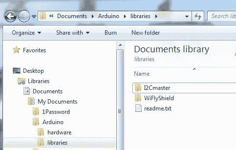

# 安装 Arduino 库

> 原文：<https://learn.sparkfun.com/tutorials/installing-an-arduino-library>

## 什么是图书馆？

Arduino 库接受复杂的任务，并将其归结为简单易用的函数。Arduino 用户已经为 Arduino 编写了许多令人兴奋的插件。例如，[电容检测](http://en.wikipedia.org/wiki/Capacitive_sensing)需要数字引脚的复杂时序和脉冲。我们可以从头开始写代码，也可以站在比我们聪明的伟人的肩膀上。

电容式触摸感应是一种非常流行的接口。 [CapacitiveSensor 库](http://playground.arduino.cc/Main/CapacitiveSensor)负责一切，这样我们就不必像这样编写代码:

```
language:c
*sOut &= ~sBit;        // set Send Pin Register low
*rReg &= ~rBit;        // set receivePin to input
*rOut &= ~rBit;        // set receivePin Register low to make sure pullups are off
*rReg |= rBit;         // set pin to OUTPUT - pin is now LOW AND OUTPUT
*rReg &= ~rBit;        // set pin to INPUT 
*sOut |= sBit;         // set send Pin High
interrupts();         // enable interrupts

while ( !(*rIn & rBit)  && (total < CS_Timeout_Millis) ) {
    total++;
}

if (total > CS_Timeout_Millis) 
    return -2;         //  total variable over timeout

// set receive pin HIGH briefly to charge up fully
noInterrupts();         // disable interrupts
*rOut  |= rBit;        // set receive pin HIGH - turns on pullup 
*rReg |= rBit;         // set pin to OUTPUT - pin is now HIGH AND OUTPUT
*rReg &= ~rBit;        // set pin to INPUT 
*rOut  &= ~rBit;       // turn off pullup
*sOut &= ~sBit;        // set send Pin LOW
interrupts();         // re-enable interrupts

while ( (*rIn & rBit) && (total < CS_Timeout_Millis) ) { 
    total++;
}

if (total >= CS_Timeout_Millis)
    return -2;     // total variable over timeout
else
    return 1; 
```

所有代码都可以替换为更易于使用和理解的语句，例如:

```
language:c
senseReading = myCapPad.capacitiveSensor(30); 
```

`myCapPad.capacitiveSensor()`负责所有繁重的工作，而`senseReading`变量包含从我们的电容板检测到的值。库使复杂的任务变得简单，这样我们就可以专注于更大的项目。

外面有成千上万的图书馆！幸运的是，安装它们非常容易。本教程将向您展示如何在 Arduino v1.0.5 中安装一个库，但应该适用于 Arduino 的许多过去、现在和未来版本。

### 推荐阅读

在进一步学习本教程之前，请确保您已经很好地理解了以下概念。

[](https://learn.sparkfun.com/tutorials/what-is-an-arduino) [### 什么是 Arduino？](https://learn.sparkfun.com/tutorials/what-is-an-arduino) What is this 'Arduino' thing anyway? This tutorials dives into what an Arduino is and along with Arduino projects and widgets.[Favorited Favorite](# "Add to favorites") 50[](https://learn.sparkfun.com/tutorials/installing-arduino-ide) [### 安装 Arduino IDE](https://learn.sparkfun.com/tutorials/installing-arduino-ide) A step-by-step guide to installing and testing the Arduino software on Windows, Mac, and Linux.[Favorited Favorite](# "Add to favorites") 16

如果您需要使用 Arduino IDE 的库管理器的更多信息，Arduino 网站也有关于安装库的详细说明，导入一个 ***。zip** 库，并手动安装。

[Arduino's Official Library Instructions](https://www.arduino.cc/en/Guide/Libraries)

## 使用 Arduino 库管理器

库管理器是从 Arduino IDE 版本 1.5 和更高版本(1.6.x)开始添加的。它位于“草图”菜单中的“包括库”、“管理库...”下

[](https://cdn.sparkfun.com/assets/learn_tutorials/3/3/1/LibraryManager.png)*Arduino 1.5+ Library Manager Menu Option*

当你打开库管理器时，你会发现一个很大的库列表，可以一键安装。要为您的产品查找库，请搜索产品名称或关键字，如“k type”或“digitizer”，您需要的库应该会显示出来。单击所需的库，将出现“安装”按钮。单击该按钮，库应该会自动安装。安装完成后，关闭库管理器。

[](https://cdn.sparkfun.com/assets/learn_tutorials/3/3/1/LibInstall.png)*Library in the Library Manager, Ready to be Installed*

或者，如果您有自己想要添加的库或尚未添加到库管理器的库，您可以单击“**添加”。ZIP 库**选项，这将允许你选择一个文件夹或 ***。包含您选择的库的 zip** 文件。

**Heads up!** In previous version of the Arduino IDE, all libraries were stored together deep within the contents folder of the Arduino application. However, in newer versions of the IDE, libraries added through the Library Manger can be found in a folder named '**libraries**' found in your Arduino Sketchbook folder.
For more information on the Library manger, including deleting and updating info, visit the [GitHub: Arduino - Library Manager FAQ](https://github.com/arduino/Arduino/wiki/Library-Manager-FAQ).

[GitHub: Arduino - Library Manager FAQ](https://github.com/arduino/Arduino/wiki/Library-Manager-FAQ)

现在库已经安装好了，可以在“示例”子菜单中找到一个示例草图。

[](https://cdn.sparkfun.com/assets/learn_tutorials/3/3/1/example.png)*Example Sketch*

由于这是 Arduino IDE 的一个相对较新的特性，在撰写本文时，并不是所有的 SparkFun 产品都在库管理器中有库。随着时间的推移，我们会增加新产品，并逐步淘汰旧产品。如果在管理器中找不到所需的库，或者由于某种原因无法安装某个现代 IDE 版本，请按照以下部分中的说明进行操作。

## 手动安装库- Windows

本节介绍在 Windows 环境下手动安装库，并使用了相当多的屏幕截图。如果你是一个文本学习者，那么看看 Arduino 教程中关于安装库的教程。

在本例中，我们将使用[电容检测](http://playground.arduino.cc/Main/CapacitiveSensor)库。导航到库的页面并下载 zip 文件。

[](//cdn.sparkfun.com/assets/9/d/e/2/b/51280175ce395fec2c000002.jpg)*The contents of the Capacitive Sense zip file*

在本地计算机上找到 zip 文件(下载文件的最终位置)。在 Windows 下，你应该能够双击文件来打开它。

这个特殊的库包含基本 Arduino 和更高级 Arduino Due 的库。如果您愿意，您可以使用这两个文件夹，但是，对于本例，我们将只复制和安装 *CapacitiveSensor* 文件夹。

[](//cdn.sparkfun.com/assets/c/e/4/a/8/50f04a47ce395fed5d000000.jpg)

库通常会包含一个 ***。cpp** 文件和**。h** 档。大多数还会包含一个*示例*文件夹。

[](//cdn.sparkfun.com/assets/5/c/e/c/2/51280267ce395fba2c000000.jpg)

在 Windows 下，Arduino 将所有的附加库存储在 *My Documents* 文件夹中。这里我们看到了 Arduino *库*文件夹的位置。

打开浏览器窗口，导航到 *My Documents* 下的 libraries 文件夹。现在将新的*电容传感器*文件夹复制到*库*文件夹。

[](//cdn.sparkfun.com/assets/6/1/5/f/e/5128042fce395f022d000001.jpg)

成功！

**Note:** Arduino does not allow library folders to contain symbols such as hyphens ‘ - ’. Arduino will throw an error upon starting up. If the library you are installing has a funky folder name then this step is the ideal time to clean it up.

[](http://cdn.sparkfun.com/assets/3/c/d/f/9/50f04a48ce395fe460000001.jpg)

要验证库是否已正确安装，请打开 Arduino IDE 下的 *Examples* 文件夹。等等。哪里有*电容式传感器*的例子？复制粘贴目录的时候有没有打开 Arduino？Arduino 会在启动时检查资源库目录，因此，如果您已经打开了 Arduino，则在任何时候添加到资源库目录时，您都需要重新启动 Arduino。

[](//cdn.sparkfun.com/assets/4/b/f/e/e/51280533ce395f662d000000.jpg)

如果您没有看到 CapacitiveSensor 示例，请尝试关闭并重新打开 Arduino IDE。

[](//cdn.sparkfun.com/assets/f/b/b/e/5/51280488ce395f932d000000.jpg)

在那里！让我们打开新库提供的示例。

[](//cdn.sparkfun.com/assets/9/0/5/f/8/50f04a47ce395f0f5e000000.jpg)

**例子**是关于图书馆最伟大的事情！好的库会有很好的例子来展示如何使用这个库。这些草图是很好的资源，例如代码和学习如何在 Arduino 下写好代码。

现在，您已经安装了电容式传感器库！请随意从示例草图开始，或者使用库提供的函数开始编写自己的代码。一个库通常在它的站点上有文档，或者在自述文件和示例代码中有文档。一般来说，要快速学习如何使用库，请查看示例代码。

## 手动安装库- Mac

本节介绍如何在 Mac OS X 环境下手动安装库。如果你是一个文本学习者，那么看看 Arduino 教程中关于安装库的教程。

在本例中，我们将使用[电容检测](http://playground.arduino.cc/Main/CapacitiveSensor)库。导航到库的页面并下载 zip 文件。

在本地计算机上找到 zip 文件(下载文件的最终位置)。解压缩它，并查看文件夹内容。

[](https://cdn.sparkfun.com/assets/a/9/5/7/b/52af4a1f757b7fce6c8b4567.jpg)*The contents of the Capacitive Sense zip file. Libraries will usually contain a *.cpp* file and *.h* file. Most will also contain an *examples* folder.*

这个特殊的库包含基本 Arduino 和更高级 Arduino Due 的库。如果您愿意，您可以使用这两个文件夹，但是，对于本例，我们将只复制和安装 *CapacitiveSensor* 文件夹。

现在我们需要将这个文件夹添加到 Arduino 的 Libraries 文件夹中。这个文件夹在 OS X 中有些隐藏。要到达那里，你可以做两件事之一。选项一，右键单击位于 Dock 中的 Arduino 图标。进入**选项**，然后点击**在 Finder** 中显示。

[](https://cdn.sparkfun.com/assets/c/2/b/7/0/52af48ed757b7fa25e8b4567.jpg)

选项二，在 Finder 中找到位于“应用程序”文件夹中的 Arduino 应用程序。现在，右键单击 Arduino 应用程序，并选择“**显示包内容**”。这两种选择都可以让你达到这一步。

[](https://cdn.sparkfun.com/assets/7/0/2/4/1/52af48da757b7f795e8b4567.jpg)

浏览以下文件夹，'**内容- >资源- > Java** ，直到到达'**库**文件夹。

**Note:** If you don't have a libraries folder, simply create one here in this location.[](https://cdn.sparkfun.com/assets/5/b/9/5/9/52af48da757b7f9b5e8b4567.jpg)

libraries 文件夹内是您想要复制/移动刚刚下载和解压缩的 library 文件夹的位置。您还会注意到，这是所有默认库以及您过去可能安装的任何其他库所在的位置。

[](https://cdn.sparkfun.com/assets/9/9/2/e/6/52af4db8757b7f0b388b4567.jpg)**Note:** Arduino does not allow library folders to contain symbols such as hyphens ‘ - ’. Arduino will throw an error upon starting up. If the library you are installing has a funky folder name then this step is the ideal time to clean it up.

[](http://cdn.sparkfun.com/assets/3/c/d/f/9/50f04a48ce395fe460000001.jpg)

接下来，如果安装库时 Arduino IDE 是打开的，请确保重新启动它。这是非常重要的一步，但经常被忽视。如果不重新启动，IDE 将无法使用刚刚安装的库。

要验证库是否已经正确安装，打开 Arduino IDE 下的'**文件>示例**'文件夹。

[](https://cdn.sparkfun.com/assets/2/f/c/4/9/52af4e11757b7f85238b4568.jpg)

在那里！让我们打开新库提供的示例。

[](//cdn.sparkfun.com/assets/9/0/5/f/8/50f04a47ce395f0f5e000000.jpg)

**例子**是关于图书馆最伟大的事情！好的库会有很好的例子来展示如何使用这个库。这些草图是很好的资源，例如代码和学习如何在 Arduino 下写好代码。

现在，您已经安装了电容式传感器库！请随意从示例草图开始，或者使用库提供的函数开始编写自己的代码。一个库通常在它的站点上有文档，或者在自述文件和示例代码中有文档。一般来说，要快速学习如何使用库，请查看示例代码。

## 资源和更进一步

如果你正在寻找一些很棒的图书馆，这里有一些我们最喜欢的:

*   TinyGPS 是 GPS 模块接口的黄金标准。
*   SevSeg 是我们编写的一个库，用来更容易地控制 7 段显示器。
*   Sdfat 是一个非常好的库，可以让你读写 SD 卡上的文件。非常适合数据记录！请务必检查库中包含的所有示例。
*   [MP3Shield](http://www.billporter.info/2012/01/28/sparkfun-mp3-shield-arduino-library/) 是一个很好的例子，SparkFun 的客户利用复杂的示例代码创建了一个非常好的库，使设备更容易使用。
*   [EEPROM](http://arduino.cc/en/Reference/EEPROM) 是一个内置库，允许用户读取和存储 ATmega328 的非易失性存储器中的设置。非常有用！
*   [电容传感器](http://playground.arduino.cc/Main/CapacitiveSensor)是我们在本教程中涉及的库。它非常适合非接触式电容开关和磁场检测。
*   红外遥控器是一个伟大的库，用于读取红外遥控器的信号，并控制基于红外遥控器的东西，如电视和音响系统。

### 内置库

您可能没有意识到，但是您可能已经在使用库了！如果您使用过:

```
Serial.print("Hello world!"); 
```

那么您使用的是 Arduino 内置的 Serial()库。Arduino 有相当多的内置库。这里是您可以立即开始使用的标准库的[列表！](http://arduino.cc/en/Reference/Libraries)

[Arduino.cc Standard Libraries](http://arduino.cc/en/Reference/Libraries)

### 编写自己的 Arduino 库

一旦你使用了不同的库，考虑写你自己的库吧！这里有一个很好的教程，展示如何[编写自己的库](http://arduino.cc/en/Hacking/LibraryTutorial)，这样你就可以通过使复杂的任务变得简单一点来帮助这个世界。

[Arduino.cc Writing a Library for Arduino Library](http://arduino.cc/en/Hacking/LibraryTutorial)

### 在库管理器中包括您的库

如果你想把它包含在 Arduino IDE 库管理器中，确保你的库符合标准。

[GitHub: Arduino - Wiki Arduino IDE 1.5: Library Specification](https://github.com/arduino/Arduino/wiki/Arduino-IDE-1.5:-Library-specification)

然后在下面链接的 Arduino IDE 的 GitHub repo 中为您的第三方库提交发布请求。关于提交请求的例子，请查看 SparkFun 的[指纹扫描仪 TTL 库请求](https://github.com/arduino/Arduino/issues/7319)。

[GitHub: Arduino - Issues](https://github.com/arduino/Arduino/issues)

## 寻找合适的 Arduino？

查看我们的 **[Arduino 对比指南](https://www.sparkfun.com/standard_arduino_comparison_guide)** ！我们已经编译了我们携带的每个 Arduino 开发板，因此您可以快速比较它们，找到最适合您需求的开发板。

带我去那里！


### 更多 Arduino

如果你正在寻找更多的 Arduino 教程，看看这些:

[](https://learn.sparkfun.com/tutorials/installing-an-arduino-bootloader) [### 安装 Arduino 引导程序](https://learn.sparkfun.com/tutorials/installing-an-arduino-bootloader) This tutorial will teach you what a bootloader is and why you would need to install or reinstall it. We will also go over the process of burning a bootloader by flashing a hex file to an Arduino microcontroller.[Favorited Favorite](# "Add to favorites") 25[](https://learn.sparkfun.com/tutorials/connecting-arduino-to-processing) [### 将 Arduino 连接到处理](https://learn.sparkfun.com/tutorials/connecting-arduino-to-processing) Send serial data from Arduino to Processing and back - even at the same time 35[](https://learn.sparkfun.com/tutorials/data-types-in-arduino) [### Arduino 中的数据类型](https://learn.sparkfun.com/tutorials/data-types-in-arduino) Learn about the common data types and what they signify in the Arduino programming environment.[Favorited Favorite](# "Add to favorites") 38[](https://learn.sparkfun.com/tutorials/choosing-an-arduino-for-your-project) [### 为您的项目选择 Arduino](https://learn.sparkfun.com/tutorials/choosing-an-arduino-for-your-project) Examining the diverse world of Arduino boards and understanding the differences between them before choosing one for a project.[Favorited Favorite](# "Add to favorites") 18

或者看看这篇博文，了解更多想法。

[](https://www.sparkfun.com/news/2194 "October 3, 2016: When writing a library, pass in I2C ports to make the library more useful on different platforms.") [### 通用化 Arduino 库

October 3, 2016](https://www.sparkfun.com/news/2194 "October 3, 2016: When writing a library, pass in I2C ports to make the library more useful on different platforms.")[Favorited Favorite](# "Add to favorites") 4[](https://www.sparkfun.com/news/3245 "February 19, 2020: We've written hundreds of libraries and made lots of mistakes. Learn the basics of how to write a good library.") [### 如何编写一个伟大的 Arduino 库

February 19, 2020](https://www.sparkfun.com/news/3245 "February 19, 2020: We've written hundreds of libraries and made lots of mistakes. Learn the basics of how to write a good library.")[Favorited Favorite](# "Add to favorites") 5