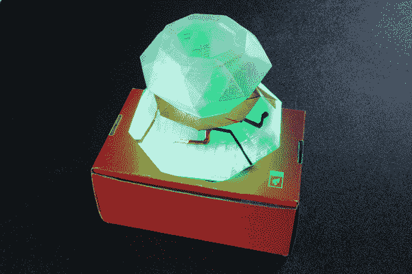

# 互动 3D 打印 LED 钻石道具

> 原文：<https://learn.sparkfun.com/tutorials/interactive-3d-printed-led-diamond-prop>

## 介绍

我的学生有一场主题为“电影之夜”的舞蹈表演我决定选择一个基于旧电视节目《碟中谍》中“钻石”一集的故事。为了让孩子们觉得有趣，并更好地向观众传达这个故事，我决定制作一个互动的 3D 打印钻石。在本教程中，您将学习如何 3D 打印模型并在舞台道具中嵌入电子设备。

### 所需材料

要跟随本项目教程，您将需要以下材料。你可能不需要所有的东西，这取决于你拥有什么。将它添加到您的购物车，通读指南，并根据需要调整购物车。