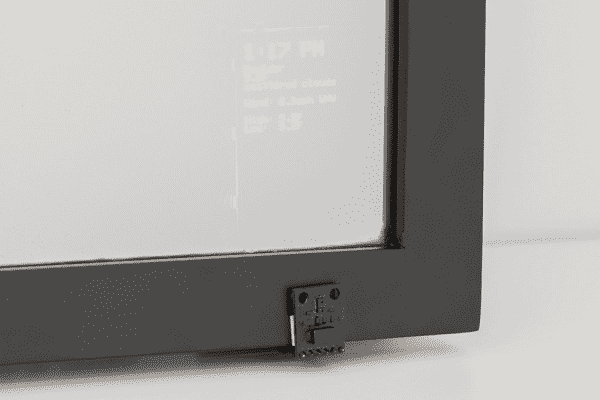

# 交互式智能镜子

> 原文：<https://learn.sparkfun.com/tutorials/interactive-smart-mirror>

## 介绍

在最近一集的 [The Fellowship of the Things](https://www.youtube.com/playlist?list=PLBcrWxTa5CS0w7y-yDVVwsF39ggOm8a7x) 中，我们构建了一个智能镜子，在右下角谨慎地显示天气数据。这个想法是，当你做早上的事情时，比如刷牙、化妆、刮胡子等等。，你可以浏览当天的天气。

虽然在单向镜子后面贴一个 LCD 的想法并不新鲜，但我们希望让我们的产品更具互动性。这个版本的智能镜子使用了一个 [APDS-9960 手势传感器](https://www.sparkfun.com/products/12787)，所以你可以简单地挥手改变显示。

### 所需材料

对于这个构建，您将需要一些电子设备: