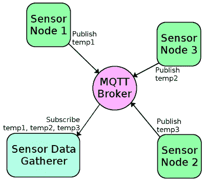

# MQTT 简介

> 原文：<https://learn.sparkfun.com/tutorials/introduction-to-mqtt>

## 介绍

在本教程中，您将学习关于 MQTT 消息传递协议的所有知识，为什么要使用它，以及它是如何实现的。简而言之，MQTT 使用您现有的互联网家庭网络向您的物联网设备发送消息，并对这些消息做出响应。

### 简史

MQTT ( **M** 消息 **Q** 使用 **T** 遥测 **T** 传输)是一个发布/订阅消息协议，它工作在 TCP/IP 协议之上。该协议的第一个版本是由 IBM 的安迪·史丹福-克拉克和 Cirrus Link 的阿尔伦·尼珀于 1999 年开发的。MQTT 比使用物联网设备发送 HTTP 请求更快的原因是 MQTT 消息可以小到 2 个字节，而 HTTP 需要包含许多其他设备可能不关心的信息的报头。此外，如果有多个设备等待 HTTP 请求，您需要向每个客户端发送一个 POST 操作。使用 MQTT，当服务器从一个客户机接收信息时，它会自动将该信息分发给每个感兴趣的客户机。

### 所需材料

为了遵循本教程中的示例，您将需要以下硬件。你可能不需要所有的东西，这取决于你拥有什么。将它添加到您的购物车，通读指南，并根据需要调整购物车。