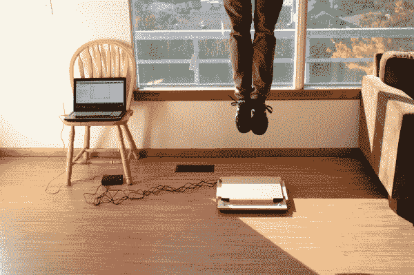
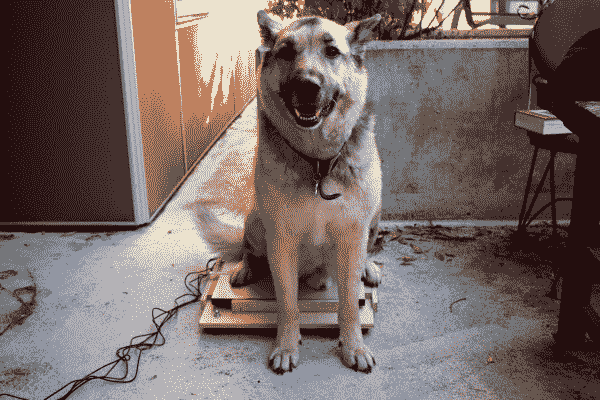

# 物联网产业规模

> 原文：<https://learn.sparkfun.com/tutorials/iot-industrial-scale>

## 介绍

一只小象有多重？*一跳的冲击力有多大？？不看里面，你怎么知道一个雨水桶是否满了？？？使用 [SparkFun OpenScale board](https://www.sparkfun.com/products/13261) 构建您自己的物联网(“IoT”)工业规模，回答所有这些问题以及更多问题！

这个项目是为那些有一点使用 Arduino 或其他微控制器背景的人设计的。但是，无论这是你的第一个还是第 137 个项目，请查看下面建议阅读部分(以及整个教程)中的链接，或者如果你有任何问题，请留下[评论](https://learn.sparkfun.com/tutorials/iot-industrial-scale/discuss)！

**读取时间**:约 15 分钟。

**建造时间**:大约。2 - 3 小时

* *要给小象称重，你可能需要是动物园管理员，或者有一个大象朋友..但是你总是可以称出 Fido 和/或 kitty 的重量！*

对于所有视觉学习者，请查看下面的项目视频:

[https://www.youtube.com/embed/aqe5DJnyWiY/?autohide=1&border=0&wmode=opaque&enablejsapi=1](https://www.youtube.com/embed/aqe5DJnyWiY/?autohide=1&border=0&wmode=opaque&enablejsapi=1)

### 所需材料

为了方便您的使用，我们列出了所有使用的部件，以便您使用。

#### 电子学

*   [开秤](https://www.sparkfun.com/products/13261) (+迷你 USB 转 USB 线)
*   四(4) [测力传感器](https://www.sparkfun.com/products/13332)(或应变仪，取决于需要和预算)
*   [粒子光子微控制器](https://www.sparkfun.com/products/13345)或其他[数据记录器](https://www.sparkfun.com/products/13712) (+微型 USB 转 USB 线)
*   [试验板](https://www.sparkfun.com/products/12002)(或 PCB 板)
*   [22 号绞合线](https://www.sparkfun.com/products/11375)(试验板线也可以工作)

**使系统无线化:**

*   [SparkFun 阳光伙伴](https://www.sparkfun.com/products/12885)和/或 [SparkFun 光子电池护罩](https://www.sparkfun.com/products/13626)
*   一块 2000 毫安时[聚合物锂离子电池](https://www.sparkfun.com/products/8483)

所有这些零件都可以在下面的愿望清单中找到。