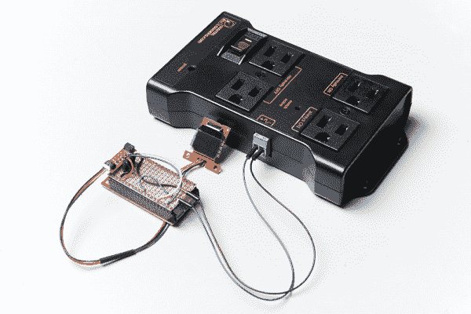

# 物联网电源继电器

> 原文：<https://learn.sparkfun.com/tutorials/iot-power-relay>

## 介绍

在本教程中，我们将向您展示如何在 [ESP32 Thing](https://www.sparkfun.com/products/13907) 上托管一个网页，该网页将允许您设置[功率继电器](https://www.sparkfun.com/products/14236)打开或关闭的时间。

它利用我们的 [ESP32 东西](https://www.sparkfun.com/products/13907)、[物联网电源继电器](https://www.sparkfun.com/products/14236)和 [Qwiic 微型有机发光二极管屏幕](https://www.sparkfun.com/products/14532)来创建一个智能插座，可以维持每周计划，为任何你想要定期循环的交流供电负载供电。

### 所需材料

#### 五金器具

为了跟进这个项目，你需要以下材料。根据你所拥有的，你可能不需要清单上的所有东西。将它添加到您的购物车，通读指南，并根据需要调整购物车。