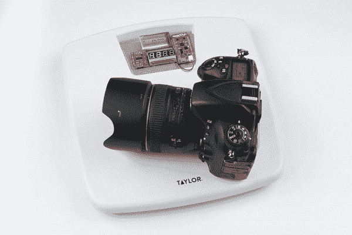

# 物联网重量记录秤

> 原文：<https://learn.sparkfun.com/tutorials/iot-weight-logging-scale>

## 介绍

本教程将向您展示如何破解浴室秤，将体重数据发布到您创建的自定义网站上！其中涉及的原理可以很容易地适用于您选择的任何类型的传感器数据:日照、温度、天气数据或任何其他您想要随时间跟踪并获得可视化的数据。

它使用一个 [ESP32 东西](https://www.sparkfun.com/products/13907)从一个 [HX711 称重传感器放大器](https://www.sparkfun.com/products/13879)读取称重传感器数据，并在一个[串行 7 段显示器](https://www.sparkfun.com/products/11441)上显示该数据，同时将其发布到一个基于 [Python 的](https://www.sparkfun.com/python)网站，该网站可以托管在本地或云上。

### 所需材料

#### 五金器具

为了跟进这个项目，你需要以下材料。你可能不需要所有的东西，这取决于你拥有什么。将它添加到您的购物车，通读指南，并根据需要调整购物车。