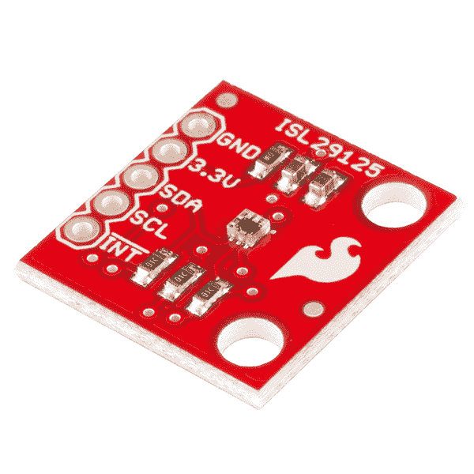
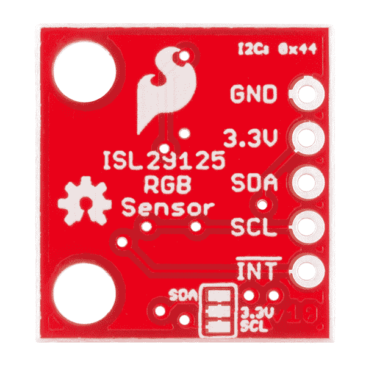

# ISL29125 RGB 光传感器连接指南

> 原文：<https://learn.sparkfun.com/tutorials/isl29125-rgb-light-sensor-hookup-guide>

## 介绍

如果您有一个依赖于感应不同可见光光谱并根据这些测量结果做出反应的项目想法，ISL29125 分线板可能正是您所需要的。

[](https://cdn.sparkfun.com/assets/learn_tutorials/2/2/7/angled.jpg)

如上所述，ISL29125 分线板与我们的 Arduino 库相结合，可以非常轻松地检测和记录可见光的一般红色、绿色和蓝色光谱的光强。您可以在各种项目中使用这些颜色强度读数:记录它们以找到模式或使用它们创造性地做出控制决策。

本教程将向您展示硬件的一面——分线板概述以及如何将其连接到 Arduino。然后，我们将讨论固件/编程部分——如何使用我们的库尽快从传感器获取读数。从那里你可以继续你的项目，或者了解这种芯片更高级的用途。在最后一节中，我们将向您展示如何针对更具体的需求配置芯片，以及如何使用中断驱动方法来提醒您传感器读数的变化。

### 所需材料

*   [ISL29125 分线板](https://www.sparkfun.com/products/12829)
*   [ISL29125 Arduino 库](https://cdn.sparkfun.com/tutorialimages/ISL29125/SFE_ISL29125_Library.zip)
*   [Arduino Uno(或 Arduino 兼容板)](https://www.sparkfun.com/products/11224)
*   [逻辑电平转换器(如果使用 3.3V Arduino 兼容，则不需要)](https://www.sparkfun.com/products/12009)

### 推荐阅读

*   [安装 Arduino 库](https://learn.sparkfun.com/tutorials/installing-an-arduino-library)
*   [逻辑电平](https://learn.sparkfun.com/tutorials/logic-levels)
*   [使用逻辑电平转换器板](https://learn.sparkfun.com/tutorials/bi-directional-logic-level-converter-hookup-guide)
*   [通过 I ² C 协议](https://learn.sparkfun.com/tutorials/i2c)进行串行通信
*   [使用 Github](https://learn.sparkfun.com/tutorials/using-github)

## 硬件概述

ISL29125 分线板的零件非常简单。它由传感器芯片本身、用于 I ² C 和中断线路的两个去耦电容和 3 个上拉电阻组成。

[](https://cdn.sparkfun.com/assets/learn_tutorials/2/2/7/top.jpg)

主标题允许您与电路板进行交互。只需将电源(3.3V)和地连接到指定的过孔。将 I ² C 线——SDA 和 SCL——连接到微控制器上相应的管脚。如果需要，您也可以连接！INT 引脚连接到微控制器的中断引脚。确保电源和逻辑使用 3.3V。芯片不能承受 5V 电压，如果对电源或任何输入施加 5V 电压，芯片将会损坏。如果你用 5V 微控制器控制芯片，使用[逻辑电平转换器](https://www.sparkfun.com/products/12009)。

[](https://cdn.sparkfun.com/assets/learn_tutorials/2/2/7/bottom.jpg)

如果您想禁用板载 10kωI²C 上拉电阻——如果您想使用微控制器或其它外部上拉电阻——只需切断电路板背面三个焊盘之间的两条走线。如果您决定以后要上拉，您可以随时将焊盘重新焊接在一起。

* * *

现在，您已经熟悉了该板，让我们启动并运行它。

## 读取 RGB 值

### 硬件连接

在深入研究代码之前，我们需要将 Arduino Uno 连接到 ISL29125 分线板。将 Arduino 上的 3.3V 和 GND 连接到分线板上的 3.3V 引脚。将分线点上的 SDA 连接到 Uno 上的 A4，将 SCL 连接到 Uno 上的 A5。如果您使用 Uno 或任何 5V Arduino，您需要在分线点的 SDA/SCL 和 Uno 的 A4/A5 之间安装一个逻辑电平转换器。如果你不知道如何使用转换器，这篇[逻辑电平转换教程](https://learn.sparkfun.com/tutorials/bi-directional-logic-level-converter-hookup-guide)解释了如何使用。

现在硬件已经准备好了，让我们来看软件。

### 安装库

现在硬件已经设置好了，您需要为 ISL29125 安装 Arduino 库。[点击这里下载库](https://cdn.sparkfun.com/tutorialimages/ISL29125/SFE_ISL29125_Library.zip)。或者你可以在 [GitHub](https://github.com/sparkfun/SparkFun_ISL29125_Breakout_Arduino_Library) 上下载最新版本的代码。

要安装库，解压并将库文件夹放在 Arduino sketchbook 的“libraries”文件夹中。有关安装库的更多帮助，请参考 [Arduino 库安装指南](https://learn.sparkfun.com/tutorials/installing-an-arduino-library)。

### 基本示例草图

在 Arduino IDE 中，进入**文件** > **实例**>**spark fun _ ISL 29125 _ Arduino _ Library**>**ISL 29125 基础知识**。这将加载一个简单的示例，让您快速读取红色、绿色和蓝色光谱中的光强度水平。让我们深入到示例草图中。

#### 设置

要设置这个示例，我们只需声明一个传感器对象，并运行一个与传感器通信的基本初始化函数。该功能将命令 ISL29125 开始读取红色、绿色和蓝色。除了调用`RGB_sensor.init()`，`setup()`功能还启动串行通信，这样我们可以将传感器的信息发送到我们的串行监视器(确保将串行监视器设置为 115200 波特)。

```
language:cpp
// Declare sensor object
SFE_ISL29125 RGB_sensor;

void setup()
{
  // Initialize serial communication
  Serial.begin(115200);

  // Initialize the ISL29125 with simple configuration so it starts sampling
  if (RGB_sensor.init())
  {
    Serial.println("Sensor Initialization Successful\n\r");
  }
} 
```

#### 读取传感器值

现在，我们如何实际获取这些传感器读数？那是下一个。传感器读数存储为 16 位无符号整数。使用这个库，我们可以调用我们的传感器对象函数`readRed()`、`readGreen()`和`readBlue()`来分别获得红色、绿色和蓝色的光强读数。每次通过`loop()`，我们获取这些读数，将它们打印到串行监视器，然后等待几秒钟。以下是该功能的代码:

```
language:cpp
// Read sensor values for each color and print them to serial monitor
void loop()
{
  // Read sensor values (16 bit integers)
  unsigned int red = RGB_sensor.readRed();
  unsigned int green = RGB_sensor.readGreen();
  unsigned int blue = RGB_sensor.readBlue();

  // Print out readings, change HEX to DEC if you prefer decimal output
  Serial.print("Red: "); Serial.println(red,HEX);
  Serial.print("Green: "); Serial.println(green,HEX);
  Serial.print("Blue: "); Serial.println(blue,HEX);
  Serial.println();
  delay(2000);
} 
```

如果您只是想记录、查看传感器读数，或在项目的进一步计算中使用，这就是您真正需要知道的。然而，如果你想知道更多关于传感器配置的细节——或者如何基于特定的传感器读数触发处理器中断——请继续阅读高级部分。

## 先进的

除了基本读数，ISL29125 还允许您定制传感器的配置，以满足您应用的特定需求。库中有一个`config()`函数，它有三个参数——每个传感器的配置寄存器一个。这将是我们定制 ISL29125 操作的主要工具。

### 配置活动通道和中断

让我们看一下“ISL29125_interrupts”示例，它演示了如何配置中断。本例配置为传感器仅读取红色值，并在红色传感器读数高于指定阈值时触发处理器中断。

在我们使用中断之前，我们必须配置它们——设置它们。在`setup()`函数中，如我们在基本示例中所做的那样初始化传感器后，我们用这个函数调用配置传感器:

```
language:cpp
RGB_sensor.config(CFG1_MODE_R | CFG1_10KLUX, CFG2_IR_ADJUST_HIGH, CFG3_R_INT | CFG3_INT_PRST8); 
```

我们使用第一个配置寄存器——用第一个参数设置——来定义采样模式。在这种情况下，我们只希望传感器收集红色光谱中的数据，这样就不会浪费时间对蓝色和绿色进行采样。我们在基本示例(幕后设置)中使用的模式是`CFG1_MODE_RGB`，它收集所有三种颜色的数据。该模式可以设置为任何单独的颜色，两种颜色的组合，甚至省电和待机模式。

除了设置采样的通道，第一个参数还用于设置光强度。我们将光强度等级设置为 10k lux，这是正常光照水平的最佳值。光强度只有一种选择——375 勒克斯——这对于非常黑暗的环境更好。该寄存器也可用于将传感器读数从 16 位更改为 12 位，以获得精度较低但速度较快的读数。它甚至可以将 INT 引脚变为触发数据采样的输入。

用于设置这些寄存器的常数以及关于使用它们的其他信息可以在库目录下的“SFE_ISL29125.h”文件中找到。现在或根据需要，您可以随意查看。

第二个配置寄存器只与 IR 滤波有关。正确地设置它，涉及用特定类型的灯进行测量的校准过程。[数据表](https://cdn.sparkfun.com/tutorialimages/ISL29125/isl29125.pdf)在第 13 页和第 14 页解释了这个过程，而关于寄存器本身的更多信息在第 10 页和第 11 页。如果您不确定该寄存器要设置什么，从值`CFG_DEFAULT`或`CFG2_IR_ADJUST_HIGH`开始。在这个例子中，我们使用了后者，它非常适合 SparkFun 的办公环境。如果这两种方法都不适合您的应用，请尝试使用不同的值，或者遵循数据手册的校准流程。

第三个配置寄存器是关于中断的，如果您不使用它们，可以保留为默认值。在本例中，我们设置了`CFG3_R_INT`，告知传感器根据传感器读取的红色值触发中断。你也可以设置为绿色、蓝色或关闭，但是没有办法同时触发多种颜色。

### 设置中断阈值

既然中断已经打开，那么它们实际上什么时候触发呢？这与阈值有关，让我们看看我们示例的`setup()`函数中的下一行代码。

```
language:cpp
RGB_sensor.setUpperThreshold(0x0B00);
//RGB_sensor.setLowerThreshold(0x0300); 
```

要触发中断，红色传感器值必须高于上限阈值或低于下限阈值。我们用上面的函数设置这两个阈值，但是在这个例子中，我们只使用上面的一个。默认情况下，上限阈值为`0xFFFF` -传感器读数的最高值-下限阈值默认为`0x0000` -传感器读数的最低值。

那么，如果红色传感器读数超过`0x0B00`一次，是否会触发中断？嗯，如果我们用选项`CFG3_INT_PRST1`配置第三个寄存器，那么答案是肯定的。但在本例中，我们使用了`CFG3_INT_PRST8`，这意味着传感器必须连续八次读数超过设定的阈值，才会触发中断。这有助于防止误报，并使我们能够看到更大的画面，而不用担心突然的波动。随意改变中断持续时间，使之最适合您的应用。它可以设置为 1、2、4 或 8。

### 处理中断

现在我们已经了解了配置传感器的更多细节，让我们更深入地研究一下这个例子。我们的 Arduino 实际上是如何使用这些来自传感器的中断的呢？

传感器的 INT 引脚为低电平有效。这意味着它保持在 3.3V，直到满足中断条件，此时它变为低电平(地)。在我们的例子中，我们将此引脚连接到数字引脚 2——Arduino 的外部中断引脚之一(如果需要，使用逻辑电平转换器，就像我们对 I ² C 线所做的那样)。

在我们的`setup()`中，我们将这个中断连接到一个函数，也称为中断服务程序(ISR)。以下代码执行此操作:

```
language:cpp
attachInterrupt(0, increment, FALLING); 
```

这使得中断 Uno 上的数字引脚 2)在中断引脚从高电平变为低电平(下降沿)时调用`increment()`函数。因此，每当传感器连续八个样本读取到红色值高于`0x0B00`时，中断线路断开，并且在我们的代码中调用`increment()`函数。该函数简单地递增一个全局变量`i`，如下所示:

```
language:cpp
void increment()
{
    i++;
} 
```

每次通过我们的`loop()`，我们检查`i`是否不同于我们记录的`lasti`变量。如果是这样，我们打印中断号、红色传感器读数和自上次中断以来的毫秒数。最后，我们设置`lasti = i`，这样直到下一次中断，我们才再次进入 if 语句。我们还调用传感器的目标函数`readStatus()`，该函数清除中断标志并允许将来触发另一个中断。

如果你想更仔细地了解细节，这里有完整的`loop()`:

```
language:cpp
// Continuously check if an interrupt occured
// If so, print out interrupt #, sensor reading for red light, and time since last interrupt to serial monitor
void loop()
{
  static unsigned int lasti = 0; // Stores the number of the last interrupt
  static unsigned long ms = millis(); // Used to calculate the time between interrupts
  uint16_t red_value = 0; // Stores sensor reading for red light intensity
  uint8_t flags = 0; // Stores status flags read from the sensor

  // Check if an interrupt has occured, if so, enter the if block
  if (lasti != i)
  {
    // Read the detected light intensity of the red visible spectrum
    red_value = RGB_sensor.readRed();

    // Print out the interrupt # and sensor reading
    Serial.print("Interrupt #: ");
    Serial.println(i);
    Serial.print("Red Sensor Value (HEX): ");
    Serial.println(red_value, HEX);
    // Print out the # of milliseconds since the last interrupt
    Serial.print("Milliseconds since last interrupt: ");
    Serial.println(millis() - ms);
    Serial.println();
    ms = millis(); // Reset ms so we can start counting milliseconds up to the next interrupt

    // Set lasti to i, so that this if statement is not entered again until another interrupt is triggered
    lasti = i;

    // Read and clear the status flags including the interrupt triggered flag
    // This must be done otherwise another interrupt from the sensor can not be triggered
    flags = RGB_sensor.readStatus();

    // If you desire to see the reported status of the chip, uncomment the line below
    //checkSensorStatus(flags);
  }
} 
```

当你想监测光线水平的变化，但不知道它什么时候会发生时，中断是非常有用的。记住修改配置寄存器和中断阈值，使之适合您的应用。

## 资源和更进一步

现在，您已经熟悉了 ISL29125 传感器、分线板硬件、如何获取传感器读数以及如何实现高级配置和中断。享受试验，看看你为这种传感器找到了什么创造性的用途。请随时在 SparkFun 与我们分享您的项目和/或反馈！

### 额外资源

*   【Arduino 处理器中断
*   [安装 Arduino 库](https://learn.sparkfun.com/tutorials/installing-an-arduino-library)
*   [使用逻辑电平转换器板](https://learn.sparkfun.com/tutorials/bi-directional-logic-level-converter-hookup-guide)
*   [通过 I2C 协议的串行通信](https://learn.sparkfun.com/tutorials/i2c)
*   [使用 Github](https://learn.sparkfun.com/tutorials/using-github)