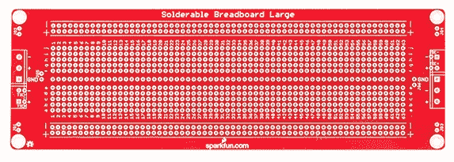
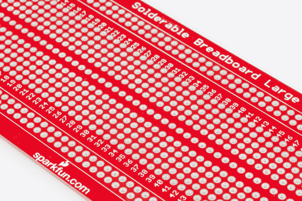
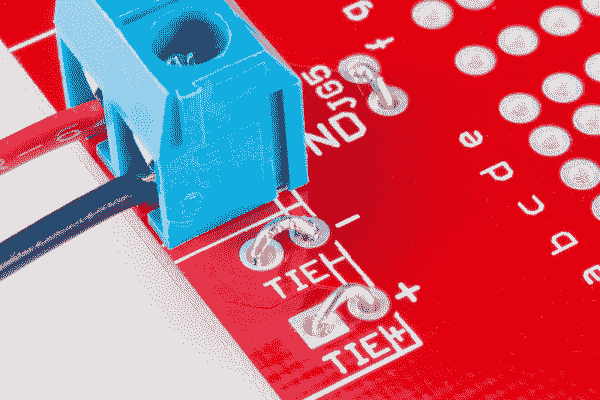
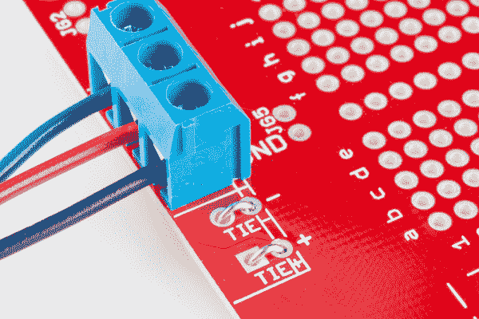
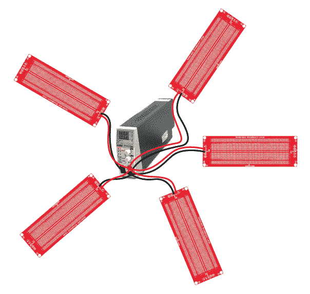
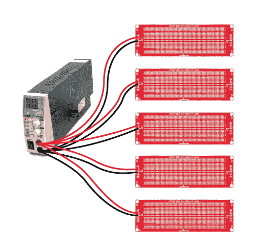

# 大型可焊接试验板连接指南

> 原文：<https://learn.sparkfun.com/tutorials/large-solderable-breadboard-hookup-guide>

## 介绍

无焊试验板非常适合原型制作。但是它们在机械方面不够坚固。好像有什么东西，在某个地方总是会松动。使用具有匹配走线图案的可焊板，可以使原型更加坚固，而无需布局定制 PCB。

乍看之下，[大型可焊接试验板](https://www.sparkfun.com/products/12699)反映了常规[大型无焊试验板](https://www.sparkfun.com/products/112)的孔型。然而，仔细观察，你会发现它有一些额外的功能，可以简化从无焊板到可焊板的过渡。

在本教程中，我们将回顾 soderable 试验板的功能，向您展示如何使用它作为最基本的水平，然后向您展示更高级的例子。

### 推荐阅读:

*   [如何使用试验板](https://learn.sparkfun.com/tutorials/how-to-use-a-breadboard)
*   [使用焊线](https://learn.sparkfun.com/tutorials/working-with-wire)
*   [什么是电路？](https://learn.sparkfun.com/tutorials/what-is-a-circuit)

## 快速概述

这些年来，我已经使用了许多类似的 soderable 面包板，但它们中的许多都有不足之处。常见的由易碎的酚醛 PCB 材料制成。铜走线很薄，粘附性很差，当您重新加工电路板时容易脱落。最大的问题是，走线图案并不总是模仿无焊试验板——电源轨不匹配，或者中心有四个孔，而不是五个。将电路从移动到焊接板上需要额外的翻译工作。

大型无焊试验板旨在解决这些问题。这是一个真正的 FR4 玻璃纤维板，有阻焊层，电镀通孔，布局复制了无焊试验板的连接性。

*Closeup of the pattern at the center of the board.*

试验板的中心区域模仿无焊板的连接模式——两排各有 5 个孔，间隔 0.3 英寸，以容纳 DIP ICs。与等效的无焊板一样，可焊板有 63 列。标记行和列坐标以匹配无焊板。

与无焊板相比，这种可焊板在电源接线方面也更加灵活。

### 电源背景

典型的电源向所连接的电路提供多个电压。每个电压通常被称为*轨*。 [*](#rail) 所需供电轨的数量以及每条供电轨上提供的电压取决于所部署的电路种类。

*   首先，每个电源都有一个“接地”轨。地被用作 0V 参考点，其它电压将被测量；它实际上可能没有连接到地球。
*   多年来，数字电路都使用 5V 单电源轨。最近，较低的电源电压变得普遍，主要是 3.3V，但有时甚至更低，例如 1.8V
*   模拟设计经常使用更高电压的双极性电源，提供镜像正负供电轨。+/-12V 和+/-15V 都很常见。
*   *混合信号*设计涉及模拟和数字部分，并带来各自的电源电压要求。一个很好的例子是 PC 电源，它为数字逻辑提供 3.3V 和 5V 电压，为磁盘驱动器电机和冷却风扇等设备提供+/-12V 电压。

在无焊试验板上，通常在每条边上都有一对供电轨，沿着电路板的长度延伸(尽管有时它们不是完全连续的，会在中点分开)。它们通常标有“+”和“-”符号，也可能标有红色和蓝色。试验板不会对供电轨的使用方式做任何假设，而是由用户决定向供电轨提供电压。

至此，我们来看看如何在这个试验板上配置供电轨。

* * *

我很难找到一个确定的词源，但我相信“rail”一词源于电气化铁路上使用“第三轨”来提供电压，这种用法可以追溯到 19 世纪 80 年代。

## 可选跳线

无需进一步配置，该电路板有 5 条走线，沿电路板长度延伸。其中四条是电路板上下边缘的+和-走线，复制无焊板上的等效点。这些走线中的第五条沿着电路板中央的“槽”走，用作接地。

这 5 条走线与电路板两端的 5 引脚 5 毫米螺丝端子相接。端子的顺序与电路板上走线的顺序相匹配。如下图所示，顶部螺丝端子销连接到顶部“-”轨道，下一个螺丝端子向下接触顶部“+”轨道，依此类推。

该板可以采用跳线，以适应多种不同的电压轨组合。

跳线如下

*   JG1、JG2、JG3、JG4 可以用来将安装孔连接到接地走线。如果将电路板安装在金属外壳中，最好将外壳接地，并将电路接地连接到外壳。
*   JG5 和 JG6 可用于将电路板边缘的轨连接到电路板中央的接地走线。
*   分别在电路板的每一侧连接+和-轨。就像无焊板一样，默认情况下它们并不相连，但该板提供了一个更简单的选项来将它们连接在一起。

该板还接受 5 毫米螺丝端子用于电源连接，可以根据供电轨配置进行组装。如果你喜欢比螺丝端子更牢固的连接，你也可以将电线直接焊接到焊盘上。

电源连接和跳线在电路板的每一端都是重复的。在大多数应用程序中，您只需要使用一端的连接。

## 一些例子

### 具有一个供电轨的数字电路

*Jumper details for single voltage, plus ground.*

如果您正在构建一个具有单供电轨(通常为 3.3V 或 5V)的数字电路，请进行以下连接

*   跳桥者系+和系-。
*   跨接器 JG5 或 JG6。
*   安装一个 2 位 5 毫米螺丝端子。如上所述
    *   红线是电源电压。
    *   黑线接地。

安装元件时，它们可以拾取+轨上的电源电压和-轨上的地电压，也可以拾取中间接地走线的地电压。

### 具有双极性供电轨的模拟电路

*Jumper details for bipolar supply voltages, plus ground.*

对于带双极电源的模拟电路，按如下方式配置跳线

*   跳桥者系+和系-。
*   安装一个 3 位置 5 毫米螺丝端子。如上所述
    *   红线是+电源电压。
    *   蓝线是-电源电压。
    *   黑线接地。

元件可以拾取任一+供电轨上的正电源电压、任一-供电轨上的负电源电压以及中间走线上的地。

### 多块电路板

如果你要用一块以上的电路板构建一个更大的电路，它们可以共享一个电源。最常见的配置被称为“星形配电”电源构成了系统的中心，每个板都直接与其相连。

或者，为了简单起见重新绘制。

这种配置直接连接电源和每个电路板。

## 资源和更进一步

光是这些电路板就让我想焊接点什么。也许是一个不错的 [Moog 滤镜](http://electro-music.com/wiki/pmwiki.php?n=Schematics.MoogTypeFilter)？

对于较小的原型，[中可焊试验板](https://www.sparkfun.com/products/12070)是该板的较小版本，与 [30 排无焊试验板](https://www.sparkfun.com/products/12002)配对。

欲了解更多关于大型 soderable 试验板的信息，请访问其 [GitHub 知识库](https://github.com/sparkfun/Solderable_Breadboard_Large)。

要了解更多原型制作的好处，请查看其他 SparkFun 教程。

*   [如何为项目提供动力](https://learn.sparkfun.com/tutorials/how-to-power-a-project)
*   [如何进行通孔焊接](https://learn.sparkfun.com/tutorials/how-to-solder-through-hole-soldering)
*   [PCB 基础知识](https://learn.sparkfun.com/tutorials/pcb-basics)
*   [电子组件](https://learn.sparkfun.com/tutorials/electronics-assembly)
*   [如何使用 Eagle PCB 布局编辑器](https://learn.sparkfun.com/tutorials/how-to-install-and-setup-eagle)