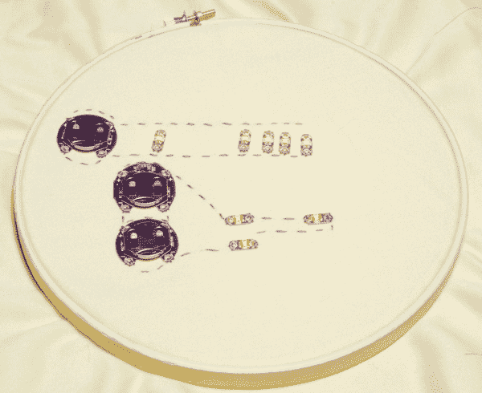

# LDK 实验 2:多个 LED 电路

> 原文：<https://learn.sparkfun.com/tutorials/ldk-experiment-2-multiple-led-circuits>

## 介绍

欢迎来到 LilyPad 设计套件的第二个实验，在这里我们将学习如何在一个[电路](http://learn.sparkfun.com/tutorials/what-is-a-circuit)中添加多个 [LED](https://learn.sparkfun.com/tutorials/light-emitting-diodes-leds) 。此外，我们将了解两种标准电路配置:[串联和并联](https://learn.sparkfun.com/tutorials/series-and-parallel-circuits)。

使用 led 时，你会经常使用并联电路。除了能够以更低的电压打开更多的组件，它们更耐用。在串联电路中，如果一个 LED 损坏，所有的 LED 将停止工作。在并联电路中，一个损坏的 LED 不会阻止其他 LED 点亮！你可能听说过这种效果，或者在圣诞灯中亲身体验过。

尽管大多数项目都倾向于并联电路，但如果不讨论串联电路，基础电路教育就不完整，所以我们将尝试一个！

### 推荐阅读

这里有几个相关的教程，你可能想通读或参考:

*   [LDK 实验一](http://learn.sparkfun.com/tutorials/ldk-experiment-1-lighting-up-a-basic-circuit)
*   [并联和串联电路](https://learn.sparkfun.com/tutorials/series-and-parallel-circuits)
*   [发光二极管](https://learn.sparkfun.com/tutorials/light-emitting-diodes-leds)
*   我如何为我的项目提供动力？

## 收集材料

这是你在这个电路中需要的元件。如果你用的是 LilyPad 设计套件，你已经有了！