# Leap Motion 拆卸

> 原文：<https://learn.sparkfun.com/tutorials/leap-motion-teardown>

## 介绍

在 SparkFun，我们喜欢小玩意和小发明，就像我们的顾客一样。而且，像你们中的许多人一样，我们发现自己经常被那些关注“哎呀”的肤浅评论所挫败花哨的新电子产品的因素，而没有真正花时间去了解设备如何工作的本质。

[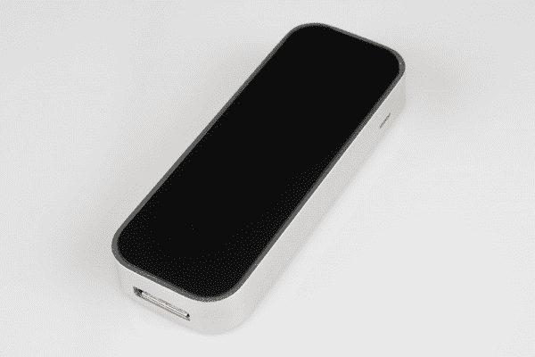](https://cdn.sparkfun.com/assets/7/0/3/d/2/51c471efce395fae72000000.jpg)

随着 [Leap Motion](https://www.leapmotion.com/) 的发布越来越近，我们都在想，它**做什么**？除了演示和闪亮的公关视频，里面到底发生了什么？又是怎么做到的？

我们的一个开发者得到了一个(通过完全合法的手段；他注册了一个开发者，并从制造商那里订购了它)，当内森发出一封电子邮件，感叹他没有一个可以拆开的电子邮件时，回复很快，很棒。

我们使用 SDK 中包含的 visualizer 应用程序拍摄了一个小视频，以连接我的手的现实和传感器输出的虚拟。看看吧！

[//www.youtube.com/embed/XOhIhvSZG94](//www.youtube.com/embed/XOhIhvSZG94)

现在让我们开始真正的拆卸...

## 外面

无缝，光滑，完全没有可见的紧固件，Leap Motion 具有拉丝铝极简设计，这是新的“弯曲金属板和米色塑料”美学。唯一值得注意的外部特征是一个微小的扩散塑料 LED 指示器窗口和一端的数据端口。

[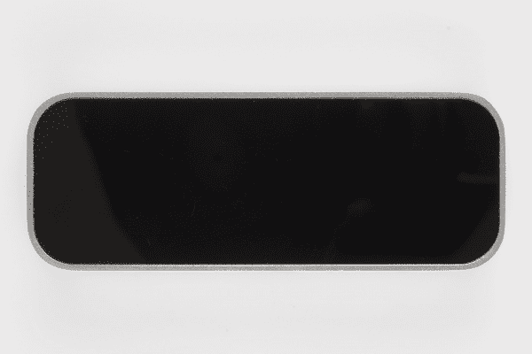](https://cdn.sparkfun.com/assets/e/d/2/0/c/51c471f0ce395f1b73000000.jpg)

顶部表面有一种表明红外透明的颜色。它摸起来很柔软，所以我们知道它是塑料的。它对于吸引和保持污迹来说也是绝对完美的，但该软件实际上会**警告**你表面上有污迹，这非常酷。

[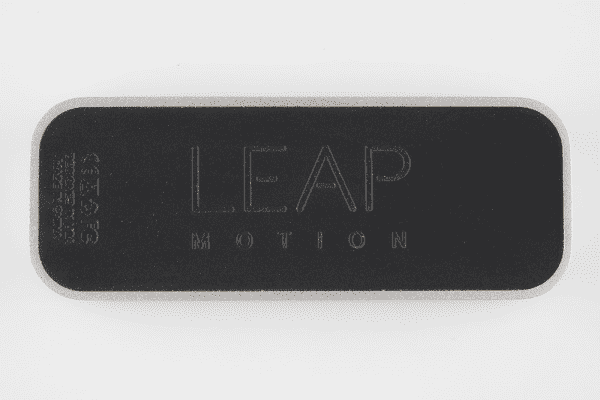](https://cdn.sparkfun.com/assets/0/d/b/e/1/51c471f0ce395fad72000000.jpg)

在底部，有一个精致的浮雕橡胶片，上面有人们期望在消费品上看到的典型的骗人的东西——机构批准，微小的[“可回收”](http://en.wikipedia.org/wiki/Recycle)和[“不要丢弃我”](http://en.wikipedia.org/wiki/Waste_Electrical_and_Electronic_Equipment_Directive)符号，“中国制造”等等。橡胶有一种非常好的抓握感——我一时兴起把这个装置放在一张丙烯酸板上，倾斜它，直到它开始滑动。那是在水平面以上大约 50 度；如果我高中物理实验室的记忆是正确的，那就是摩擦系数大约是 1.2。虽然它不是很重(大约 32 克，根据我们的邮政秤)，底部的橡胶片仍然令人钦佩地放在我的桌子上。

[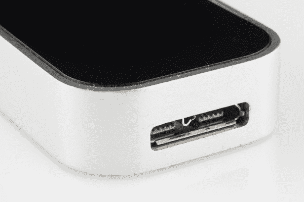](https://cdn.sparkfun.com/assets/2/3/0/3/a/51c471f0ce395f9272000000.jpg)

Leap 很小，厚 6.2 毫米，宽 25 毫米，长 75 毫米。在一端，你会发现数据端口- a [USB 3.0](http://en.wikipedia.org/wiki/USB_3.0) micro-B 连接器。虽然它**可以**用作 3.0 设备，但我发现它与标准 USB micro-B 连接器一起插入 USB 2.0 端口也能正常工作。我猜这可能会降低你的帧率，但我仍然看到帧率接近 200 帧/秒，这相当不错。

[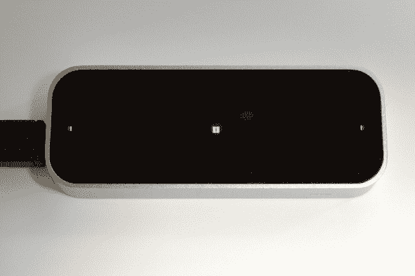](https://cdn.sparkfun.com/assets/d/e/9/c/4/51c471f0ce395fe072000000.jpg)

你可以在这里看到，里面有三个红外 led，它们的位置提供了一个良好的，广泛的覆盖范围。当我们揭开盖子的时候，我们会看更多的。当我摆弄这款设备时，我注意到一个非常酷的功能是动态 LED 驱动——当你把手靠近传感器时，设备会自动调暗 LED，以防止成像器饱和，并保持高数据质量。这是显而易见的——发光二极管必须在非常近的红外波长(可能接近或低于 800 纳米)，因为它们是肉眼可见的，如果勉强可见的话。

我在装置上贴了一个电表来测量电流；一旦 Leap 全面展开，它将消耗大约 320mA 的电流。将你的手移向它，使它的 led 变暗，这将把电流降低到大约 200 毫安。它摸起来很温暖，但不会令人不愉快——肯定不会热到融化热熔胶，所以这是一种将它固定到机器人上的选择，我知道你已经在考虑用它来建造了。

## 剥洋葱皮

就像现在经常发生的情况一样，没有明显的切入点。所以，我用胶水开始剥皮。

[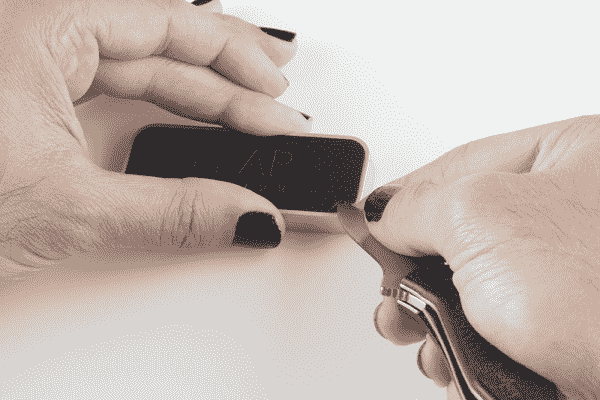](https://cdn.sparkfun.com/assets/1/f/b/7/6/51c471f0ce395f5b72000000.jpg)

底部的橡胶板似乎是一个很好的起点；毕竟，它不是功能性的或非常脆弱的。拿着我信赖的克肖葱，我慢慢地小心地剥去底部的橡胶片。

[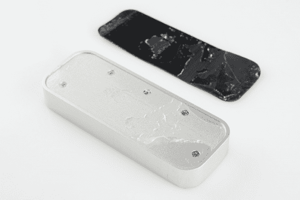](https://cdn.sparkfun.com/assets/5/a/3/1/e/51c471f0ce395fc972000001.jpg)

在下面，我发现了五个小螺丝。Leap Motion 的员工没有使用防篡改螺钉，这是加分项——我真的很感激！飞利浦 0 螺丝刀把螺丝取出来了，但这并没有改善更多内部结构。我们一会儿就会明白为什么会这样。

我曾短暂地幻想过，如果我把什么东西戳进螺丝孔，然后推一下，肠子会弹出来；一点温和的刺激很快消除了我的这种想法。不知道我到底捅了什么，我不愿意使用任何真正的力量...这让我又回到了窥探。

起初，我无法让我的刀和马铃薯足够进入塑料和外壳之间的裂缝，以取得任何真正的进展。我拿了一把细齿锯，在箱子上切了一个很小的切口，这就足够把刀偷偷放进去，释放一些压力。从那以后，一切都很顺利，除了我把塑料弄裂了一点点。

## 你有胆量，孩子...

[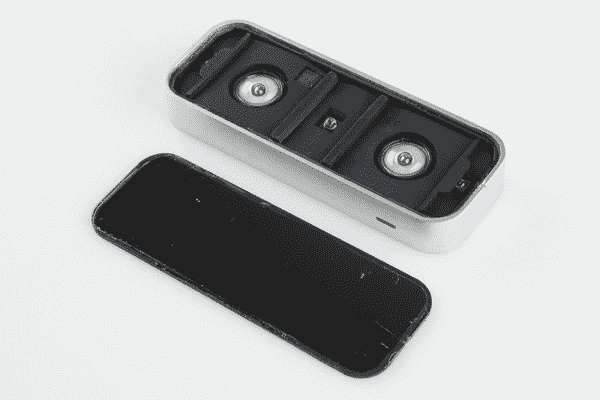](https://cdn.sparkfun.com/assets/6/4/7/1/6/51c471f0ce395f0c75000000.jpg)

终于来点有趣的了！塑料下面是另一个橡胶片，上面有三个 led，两个传感器元件和一个 ic 的孔，显然有点太厚了，无法安装。

[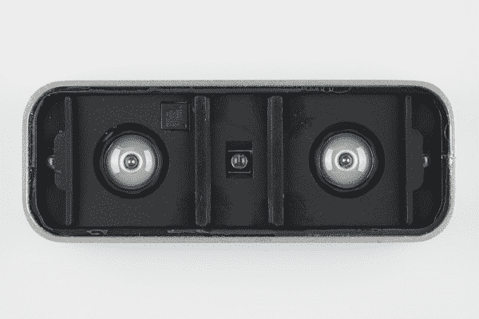](https://cdn.sparkfun.com/assets/1/6/e/9/0/51c471f1ce395f0d73000001.jpg)

在自上而下的视图中，你可以看到一些有趣的东西。首先，橡胶片显然是为了阻挡光线，阻止光线在机箱内反弹到达探测器。第二，侧面的发光二极管不仅可以阻挡光线射向探测器，还可以部分遮挡光线，以改变光线投射的区域。据我所知，发光二极管之间没有同步；这三个发光二极管的放置似乎主要是为了提供一个坚固的，广角的红外感兴趣的区域，而不是像 Kinect 一样提供任何一种神奇的照明模式。这种阻碍似乎是为了防止两个发光二极管重叠的“热点”。

[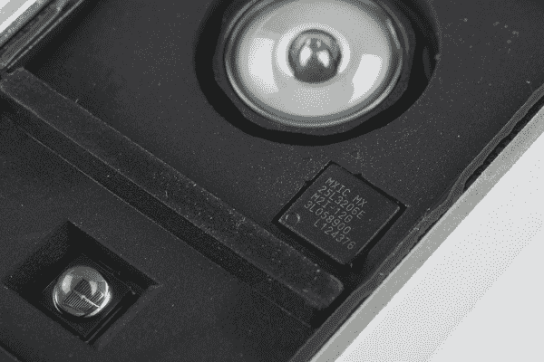](https://cdn.sparkfun.com/assets/c/c/6/b/a/51c471f2ce395f1b0d000000.jpg)

透过橡胶窥视的 IC 并不是什么真正令人兴奋的东西——只是一个 8 引脚 SOIC 封装的 32Mbit 串行 NOR 闪存。在这么大的包装里看到它令人惊讶，但我相信他们有充分的理由。NOR flash 在像这样的应用中更常见，在这种应用中，不期望有大量的程序擦除周期；通常伴随 NAND 闪存的写入均衡和坏块避免只会增加成本。

[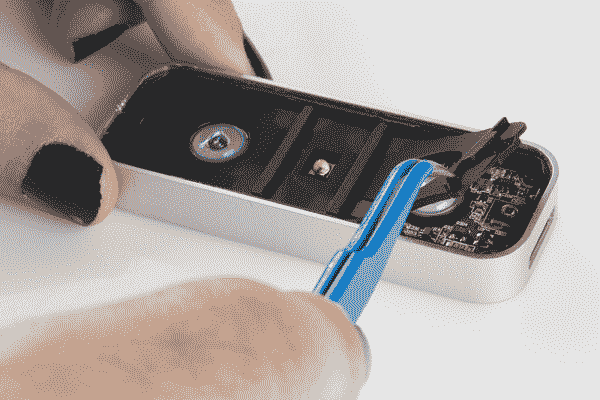](https://cdn.sparkfun.com/assets/a/6/9/1/7/51c471f1ce395fa072000000.jpg)

剥去橡胶挡板(轻轻粘在下面的 PCB 上),露出双面 PCB 的顶部。顶部主要是簿记:电源、LED 驱动器、LED 本身。然而，有三个有趣的地方。

[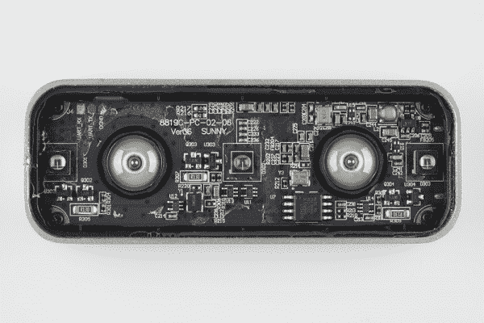](https://cdn.sparkfun.com/assets/b/6/6/d/5/51c471f2ce395ffa74000000.jpg)

在左上角，你可以看到一个三点串口- RX，TX 和 GND。我没有深究太多，但我能将范围缩小到 3.3V 信号。它在通电后的前几秒没有转储任何数据，所以我不能告诉你数据速率是多少。

在右上角，有一个电源电路。这引起了我的注意，因为电路中的电感被适量的环氧树脂包裹，这表明在他们开发周期的某个时候，他们发现它往往会从电路板上脱落，并采取措施进行补救。彻底的测试和缓解值得称赞！

[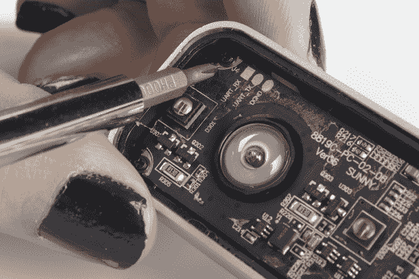](https://cdn.sparkfun.com/assets/c/3/5/d/5/51c471f2ce395f6a72000000.jpg)

第三个有趣的地方是角落里的裸铜。我看到这一点有点惊讶，因为这些点上的螺钉是黑色氧化的，它们拧进了一个塑料支架，但如果这是一个早期版本的倒退，或“安全比抱歉好”之类的事情，我不会感到惊讶。

[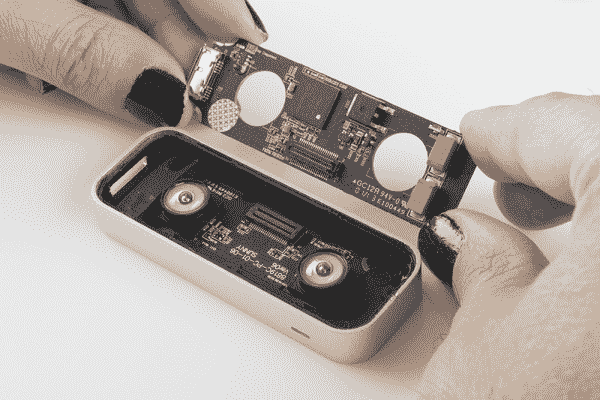](https://cdn.sparkfun.com/assets/7/c/2/8/2/51c471f2ce395f0575000001.jpg)

在我卸下这些螺丝后，顶部的板子很容易就抬起来了，露出了另一块板子和一个惊人的空间。

[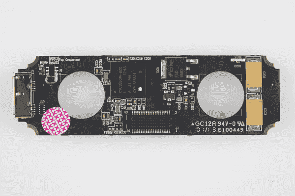](https://cdn.sparkfun.com/assets/6/c/7/b/3/51c471f2ce395f1a73000000.jpg)

顶部 PCB 的背面有更少但更大的元件:两个大型钽电容，用于防止浪涌电流期间的电源掉电；一个大型表面贴装 MOSFET(可能是浪涌电流限制电路的一部分，或为 led 供电)；一个细间距双排连接器，连接到第二个 PCB；以及操作大脑。

[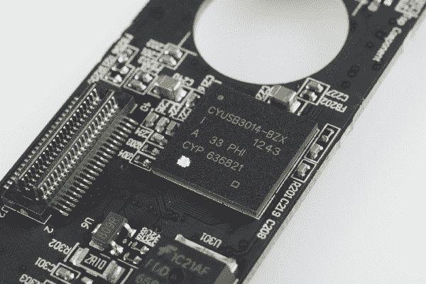](https://cdn.sparkfun.com/assets/9/8/f/9/c/51c471f2ce395f1775000000.jpg)

~~Leap Motion 的核心功能由 Cypress PSoC 器件提供，具体来说就是 [CYUSB3014](http://www.cypress.com/?rID=50120) 。如果您以前从未研究过 PSoC 部分，我强烈建议您这样做——它们非常棒。PSoC(可编程片上系统)不同于标准 MCU，因为它们提供模拟和数字模块，可以重新配置以满足用户的需求。例如，一个应用可能需要一个 DMA 控制器，而另一个应用需要多个捕获/比较定时器，但两者都可以由同一器件提供服务，只需通过修改固件来改变系统模块的配置即可。~~

哎呦，我搞砸了，大时间。该部分是**实际上**只是一个通用 USB 3.0 设备控制器，内置 USB 3.0 PHY。这意味着*所有的*工作都是在 PC 端完成的，Leap Motion 只是尽可能快地将数据从探测器转移到 PC。也就是说，我袖手旁观我的意见对 PSoC 部分以上。他们真的很酷。

感谢指出我的错误，IRC 用户 Krain 和 Robint91！

## 无籽的腹部

[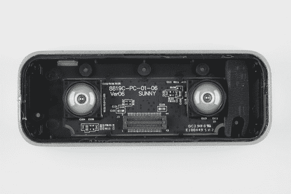](https://cdn.sparkfun.com/assets/b/0/c/7/3/51c471f2ce395f1273000000.jpg)

我们到了最后，现在-只剩下一个 PCB，坐落在一个塑料支架里。探测器上的透镜给这个东西一个光鲜的外观；我没有试图剥离光学元件，因为我不想永久损坏它，镜头、光圈和探测器之间的灰尘似乎不是一个好主意。我也知道，除了拆下探测器(即使在那时)，我不太可能对它们有任何了解，除了我从这个角度可以说的:它们是 [CMOS，不是 CCD，](https://en.wikipedia.org/wiki/Image_sensor)这并不奇怪。CMOS 成像器的一体化功能与 CCD 成像器支持电路的复杂性相比，意味着基于 CCD 的解决方案几乎不可能适合这种尺寸。

至于为什么有两个检测器，看来立体成像对这种应用非常重要。盖住其中一个传感器，但不盖住另一个，跳跃就会完全失败。

[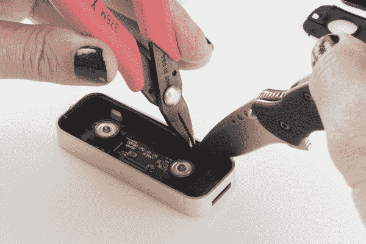](https://cdn.sparkfun.com/assets/2/a/5/5/5/51c471f2ce395f7972000000.jpg)

我试着把摇篮取出来，但这并不容易——可能是粘在里面了。如果你还记得我发现的第一个剥皮后的螺丝-从底部上来的-你现在可以看到他们压着什么。奇怪的是，他们觉得需要螺钉*和*胶水，但这符合设计中其他地方的质量组装。

[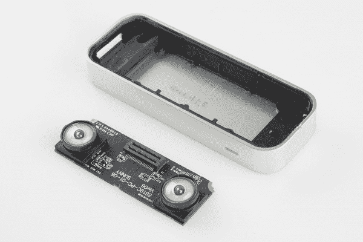](https://cdn.sparkfun.com/assets/4/b/7/7/6/51c471f3ce395f3674000000.jpg)

一旦我设法把印刷电路板取出来，你可以看到里面没有更多的东西。支架和软橡胶垫片似乎很标准——它们似乎不是导电材料或任何类似的花哨东西。主板本身有我们在顶部主板上看到的裸铜角，尽管没有螺钉固定这些角。

[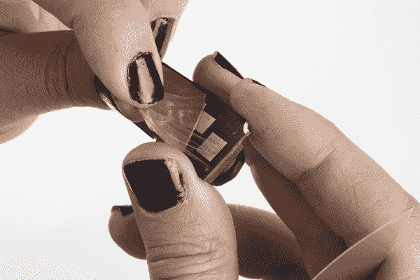](https://cdn.sparkfun.com/assets/4/9/b/2/8/51c471f3ce395f0075000001.jpg)

底部 PCB 的背面有几个裸露的铜焊盘，通过导电金属织物可以看到。看起来，固定它的粘合剂要么是导电的，要么不是设计成不导电的，所以衬垫和织物可能允许外壳散热。

## 到处都是零件！

[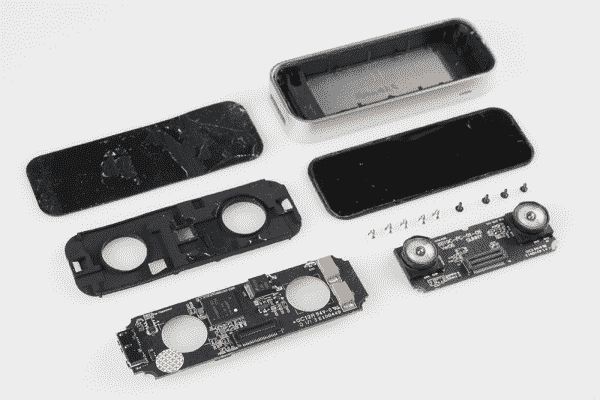](https://cdn.sparkfun.com/assets/f/7/6/3/6/51c471f3ce395f7f72000000.jpg)

各位，这就是飞跃运动破碎的荣耀。我把它插上电源，在它还是一片一片的时候试了试，它仍然工作得出奇的好。也就是说，如果包装到位，效果会更好。

它的简单给我留下了深刻的印象，但我不能说我对此感到惊讶。就像谷歌眼镜被拆一样，很明显，魔力在于代码，而不是硬件。我也对设计中的想法印象深刻。很明显，Leap Motion 公司有一些技术熟练的工程师在思考如何制造耐用的高质量产品。

## 资源和更进一步

更多拆卸的好处，看看这些其他 SparkFun 拆卸:

*   [Nest 恒温器拆卸](https://learn.sparkfun.com/tutorials/nest-thermostat-teardown-) -查看 SFE Nest 拆卸原图。
*   [巢穴保护拆除](https://learn.sparkfun.com/tutorials/nest-protect-teardown)
*   [谷歌眼镜拆卸(SFE 赞助)](http://www.catwig.com/google-glass-teardown/)