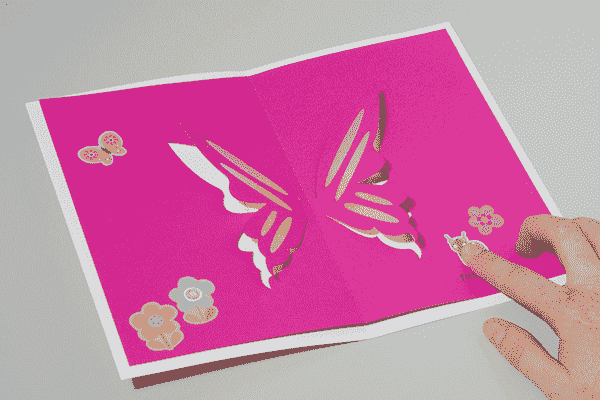

# LED 蝴蝶弹出卡

> 原文：<https://learn.sparkfun.com/tutorials/led-butterfly-pop-up-card>

## 介绍

用铜带、两个发光二极管和一块电池制作一个发光的蝴蝶弹出卡。

### 推荐阅读

如果你刚刚接触电子产品，这里有一些有用的阅读材料供你参考:

*   [什么是电路？](https://learn.sparkfun.com/tutorials/what-is-a-circuit)
*   [发光二极管](https://learn.sparkfun.com/tutorials/light-emitting-diodes-leds)

## 材料和工具

以下是您需要遵循的所有材料和工具的列表: