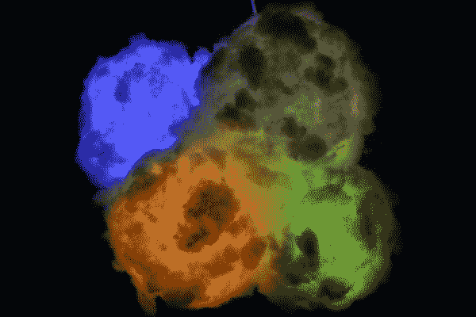
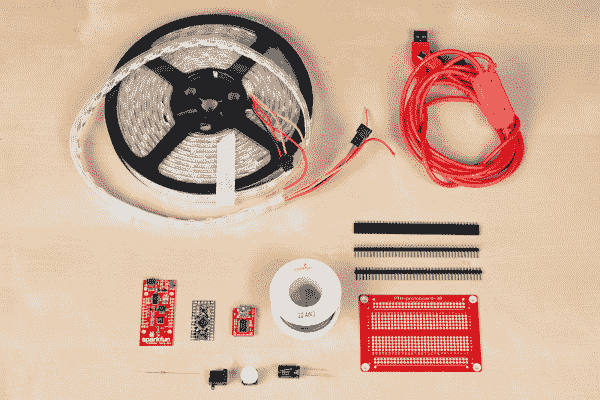

# LED 云-连接云

> 原文：<https://learn.sparkfun.com/tutorials/led-cloud-connected-cloud>

## 介绍

制作一个彩虹色的 LED 云灯，你可以用手机控制它。你甚至可以让它根据外面的天气改变颜色。

这些是第三集《万物之灵》中的云，如果你还没有看过的话，可以在下面看看。

[https://www.youtube.com/embed/NVGOanCVbDM/?autohide=1&border=0&wmode=opaque&enablejsapi=1](https://www.youtube.com/embed/NVGOanCVbDM/?autohide=1&border=0&wmode=opaque&enablejsapi=1)

### 所需材料:

要跟随本教程，您需要以下材料。

