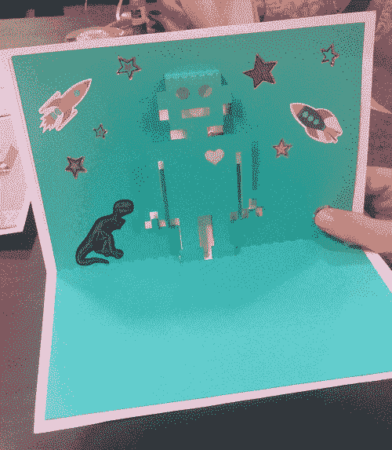

# LED 机器人弹出卡

> 原文：<https://learn.sparkfun.com/tutorials/led-robot-pop-up-card->

## 介绍

用循环 RGB LED、电池和铜带制作一个纸质电路弹出卡。如果你以前制作过我们的纸质电路弹出卡，请随意按照模板进行操作。如果这是您的第一个纸质电路，我们将带您了解整个过程。

### 推荐阅读

如果你刚刚接触电子产品，这里有一些有用的阅读材料供你参考:

*   [什么是电路？](https://learn.sparkfun.com/tutorials/what-is-a-circuit)
*   [发光二极管](https://learn.sparkfun.com/tutorials/light-emitting-diodes-leds)

## 材料和工具

以下是您需要遵循的所有材料和工具的列表: