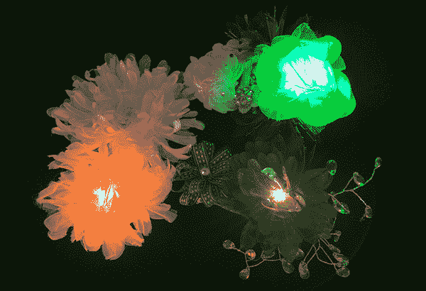

# 点亮绢花胸花

> 原文：<https://learn.sparkfun.com/tutorials/light-up-silk-flower-corsage>

## 介绍

创建一个独一无二的胸花，可以改变颜色，以配合你的整体！这个项目探索了一种用[丝花 LED](https://www.sparkfun.com/products/13270?_ga=1.62154218.750303857.1422291681) 制作配饰的选择，丝花是一种带有内置公共阴极 5 毫米 RGB LED 的欧根纱花。我们将向您展示如何用它来制作胸花，但这个电路也可以内置到头带、胸针或其他小配件中。

我们将在 LED 的每一个通电的脚——红色、绿色和蓝色——上连接一个开关来单独控制它们。这允许我们根据开关状态的组合来混合多达 7 种颜色-红色、绿色、蓝色、黄色、青色、紫色和白色。

Note: This is an e-textiles project, but we'll be soldering to prep our LED for sewing.

### 推荐阅读

*   [用导电线缝制](https://learn.sparkfun.com/tutorials/sewing-with-conductive-thread)
*   [LDK 实验一:点亮一个基本电路](https://learn.sparkfun.com/tutorials/ldk-experiment-1-lighting-up-a-basic-circuit)
*   [发光二极管](https://learn.sparkfun.com/tutorials/light-emitting-diodes-leds)
*   [如何焊接](https://learn.sparkfun.com/tutorials/how-to-solder---through-hole-soldering)
*   [电阻器](https://learn.sparkfun.com/tutorials/resistors?_ga=1.204588374.750303857.1422291681)

## 材料和工具

让我们收集完成这个项目所需的材料:

*如果你不喜欢这种特殊的绢花的外观，你也可以自己制作，把一个[5 毫米的普通阴极 LED](https://www.sparkfun.com/products/9264) 粘到你选择的绢花上。看看我们的[愿望清单](https://www.sparkfun.com/wish_lists/109681)的 DIY 花版本。*