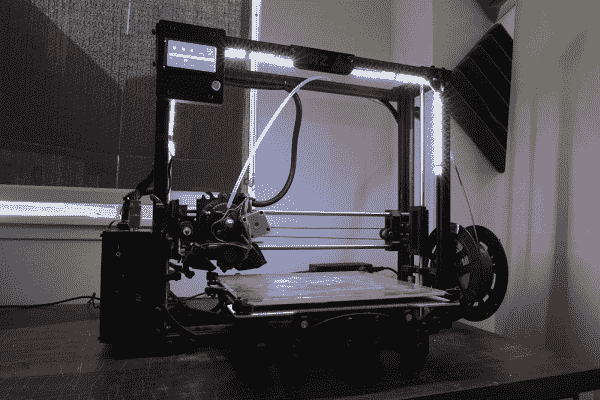

# 点亮你的 3D 打印机

> 原文：<https://learn.sparkfun.com/tutorials/light-up-your-3d-printers-bed>

## 介绍

晚上，你是否在几乎没有光线的房间里进行 3D 打印？这是我在 SparkFun 检查印刷品时遇到的问题。我身后的光源在打印床上制造了一个阴影，很难看清发生了什么。在本教程中，我们将使用 LED 灯照亮 LulzBot 3D 打印机上的打印床！

### 所需材料

**Note:** This tutorial uses non-addressable LED strips but you could also customize your lighting by using an addressable LED strip of your choice. This will require additional components to get started.

要跟随本教程，您将需要以下材料。你可能不需要所有的东西，这取决于你拥有什么。将它添加到您的购物车，通读指南，并根据需要调整购物车。