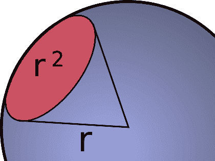
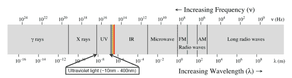
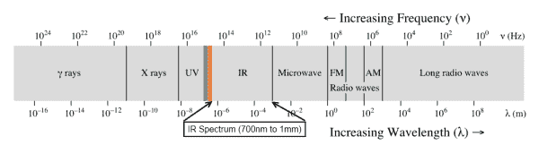

# 光

> 原文：<https://learn.sparkfun.com/tutorials/light>

## 介绍

对任何电子修补匠来说，操纵光线都是一项非常有用的技能。从照明到距离感测，光以无数种有用的方式在电子和物理之间架起了桥梁。

### 波长

一束光的关键定义特征是它的波长。光以波的形式在空间传播，两个波峰之间的距离就是光束的波长。从人类的角度来看，波长决定了光束的颜色。

*Wavelength is usually denoted by the greek character **λ** (pronounced "lamb-da") (Image by Wikipedia user [dicklyon](http://en.wikipedia.org/wiki/User:Dicklyon)).*

因为物理学中没有什么是简单的，光束也表现为粒子流，或**光子**(受虐狂可以参考[这篇关于光的波粒二象性](http://en.wikipedia.org/wiki/Wave%E2%80%93particle_duality)的文章)。波长越短的光，每个光子的能量越多。

### 强度

光束的另一个特征是它的强度。辐射强度是通过能量与冰淇淋甜筒顶部圆圈所包围的球体表面相交的比率来测量的，单位为瓦特每球面度。为了理解这一点，想象一个中心有一颗很小很小的星星的球体。光从恒星向四面八方均匀传播。现在，添加一个冰淇淋甜筒，它的点在星形的中心，延伸到球体的表面。圆锥体底部的角度为一弧度(一个圆有 2π弧度；一弧度约为 57.3)。这个假想的冰淇淋蛋卷所限定的区域被称为[球面度](http://en.wikipedia.org/wiki/Steradian)。

*Graphical depiction of a steradian. A beam of light's radiant intensity is described by the wattage of the light beam divided by this surface area (Image courtesy of [wikimedia commons](http://commons.wikimedia.org/wiki/File:Steradian.svg).)*

### 可见光对不可见光

当我们谈论光时，我们通常指的是可见的光——彩虹和阳光的奇妙组成部分。然而，光的波长范围非常非常广。这被称为电磁波谱。

*The full spectrum of electromagnetic radiation. Visible light is a very small part! Image created by [Philip Ronan](http://commons.wikimedia.org/wiki/User:Sakurambo)).*

在一端，有伽马射线和 X 射线，它们是讨厌的高能电离电磁辐射，从根本上与生命不相容。另一方面，频率很低、波长很长的无线电波可以远距离传送信息，让我们得以一窥宇宙本身的起源。

在这篇文章中，我们将坚持可见光和最接近它的领域:红外线和紫外线。从紫外线到远红外，光的行为与我们习惯用可见光看到的非常相似:阴影被投射，透镜可以聚焦它，它可以被，比如说，一张白纸扩散，等等。一旦你移到更长和更短的波长，事情就开始变得奇怪，我们将在另一节课讨论这个问题。

我们将分三组讨论光:紫外线、可见光和红外线。紫外光是波长比可见光稍短的光；红外线，只是稍微长一点。在这三组中，可见光和红外线在电子学中更有用和更常见，我们将相应地给它们更多的时间。

D-Kuru/维基共享资源。

## 紫外线

[紫外线](http://en.wikipedia.org/wiki/Ultraviolet)是介于 10 纳米和 400 纳米之间的光，这使它处于 X 射线和可见光之间。紫外线对生命形式非常有害——你可能最熟悉它以晒伤形式出现的影响。

### 紫外线-A

UVA(315 纳米到 400 纳米波长)是紫外线中能量最低的波段。人类几乎可以看到它，许多昆虫，甚至一些鸟类，都可以看到这个光带。白色荧光灯泡和白色 led 的工作原理是将材料暴露在 UVA 光下，UVA 光吸收 UVA 光子并发射可见光谱中的光子，在我们看来是白色的。

UVA 也常用于检测伪造文件；作为防范伪造的手段，许多文件(护照、驾照和钞票等)将包含在 UVA 辐射下发光的水印。黑光海报是另一个对 UVA 光起反应的例子，漂白剂、肥皂和许多生物材料在暴露于 UVA 时也会发光。

*Anti-counterfeiting features in a US $20 bill revealed by a [400nm UVA LED](https://www.sparkfun.com/products/8662).*

阳光中的大部分长波紫外线到达地球表面。

### 紫外线-B

UVB(280 纳米到 315 纳米)是一种比 UVA 更高能级的光。它存在于阳光中，不仅是导致晒伤和皮肤癌的皮肤损伤的原因，也是人体内维生素 D 合成的原因。它也是由焊枪产生的；如果观看者没有得到保护，即使只是短暂暴露在焊炬的闪光下，即使是在合理的距离内，也会对眼睛造成严重伤害。

*Welding torches create a lot of UVB and UVC light. Welders must minimize exposure to avoid sunburn and eye damage ([Image](http://en.wikipedia.org/wiki/File:Pipefitter_welder_kutzo.jpg) courtesy wikipedia).*

UVB 光线被普通的窗户玻璃很好地阻挡了；这就是为什么把一只胳膊挂在敞开的车窗外面会导致晒伤只影响那只胳膊。理查德·费曼(诺贝尔奖获得者和著名的邦戈音乐家)用一辆小货车的挡风玻璃来保护自己免受爆炸释放的紫外线辐射，观察了三一核试验爆炸。

太阳发出的 UVB 光中只有大约 10%到达地球表面；其余 90%被大气吸收(主要是臭氧层)。

#### 紫外线-C

UVC(100 纳米至 280 纳米)往往是我们感兴趣的紫外光的极限。太阳的 UVC 几乎没有一个到达地球表面；大气非常有效地屏蔽了它。

在糟糕的旧时代，在 EEPROM 存储器和闪存(可以用电子方式擦除和重写)出现之前，唯一的非易失性、非磁性电子数据存储方式是 EPROM。一旦 EPROM 被写入，只有暴露在强 UVC 光源下 20-30 分钟才能被擦除。对于一个业余爱好者来说，要等很长时间才能知道你对代码所做的修改是否修复了一个 bug！

*An old UV-erasable PIC16C765 microcontroller. The window over the die is made of quartz, because normal glass is not transparent to ultraviolet light.*

## 可见光

可见光是在(大约)380 纳米到 740 纳米范围内的光。这可以变化；一些人的眼睛将能够检测比这更低或更高波长的光，但一般来说，大多数人的眼睛对这个区域很敏感。

### 人类的眼睛

人眼感知光线的方式有两个特点:我们的眼睛对不同波长的敏感度不同，我们的眼睛对光强的感知是对数的而不是线性的。

#### 颜色感知

正如你在这张图表上看到的，我们的眼睛以不同的效率接收不同波长的光，混合感知的强度产生我们所说的“颜色”。此外，你还可以看到，在低光照水平下，我们对颜色的感知变得扭曲。

*[Scotopic and photopic luminosity curves](http://en.wikipedia.org/wiki/Luminous_intensity) for the human eye. These curves show the perceived intensity of a light source by wavelength, assuming the [radiant intensity](http://en.wikipedia.org/wiki/Radiant_intensity) of the light sources are all equal.*

正因为如此，一种特殊的光强单位**坎德拉**应运而生。坎德拉根据光源的颜色来衡量光源的强度；人眼会感觉到一个 1 坎德拉的光源与另一个 1 坎德拉的光源具有相似的亮度，而与波长无关。LED 亮度通常以毫坎德拉(mcd)为单位，当考虑一个 RGB LED(如[这个](https://www.sparkfun.com/products/105))的强度时，可以看到不同颜色之间感知强度差异的一个很好的演示:红色为 800mcd，绿色为 4000mcd，蓝色为 900mcd。我在下面的图表上标记了这三种颜色的波长(625 纳米、520 纳米和 467.5 纳米)。

*The relative intensities of the blue, green, and red LEDs in a [tricolor LED](https://www.sparkfun.com/products/105) have been marked on this photopic curve. Compare the relative intensities (0.3 for the red, 0.7 for the green, and 0.15 for the blue) to the millicandela ratings for the three colors given by the LEDs datasheet (800mcd, 4000mcd, and 900mcd). The ratios aren't exact. While blue has a slightly higher mcd than red, blue is lower on the curve. The mcd rating for green is higher than both colors on the curve.*

通过混合不同的波长，眼睛可以被骗去检测不存在的光的波长；大多数彩色显示器就是根据这一原理工作的。实际上只有三种颜色(某种形式的红色、绿色和蓝色)可用；通过混合这三种不同强度的光，可以模拟绝大多数的自然颜色(至少，就我们的眼睛而言)。

*Color mixing of red, green and blue light sources. By tweaking the light levels, a vast number of other light colors can be simulated.*

#### 强度感知

我们自然倾向于认为光是一种线性现象。给定两个光源，我们有理由认为其中一个比另一个亮一倍。我们已经看到这是如何受颜色影响的；现在让我们来考虑一种单一颜色的光的强度相对于我们对它的感知。LED 的亮度随着用来驱动它的电流而线性变化。

*Actual data gathered by pointing an LED at a photodiode and linearly increasing the LED drive current linearly from 0-25mA.*

让我们做一个小实验。如果你有一个 Arduino、试验板、电阻、LED 和一个按钮，快速启动这个电路，[下载代码](//cdn.sparkfun.com/assets/a/f/2/9/5/51158420ce395fba23000000.ino)，并把代码扔到 Arduino 上。

这个电路非常简单:按一下按钮，LED 就会亮。按住它，LED 将开始变亮。释放它，LED 将停止变亮，Arduino 将通过串行端口打印出停止变亮时 LED 的亮度比启动时的亮度高多少。当 LED 的亮度是启动时的两倍时，尝试停止 LED。

为什么这么难？LED 的光输出是线性的，所以通过 LED 的电流增加一倍，它发出的光能也增加一倍。然而，你的眼睛不是以线性方式响应，而是以对数方式响应。原因很简单:我们的眼睛需要在从星光到日光的所有照明条件下为我们提供有用的信息。在月圆无云的夜晚，光线强度只有晴天的 1/440，000，然而我们的眼睛必须在这两种极端情况下以及两者之间的任何地方都能正常工作！这使得判断线性光源的相对亮度非常困难。

#### 色盲

色盲并不像它的名字所暗示的那样，仅仅是不能感知颜色。事实上有许多种类的色盲；最常见的是红绿色盲，在某种程度上影响着近 10%的男性人口。

色盲可以通过[简单测试](http://www.micro.magnet.fsu.edu/primer/java/humanvision/colorblindness/index.html)来诊断，要求受试者在类似大小的点的背景下识别由不同颜色的点创建的图案或符号。

*Test plate from the Ishihara color blindness test. A person with normal color vision will see the number 74; color blind persons may see the number 21 or no number at all, depending on the type of deficiency present.*

作为对我们这些色盲的善意，请尽量不要用颜色来传递信息。不良设计的好例子包括改变颜色以表示状况的 led(绿色表示“正常”，红色表示“失败”)、使用一系列颜色将数值与区域联系起来的地图，以及除黑底白字或白底黑字之外的文本颜色。

## 红外光

红外光的波长比可见光长，但比微波短。它被任意选择从 700 纳米开始，到 1 毫米(1000000 纳米)结束，这使它成为比紫外线或可见光大得多的光谱段。大约 55%从太阳到达地球表面的光能是红外线。

### 近红外

近红外是电子学中一个非常令人感兴趣的领域:这是红外遥控器、物体传感器和距离探测器工作的区域。它仅略高于可见范围，并且非常容易用固态技术制造和检测。

*[SparkFun's matched infrared emitter/detector pair.](https://www.sparkfun.com/products/241) Inexpensive, but extremely susceptible to interference from both visible and infrared light in the environment.*

近红外波段延伸至 1400 纳米。常见的发射极波长为 [850nm](https://www.sparkfun.com/products/9469) 和 [950nm](https://www.sparkfun.com/products/9349) 。我们周围无时无刻都有大量的近红外光；干扰红外信号和传感的可能性很大。大多数红外信号系统(如[红外遥控器](http://learn.sparkfun.com/tutorials/ir-remote-control)通过以固定频率调制光束来解决这一问题，而不是试图过滤掉不是所需波长的光。

*[Modulated IR receiver module](https://www.sparkfun.com/products/10266). This small IC looks for infrared light being pulsed at 38kHz and attempts to interpret it as a data signal.*

数码相机也能很好地探测到近红外线。事实上，大多数数码相机都有一个物理过滤器来阻挡红外波长。这种滤光器可以去掉，从而在红外范围内获得更高的灵敏度。一种允许红外光通过但阻挡可见光的简单滤光器可以用 35mm 胶片底片制成；胶卷的标签末端没有图片，非常适合这种情况。

*Two pictures of the same scene. The image on the left was taken in a darkened room with a cheap webcam that has had its infrared filter removed and replaced by film negatives, and the image on the right was taken with a standard point-and-shoot camera.*

### 长波红外线

长波红外是 8000 纳米-15000 纳米范围内的光。这是热成像区，所有这些令人惊讶的伪彩色图像详细描述了事物的相对温度。

*The same scene in the visible spectrum and the long-wavelength infrared. Notice that the plastic bag is opaque to visible light but nearly transparent to infrared (courtesy NASA Spitzer Infrared Telescope team).*

误解近红外成像和长波红外成像的区别是人们常犯的错误。近红外成像非常容易实现-标准的 CMOS 和 CCD 成像芯片可以很容易地检测到近红外区域的光。长波红外需要特殊的传感器，因为光束的波长是近红外的 1000 倍。这要求传感器元件具有相应更大的几何形状。

*A long-wave [IR temperature sensor](https://www.sparkfun.com/products/9570). The longer wavelength requires a larger sensing region than visible or near-IR applications.*

这个区域的另一个越来越常见的用途是激光蚀刻和切割。大多数激光切割机依靠 CO [2] 激光管产生波长为 10640 纳米的激光束。

## 资源和更进一步

光是一个迷人而复杂的东西，在本教程中我们仅仅触及了它的表面。如果你发现自己想要了解更多，这里有一些很好的资源供你参考:

*   [红外通信](https://learn.sparkfun.com/tutorials/ir-communication)
*   [红外控制套件连接指南](https://learn.sparkfun.com/tutorials/ir-control-kit-hookup-guide)
*   [TSL2561 光度传感器连接指南](https://learn.sparkfun.com/tutorials/tsl2561-luminosity-sensor-hookup-guide)
*   [维基百科文章](http://en.wikipedia.org/wiki/Ultraviolet)关于紫外线
*   [维基百科文章](http://en.wikipedia.org/wiki/Visible_light)关于可见光
*   [维基百科文章](http://en.wikipedia.org/wiki/Infrared)关于红外线
*   [关于不同激光切割机波长的文章](http://www.epiloglaser.com/tl_yaginfo.htm)
*   [可见光和用眼睛玩的把戏](http://www.d.umn.edu/~mharvey/th1501color.html)
*   [“色觉智商”测试](http://www.xrite.com/custom_page.aspx?PageID=77) -你的色觉有多接近“正常”？