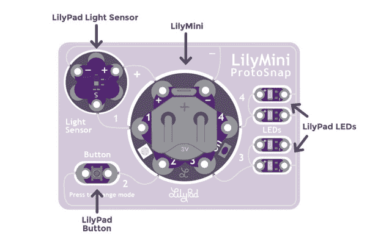
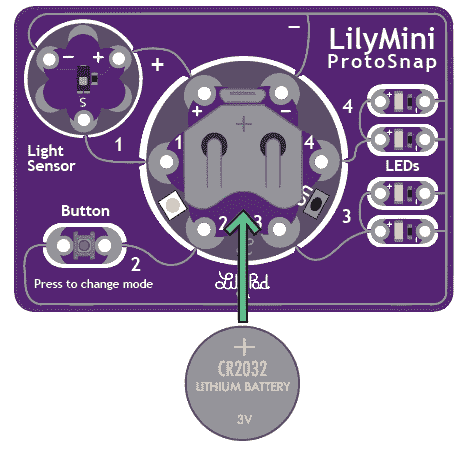
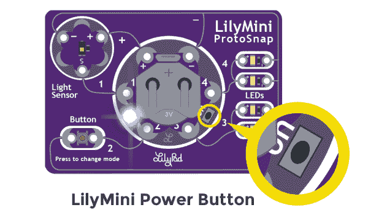
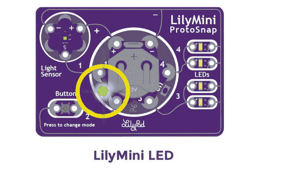
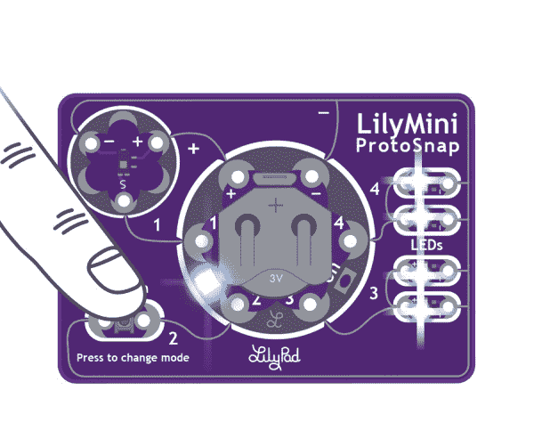
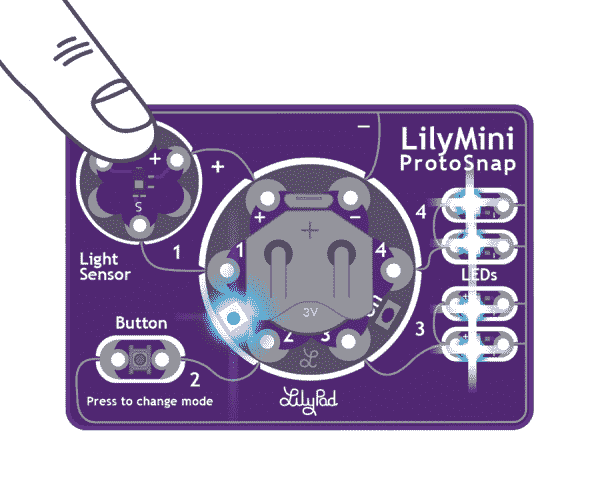
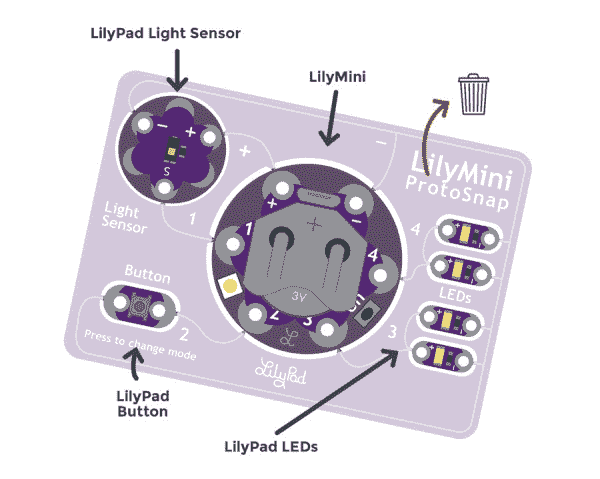
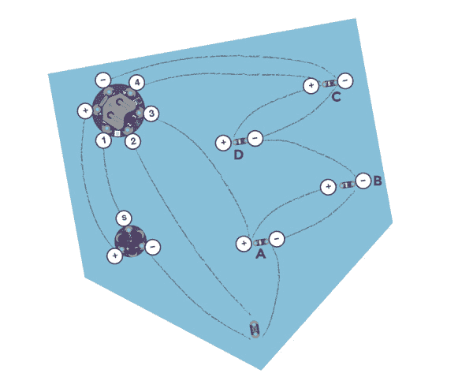

# LilyMini ProtoSnap 连接指南

> 原文：<https://learn.sparkfun.com/tutorials/lilymini-protosnap-hookup-guide>

## 概观

在开始缝纫之前，LilyMini ProtoSnap 是开始学习创建交互式电子纺织品电路的好方法。请继续阅读，了解电路板预编程行为的描述，以及如何在项目中使用它。

 

将**添加到您的[购物车](https://www.sparkfun.com/cart)中！**

### [LilyPad LilyMini 原声](https://www.sparkfun.com/products/14063)

[In stock](https://learn.sparkfun.com/static/bubbles/ "in stock") DEV-14063

LilyMini ProtoSnap 是开始学习创建交互式电子纺织品电路的好方法，在您开始之前…

$17.503[Favorited Favorite](# "Add to favorites") 15[Wish List](# "Add to wish list")** **像其他 [LilyPad ProtoSnap 板](https://www.sparkfun.com/search/results?term=protosnap)一样，LilyMini ProtoSnap 的所有部件都连接在一起，使您能够在缝纫之前测试电路的功能。在电路板的中心是一个预编程的 LilyMini 微控制器，连接到一个 [LilyPad 光传感器](https://www.sparkfun.com/products/8464)、 [LilyPad 按钮](https://www.sparkfun.com/products/8776)和两对[lily pad led](https://www.sparkfun.com/products/13902)。

### 推荐阅读

如果这是你的第一个电子纺织项目，看看我们的一些初学者教程。

 [### 规划可穿戴电子项目](https://learn.sparkfun.com/tutorials/planning-a-wearable-electronics-project) Tips and tricks for brainstorming and creating a wearables project.[Favorited Favorite](# "Add to favorites") 25 [### LilyPad 光线传感器连接指南](https://learn.sparkfun.com/tutorials/lilypad-light-sensor-hookup-guide) How to hook up the LilyPad Light Sensor as well as some project ideas and example code.[Favorited Favorite](# "Add to favorites") 3 [### LilyPad 基础:电子缝纫](https://learn.sparkfun.com/tutorials/lilypad-basics-e-sewing) Learn how to use conductive thread with LilyPad components.[Favorited Favorite](# "Add to favorites") 16

## 硬件概述和功能

Don’t snap apart your LilyMini ProtoSnap until you are ready to install into a project. Keeping the pieces together is a great way to prototype and test out function before sewing.

LilyMini 原型快照包括六个 LilyPad 组件，它们通过称为轨迹的银色路径连接到 LilyMini。在将 ProtoSnap 分解成单独的片段后，我们将用导电线代替这些路径。为了便于参考，ProtoSnap 上的每个部件都有一个标签，上面有其名称和与之连接的 LilyMini sew 选项卡。

| LilyPad 组件: | 连接到 LilyMini 缝纫标签: | 描述: |
| LilyPad 光传感器 | one | LilyMini 接收来自光线传感器的环境光线水平输入。 |
| LilyPad 按钮 | Two | LilyMini 接收按钮按压输入以改变模式。 |
| 2 个 LilyPad LEDs) | three | 一对由 LilyMini 模式控制的 led。 |
| 2 个 LilyPad LEDs) | four | 由 LilyMini 模式控制的第二对 led。 |
| LilyPad 光传感器(+) | + | LilyMini 为光传感器供电。 |
| 所有组件(-) | - | 所有元件共用一个公共接地连接回 LilyMini。 |

### 为 LilyMini 原型快照供电

位于 ProtoSnap 中心的 LilyMini 板有一个内置电池座，可以容纳一个[20 毫米 CR2032 纽扣电池](https://www.sparkfun.com/products/338)。该板也可以通过微型 USB 端口供电。如果两者都存在，USB 电缆优先。当 LilyMini 通过电缆供电时，不会从电池中获得电力。

Slide the battery into the LilyMini's battery holder with the + labeled side facing up. Be careful not to break the LilyPad pieces apart while inserting or removing the battery. To remove the battery, use a non-conductive item (pen caps or pencils work well) to gently push the battery out. Some LilyMini ProtoSnaps may ship with a battery pull tab, remove this before using.

要打开 LilyMini，请在缝纫标签 3 和 4 之间找到标有 on 的小按钮。安装电池(或连接 USB 电缆)后，快速按下并松开按钮以启动 LilyMini。要关闭 LilyMini，再次按下按钮。

通电时，缝纫标签 1 和 2 之间的内置 LED 用作指示灯。如果电池电量足够为电路板供电，LED 将在启动时短暂闪烁绿色；如果电池电量过低，无法为电路供电，LED 将闪烁红色。LilyMini 不包括电池充电电路，当 LED 闪烁红光时，我们建议安装新电池以获得最佳性能。

## 探索示例电路

LilyMini ProtoSnap 附带了预加载的代码，这些代码使用所有与之连接的 LilyPad 片段。此示例代码有三种模式，可以通过按下 ProtoSnap 左下角的 LilyPad 按钮来选择(请参见下图)。LilyMini 上的内置 LED 会改变颜色，以指示所选择的模式。

#### LilyMini 原型快照模式

| 方式 | 颜色 | 行为 |
| one | 怀特（姓氏） | 所有指示灯都亮着。 |
| Two | 品红 | led 以呼吸模式淡入淡出。当光传感器被盖住时，led 会更快地消失。 |
| three | 蓝绿色 | led 关闭。当光传感器被盖住时，led 将闪烁。 |

### 尝试一下

按下按钮切换模式。在模式 2 和 3 中，当光传感器的光值低于某个水平时，LilyMini 会告诉 led 改变行为(呼吸或闪烁)。当光线水平再次上升时，LilyMini 会告诉 led 返回到初始状态。

## 缝合到项目中

小心地将原型的各个部分分开，为缝纫做准备。如果你很难将碎片分开，使用一套钳子或斜切器。丢弃不可缝合的碎片和废料。

Before sewing, use a pen cap or other non-metal object to carefully push the battery out of the holder. The LilyMini’s battery fits tightly in the holder.

将 LilyPad 放在你的项目上，用少量热胶水或织物胶水固定，确保不要盖住缝翼上的孔。在粘贴之前，请对照您的图表(或模板，如果使用 SparkFun 设计)仔细检查 LilyPad 的方向。为了帮助你规划缝线，用粉笔或可洗记号笔在毛毡上画出你的线路图。

The image above is an example of a project diagram using the LilyMini ProtoSnap. For instructions and downloadable template, visit the [Night-Light Pennant](https://learn.sparkfun.com/tutorials/night-light-pennant-with-lilymini-protosnap) tutorial.

布置电路后，小心地用导线将每个 LilyPad 组件连接到 LilyMini。

#### 如果你需要用导电线缝纫的帮助，本教程涵盖了基本知识。

## 资源和更进一步

寻找项目灵感？来自 [LilyPad 可缝合电子套件](https://www.sparkfun.com/products/13927?_ga=1.98687388.305709336.1443132280)的[夜光三角旗](https://learn.sparkfun.com/tutorials/night-light-pennant-with-lilymini-protosnap)项目使用 LilyMini ProtoSnap。

 

将**添加到您的[购物车](https://www.sparkfun.com/cart)中！**

### [LilyPad 可缝电子套装](https://www.sparkfun.com/products/13927)

[In stock](https://learn.sparkfun.com/static/bubbles/ "in stock") KIT-13927

LilyPad 可缝制电子套件让您通过以下方式探索电子缝纫和电子纺织品的奇妙世界

$106.959[Favorited Favorite](# "Add to favorites") 39[Wish List](# "Add to wish list")** **这些教程将指导您完成其他项目和概念:

 [### 电子纺织品的绝缘技术](https://learn.sparkfun.com/tutorials/insulation-techniques-for-e-textiles) Learn a few different ways to protect your conductive thread and LilyPad components in your next wearables project.[Favorited Favorite](# "Add to favorites") 16 [### 规划可穿戴电子项目](https://learn.sparkfun.com/tutorials/planning-a-wearable-electronics-project) Tips and tricks for brainstorming and creating a wearables project.[Favorited Favorite](# "Add to favorites") 25 [### 为您的项目选择 LilyPad Arduino](https://learn.sparkfun.com/tutorials/choosing-a-lilypad-arduino-for-your-project) Not sure which LilyPad Arduino is right for you? We'll discuss the features of each and help you decide.[Favorited Favorite](# "Add to favorites") 13****