# LilyPad 开发板连接指南

> 原文：<https://learn.sparkfun.com/tutorials/lilypad-development-board-hookup-guide>

## 介绍

#### 用户注意:

This resource is for users who are using the [LilyPad Development Board](https://www.sparkfun.com/products/retired/11262).

For users with the [LilyPad ProtoSnap Plus](https://www.sparkfun.com/products/14346), please refer to the [LilyPad ProtoSnap Plus Hookup Guide](https://learn.sparkfun.com/tutorials/lilypad-protosnap-plus-hookup-guide).

有兴趣进 LilyPad 吗？或者是 Arduino 引起了你的兴趣？两者都有？不管是什么，ProtoSnap LilyPad 开发板都是一个很好的开始工具！

[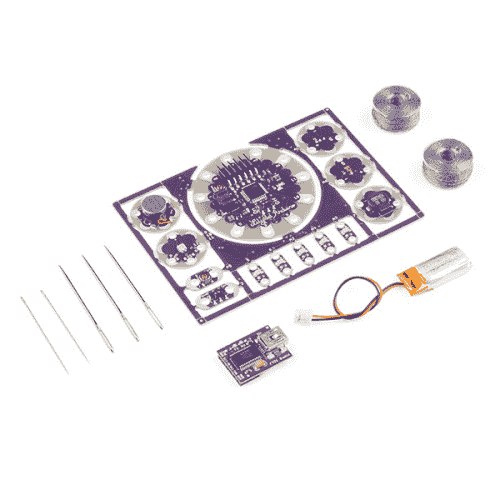](https://www.sparkfun.com/products/retired/11262) 

### [LilyPad ProtoSnap 开发板](https://www.sparkfun.com/products/retired/11262)

[Retired](https://learn.sparkfun.com/static/bubbles/ "Retired") DEV-11262

ProtoSnap 系列是一种无需试验板即可构建项目原型的新方法。所有东西都连接在一个单独的业务对象上…

5 **Retired**[Favorited Favorite](# "Add to favorites") 18[Wish List](# "Add to wish list")[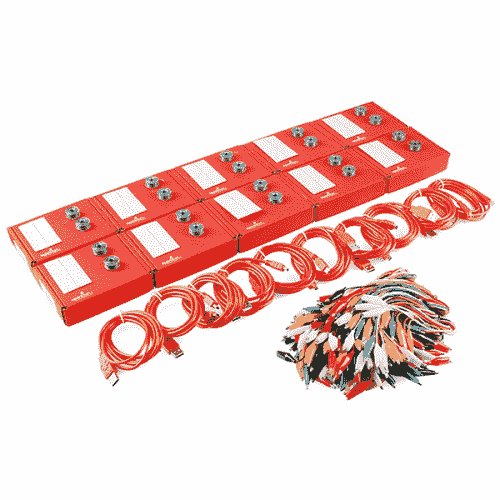](https://www.sparkfun.com/products/retired/11762) 

### [LilyPad 实验室套装](https://www.sparkfun.com/products/retired/11762)

[Retired](https://learn.sparkfun.com/static/bubbles/ "Retired") LAB-11762

ProtoSnap LilyPad 开发板是介绍和探索电子纺织品的好方法。这个实验包包括你所有的东西…

**Retired**[Favorited Favorite](# "Add to favorites") 1[Wish List](# "Add to wish list")

ProtoSnap LilyPad 开发板汇集了一些我们最喜欢的 LilyPad 开发板。在这个大杂烩的中心是我们的[LilyPad Arduino Simple Board](https://www.sparkfun.com/products/10274)-一个流行的 Arduino 开发平台的小型 lily pad 版本。使用附带的 [FTDI 基本分线点](http://www.sparkfun.com/products/10275)，您可以对该板进行编程，使其能够处理各种输入和输出:

*   1 个 [LilyPad 按钮](http://www.sparkfun.com/products/8776)
*   1 个 [LilyPad 滑动开关](http://www.sparkfun.com/products/9350)
*   5 个 [LilyPad 亮白色 LED](http://www.sparkfun.com/products/10081)
*   1 个 [LilyPad RGB 三色 LED](http://www.sparkfun.com/products/8467)
*   1 个 [LilyPad 光传感器](http://www.sparkfun.com/products/8464)
*   1 个 [LilyPad 温度传感器](http://www.sparkfun.com/products/8777)
*   1 x [LilyPad 蜂鸣器](http://www.sparkfun.com/products/8463)
*   1 个 [LilyPad 振动板](http://www.sparkfun.com/products/8468)

所有这些都已经连接到 LilyPad Arduino Simple。然后，一旦你对 Arduino 的编程感到满意，你就可以把每一部分分开，然后按照你认为合适的方式实现到你的项目中。但是...

**Don’t snap apart your LilyPad Development Board** until you're ready to use the pieces in a project. If you leave the pieces attached to the board, you'll be able to prototype and test your project before you start sewing.

### 所需材料

要对电路板重新编程和充电，您需要连接一根 mini-B USB 电缆。仔细检查它是否标有“仅供电”,因为这种类型的电缆不会传输 LilyPad Arduino Simple 板所需的编程数据。如果您没有，可以从 SparkFun 获得一个:

[](https://www.sparkfun.com/products/11301) 

将**添加到您的[购物车](https://www.sparkfun.com/cart)中！**

### [SparkFun USB 迷你-B 线- 6 脚](https://www.sparkfun.com/products/11301)

[In stock](https://learn.sparkfun.com/static/bubbles/ "in stock") CAB-11301

这是一条 USB 2.0 型到 Mini-B 型 5 针电缆。你知道，通常带有 USB 集线器、相机、MP3 的迷你 B 连接器…

$4.503[Favorited Favorite](# "Add to favorites") 20[Wish List](# "Add to wish list")******Note:** The [LilyPad FTDI](https://www.sparkfun.com/products/10275) is included in the LilyPad Development Board. If you bought the LilyPad Arduino Simple board separately, you will need both the mini-B USB cable and FTDI to follow along with this guide.

### 推荐阅读

如果您不熟悉以下概念，我们建议您在继续之前查看这些教程。

[](https://learn.sparkfun.com/tutorials/what-is-an-arduino) [### 什么是 Arduino？](https://learn.sparkfun.com/tutorials/what-is-an-arduino) What is this 'Arduino' thing anyway? This tutorials dives into what an Arduino is and along with Arduino projects and widgets.[Favorited Favorite](# "Add to favorites") 50[](https://learn.sparkfun.com/tutorials/installing-arduino-ide) [### 安装 Arduino IDE](https://learn.sparkfun.com/tutorials/installing-arduino-ide) A step-by-step guide to installing and testing the Arduino software on Windows, Mac, and Linux.[Favorited Favorite](# "Add to favorites") 16[](https://learn.sparkfun.com/tutorials/planning-a-wearable-electronics-project) [### 规划可穿戴电子项目](https://learn.sparkfun.com/tutorials/planning-a-wearable-electronics-project) Tips and tricks for brainstorming and creating a wearables project.[Favorited Favorite](# "Add to favorites") 25

## 硬件概述和功能

**Don’t snap apart your LilyPad Development Board** until you're ready to use the pieces in a project. If you leave the pieces attached to the board, you'll be able to prototype and test your project before you start sewing.

LilyPad 开发板具有 12 个 LilyPad 组件，通过称为走线的导电路径连接到 LilyPad Arduino 简单微控制器。这些轨迹中有许多是隐藏的，但作为参考，ProtoSnap 上的每个组件都有一个用白色丝网印刷的标签，上面印有它所连接的 LilyPad Arduino Simple sew 标签的编号。

如果你以前用过 Arduino，你可能对它的管脚很熟悉——数字的和模拟的。一个 Arduino 有 14 个[数字引脚](http://arduino.cc/en/Tutorial/DigitalPins)，6 到 8 个[模拟引脚](http://www.arduino.cc/en/Tutorial/AnalogInputPins)，都可以用来与其他组件接口；例如，在 ProtoSnap LilyPad 开发板上围绕 Arduino 的那些。

了解 Arduino 上的哪个引脚与哪个组件相关联非常重要。如果你需要一个什么引脚连接什么的提示，你真正需要做的就是往下看。

[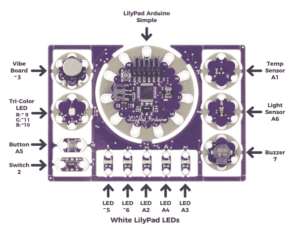](https://cdn.sparkfun.com/assets/learn_tutorials/5/2/0/Dev_Labels_2.png)**Some of the sew tabs on the LilyPad Arduino Simple have special functionality:**

*   数字前面的“A”表示可以作为[模拟输入](https://learn.sparkfun.com/tutorials/analog-to-digital-conversion)的选项卡。这些 sew 标签可以读取输出不同电压的传感器，如内置在 LilyPad Arduino Simple 中的光传感器。
    
*   参考上面 LilyPad 开发板的注释图，数字前面的一个“~”符号表示 tab 支持 [PWM(脉宽调制)输出](https://learn.sparkfun.com/tutorials/pulse-width-modulation)。这些标签可以输出“模拟”信号，用于改变发光二极管的亮度等。

**Note:** The "A" in front of analog sew tab numbers in your code is optional. However, do not include the "~" symbol for PWM outputs. It is only provided to make it easy for you to check which pins can produce PWM (analog) output and is not used in programming.

但是，如果你的眼睛不能阅读那么小的文本，这里有一个连接到 LilyPad Arduino Simple 的组件列表:

| LilyPad 组件 | Arduino 引脚 | 连接到 LilyPad Arduino 简单缝纫标签 | 描述 |
| LilyPad 共鸣板 | ~3 |  | 触觉反馈由电机的振动提供，并由 LilyPad Arduino Simple 控制。 |
| LilyPad 三色(RGB) LED -红色 | ~9 | -好的 | 三色 LED 的红色由 LilyPad Arduino Simple 控制。 |
| LilyPad 三色(RGB) LED -蓝色 | ~10 | -好的 | 三色 LED 的蓝色由 LilyPad Arduino Simple 控制。 |
| LilyPad 三色(RGB) LED -绿色 | ~11 | -好的 | 三色 LED 的绿色由 LilyPad Arduino Simple 控制。 |
| LilyPad 按钮 | A5 号 | -好的 | LilyPad Arduino Simple 接收按钮按压作为输入。 |
| LilyPad 滑动开关 | Two |  | LilyPad Arduino Simple 接收开关状态(开/关)输入。 |
| LilyPad 白色发光二极管 | ~5，~6，A2，A3，A4 | (所有 5 个发光二极管) | 一组由 LilyPad Arduino Simple 控制的白色 led。 |
| LilyPad 蜂鸣器(+) | seven |  | 由 LilyPad Arduino Simple 控制的蜂鸣器。 |
| LilyPad 蜂鸣器(-) | Twelve |  | 由 LilyPad Arduino Simple 控制的蜂鸣器。虽然通常连接到 GND，它可以连接到一个 Arduino 引脚。 |
| LilyPad 光线传感器 | A6 |  | LilyPad Arduino Simple 从光线传感器接收环境光线水平输入。 |
| LilyPad 温度传感器 | 一流的 |  | LilyPad Arduino Simple 通过模拟传感器接收基于体温和环境条件的物理触摸温度。 |

**Heads up!** When planning to snap the LilyPad components apart for a project, not all the components will be able to connect due to the design of the LilyPad Arduino Simple's sew tabs. Certain components are currently connected to the LilyPad Arduino Simple via small traces instead of the petals. The table above indicates which pins are currently connected to the sew tabs. Make sure to plan the project accordingly. You will also need to redefine the pins in code when reconnecting the components to the sew tabs.

For example, if you decide to snap the components off and use the light sensor instead of a white LED, you will need to reconnect the light sensor to another analog pin (like A2-A5). By replacing the connection of one of the components, the sensor will be able to be controlled by the LilyPad Arduino Simple again. Replacing the LED on A3, will require the code to be adjusted for the LilyPad light sensor on A3.

### LilyPad 三色 LED

RGB LED 内部是三个较小的 LED——红色、绿色和蓝色。这些 LED 中的每一个都连接到[三色 LED](https://www.sparkfun.com/products/8467) 上的一个 sew 标签，它们都通过一个公共阳极(正极)引脚连接。与其他 RGB LEDs 不同，这种配置意味着要点亮 LED，您需要将各个红色、绿色和蓝色 LED 接地，而不是给它们供电。

[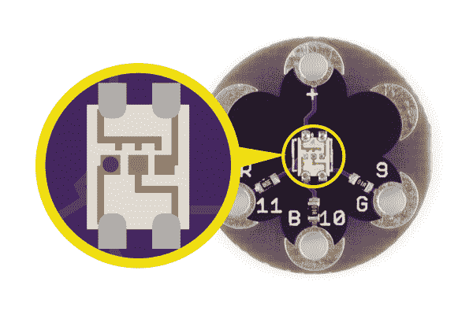](https://cdn.sparkfun.com/assets/learn_tutorials/5/2/0/LilyPad_Tri-Color_LED_Dev_RGBDetail_Common_Anode.png)

### LilyPad Arduino 简易板

ProtoSnap LilyPad 开发板上的大部分单个板都比较简单；它们有一个大元件，可能还有一些小的支持元件，比如电阻。但是我们应该概述一下 LilyPad Arduino Simple 的一些复杂性。

[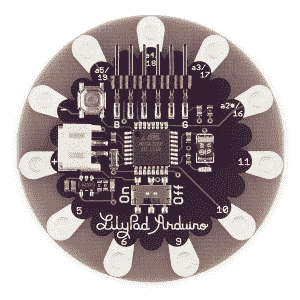](https://cdn.sparkfun.com/assets/learn_tutorials/5/2/0/10274-04c.jpg)

**特性:**

*   5 个数字 I/O 引脚
*   4 个模拟引脚
*   ATmega328P
*   引脚 13 上的内置 LED
*   内置开/关开关
*   内置电源插座(JST 连接器),用于 3.7V LiPo 电池和充电电路(无需额外的电池充电器)
*   简化布局，减少针脚，为缝纫或不太复杂的项目提供更多空间

简单电路板的中心是 atmega 328(T1)，电路板中间的黑色大方块。这是微处理器，是“操作的大脑”这是存储和执行你的 Arduino 草图。围绕 ATmega328 的是一些无源支持元件，对你来说没什么重要的。

[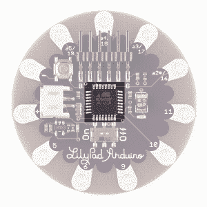](https://cdn.sparkfun.com/assets/learn_tutorials/5/2/0/10274-04c_ATmega328.png)

ATmega328 的右边是一个很小的 **LED** (虽然不亮的话很难看到)。这可以被归类为 Arduino 上最重要的组件。LED 与 Arduino 引脚 13 相连，可满足您所有的闪烁需求。在左上方，有一个瞬时按钮，用于**重置**atmega 328。这将使 Arduino 正在运行的任何草图再次从最顶端开始。

[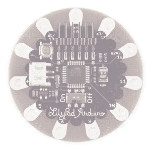](https://cdn.sparkfun.com/assets/learn_tutorials/5/2/0/10274-04c_LilyPadArduinoSimpleBuiltInLED.png)

ATmega328 下面有一个**开/关滑动开关**。它的功能非常明显，但可能会有一点误导。有几种方法为 ProtoSnap LilyPad 开发板供电，在大多数情况下，您可能会使用附带的 FTDI 板，通过计算机的 USB 为其供电。如果电路板由 FTDI 板供电，开/关开关将完全不起作用。如果你通过 ATmega 左边的白色小连接器供电，这个开关只能控制 Arduino 的电源。

[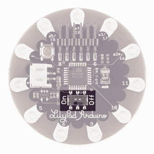](https://cdn.sparkfun.com/assets/learn_tutorials/5/2/0/10274-04c_LilyPadArduinoSimpleBatteryPowerSwitch.png)

简单板上的**白色连接器**是一个有点普通的电源连接器，来自 JST 系列连接器。它主要用于连接我们的一个[锂聚合物](http://www.sparkfun.com/search/results?term=lithium+ion&what=products)电池。LiPo 是可充电电池，所以我们在 LilyPad Arduino Simple 上还包括了一个**电池充电器**。因此，如果你插上电池，并连接了 FTDI 基本分线点，你就可以从你的电脑上给电池充电。

[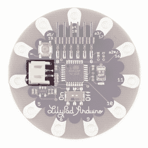](https://cdn.sparkfun.com/assets/learn_tutorials/5/2/0/10274-04c_LilyPadArduinoSimpleBatteryJSTConnector.png)

哦，你在哪里连接 FTDI 板？嗯，Arduino Simple 的顶部是一个**直角六针插头**。FTDI 板上的母接头应能顺利滑入该连接器。

[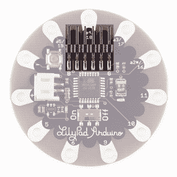](https://cdn.sparkfun.com/assets/learn_tutorials/5/2/0/10274-04c_LilyPadArduinoSimpleFTDIProgrammingHeader.png)

### 为 LilyPad 开发板供电

LilyPad LilyPad 开发板有两种供电方式:

*   如果你有一个可用的 USB 电源(一台电脑，5V USB 墙上适配器，USB 电池组等。)，您可以通过 USB 电缆和 FTDI 运行该板。

*   如果你想让你的项目更便携，你可以很容易地将可充电的锂聚合物电池连接到板上。有关电池和充电的更多信息，请参见[技术说明](#battery)部分。

## 探索示例电路

**Don’t snap apart your LilyPad Development Board** until you're ready to use the pieces in a project. If you leave the pieces attached to the board, you'll be able to prototype and test your project before you start sewing.

LilyPad 开发板附带了预加载的代码，这些代码展示了与之相连的所有 LilyPad 部件。要启动 LilyPad 开发板，请使用 FTDI 和 mini-B USB 电缆将其连接到您的计算机，或者连接一个 [E-Textiles 电池](https://www.sparkfun.com/products/13112)。然后将 LilyPad Arduino Simple 右侧的开关滑动到 on 位置。

首先，白色发光二极管逐个打开，一次一个。然后 RGB LED 将闪烁每种颜色。一旦序列完成，LilyPad 开发板将准备接受输入！尝试将手指放在温度传感器上。一旦传感器读取到某个阈值，红色 LED 就会亮起。将手指放在光传感器上将打开白色 led。按下瞬时按钮将导致蜂鸣器发出一些噪音。将 LilyPad 滑动开关(位于电路板的左下方)拨到 on 位置将导致振动电机开始振动以获得触觉反馈。

[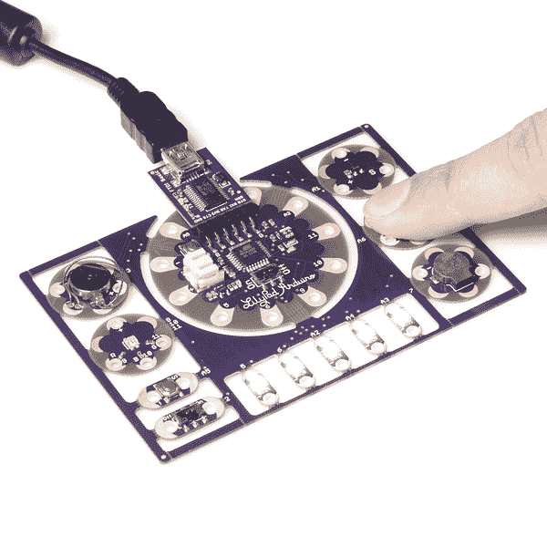](https://cdn.sparkfun.com/assets/learn_tutorials/5/2/0/10958-04a.jpg)

## 设置 Arduino

**注意:**本指南假设您在桌面上使用的是最新版本的 Arduino IDE。如果这是你第一次使用 Arduino，请回顾我们关于[安装 Arduino IDE 的教程。](https://learn.sparkfun.com/tutorials/installing-arduino-ide)

[](https://learn.sparkfun.com/tutorials/installing-arduino-ide) [### 安装 Arduino IDE

#### 2013 年 3 月 26 日](https://learn.sparkfun.com/tutorials/installing-arduino-ide) A step-by-step guide to installing and testing the Arduino software on Windows, Mac, and Linux.[Favorited Favorite](# "Add to favorites") 16

### 安装 FTDI 驱动程序

如果你以前从未使用过 LilyPad Arduino，你需要安装 FTDI 驱动程序。根据计算机的操作系统，您需要遵循特定的说明。请转到[如何安装 FTDI 驱动程序](https://learn.sparkfun.com/tutorials/usb-serial-driver-quick-install-)，了解如何将 FTDI 驱动程序安装到您的计算机上的具体说明。

[](https://learn.sparkfun.com/tutorials/usb-serial-driver-quick-install-) [### USB 串行驱动程序快速安装

#### 2017 年 8 月 31 日](https://learn.sparkfun.com/tutorials/usb-serial-driver-quick-install-) How to install USB serial drivers on Windows, MacOS , and Linux.[Favorited Favorite](# "Add to favorites") 2

请注意，你*不会*必须再次安装 FTDI 驱动程序。

## 上传代码

您*将*需要在每次对电路板编程时执行以下三个步骤。这三个步骤是:

1\. Connect the LilyPad Development Board to your computer using the FTDI board and a USB cable.
2\. Select **"LilyPad Arduino"** from Arduino's **"Board"** menu.
3\. Select **"ATmega328"** from Arduino's **"Processor"** menu.
4\. Select the serial port the LilyPad is connected to from Arduino's **"Port"** menu.

让我们详细回顾一下这三个步骤:

### 1.将 LilyPad 开发板连接到您的电脑

将 LilyPad 开发板放在干净的非金属工作台面上。将 LilyPad FTDI 板连接到开发板中心的 LilyPad Arduino Simple 上的接头。

[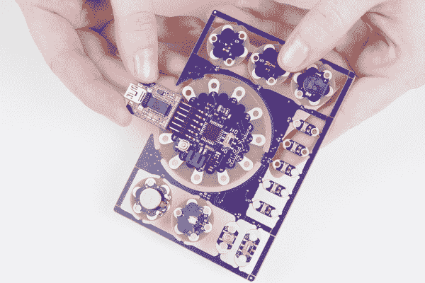](https://cdn.sparkfun.com/assets/learn_tutorials/5/2/0/LilyPadDev_AttachFTDI.jpg)

将 FTDI 板的另一端连接到 mini-B USB 电缆。电缆只能以一种方式插入，并且应该卡紧。

[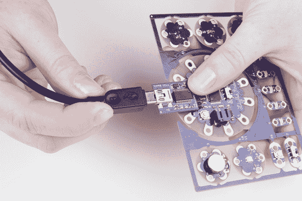](https://cdn.sparkfun.com/assets/learn_tutorials/5/2/0/LilyPadDev_FTDIUSB.jpg)

然后将 USB 电缆的另一端连接到电脑的 USB 端口。

[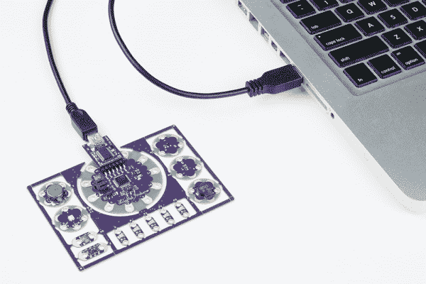](https://cdn.sparkfun.com/assets/learn_tutorials/5/2/0/LilyPadDev_PluggedIn.jpg)

将 LilyPad Arduino 上的开关滑动到 on 位置。如果设置为关闭位置，您将无法将代码上传至电路板。

[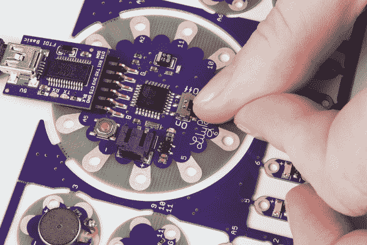](https://cdn.sparkfun.com/assets/learn_tutorials/5/2/0/LilyPadDEV_OnSwitch.jpg)

### 2.从纸板菜单中选择 LilyPad Arduino

要对 LilyPad 开发板中心的 LilyPad Arduino Simple 进行编程，打开**工具** > **板**列表，选择 **LilyPad Arduino** 。选中时，菜单中的电路板旁边会显示一个点(Windows)或复选标记(Mac ),并且它会显示在工具菜单中的电路板旁边。

[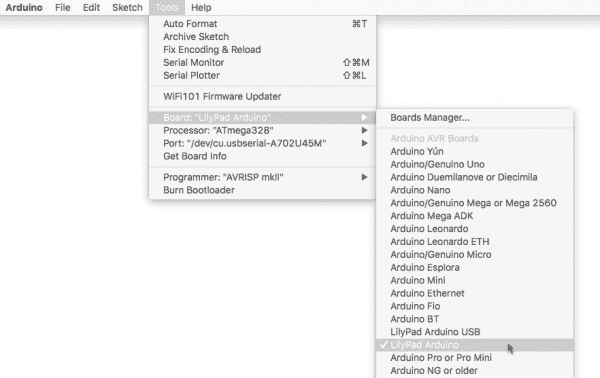](https://cdn.sparkfun.com/assets/learn_tutorials/5/2/0/LilyPadSelectArduino.png)

### 3.从处理器菜单中选择 ATmega328

选择 LilyPad Arduino 后，在下一个标签为**处理器**的菜单中将有两个选项可用。为您的 LilyPad Arduino 选择 **ATmega328** 。

[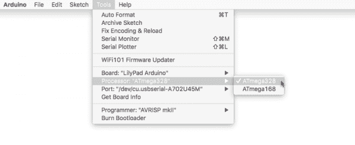](https://cdn.sparkfun.com/assets/learn_tutorials/5/2/0/LilyPadDevSelectProcessor.png)

### 4.从端口菜单中选择端口

Arduino 需要知道你的 LilyPad Arduino 连接到哪个端口，这样它才能对它进行编程。每当您将 USB 设备插入电脑时，电脑都会为其分配一个端口号。进入**工具** > **端口**菜单，选择连接了 LilyPad Arduino 的端口。

在 Windows 上，端口被列为 COM # #在 Mac 或 Linux 机器上，它们将是“/dev/cu.usbmodem####”。您的屏幕可能与下图不同，这取决于您使用的操作系统。

[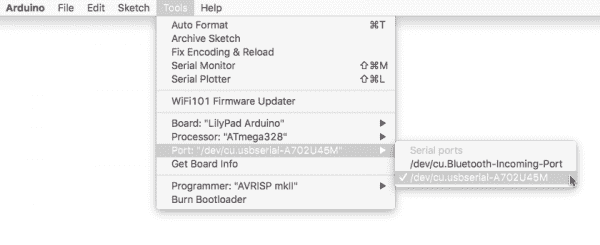](https://cdn.sparkfun.com/assets/learn_tutorials/5/2/0/LIlyPadDevSelectSerial.png)**Troubleshooting:** If you don't see a port in the menu, ensure that the board is powered up (switch in the ON position), and that the USB cable is securely connected to both the board and your computer and that you have installed the FTDI drivers. Some USB cables are only meant for charging and don't pass data - they'll power the board, but it won't show up in the port menu. If needed, try a different cable.

### 上传闪烁

在嵌入式电子领域，每个好的开发平台都必须有一个 LED，在任何开发平台上运行的第一个测试程序几乎总是 LED 的闪烁。所以让我们让 LilyPad Simple Arduino 板上的那个小 LED 闪烁一下。

回顾一下，一旦你:

1.  已使用 FTDI 和 USB 电缆将 LilyPad 开发板连接至您的计算机。
2.  选择板卡类型(" **LilyPad Arduino** "作为板卡，ATmega328 作为处理器)。
3.  从**【端口】**菜单中选择 COM 端口。

您可以上传代码了！让我们上传一些代码来尝试一下。

从菜单**文件** > **加载“眨眼”示例** > **01。基础** > **眨眼**，点击“上传”按钮(里面有右箭头的大圆形按钮)。这是一个非常简单的示例程序；它只是每秒钟闪烁一次 LED。

[](https://cdn.sparkfun.com/assets/learn_tutorials/5/2/0/OpenBlinkExample.png)

Arduino 会编译代码，然后通过 USB 线发送到 LilyPad Arduino Simple。当代码上传时，内置的 LED 将闪烁，表示代码正在传输。当代码最终运行时，电路板中央的 LED 将缓慢闪烁绿色。成功！

如果这一切工作，祝贺你！您已经准备好使用 LilyPad 开发板进行原型开发了。

### 默认示例代码

如果您有兴趣重新上传您之前研究过的默认示例代码，可以在[产品 GitHub 存储库](https://github.com/sparkfun/ProtoSnap-LilyPad_Development_Board)和下面显示的下载按钮中找到。

[Download LilyPad Development Board Sample Code](https://cdn.sparkfun.com/assets/learn_tutorials/5/2/0/LilyPadDev_v11rev.ino)

### 超越眨眼

好吧，我们刚刚打开了一个巨大的蠕虫罐头，你已经迈出了你进入 Arduino 的消耗生命的世界的第一步。从这里开始，你可能想探索一些 Arduino 的其他示例草图。有一个用于按钮**(文件>示例> 2。数字>按钮)**，或者你可以淡化那些 RGB led**(文件>示例> 1。基本的>渐变)**，或者你可以在蜂鸣器上播放一首歌曲**(文件>示例> 2。数字>音调旋律)**，或者尝试改编模拟序列草图**(文件>示例> 3。温度和光线传感器的模拟>analoginutserial)**。只要确保你在 LilyPad 开发板上将管脚改变到它们正确的映射就行了！

[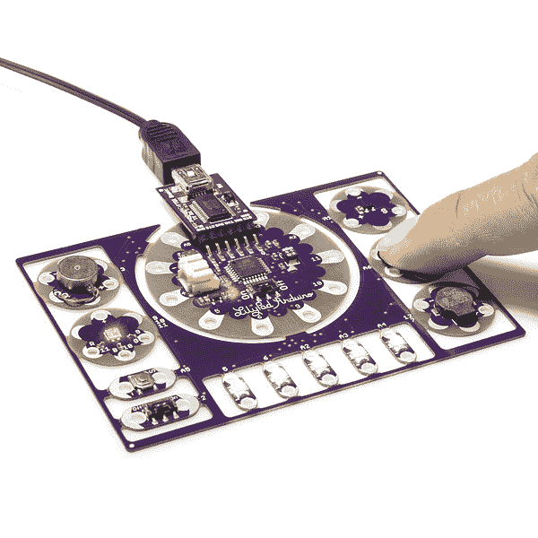](https://cdn.sparkfun.com/assets/learn_tutorials/5/2/0/10506-04.jpg)

您还可以查看 [LilyPad 开发板活动指南](https://learn.sparkfun.com/tutorials/lilypad-development-board-activity-guide):

[](https://learn.sparkfun.com/tutorials/lilypad-development-board-activity-guide) [### LilyPad 开发板活动指南

#### 2017 年 12 月 7 日](https://learn.sparkfun.com/tutorials/lilypad-development-board-activity-guide) Learn how to program in Arduino with the LilyPad Development Board. This guide includes 11 example activities that use the pre-wired LilyPad boards on the LilyPad Development Board.[Favorited Favorite](# "Add to favorites") 5

## 缝合到项目中

一旦你对 Arduino 编程感到舒适，也许你会开始觉得受到 ProtoSnap LilyPad 开发板当前配置的限制。在这一点上，你可以随意折断每一个单独的部分，把它们变成下一个伟大的创造！你将有一个坚实的 Arduino 编程基础，所以你可以把所有的注意力放在硬件上。

要获得灵感，请查看在更小的 [LilyPad 开发简单板](https://learn.sparkfun.com/tutorials/protosnap-lilypad-development-simple-hookup-guide)中使用的示例项目，以便抓取组件并缝合到织物上。

[](https://learn.sparkfun.com/tutorials/protosnap-lilypad-development-simple-hookup-guide) [### ProtoSnap LilyPad 开发简单连接指南

#### 2013 年 9 月 5 日](https://learn.sparkfun.com/tutorials/protosnap-lilypad-development-simple-hookup-guide) Interested in getting into LilyPad? Or maybe it's Arduino that tickles your fancy? Just want to add a little white-blinky-LED zest to your vest? All of the above? The ProtoSnap LilyPad Simple is a great tool to explore any of these subjects.[Favorited Favorite](# "Add to favorites") 5

这些教程会给你一些[工程施工](https://learn.sparkfun.com/tutorials/lilypad-basics-e-sewing)和[保温](https://learn.sparkfun.com/tutorials/insulation-techniques-for-e-textiles)的技巧和窍门:

[](https://learn.sparkfun.com/tutorials/insulation-techniques-for-e-textiles) [### 电子纺织品的绝缘技术](https://learn.sparkfun.com/tutorials/insulation-techniques-for-e-textiles) Learn a few different ways to protect your conductive thread and LilyPad components in your next wearables project.[Favorited Favorite](# "Add to favorites") 16[](https://learn.sparkfun.com/tutorials/lilypad-basics-e-sewing) [### LilyPad 基础:电子缝纫](https://learn.sparkfun.com/tutorials/lilypad-basics-e-sewing) Learn how to use conductive thread with LilyPad components.[Favorited Favorite](# "Add to favorites") 16

## 技术札记

如果你已经编程 Arduino 有一段时间了，请继续阅读关于 LilyPad 开发板的一些附加说明。它与其他 Arduinos 非常相似，但有一些你想知道的特殊功能和限制。

### 引脚编号

下面是 LilyPad Arduino 简单 I/O 引脚和每个功能的列表。

**图例:**

*   *n* =数字引脚

*   ~ *n* =支持 PWM 的引脚

*   *n，serial*= UART、I2C 或 SPI 的硬件串行引脚
*   A *n* =模拟引脚

*   ( *n* ) =内部引脚(未连接到缝纫标签)

*   [ *n* ] =内部引脚(在裸露过孔上可用)
*   { *n* } =内部引脚(公接头引脚上可用)

| 功能 | 数字的 | 模拟的 |
| Rx-I | {0}，接收 |  |
| Tx-O | {1}，德克萨斯州 |  |
| 滑动开关 | (2) |  |
| 振动板 | (~3) |  |
| 白光 LED | ~5 |  |
| 白光 LED | ~6 |  |
| 门铃 | (7) |  |
| RGB LED -红色 | ~9 |  |
| RGB LED -蓝色 | ~10，SS |  |
| RGB LED -绿色 | 11 岁，MOSI |  |
|  | [12]，味噌 |  |
| 内置绿色 LED | [13]SCK |  |
| 温度传感器 | (15) | (A1) |
| 白光 LED | Sixteen | 主动脉第二声 |
| 白光 LED | Seventeen | A3 号 |
| 白光 LED | Eighteen | A4，SDA |
| 瞬时按钮 | Nineteen | A5 号呼叫 SCL |
| 光敏感元件 |  | (A6) |

### [使用脂电池和电池充电](#battery)

SparkFun 出售一些与此板兼容的 LiPo 电池。如果你不熟悉 LilyPad 系统，我们推荐使用[电子纺织品电池](https://www.sparkfun.com/products/13112)。如果您自己提供电池，请使用带 JST 连接器的单芯(3.7V)锂电池。

容量较大的电池(以安培小时或 Ah 衡量)在需要充电之前会运行更长时间。多长时间将取决于你的程序打开多少个发光二极管，等等。如果你只是运行几个发光二极管，你可以期待每 100 毫安时的电池容量运行约 5 小时的董事会。

#### 充电率

要给连接的电池充电，请将主板插入 USB 电源。电池充电时,“CHG”LED 会亮起。当电池充满电时，LED 将关闭。默认充电电流设置为 **100mA** ，因此 100mAh 电池将在 1 小时内充电，1000mAh 电池将在 10 小时内充电，以此类推。由于主板被设置为以 100 毫安的速率充电，我们不建议连接低容量的 LiPo 电池(即 40 毫安的 LiPo 电池)进行充电。

[](https://cdn.sparkfun.com/assets/learn_tutorials/6/8/0/InsertBattery.jpg)*An example of inserting a LiPo battery into a JST connector on a different LilyPad board.*

即使使用 USB 电源，将 LiPo 电池永久连接到主板上也是安全的。电池不会被过度充电。

#### 关于清洗 LilyPad 项目的说明

LilyPad projects are hand-washable, but **always remove the battery before washing your project** and air-dry your project for several days before replacing the battery.

#### 拆卸脂肪电池

电池连接器可以很紧；拆卸电池时，切勿拉扯电线。用一把尖嘴钳或钳子轻轻地将插头从连接器中拔出。

**Tip:** There are two small "nubs" on the top of the plastic battery connector that can be shaved off with a hobby knife to make the battery easier to remove.Always turn the LilyPad off before inserting or removing a battery.

下图是用尖嘴钳从另一个 LilyPad 上取下的 LiPo 电池。

[](https://cdn.sparkfun.com/assets/learn_tutorials/6/8/0/PliersBattery_1.jpg)*An example of how to remove a LiPo battery from the JST connector on a different LilyPad board.*

## 解决纷争

### 常见的 Arduino 编译错误消息

没有按预期工作？别担心，我们都会遇到这种事。有时候，即使你遵循了指南，事情也不会按计划进行。本节重点介绍了在试图将代码上传到 LilyPad 开发板时可能会遇到的一些错误。

* * *

#### 错误 1: avrdude: stk500_getsync():不同步

如果您在 Arduino IDE 底部收到如下错误消息:

```
avrdude: stk500_getsync(): not in sync: resp=0x00
avrdude: stk500_disable(): protocol error, expect=0x14, resp=0x51 
```

或者

```
avrdude: stk500_recv(): programmer is not responding
avrdude: stk500_getsync() attempt 10 of 10: not in sync: resp=0x8c 
```

您看到的错误输出可能是由多种原因造成的。

“`sync resp`”的值是不同的，并不总是相同的，所以很难说。以下是我们知识库中已知的一些常见错误原因和可能的解决方案:

*   您没有正确设置*板*和*处理器*。
    *   将 **Tools > Board** 菜单设置为 **LilyPad Arduino** 为板卡， **ATmega328** 为处理器。它只能设置为**lily pad Arduino w/atmega 328**。
*   *串口*可能设置不正确。
    *   如果菜单中列出了多个串行端口，请尝试选择其他一些端口。
*   或者驱动程序安装不正确。

## *尝试拔出并重新插入 ProtoSnap。如果它提示您[安装驱动程序](https://learn.sparkfun.com/tutorials/usb-serial-driver-quick-install-)，请再次尝试安装。如果还是不行，我建议发一封电子邮件给我们的[技术支持团队](https://www.sparkfun.com/technical_assistance)。

#### 错误 2: avrdude: ser_open():无法打开设备

如果您收到如下错误消息:

```
avrdude: ser_open(): can't open device "\\.\COM15": Access is denied. 
```

*   可能是选择了错误的 COM 端口。
    *   确保 COM 端口与连接到计算机的 FTDI 端口相同。如果不是，请选择正确的 COM 端口。
*   这也可能意味着 LilyPad Arduino Simple 和您的电脑之间存在不良连接。
    *   在这种情况下，在`COM15`上选择了正确的 COM 端口，但是 Lilypad Arduino Simple 并没有物理连接到 FTDI。

* * *

### 上传有更多问题？

如果您在将代码上传到 LilyPad Arduino Simple 时仍有问题，并且这里没有列出，请尝试查看我们的[活动指南](https://learn.sparkfun.com/tutorials/lilypad-development-board-activity-guide/troubleshooting)的故障排除部分:

[LilyPad Development Board Activity Guide: Troubleshooting](https://learn.sparkfun.com/tutorials/lilypad-development-board-activity-guide/troubleshooting)

或者，您也可以尝试点击上传错误末尾提供的链接:

```
Problem uploading to board.  See http://www.arduino.cc/en/Guide/Troubleshooting#upload for suggestions. 
```

该链接指向 [Arduino.cc 的一般故障排除页面](http://www.arduino.cc/en/Guide/Troubleshooting#upload)，其中有几个可能的解决方案，我们的指南中没有列出。

## 资源和更进一步

有关 LilyPad 开发板的更多信息，请查看下面的参考资料:

*   [示意图(PDF)](http://cdn.sparkfun.com/datasheets/E-Textiles/Lilypad/LilyPad-Dev-v34b.pdf)
*   [老鹰文件(ZIP)](http://cdn.sparkfun.com/datasheets/E-Textiles/Lilypad/LilyPad-Dev-v34b.zip)
*   [LilyPad 门户生态系统](https://www.sparkfun.com/lilypad_sewable_electronics)
*   [默认示例 Arduino 草图](https://cdn.sparkfun.com/assets/learn_tutorials/5/2/0/LilyPadDev_v11rev.ino)
*   [LilyPad 开发板 GitHub 库](https://github.com/sparkfun/ProtoSnap-LilyPad_Development_Board)
*   [LilyPad 开发板活动指南](https://learn.sparkfun.com/tutorials/lilypad-development-board-activity-guide)
*   [GitHub 活动指南库](https://github.com/sparkfun/LilyPad_ProtoSnap_Development_Board_Activity_Guide)

以下是一些附加的 LilyPad 板，可以与 LilyPad 开发板和项目创意结合使用:

[](https://learn.sparkfun.com/tutorials/lilypad-pixel-board-hookup-guide) [### LilyPad 像素板连接指南](https://learn.sparkfun.com/tutorials/lilypad-pixel-board-hookup-guide) Add changing colors to your wearable projects using LilyPad Pixel Boards.[Favorited Favorite](# "Add to favorites") 5[](https://learn.sparkfun.com/tutorials/lilypad-reed-switch-hookup-guide) [### LilyPad 簧片开关连接指南](https://learn.sparkfun.com/tutorials/lilypad-reed-switch-hookup-guide) A guide to using the LilyPad Reed Switch breakout in your projects.[Favorited Favorite](# "Add to favorites") 2[](https://learn.sparkfun.com/tutorials/lilypad-safety-scarf) [### LilyPad 安全围巾](https://learn.sparkfun.com/tutorials/lilypad-safety-scarf) This scarf is embedded with a ribbon of LEDs that illuminate when it gets dark out, making yourself more visible to vehicle and other pedestrians.[Favorited Favorite](# "Add to favorites") 4

这里有一些资源可以帮助您使用 LilyPad 开发板规划项目:

[](https://learn.sparkfun.com/tutorials/insulation-techniques-for-e-textiles) [### 电子纺织品的绝缘技术](https://learn.sparkfun.com/tutorials/insulation-techniques-for-e-textiles) Learn a few different ways to protect your conductive thread and LilyPad components in your next wearables project.[Favorited Favorite](# "Add to favorites") 16[](https://learn.sparkfun.com/tutorials/planning-a-wearable-electronics-project) [### 规划可穿戴电子项目](https://learn.sparkfun.com/tutorials/planning-a-wearable-electronics-project) Tips and tricks for brainstorming and creating a wearables project.[Favorited Favorite](# "Add to favorites") 25[](https://learn.sparkfun.com/tutorials/powering-lilypad-led-projects) [### 为 LilyPad LED 项目供电](https://learn.sparkfun.com/tutorials/powering-lilypad-led-projects) Learn how to calculate how many LEDs your LilyPad project can power and how long it will last.[Favorited Favorite](# "Add to favorites") 8[](https://learn.sparkfun.com/tutorials/lilypad-basics-e-sewing) [### LilyPad 基础:电子缝纫](https://learn.sparkfun.com/tutorials/lilypad-basics-e-sewing) Learn how to use conductive thread with LilyPad components.[Favorited Favorite](# "Add to favorites") 16**