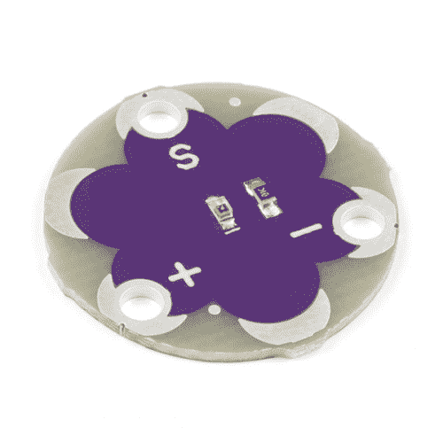

# LilyPad 光传感器 V2 连接指南

> 原文：<https://learn.sparkfun.com/tutorials/lilypad-light-sensor-v2-hookup-guide>

## 介绍

[LilyPad 光传感器](https://www.sparkfun.com/products/14629)是一个可缝合的分线板，上面有一个 ALS-PT19 光传感器。要使用光传感器，您需要连接到 LilyPad Arduino 或其他微控制器，以读取传感器值并在您的代码中使用它们。

LilyPad 光线传感器根据照射其上的环境光线水平，输出介于 **0V** 和 **3.3V** 之间的电压。随着更多的光线照射到传感器上，更多的电流将从电路板通过信号片流向与传感器相连的微控制器。如果传感器没有接收到光，就没有电流流过。在典型的室内照明情况下，传感器将输出大约 1 到 2V 的电压。

 

将**添加到您的[购物车](https://www.sparkfun.com/cart)中！**

### [LilyPad 光传感器](https://www.sparkfun.com/products/14629)

[Out of stock](https://learn.sparkfun.com/static/bubbles/ "out of stock") DEV-14629

LilyPad 光线传感器是一款可缝合的分线板，内置 ALS-PT19 光线传感器，可立即使用。

$4.50[Favorited Favorite](# "Add to favorites") 13[Wish List](# "Add to wish list")** **[https://www.youtube.com/embed/-mGYxf7Clh4/?autohide=1&border=0&wmode=opaque&enablejsapi=1](https://www.youtube.com/embed/-mGYxf7Clh4/?autohide=1&border=0&wmode=opaque&enablejsapi=1)

该传感器也用于 [LilyPad ProtoSnap Plus](https://www.sparkfun.com/products/14346) 和 [LilyMini ProtoSnap](https://www.sparkfun.com/products/14063) 上。

 

将**添加到您的[购物车](https://www.sparkfun.com/cart)中！**

### [LilyPad ProtoSnap 加](https://www.sparkfun.com/products/14346)

[In stock](https://learn.sparkfun.com/static/bubbles/ "in stock") DEV-14346

LilyPad ProtoSnap Plus 是一个可缝合的电子原型板，您可以使用它来探索电路和编程，测试

$42.95[Favorited Favorite](# "Add to favorites") 10[Wish List](# "Add to wish list")**** 

将**添加到您的[购物车](https://www.sparkfun.com/cart)中！**

### [LilyPad LilyMini 原声](https://www.sparkfun.com/products/14063)

[In stock](https://learn.sparkfun.com/static/bubbles/ "in stock") DEV-14063

LilyMini ProtoSnap 是开始学习创建交互式电子纺织品电路的好方法，在您开始之前…

$17.503[Favorited Favorite](# "Add to favorites") 15[Wish List](# "Add to wish list")**** ****为了跟随代码示例，我们建议:******