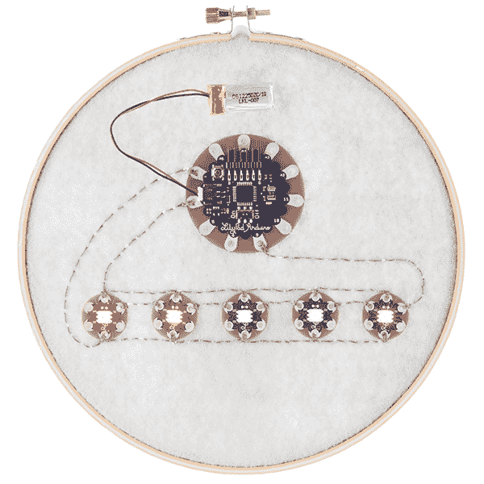

# LilyPad 像素板连接指南

> 原文：<https://learn.sparkfun.com/tutorials/lilypad-pixel-board-hookup-guide>

## 介绍

厌倦了在 lily pad lily pad LED 项目中坚持使用一种 LED 颜色吗？使用可寻址的 [LilyPad 像素板](https://www.sparkfun.com/products/13264)可以让你的项目以更少的布线展示各种颜色——这些分线点中的几个可以链接在一起，并由 LilyPad Arduino 上的一个引脚控制。像素板配备了一个 WS2812B，它实际上是一个 RGB LED，其中内置了一个 WS2811！因此，留出一些时间(和鳄鱼夹)和我们一起制作原型，然后头脑风暴如何将其实现到可穿戴项目中。

Unlike LilyPad LEDs, which will light when connected to a power source, LilyPad Pixel Boards need to be connected to a microcontroller in order to illuminate.

### 推荐阅读

这是一个中级的 LilyPad 项目，所以我们假设你已经习惯了用导线缝纫和上传代码到你的 LilyPad Arduino。在开始这个项目之前，下面是一些教程:

*   [电子纺织品基础知识](https://learn.sparkfun.com/tutorials/ws2812-breakout-hookup-guide?_ga=1.129092042.750303857.1422291681)
*   [电子纺织品的绝缘技术](https://learn.sparkfun.com/tutorials/insulation-techniques-for-e-textiles)
*   [短路](https://learn.sparkfun.com/tutorials/what-is-a-circuit/short-and-open-circuits)
*   [ProtoSnap LilyPad 开发简单连接指南](https://learn.sparkfun.com/tutorials/protosnap-lilypad-development-simple-hookup-guide)

如果您没有使用过 WS2812 LEDs(也称为 Neopixel LEDs ),我们建议您首先访问本教程:

 [### WS2812 分线连接指南

#### 2013 年 7 月 24 日](https://learn.sparkfun.com/tutorials/ws2812-breakout-hookup-guide) How to create a pixel string with the WS2812 and WS2812B addressable LEDs 10

## 材料和工具

让我们回顾一下开始工作所需的一些基本用品:

*   我们建议从 3 个 LilyPad 像素板开始，但在您的个人项目中可以随意使用或多或少的像素板。参见本教程的下一节，计算你可以供电多少像素。
*   我们还包括一个可选的电容器，它将有助于平滑您的电源，并减少电路中 led 的潜在闪烁。详见 [WS2812 教程](https://learn.sparkfun.com/tutorials/ws2812-breakout-hookup-guide#hardware-hookup)。