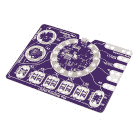

# LilyPad USB Plus 连接指南

> 原文：<https://learn.sparkfun.com/tutorials/lilypad-usb-plus-hookup-guide>

## 介绍

[LilyPad USB Plus](https://www.sparkfun.com/products/14631) 是一款可缝合的电子微控制器，可以与 Arduino 配合使用。在本教程中，我们将介绍 USB Plus 的功能，并设置免费的 Arduino 软件，您将需要向其上传代码。

[](https://www.sparkfun.com/products/14631) 

将**添加到您的[购物车](https://www.sparkfun.com/cart)中！**

### [Lilypad USB 加](https://www.sparkfun.com/products/14631)

[16 available](https://learn.sparkfun.com/static/bubbles/ "16 available") DEV-14631

这是 LilyPad USB Plus，一种由 ATmega32U4 控制的可缝合电子微控制器板，带有 Arduino 引导程序…

$29.50[Favorited Favorite](# "Add to favorites") 9[Wish List](# "Add to wish list")** **[https://www.youtube.com/embed/NbVpR8xX-gs/?autohide=1&border=0&wmode=opaque&enablejsapi=1](https://www.youtube.com/embed/NbVpR8xX-gs/?autohide=1&border=0&wmode=opaque&enablejsapi=1)

USB Plus 可作为独立板或作为 [LilyPad ProtoSnap Plus](https://www.sparkfun.com/products/14346) 板的一部分。

[](https://www.sparkfun.com/products/14346) 

将**添加到您的[购物车](https://www.sparkfun.com/cart)中！**

### [LilyPad ProtoSnap 加](https://www.sparkfun.com/products/14346)

[In stock](https://learn.sparkfun.com/static/bubbles/ "in stock") DEV-14346

LilyPad ProtoSnap Plus 是一个可缝合的电子原型板，您可以使用它来探索电路和编程，测试

$42.95[Favorited Favorite](# "Add to favorites") 10[Wish List](# "Add to wish list")******Warning:** There are known driver issues on older versions of Windows (7 and 8 specifically). We are actively working on the issue and expect to have a resolution soon.

### 所需材料

要对电路板重新编程和充电，你需要一根 micro-B USB 线。这是许多设备使用的常见电缆，因此您可能已经有一根了。仔细检查它是否标有“仅供电”,因为这种类型的电缆不会传输 LilyPad USB Plus 板所需的编程数据。如果您没有，可以从 SparkFun 获得一个:

[](https://www.sparkfun.com/products/10215) 

将**添加到您的[购物车](https://www.sparkfun.com/cart)中！**

### [USB micro-B 线- 6 脚](https://www.sparkfun.com/products/10215)

[In stock](https://learn.sparkfun.com/static/bubbles/ "in stock") CAB-10215

USB 2.0 型到微型 USB 5 针。这是一种新的、更小的 USB 设备连接器。微型 USB 连接器大约是…

$5.5014[Favorited Favorite](# "Add to favorites") 21[Wish List](# "Add to wish list")****[](https://www.sparkfun.com/products/13244) 

将**添加到您的[购物车](https://www.sparkfun.com/cart)中！**

### [【USB Micro-B 线缆-6】](https://www.sparkfun.com/products/13244)

[In stock](https://learn.sparkfun.com/static/bubbles/ "in stock") CAB-13244

这是一根 USB 2.0 型转 Micro-B 型 5 针黑色电缆。你知道，通常配在手机上的迷你 B 连接器，可以…

$2.103[Favorited Favorite](# "Add to favorites") 7[Wish List](# "Add to wish list")**** ****### 推荐阅读

如果您不熟悉以下概念，我们建议您在继续之前查看这些教程。

[](https://learn.sparkfun.com/tutorials/what-is-an-arduino) [### 什么是 Arduino？](https://learn.sparkfun.com/tutorials/what-is-an-arduino) What is this 'Arduino' thing anyway? This tutorials dives into what an Arduino is and along with Arduino projects and widgets.[Favorited Favorite](# "Add to favorites") 50[](https://learn.sparkfun.com/tutorials/installing-arduino-ide) [### 安装 Arduino IDE](https://learn.sparkfun.com/tutorials/installing-arduino-ide) A step-by-step guide to installing and testing the Arduino software on Windows, Mac, and Linux.[Favorited Favorite](# "Add to favorites") 16[](https://learn.sparkfun.com/tutorials/planning-a-wearable-electronics-project) [### 规划可穿戴电子项目](https://learn.sparkfun.com/tutorials/planning-a-wearable-electronics-project) Tips and tricks for brainstorming and creating a wearables project.[Favorited Favorite](# "Add to favorites") 25**Note:** For a better look at any of the pictures in this tutorial, click on the image to enlarge them!

## 硬件概述和功能

LilyPad USB Plus 是一款兼容 Arduino 的微控制器。它有 14 个缝纫片，用于用导线连接部件。其中四个标签用于连接 LilyPad 传感器和附件板的电源和接地，十个用于输入/输出(I/O)。作为参考，每个 sew 标签附近都有一个标签，标签上有其名称和其中心 ATmega32U4 芯片上连接的 pin 号。

[](https://cdn.sparkfun.com/assets/learn_tutorials/7/3/7/USBPlus_TabLabels.png)

**特性:**

*   用于连接电脑的 USB 端口。
*   两组电源(+)和接地(-)缝合片。
*   连接到引脚 12 (R)、13 (G)和 14 (B)的内置 RGB LED。
*   一排六个白色发光二极管连接到引脚 15-20。
*   单体( **3.7V** )锂聚合物电池充电电路。

[](https://cdn.sparkfun.com/assets/learn_tutorials/6/8/0/LilyPadUSBPlusDetails.png)**Some of the sew tabs on the LilyPad USB Plus have special functionality:**

*   数字前面的“A”表示可以作为[模拟输入](https://learn.sparkfun.com/tutorials/analog-to-digital-conversion)的选项卡。这些 sew 标签可以读取输出变化电压的传感器，如 ProtoSnap Plus 内置的光传感器。
    
*   数字前的“~”符号表示 tab 支持 [PWM(脉宽调制)输出](https://learn.sparkfun.com/tutorials/pulse-width-modulation)。这些标签可以输出“模拟”信号，用于改变发光二极管的亮度等。

**Note:** The "A" in front of analog sew tab numbers in your code is optional. However, do not include the "~" symbol for PWM outputs. It is only provided to make it easy for you to check which pins can produce PWM (analog) output and is not used in programming.

### 为 LilyPad USB Plus 供电

LilyPad USB Plus 有两种供电方式:

*   如果你有一个可用的 USB 电源(一台电脑，5V USB 墙上适配器，USB 电池组等。)，您可以通过 USB 电缆运行该板。

*   一旦缝合到一个项目中，你可以很容易地将可充电的锂聚合物电池连接到板上。有关电池和充电的更多信息，请参见[技术说明](#battery)部分。

要启动 USB Plus，请使用 micro-B USB 电缆将其连接到您的计算机，或者连接一个[电子纺织品电池](https://www.sparkfun.com/products/13112)。然后将 LilyPad USB Plus 右侧的开关滑动到打开位置。

[](https://cdn.sparkfun.com/assets/learn_tutorials/7/3/7/TurnOnUSBPlus.jpg)

## 设置 Arduino

**WARNING: There are known driver issues on older versions of Windows (7 and 8 specifically).** We are actively working on the issue and expect to have a resolution soon.**Note:** The LilyPad USB Plus requires **Arduino version 1.8 or higher**. If this is your first time using Arduino, you can install it by following our [Installing the Arduino IDE](https://learn.sparkfun.com/tutorials/installing-arduino-ide) tutorial. Otherwise, please make sure to install (or update to) the latest version of Arduino and verify that you are connected to the internet to download the LilyPad USB Plus software add-ons.

当你第一次安装 Arduino 时，它知道如何对许多“标准的”Arduino 兼容板进行编程。由于 LilyPad USB Plus 是较新的 LilyPad 微控制器，您需要按照以下步骤将其手动添加到此列表中。您只需这样做一次，就可以将电路板添加到 Arduino。

**Note for Linux Users:** If you are installing the LilyPad USB Plus in Linux, this document has some specific notes: [https://github.com/sparkfun/LilyPad_ProtoSnap_Plus/blob/master/Documentation/LinuxInstallation.md](https://github.com/sparkfun/LilyPad_ProtoSnap_Plus/blob/master/Documentation/LinuxInstallation.md).

### 将 SparkFun 板添加到 Arduino 的偏好设置中

启动 Arduino IDE 软件(版本 1.8 或更高版本)，从菜单中选择**文件** > **首选项**打开首选项窗口。

现在，复制以下文本，并将其粘贴到“附加电路板管理器 URL”文本框中:

```
https://raw.githubusercontent.com/sparkfun/Arduino_Boards/master/IDE_Board_Manager/package_sparkfun_index.json 
```

[](https://cdn.sparkfun.com/assets/learn_tutorials/6/8/0/PasteBoardURL2.png)**No room?** If there is already a URL in the box, click the button to the right of the box. This will open a window allowing you to paste the URL onto a new line.[](https://cdn.sparkfun.com/assets/learn_tutorials/6/8/0/PasteBoardURLWindow.png)

完成后，单击“确定”按钮。

### 安装 SparkFun AVR 板

接下来，您将通过 Arduino 的 Boards Manager 菜单添加 LilyPad USB Plus。选择**工具** > **电路板** > **电路板管理器，打开电路板管理器...**(董事会经理选项位于董事会列表的最顶端；您可能需要向上滚动才能看到它。)

[](https://cdn.sparkfun.com/assets/learn_tutorials/6/8/0/SelectBoardManager2.png)

“纸板管理器”窗口打开时，会显示一长串选项。在窗口顶部的*“过滤您的搜索”*框中键入“SparkFun”(不带引号)。这将把列表缩小到 SparkFun 的选项。

您应该会看到几个条目。寻找标有 SparkFun Electronics 的 **SparkFun AVR 板。**

[](https://cdn.sparkfun.com/assets/learn_tutorials/6/8/0/SearchSparkFun1_8.png)**Troubleshooting:** If you don't see a SparkFun entry, it may mean that the URL you pasted into the Additional Boards Manager section of Arduino's preferences did not load correctly in Step #1, or you're not connected to the internet. Double check that the entire link was copied into the Additional Boards Manager URLs, and that you're connected to the internet. You might also try closing and restarting the Arduino software to refresh the preferences.

点击 **SparkFun AVR 板**框中的任意位置。将出现一个版本号和一个“安装”按钮。单击安装按钮。这将下载并安装扩展。如果您已经安装了 SparkFun AVR 板支持，请更新至最新版本(1.1.8 及更高版本中包含 LilyPad USB Plus)。

[](https://cdn.sparkfun.com/assets/learn_tutorials/6/8/0/SelectInstallVersion1_8.png)

如果一切正常，SparkFun AVR 板标题旁边应该会出现一个蓝色的“已安装”说明。你已经准备好开始编程了。

[](https://cdn.sparkfun.com/assets/learn_tutorials/6/8/0/ConfirmInstall1_8.png)

## 上传代码

一旦你将 LilyPad USB Plus 扩展安装到 Arduino 上，你就可以开始对开发板编程了！

注意，你*不需要*再次安装扩展，但是你*将*需要在每次你想要对电路板编程时执行以下三个步骤。这三个步骤是:

1\. Connect the LilyPad USB Plus to your computer using a USB cable
2\. Select **"LilyPad USB Plus"** from Arduino's **"Board"** menu
3\. Select **"LilyPad USB Plus"** from Arduino's **"Port"** menu

让我们详细回顾一下这三个步骤:

### 1.将 LilyPad USB Plus 连接到电脑

将 LilyPad USB Plus 放在干净的非金属工作台面上。使用 micro-B USB 电缆将 LilyPad USB Plus 连接到电脑的 USB 端口。电缆只能以一种方式插入，并且应该卡紧。

[](https://cdn.sparkfun.com/assets/learn_tutorials/7/3/7/PlugInUSBPlus.jpg)**Tip:** Both the micro-B USB cable and the connector on the LilyPad have a subtle "D" shape to them. Match this shape to plug it in properly.[](https://cdn.sparkfun.com/assets/learn_tutorials/7/3/7/USBPlus_Laptop.jpg)

将 LilyPad USB Plus 上的开关滑动到打开位置。如果设置为关闭位置，您将无法将代码上传至电路板。

[](https://cdn.sparkfun.com/assets/learn_tutorials/7/3/7/TurnOnUSBPlus.jpg)

### 2.从主板菜单中选择 LilyPad USB Plus

如果 Arduino 板支持安装正确，“LilyPad USB Plus”选项将在 SparkFun AVR 板组下的**工具** > **板**列表中可用。打开菜单，选择 **LilyPad USB Plus** 。根据列表中已经有多少电路板，您可能需要向下滚动一点才能找到它。选中时，菜单中的电路板旁边会显示一个点(Windows)或复选标记(Mac ),并且它会显示在工具菜单中的电路板旁边。

**IMPORTANT:** You'll see some LilyPad entries higher in the Arduino menu, but the **LilyPad USB Plus** is not one of them. You'll need to scroll down to the SparkFun section at the bottom of the list to find it. We're working on getting the LilyPad USB Plus added to the LilyPad group in the future.[](https://cdn.sparkfun.com/assets/learn_tutorials/6/8/0/SelectBoardArrow.png)**Troubleshooting:** If you don't see "LilyPad USB Plus" in the board list, go back to [Setting Up Arduino](https://learn.sparkfun.com/tutorials/lilypad-usb-plus-hookup-guide#setting-up-arduino) and double check that you performed all the steps. You might try restarting Arduino as well.

### 3.从端口菜单中选择 LilyPad USB Plus

Arduino 需要知道你的 LilyPad USB Plus 连接到哪个端口，这样它才能对它进行编程。每当您将 USB 设备插入电脑时，电脑都会为其分配一个端口号。这在过去很难确定，但这块板有一个方便的特性可以识别自己。进入**工具** > **端口**菜单，选择旁边有“LilyPad USB Plus”的端口。

在 Windows 上，端口被列为 COM # #在 Mac 或 Linux 机器上，它们将是“/dev/cu.usbmodem####”。您的屏幕可能与下图不同，这取决于您使用的操作系统，但所有屏幕都应该在端口地址旁边显示 LilyPad USB Plus。

[](https://cdn.sparkfun.com/assets/learn_tutorials/7/3/7/SelectSerialPort1.png)**Troubleshooting:** If you don't see a port with "LilyPad USB Plus" next to it, ensure that the board is powered up (switch in the ON position), and that the USB cable is securely connected to both the board and your computer. Some micro-USB cables are only meant for charging and don't pass data - they'll power the board, but it won't show up in the port menu. If needed, try a different cable.

### 上传代码

回顾一下，一旦你:

1.  已使用 USB 电缆将 LilyPad USB Plus 连接至电脑。
2.  选择了板卡类型(**lily pad USB Plus****NOT***lily pad Arduino USB*)。
3.  已选择 COM 端口。

您可以上传代码了！让我们上传一些代码来试用一下:

从菜单**文件** > **加载“眨眼”示例** > **01。基础知识** > **眨眼**。这是一个非常简单的示例程序；它只是每秒钟闪烁一次 LED。

[](https://cdn.sparkfun.com/assets/learn_tutorials/6/8/0/OpenBlinkExample.png)

点击“上传”按钮(带有右箭头的大圆形按钮)。

[](https://cdn.sparkfun.com/assets/learn_tutorials/7/3/7/ClickUpload.png)

Arduino 会编译代码，然后通过 USB 线发送到 LilyPad USB Plus。当代码上传时，内置的 LED 将闪烁，表示代码正在传输。当代码最终运行时，电路板中央的 RGB LED 将缓慢闪烁绿色。成功！

如果这一切工作，祝贺你！你已经设置好了 LilyPad USB Plus 的原型。

### 故障排除:上传时出现错误消息？

如果您正在使用 Mac，并收到如下错误信息:

```
Board LilyPad USB Plus (platform avr, package SparkFun) is unknown 
```

更新后留下的旧 Arduino 版本可能会干扰 LilyPad USB Plus 支持安装。如果您想清除这些旧信息，请遵循以下步骤:

**WARNING:** The following instructions will delete any extensions you've previously applied to Arduino, returning it to its factory-default state. It should not delete any sketches that you've created.

1.  打开 Arduino 的“偏好设置”窗口。
2.  在窗口的底部将会有一个指向您的首选项文件的链接。点击它，它会打开一个查找窗口。
3.  在 finder 窗口中，查找“Arduino15”文件夹并将其删除。
4.  现在打开一个 finder 窗口，打开您的个人文件夹(旁边有您的登录名和房子图标的文件夹)。查找“Arduino”文件夹(可能在“文档”中)。如果“Arduino”文件夹包含“硬件”文件夹，请将其删除。您的 Arduino 安装现在是干净的。重启 Arduino 并重复上一页的 LilyPad 安装说明。

### 故障排除:上传仍有问题？

如果您在向 LilyPad USB Plus 上传代码时仍有问题，并且这里没有列出，请尝试查看我们的[活动指南](https://learn.sparkfun.com/tutorials/lilypad-protosnap-plus-activity-guide/troubleshooting)的故障排除部分:

[LilyPad Protosnap Plus Activity Guide: Troubleshooting](https://learn.sparkfun.com/tutorials/lilypad-protosnap-plus-activity-guide/troubleshooting)

## 缝合到项目中

在规划项目和构建代码原型时，您可以使用鳄鱼夹将单个 LilyPad 片段连接到 USB Plus，并在构建到项目中之前进行测试。

完成原型制作后，可以通过缝合项目中的元件，使用鳄鱼夹或电路草图规划的连接可以用导线重新创建。如果您想在缝合到项目中后继续细化代码，请确保 USB 连接器可以访问。

[](https://cdn.sparkfun.com/assets/learn_tutorials/6/8/0/ProtoSnapSew.jpg)

这些教程将为您提供一些关于项目建设和绝缘的提示和技巧:

[](https://learn.sparkfun.com/tutorials/insulation-techniques-for-e-textiles) [### 电子纺织品的绝缘技术](https://learn.sparkfun.com/tutorials/insulation-techniques-for-e-textiles) Learn a few different ways to protect your conductive thread and LilyPad components in your next wearables project.[Favorited Favorite](# "Add to favorites") 16[](https://learn.sparkfun.com/tutorials/lilypad-basics-e-sewing) [### LilyPad 基础:电子缝纫](https://learn.sparkfun.com/tutorials/lilypad-basics-e-sewing) Learn how to use conductive thread with LilyPad components.[Favorited Favorite](# "Add to favorites") 16

## 技术札记

如果你已经熟悉 Arduino 编程有一段时间了，请继续阅读一些关于 LilyPad USB Plus 的附加说明。它类似于其他 Arduinos，但有一些你想知道的特殊功能和限制。

### [使用电池并给电池充电](#battery)

SparkFun 出售一些与此板兼容的 LiPo 电池。如果你不熟悉 LilyPad 系统，我们推荐使用[电子纺织品电池](https://www.sparkfun.com/products/13112)。如果你自己提供电池，请使用带 JST 连接器的单节( **3.7V** )锂电池。

容量较大的电池(以安培小时或 Ah 衡量)在需要充电之前会运行更长时间。多长时间将取决于你的程序打开多少个发光二极管，等等。如果你只是运行几个发光二极管，你可以期待每 100 毫安时的电池容量运行约 5 小时的董事会。

#### 充电率

要给连接的电池充电，请将主板插入 USB 电源。

[](https://cdn.sparkfun.com/assets/learn_tutorials/7/3/7/USBPlusLipo.jpg)

电池充电时,“CHG”LED 会亮起。当电池充满电时，LED 将关闭。默认充电电流设置为 **100mA** ，因此 100mAh 电池将在 1 小时内充电，1000mAh 电池将在 10 小时内充电，以此类推。由于主板被设置为以 100 毫安的速率充电，我们不建议连接低容量的 LiPo 电池(即 40 毫安的 LiPo 电池)进行充电。

[](https://cdn.sparkfun.com/assets/learn_tutorials/7/3/7/USBPlus_ChgLED1.png)*Location of the "CHG" LED*

即使使用 USB 电源，将 LiPo 电池永久连接到主板上也是安全的。电池不会被过度充电。

#### 关于清洗 LilyPad 项目的说明

LilyPad projects are hand-washable, but **always remove the battery before washing your project** and air-dry your project for several days before replacing the battery.

#### 拆卸脂肪电池

电池连接器可以很紧；拆卸电池时，切勿拉扯电线。用一把尖嘴钳或钳子轻轻地将插头从连接器中拔出。

**Tip:** There are two small "nubs" on the top of the plastic battery connector that can be shaved off with a hobby knife to make the battery easier to remove.Always turn the LilyPad off before inserting or removing a battery.[](https://cdn.sparkfun.com/assets/learn_tutorials/7/3/7/USBPlus_RemoveLipo.jpg)

### 引脚编号

下面是 LilyPad USB Plus I/O 引脚和每个功能的列表。

**图例:**

*   *n* =数字引脚

*   ~ *n* =支持 PWM 的引脚

*   A *n* =模拟引脚

*   ( *n* ) =内部引脚(未连接到缝纫标签)

*   [ *n* ] =内部引脚(在裸露过孔上可用)

| 功能 | 数字的 | 模拟的 |
| RX_LED | (0) |  |
| RX_LED/SS | (1) |  |
|  | Two | 主动脉第二声 |
|  | three | A3 号 |
|  | four | A4 号 |
|  | five | A5 号 |
|  | ~6 |  |
|  | ~7 | A7 |
|  | ~8 | A8 |
|  | nine | A9 |
| SCL | ~10 |  |
| 国家药品监督管理局 | Eleven |  |
| RGB LED -红色 | (~12) |  |
| RGB LED -绿色 | (~13) |  |
| RGB LED -蓝色 | (~14) |  |
| 条形图 LED 0 | (15) |  |
| 条形图 LED 1 | (16) |  |
| 条形图 LED 2 | (17) |  |
| 条形图 LED 3 | (18) |  |
| 条形图 LED 4 | (19) |  |
| 条形图 LED 5 | (20) |  |
| SCLK | [21] |  |
| MOSI | [22] |  |
| 军事情报部门组织(Military Intelligence Service Organization) | [23] |  |

## 资源和更进一步

现在，您已经成功启动并运行了 LilyPad USB Plus，是时候将它整合到您自己的项目中了！

有关 LilyPad USB Plus 的更多信息，请查看以下资源:

*   [示意图(PDF)](https://cdn.sparkfun.com/assets/7/9/1/c/5/LilyPad_USB_Plus.pdf)
*   [老鹰文件(ZIP)](https://cdn.sparkfun.com/assets/0/4/f/4/5/LilyPad_USB_Plus.zip)
*   [LilyPad 登陆页面](https://www.sparkfun.com/lilypad_sewable_electronics)
*   [LilyPad for Education](http://www.sparkfuneducation.com/lilypad)
*   [SparkFun Arduino 插件 GitHub 库](https://github.com/sparkfun/Arduino_Boards/)
*   [LilyPad USB Plus GitHub 储存库](https://github.com/sparkfun/LilyPad_USB_Plus_Standalone)

希望在新的 LilyPad ProtoSnap Plus 中重用旧的 Lilypad 开发板示例和项目？查看以下链接的[指南，了解更多信息](https://learn.sparkfun.com/tutorials/adapting-lilypad-development-board-projects-to-the-lilypad-protosnap-plus)。

[](https://learn.sparkfun.com/tutorials/adapting-lilypad-development-board-projects-to-the-lilypad-protosnap-plus) [### 使 LilyPad 开发板项目适应 LilyPad ProtoSnap Plus

#### 2018 年 5 月 24 日](https://learn.sparkfun.com/tutorials/adapting-lilypad-development-board-projects-to-the-lilypad-protosnap-plus) An overview of the updates made in the redesign of the LilyPad Development Board to the LilyPad ProtoSnap Plus and how to adapt code written for the old board to the new one.[Favorited Favorite](# "Add to favorites") 0

使用 LilyPad Arduino 查看这些项目:

[](https://learn.sparkfun.com/tutorials/dungeons-and-dragons-dice-gauntlet) [### 龙与地下城骰子战书](https://learn.sparkfun.com/tutorials/dungeons-and-dragons-dice-gauntlet) A playful, geeky tutorial for a leather bracer that uses a LilyPad Arduino, LilyPad accelerometer, and seven segment display to roll virtual 4, 6, 8, 10, 12, 20, and 100 side dice for gaming.[Favorited Favorite](# "Add to favorites") 9[](https://learn.sparkfun.com/tutorials/light-up-pennant-with-e-textiles) [### 用电子纺织品点亮三角旗](https://learn.sparkfun.com/tutorials/light-up-pennant-with-e-textiles) Show your school spirit, geek pride, or fandom with a light up pennant using the LilyTwinkle or LilyPad Arduino.[Favorited Favorite](# "Add to favorites") 6[](https://learn.sparkfun.com/tutorials/night-sky-halloween-costume) [### 夜空万圣节服装](https://learn.sparkfun.com/tutorials/night-sky-halloween-costume) Make a beautiful night sky costume using the LilyPad LEDs and the LilyTiny.[Favorited Favorite](# "Add to favorites") 7[](https://learn.sparkfun.com/tutorials/lilypad-safety-scarf) [### LilyPad 安全围巾](https://learn.sparkfun.com/tutorials/lilypad-safety-scarf) This scarf is embedded with a ribbon of LEDs that illuminate when it gets dark out, making yourself more visible to vehicle and other pedestrians.[Favorited Favorite](# "Add to favorites") 4********