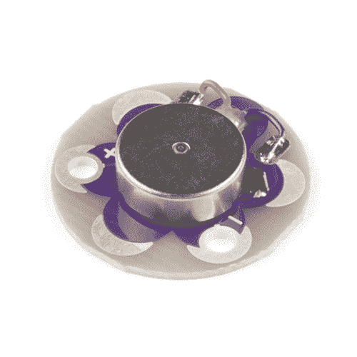

# LilyPad Vibe 板连接指南

> 原文：<https://learn.sparkfun.com/tutorials/lilypad-vibe-board-hookup-guide>

## 介绍

[LilyPad 振动板](https://www.sparkfun.com/products/11008)是一个小型振动马达，可以用导电线缝成项目，由 LilyPad Arduino 控制。该板可以用作服装和服饰上触觉反馈的物理指示器。

 

将**添加到您的[购物车](https://www.sparkfun.com/cart)中！**

### [LilyPad Vibe 板](https://www.sparkfun.com/products/11008)

[In stock](https://learn.sparkfun.com/static/bubbles/ "in stock") DEV-11008

施加 5V 电压，通过这个小而强大的振动马达进行振动。作为一个物理指示器工作很好，不需要通知…

$8.502[Favorited Favorite](# "Add to favorites") 23[Wish List](# "Add to wish list")** **### 所需材料

要跟随本教程，您将需要以下材料。你可能不需要所有的东西，这取决于你拥有什么。将它添加到您的购物车，通读指南，并根据需要调整购物车。**